# Table of contents

<ul dir="auto">
    <li><details><summary><a href="#the-team">The team</a></summary>
        <ul dir="auto">
            <li><a href="#nils-stauff">Nils Stauff</a></li>
            <li><a href="#olivia-greilich">Olivia Greilich</a></li>
            <li><a href="#leonard-kolo">Leonard Kolo</a></li>
            <li><a href="#team-photo">Team photo</a></li>
            <li><a href="#funny-team-photo">Funny team photo</a></li>
        </ul>
        </details>
    </li>
    <li><details><summary><a href="#the-robot">The robot</a></summary>
        <ul dir="auto">
            <li><a href="#photos-of-the-robot">Photos of the robot</a></li>
        </ul>
        </details>
    </li>
    <li><details><summary><a href="#mobility-management">Mobility management</a></summary>
        <ul dir="auto">
            <li><a href="#chassis">Chassis</a></li>
            <li><a href="#modification-of-the-model-car">Modification of the model car</a>
                <ul dir="auto">
                    <li><a href="#chassis-plate">Chassis plate</a></li>
                    <li><a href="#middle-deck">Middle deck</a></li>
                    <li><a href="#upper-deck">Upper deck</a></li>
                </ul>
            </li>
            <li><a href="#potential-improvements---chassis">Potential improvements - chassis</a></li>
            <li><a href="#powertrain">Powertrain</a>
                <ul dir="auto">
                    <li><a href="#drivetrain">Drivetrain</a></li>
                    <li><a href="#motor">Motor</a></li>
                    <li><a href="#electronic-speed-controller">Electronic speed controller</a></li>
                    <li><a href="#functioning-of-the-drive-system">Functioning of the drive system</a></li>
                </ul>
            </li>
            <li><a href="#potential-improvements---powertrain">Potential improvements - powertrain</a></li>
            <li><a href="#steering">Steering</a>
                <ul dir="auto">
                    <li><a href="#new-front-axle">New front axle</a></li>
                    <li><a href="#servo-saver">Servo saver</a></li>
                    <li><a href="#servo-motor">Servo motor</a></li>
                </ul>
            </li>
            <li><a href="#potential-improvements---steering">Potential improvements - steering</a></li>
        </ul>
        </details>
    </li>
    <li><details><summary><a href="#power-and-sense-management">Power and sense management</a></summary>
        <ul dir="auto">
            <li><a href="#sensors">Sensors</a>
                <ul dir="auto">
                    <li><a href="#lidar">LiDAR</a></li>
                    <li><a href="#potential-improvements---lidar">Potential improvements - LiDAR</a></li>
                    <li><a href="#camera">Camera</a></li>
                    <li><a href="#potential-improvements---camera">Potential improvements - camera</a></li>
                    <li><a href="#odometry-sensor">Odometry sensor</a></li>
                    <li><a href="#potential-improvements---odometry-sensor">Potential improvements - odometry sensor</a></li>
                    <li><a href="#status-display">Status display</a></li>
                    <li><a href="#potential-improvements---status-display">Potential improvements - status display</a></li>
                </ul>
            </li>
            <li><a href="#vehicle-power-supply">Vehicle power supply</a>
                <ul dir="auto">
                    <li><a href="#lipo-battery">LiPo battery</a></li>
                    <li><a href="#component-power-consumption">Component power consumption</a></li>
                    <li><a href="#total-power-requirements">Total power requirements</a></li>
                    <li><a href="#power-supply">Power supply</a></li>
                    <li><a href="#safety-and-wiring">Safety and wiring</a></li>
                    <li><a href="#potential-improvements---power-supply">Potential improvements - power supply</a></li>
                </ul>
            </li>
            <li><a href="#circuit-diagram-of-components">Circuit diagram of components</a></li>
        </ul>
        </details>
    </li>
    <li><details><summary><a href="#obstacle-management">Obstacle management</a></summary>
        <ul dir="auto">
            <li><a href="#coordinate-system">Coordinate system</a>
                <ul dir="auto">
                    <li><a href="#coordinate-dimensions-and-origin">Coordinate dimensions and origin</a></li>
                    <li><a href="#coordinate-system-properties">Coordinate system properties</a></li>
                    <li><a href="#heading-angle-convention">Heading angle convention</a></li>
                </ul>
            </li>
            <li><a href="#waypoint-navigation-system">Waypoint navigation system</a>
                <ul dir="auto">
                    <li><a href="#command-example-drive-to-coordinate-4502500">Command example: drive to coordinate 450/2500</a></li>
                    <li><a href="#command-example-turn-robot-ccw-to-a-heading-of--90">Command example: turn robot CCW to a heading of -90°</a></li>
                </ul>
            </li>
            <li><a href="#initial-location-acquisition">Initial location acquisition</a></li>
            <li><a href="#position-updates-during-the-race">Position updates during the race</a>
                <ul dir="auto">
                    <li><a href="#optical-tracking-sensor-function">Optical tracking sensor function</a></li>
                    <li><a href="#sensor-failure-detection--health-status">Sensor failure detection / health status</a></li>
                </ul>
            </li>
            <li><a href="#position-corrections">Position corrections</a>
                <ul dir="auto">
                    <li><a href="#reposition-while-driving-pseudocode">Reposition while driving (pseudocode)</a></li>
                </ul>
            </li>
            <li><a href="#obstacle-recognition">Obstacle recognition</a>
                <ul dir="auto">
                    <li><a href="#determining-the-position-of-an-obstacle-within-a-course-section">Determining the position of an obstacle within a course section</a></li>
                    <li><a href="#determining-the-color-of-the-obstacle">Determining the color of the obstacle</a></li>
                    <li><a href="#complete-obstacle-detection-function">Complete obstacle detection function</a></li>
                    <li><a href="#angle-width-and-color-assignment-implementation-note">Angle width and color assignment (implementation note)</a></li>
                </ul>
            </li>
             <li><a href="#navigation-strategy-open-challenge">Navigation strategy open challenge</a>
                <ul dir="auto">
                    <li><a href="#complete-code-for-waypoint-generation">Complete code for waypoint generation</a></li>
                </ul>
            </li>
            <li><a href="#navigation-strategy-obstacle-challenge">Navigation strategy obstacle challenge</a>
                <ul dir="auto">
                    <li><a href="#unparking">Unparking</a></li>
                    <li><a href="#first-round-scanning">First round: scanning</a></li>
                    <li><a href="#second-and-third-round">Second and third round</a></li>
                    <li><a href="#parking">Parking</a></li>
                    <li><a href="#obstacle-avoidance-waypoint-generation">Obstacle avoidance waypoint generation</a></li>
                    <li><a href="#rotation-mapping">Rotation mapping</a></li>
                    <li><a href="#source-code-driveroundpy">Source code: driveRound.py</a></li>
                </ul>
            </li>
            <li><a href="#possible-improvements">Possible improvements</a></li>
        </ul>
        </details>
    </li>
    <li><details><summary><a href="#code-for-all-components">Code for all components</a></summary>
        <ul dir="auto">
            <li><a href="#servo">Servo</a>
                <ul dir="auto">
                    <li><a href="#software-implementation">Software implementation</a></li>
                    <li><a href="#steering-range-and-calibration">Steering range and calibration</a></li>
                </ul>
            </li>
            <li><a href="#drive-motor">Drive motor</a>
                <ul dir="auto">
                    <li><a href="#components">Components</a></li>
                    <li><a href="#hardware-interface">Hardware interface</a></li>
                    <li><a href="#software-implementation-1">Software implementation</a></li>
                    <li><a href="#pid-controller-implementation">PID controller implementation</a></li>
                    <li><a href="#advanced-control-features">Advanced control features</a></li>
                </ul>
            </li>
            <li><a href="#optical-tracking-odometry-sensors">Optical tracking odometry sensors</a>
                <ul dir="auto">
                    <li><a href="#position-and-speed-tracking">Position and speed tracking</a></li>
                    <li><a href="#sensor-health-monitoring-and-redundancy">Sensor health monitoring and redundancy</a></li>
                    <li><a href="#data-fusion-and-final-position-calculation">Data fusion and final position calculation</a></li>
                    <li><a href="#position-reset-and-calibration">Position reset and calibration</a></li>
                    <li><a href="#key-features-of-our-implementation">Key features of our implementation</a></li>
                </ul>
            </li>
            <li><a href="#lidar-1">LiDAR</a>
                <ul dir="auto">
                    <li><a href="#real-time-scanning-and-data-acquisition">Real-time scanning and data acquisition</a></li>
                    <li><a href="#position-detection-and-localization">Position detection and localization</a></li>
                    <li><a href="#dynamic-position-correction-during-driving">Dynamic position correction during driving</a></li>
                    <li><a href="#obstacle-detection-and-recognition">Obstacle detection and recognition</a></li>
                    <li><a href="#key-features-of-our-lidar-implementation">Key features of our LiDAR implementation</a></li>
                    <li><a href="#data-structure-and-access-patterns">Data structure and access patterns</a></li>
                </ul>
            </li>
            <li><a href="#camera-1">Camera</a>
                <ul dir="auto">
                    <li><a href="#image-capture-and-preprocessing">Image capture and preprocessing</a></li>
                    <li><a href="#color-detection">Color detection</a></li>
                    <li><a href="#angle-mapping-and-field-alignment">Angle mapping and field alignment</a></li>
                    <li><a href="#calibration-and-settings">Calibration and settings</a></li>
                    <li><a href="#key-features-of-our-camera-implementation">Key features of our camera implementation</a></li>
                </ul>
            </li>
            <li><a href="#potential-improvements---code-for-all-components">Potential improvements - code for all components</a></li>
        </ul>
        </details>
    </li>
    <li><details><summary><a href="#construction-guide">Construction guide</a></summary>
        <ul dir="auto">
            <li><a href="#assembly-overview">Assembly overview</a></li>
            <li><a href="#step-1-preparing-the-3d-printed-parts">Step 1: Preparing the 3D-printed parts</a></li>
            <li><a href="#step-2-lower-deck-assembly">Step 2: Lower deck assembly</a>
                <ul dir="auto">
                    <li><a href="#21-prepare-latrax-rally-back-axle">2.1 Prepare LaTrax Rally back axle</a></li>
                    <li><a href="#22-install-steering-servo">2.2 Install steering servo</a></li>
                    <li><a href="#23-front-axle">2.3 Front axle</a></li>
                    <li><a href="#24-mount-bumper">2.4 Mount Bumper</a></li>
                    <li><a href="#25-mount-esc-electronic-speed-controller">2.5 Mount ESC (electronic speed controller)</a></li>
                    <li><a href="#26-install-odometry-sensors">2.6 Install odometry sensors</a></li>
                </ul>
            </li>
            <li><a href="#step-3-middle-deck-assembly">Step 3: Middle deck assembly</a>
                <ul dir="auto">
                    <li><a href="#31-place-the-middle-deck">3.1 Place the middle deck</a></li>
                    <li><a href="#32-mount-raspberry-pi-5">3.2 Mount Raspberry Pi 5</a></li>
                    <li><a href="#33-integrate-camera">3.3 Integrate camera</a></li>
                    <li><a href="#34-mount-servo-controller-and-voltage-regulator">3.4 Mount servo controller and voltage regulator</a></li>
                    <li><a href="#35-battery-and-power-supply">3.5 Battery and power supply</a></li>
                </ul>
            </li>
            <li><a href="#step-4-upper-deck-with-lidar">Step 4: Upper deck with LiDAR</a>
                <ul dir="auto">
                    <li><a href="#41-mount-lidar">4.1 Mount LiDAR</a></li>
                    <li><a href="#42-install-status-display">4.2 Install status display</a></li>
                </ul>
            </li>
            <li><a href="#step-5-wiring">Step 5: Wiring</a></li>
            <li><a href="#step-6-software-installation">Step 6: Software installation</a>
                <ul dir="auto">
                    <li><a href="#61-prepare-raspberry-pi-os">6.1 Prepare Raspberry Pi OS</a></li>
                    <li><a href="#62-install-python-libraries">6.2 Install Python libraries</a></li>
                    <li><a href="#63-install-battlepillars-software">6.3 Install Battlepillars software</a></li>
                </ul>
            </li>
        </ul>
        </details>
    </li>
</ul>

# **The team** 
<div align="center">
    <a href="img/freigestellt.png" target="_blank">
        
    </a>
</div>
In this repository, you’ll find the documentation for the robot created by the "Battlepillars" for the 2026 World Robot Olympiad Future Engineers competition. The robot was the result of a collaborative effort by three students.

## **Nils Stauff**

<div align="center">
    <a href="img/nils.jpg" target="_blank">
        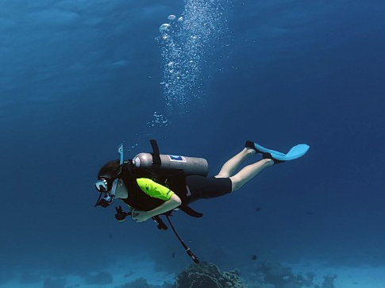
    </a>
</div>

Hi! I’m Nils, and I’m 16 years old. I enjoy coding and solving technical problems. In my free time, I like scuba diving and exploring the underwater world. During winter, I often go skiing, and I’m also a big fan of cats.

For our WRO project, I’m responsible for developing the robot’s software and making sure it runs as intended. It can be challenging at times, but it’s very rewarding when everything works as planned!

## **Olivia Greilich**

<div align="center">
    <a href="img/olivia.jpg" target="_blank">
        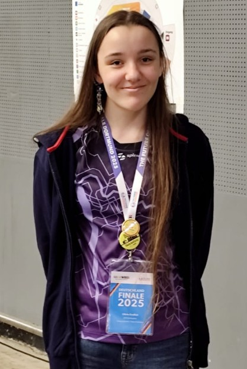
    </a>
</div>

Hello everyone! My name is Olivia Greilich and I'm 16, currently attending the Lise-Meitner Gymnasium in Anrath. Languages, communicating and connecting with people is my passion, same with painting, sculpting and crocheting!
One interesting fact about me is that I am simply enamored with jellyfish of all types, colors, shapes and sizes. I have two jellyfish lamps, tons of stickers, books and of course a phone charm.
In my free time, I usually occupy myself with writing fanfiction on Archive Of Our Own (AO3).

My part of the team effort is the documentation and images you'll see below.

## **Anton Wiesen**

<div align="center">
    <a href="img/leonard.jpg" target="_blank">
        
    </a>
</div>


## **Team photo**

<div align="center">
    <a href="img/team.png" target="_blank">
        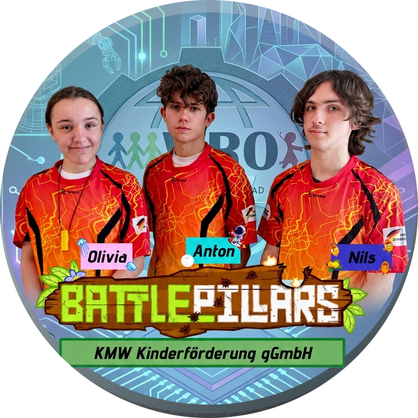
    </a>
</div>


# **The robot**
## **Photo of the robot**
<div align="center">
    <a href="img/sechs_ansichten Kopie.jpg" target="_blank">
        
    </a>
<br><br><br>

# **1. Mobilität und Mechanik**

## **Entwicklungsziel**
In der Saison 2025 haben wir bereits erfolgreich an der Kategorie Future Engineers teilgenommen und im Weltfinale in beiden Wertungsläufen die höchstmögliche Punktzahl erreicht. 
<br><br>
**Ziel der Saison 2026** war es, nicht mehr nur zuverlässig die maximale Punktzahl zu erreichen, sondern die **Strecke in möglichst kurzer Zeit** zu absolvieren. Daraus ergaben sich drei zentrale mechanische Entwicklungsziele: ein kleineres und leichteres Chassis, ein schnellerer und effizienterer Antrieb sowie eine präzisere Lenkung. Diese Ziele führten zu einer vollständigen Neukonstruktion von Chassis, Antrieb, Vorderachse und Elektroniklayout.
<br><br>
Die kleinere Bauform sollte mehrere Vorteile bringen: Durch die kleine Größe des Autos sind kleinere Kurvenradien möglich und somit eine höhere Wendigkeit. Außerdem hat das Auto beim Hindernisrennen bei der Durchfahrt enger Passagen mehr Abstand zu den Hindernissen, was die Fahrt fehlertoleranter macht und höhere Geschwindigkeiten erlaubt.
<br>

## **Chassis und mechanischer Aufbau**

### **Konstruktion des Chassis**
Das **Chassis** wurde in Fusion 360 konstruiert. Während der Entwicklung wurde als Filament **einfaches PLA** verwendet, da es kostengünstig und einfach zu drucken ist. Allerdings funktionierte die Motorhalterung in PLA nicht zuverlässig, da das PLA kriecht (sich unter konstantem Druck verformt) und das Zahnflankenspiel am Motor dadurch nicht mehr passte. 
<br><br>
In der finalen Version wurde das Chassis aus **PPA-CF-Filament** gefertigt. PPA-CF ist deutlich steifer und kriecht nicht. Dadurch verändern sich die Winkel von Kamera und Sensoren nicht durch ein Durchbiegen des Chassis. Das verbessert die Reproduzierbarkeit der Sensordaten und sorgt für konsistentere Messwerte über den gesamten Lauf. 
<br><br>
Allerdings ergab sich dadurch ein neues Problem. Wenn die Radaufhängung nicht ganz genau gleich hoch war oder die Bodenplatte minimal verzogen war, schwebte ein Rad durch die extreme Steifheit des Materials leicht in der Luft und drehte durch. Bei den vorherigen Versionen in PLA wurde diese Problematik durch die federnden Eigenschaften des Materials ausgeglichen. Da wir aber auf die positiven Eigenschaften des PPA-CF-Filaments in Bezug auf die Sensordaten nicht verzichten wollten, erhitzten wir die Bodenplatte mit einem Heißluftfön und bogen diese vorsichtig, bis alle Räder guten Bodenkontakt hatten.
<br>

### **Iteration der Bodenplatte**

Zu Beginn bestand die **Bodenplatte** nur aus einem einfachen Rechteck. Diese erste Version diente dazu, die wichtigsten mechanischen Komponenten grob zu positionieren und die benötigte Grundfläche abzuschätzen. Als erster Anhaltspunkt dienten die Abmessungen der Hinterachse mit Kugeldifferential, die wir als vormontierte Baugruppe mit fest angebauter Hinterachse und Radnaben eingekauft hatten. Diese bestimmte den Radstand und damit die Breite der Bodenplatte. Die Länge der Bodenplatte wurde hingegen durch die Abmessungen der selbst entwickelten Platine vorgegeben, da diese als flächenmäßig größte Komponente längs ins Chassis eingebaut wurde. Für die Hinterachse haben wir ein Kugeldifferential aus dem Modellbau verwendet, da ein Differential in dieser Größe nur schwer zuverlässig zu drucken ist. Anschließend wurde die Bodenplatte schrittweise an die tatsächlichen mechanischen Anforderungen angepasst. Während dieses Prozesses wurden über fünfzehn Versionen der Bodenplatte erstellt und gedruckt, bis die finale Version mit allen notwendigen Aussparungen, Befestigungspunkten und Anpassungen für die Achsen, Räder, Sensoren und Elektronik fertiggestellt war. Für Lenkung und Radaufhängung wurden insgesamt zehn Kugellager verbaut.

#### Abbildung 1: Iterationen der Bodenplatte:

<div align="center">
    <a href="img/iterationen_bodenplatte_eng.png" target="_blank">
        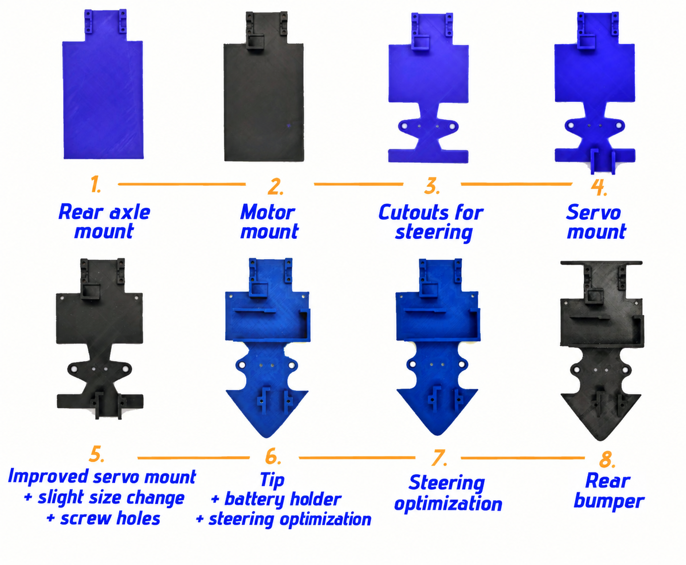
    </a>
</div>

### **Aufbau des Chassis**

Das **Chassis ist in drei Ebenen** aufgeteilt, die eine kompakte und übersichtliche Integration aller Komponenten ermöglichen: 
<br>
<li>Die Bodenplatte trägt Antrieb, Akku, Differential und Lenkung.</li>
<li>Die Mittelplatte beherbergt Platine, den Raspberry Pi CM5 das Gyroskop und den Microcontroller.
<li>Das Oberdeck beinhaltet die Kamera und die ToF-Sensoren.</li>
<br>

Das fertige Fahrzeug mit allen Komponenten (Platine, Akku, Raspberry Pi CM5, Sensoren, Kamera) hat ein **Gesamtgewicht von ca. 450 g**. 
<br><br>
#### Abbildung 2: Aufbau des Roboters:

<div align="center">
    <a href="img/ebenen_eng.png" target="_blank">
        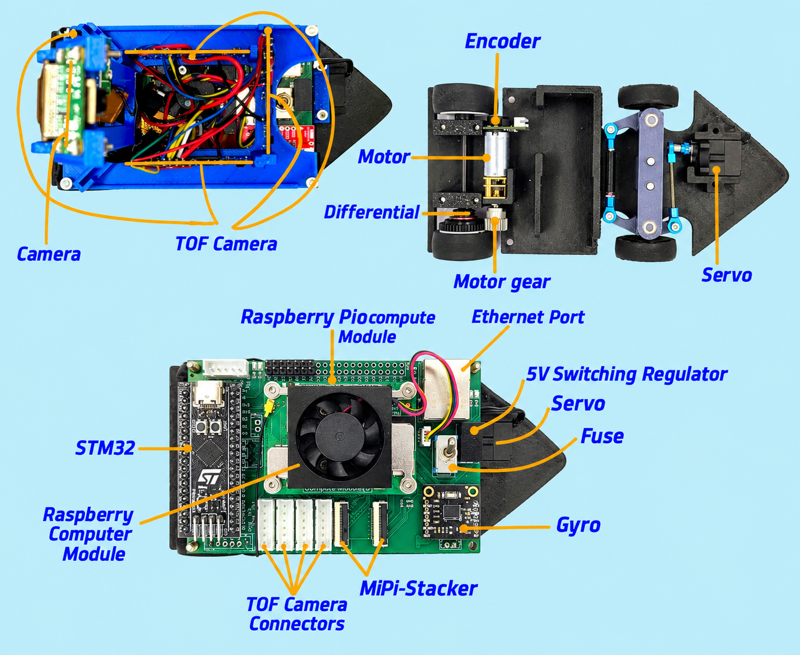
    </a>
</div>


## **Antriebskonzept und Motorauswahl**

Unser Ziel war es, **eine Runde in ungefähr 10 Sekunden zu fahren** – ein Rennen besteht aus drei Runden, das wir damit in etwa 30 Sekunden absolvieren wollen. Die WRO-Strecke hat pro Runde einen Umfang (je nach Streckenführung) von etwa 8 m. Daraus ergibt sich eine benötigte Zielgeschwindigkeit von 8 m / 10 s = 0,8 m/s.  Allerdings können wir nicht permanent mit voller Geschwindigkeit fahren. Es braucht Zeit zum Beschleunigen und Abbremsen und für langsamere Kurvenfahrten. Außerdem geht Zeit zum Parken und für die Hinderniserkennung verloren. Diese Faktoren sind schwer zu berechnen, deswegen haben wir für unser Auto eine Zielgeschwindigkeit von **2m/s als Höchstgeschwindigkeit** abgeschätzt.
<br><br>
Auf Grundlage der gewählten Räder (Durchmesser ca. 27 mm, Umfang ca. 84,8 mm) muss das Rad dafür ungefähr 23,7 Umdrehungen pro Sekunde (= 1410 RPM) ausführen. Um die benötigte Raddrehzahl von etwa 1410 RPM zu erreichen, muss der Getriebeausgang des Motors aufgrund der externen Übersetzung von 2,44:1 eine **Drehzahl** von ungefähr 3384 RPM liefern. Das ist die erste Anforderung an den Motor.
<br><br>
Die zweite Anforderung betrifft das **Drehmoment**. Ein Motor muss nicht nur eine hohe Drehzahl erreichen, sondern auch genug Drehmoment liefern, um das Fahrzeug unter realen Bedingungen zuverlässig zu beschleunigen. Das notwendige Drehmoment schätzten wir auf Basis des Fahrzeuggewichts von ca. 450 g ab. Bei einem angenommenen Rollreibungskoeffizienten von 0,05 und einem Radradius von 13,5 mm ergibt sich:
<br>
<div style="background-color: #B8D8EE; padding: 8px; text-align: center; color: #000000; margin-bottom: 20px;">
Rollwiderstandskraft: F<sub>roll</sub> = 0,45 kg × 9,81 m/s² × 0,05 ≈ 0,22 N<br>
Drehmoment am Rad: M<sub>rad</sub> = 0,22 N × 0,0135 m ≈ 3,0 mNm
</div>

Nach Rückrechnung durch die externe Getriebeübersetzung muss der Motor mindestens 3,0 / 2,44 ≈ 1,2 mNm Drehmoment aufbringen, zuzüglich Reserve für Kurvenfahrten und Beschleunigung.

Um einen geeigneten Motor zu finden, haben wir mehrere kleine Motoren der N20/N30-Klasse gekauft, die laut Datenblatt hohe Drehzahlen bei vertretbarem Drehmoment versprechen, und diese direkt im Fahrzeug getestet. Dafür haben wir ein **Testprogramm** geschrieben, das die Fahrgeschwindigkeit über den Encoder am Motor berechnet. Der STM32 liest einen Quadratur-Encoder aus und berechnet die Drehzahl. Die Umrechnung des Encoder-Zählerwerts in eine Fahrgeschwindigkeit erfolgt über den empirisch kalibrierten Faktor: 

<div style="background-color: #B8D8EE; padding: 8px; text-align: center; color: #000000; margin-bottom: 20px;">
v [m/s] = Encoder-Zählwert × 30 / (5,165 × 1000)</div>

Der Faktor 5,165 wurde anhand von  Referenzmessungen bei bekannten Strecken bestimmt.

 #### Tabelle 1: Vergleich der getesteten Motoren

<table align="center" border="1" style="border-collapse: collapse; border: 2px solid black;">

  <!-- Tabellenkopf -->
  <tr>
    <th bgcolor="#4A90C2" width="120" style="border: 1px solid black; border-bottom: 3px solid black; padding: 8px; color: white;">Motor</th>
    <th bgcolor="#4A90C2" width="160" style="border: 1px solid black; border-bottom: 3px solid black; padding: 8px; color: white;">Leerlauf-Drehzahl<br>(Datenblatt)</th>
    <th bgcolor="#4A90C2" width="160" style="border: 1px solid black; border-bottom: 3px solid black; padding: 8px; color: white;">Nenndrehmoment<br>(Datenblatt)</th>
    <th bgcolor="#4A90C2" width="160" style="border: 1px solid black; border-bottom: 3px solid black; padding: 8px; color: white;">Gemessene<br>Geschwindigkeit</th>
    <th bgcolor="#4A90C2" width="260" style="border: 1px solid black; border-bottom: 3px solid black; padding: 8px; color: white;">Beobachtungen</th>
    <th bgcolor="#4A90C2" width="120" style="border: 1px solid black; border-bottom: 3px solid black; padding: 8px; color: white;">Entscheidung</th>
  </tr>

  <!-- N20 6V 600 rpm -->
  <tr>
    <td bgcolor="#EAF4FB" style="border: 1px solid black; padding: 8px;"><b>N20 6V<br>600 rpm</b></td>
    <td bgcolor="#EAF4FB" style="border: 1px solid black; padding: 8px; text-align: center;">600 rpm</td>
    <td bgcolor="#EAF4FB" style="border: 1px solid black; padding: 8px; text-align: center;">ca. 5 mNm</td>
    <td bgcolor="#EAF4FB" style="border: 1px solid black; padding: 8px; text-align: center;">ca. 0,7 m/s</td>
    <td bgcolor="#EAF4FB" style="border: 1px solid black; padding: 8px;">
      • zu langsam<br>
      • Drehmoment ausreichend
    </td>
    <td bgcolor="#EAF4FB" style="border: 1px solid black; padding: 8px; text-align: center;">verworfen</td>
  </tr>

  <!-- N20 6V 1500 rpm -->
  <tr>
    <td style="border: 1px solid black; padding: 8px;"><b>N20 6V<br>1500 rpm</b></td>
    <td style="border: 1px solid black; padding: 8px; text-align: center;">1500 rpm</td>
    <td style="border: 1px solid black; padding: 8px; text-align: center;">ca. 2 mNm</td>
    <td style="border: 1px solid black; padding: 8px; text-align: center;">ca. 1,5 m/s</td>
    <td style="border: 1px solid black; padding: 8px;">
      • Motor wird sehr heiß<br>
      • Drehmoment zu gering
    </td>
    <td style="border: 1px solid black; padding: 8px; text-align: center;">verworfen</td>
  </tr>

  <!-- N30 6V 500 rpm -->
  <tr>
    <td bgcolor="#EAF4FB" style="border: 1px solid black; padding: 8px;"><b>N30 6V<br>500 rpm</b></td>
    <td bgcolor="#EAF4FB" style="border: 1px solid black; padding: 8px; text-align: center;">500 rpm</td>
    <td bgcolor="#EAF4FB" style="border: 1px solid black; padding: 8px; text-align: center;">ca. 9 mNm</td>
    <td bgcolor="#EAF4FB" style="border: 1px solid black; padding: 8px; text-align: center;">ca. 0,8 m/s</td>
    <td bgcolor="#EAF4FB" style="border: 1px solid black; padding: 8px;">
      • hohes Drehmoment<br>
      • zu geringe Geschwindigkeit
    </td>
    <td bgcolor="#EAF4FB" style="border: 1px solid black; padding: 8px; text-align: center;">verworfen</td>
  </tr>

  <!-- N30 6V 1500 rpm – verwendeter Motor -->
  <tr>
    <td style="border: 1px solid black; border-top: 3px solid black; padding: 8px;"><b>N30 6V<br>1500 rpm</b></td>
    <td style="border: 1px solid black; border-top: 3px solid black; padding: 8px; text-align: center;">1500 rpm</td>
    <td style="border: 1px solid black; border-top: 3px solid black; padding: 8px; text-align: center;">ca. 3 mNm</td>
    <td style="border: 1px solid black; border-top: 3px solid black; padding: 8px; text-align: center;"><b>ca. 2,1 m/s</b></td>
    <td style="border: 1px solid black; border-top: 3px solid black; padding: 8px;">
      • beste Geschwindigkeit
    </td>
    <td style="border: 1px solid black; border-top: 3px solid black; padding: 8px; text-align: center;"><b>verwendet</b></td>
  </tr>

</table>


Wir haben uns für den **N30 6V 1500 rpm** entschieden, da er im Fahrzeug mit ca. 2 m/s die höchste reale Geschwindigkeit erreichte. Sein Nenndrehmoment von ca. 3 mNm liegt über dem berechneten Mindestbedarf von 1,2 mNm und liefert ausreichend Reserve. Laut Datenblatt erreicht er bei 6 V 1500 RPM; hochskaliert auf die Betriebsspannung von 11,1 V (3S-LiPo) ergibt sich eine extrapolierte Leerlaufdrehzahl von ca. 2775 RPM.  


## **Hinterachse und Differential**
#### Abbildung 3: Aufbau der Hinterachse:
<div align="center">
    <a href="img/hinterachse.jpeg" target="_blank">
        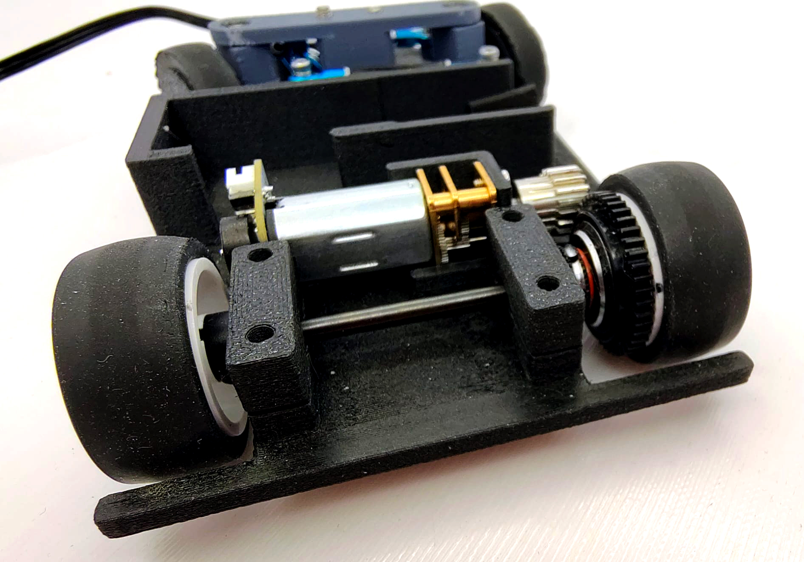
    </a>
</div>

Der Motor treibt die Hinterräder nicht direkt an. Stattdessen verwenden wir ein **Kugeldifferential** an der Hinterachse. 

Der verwendete N30-Motor ist ein Getriebemotor mit interner Übersetzung von 1:10. Zusätzlich überträgt ein externes Zahnradpaar die Kraft auf die Hinterachse: Das Antriebsritzel am Motorausgang hat 18 Zähne, das Differentialzahnrad 44 Zähne, was einer zweiten Übersetzung von ≈ 2,44:1 entspricht. Insgesamt ergibt sich somit eine **Gesamtuntersetzung** von etwa 24,4:1 zwischen dem eigentlichen Elektromotor und der Hinterachse. 

Das **Nenndrehmoment** des N30-Motors liegt laut Datenblatt nach der internen Übersetzung bei ca. 3 mNm. Durch die zusätzliche externe Übersetzung erhöht sich das verfügbare Drehmoment auf  etwa 7,2 mNm an der Hinterachse. 	

Die **Konstruktion** der Hinterachse erfolgte in Fusion 360 auf Basis des Kugeldifferential. Eine Schwierigkeit war, dass sowohl die Motorhalterung als auch die Halterung des Differentials mechanisch präzise gefertigt werden mussten, damit das Zahnflankenspiel zwischen Motorritzel und Differentialzahnrad stimmte. Dies war durch Messen und Konstruieren praktisch allein nicht möglich, da die Maßhaltigkeit der gedruckten Teile nicht hoch genug war. Also wurde der richtige Abstand experimentell ermittelt, indem wir die Konstruktionsparameter änderten und die Bodenplatte neu druckten, bis es gepasst hat. 

## **Vorderachse und Lenkung**

### Ackermann-Bedingung bei unserer Lenkung
Für die Vorderachse haben wir uns wie schon im letzten Jahr für eine **Ackermann-Lenkung** entschieden. Bei einer einfachen Parallellenkung drehen beide Vorderräder um denselben Winkel – das führt in Kurven zu seitlichem Schlupf, weil das kurveninnere Rad einen kleineren Radius fährt als das äußere und daher stärker einlenken müsste. Die Ackermann-Lenkung löst dieses Problem, indem die Lenkgeometrie so ausgelegt wird, dass sich die verlängerten Radachsen beider Vorderräder auf der Verlängerung der Hinterachse in einem gemeinsamen Punkt schneiden. Die ideale Bedingung dafür lautet:

<div style="background-color: #B8D8EE; padding: 8px; text-align: center; color: #000000; margin-bottom: 20px;">cot(δ<sub>außen</sub>) − cot(δ<sub>innen</sub>) = Spurbreite t / Radstand L</div>

Mit unserer Spurbreite t = 65 mm und dem Radstand L = 80 mm ergibt sich ein **Zielwert von t/L = 0,81.**

Da für unsere kompakte Bauform keine geeigneten Fertigteile verfügbar waren, konstruierten wir die gesamte Vorderachse in Fusion 360 selbst und testeten verschiedene Varianten der Lenkgeometrie im 3D-Druck. 

#### Abbildung 4: Einstellung der Lenkgeometrie:
<div align="center">
    <a href="img/Einstellung_Lenkung2.jpg" target="_blank">
        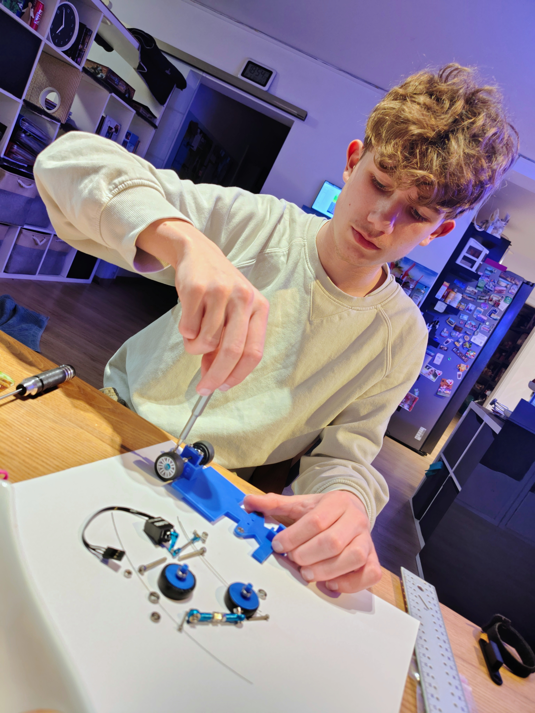
    </a>
</div>

#### Abbildung 5: Experimentelle Validierung der Ackermann-Lenkgeometrie anhand verschiedener Lenkwinkel und Fahrkurven
<div align="center">
    <a href="img/ackermann_radien.jpg" target="_blank">
        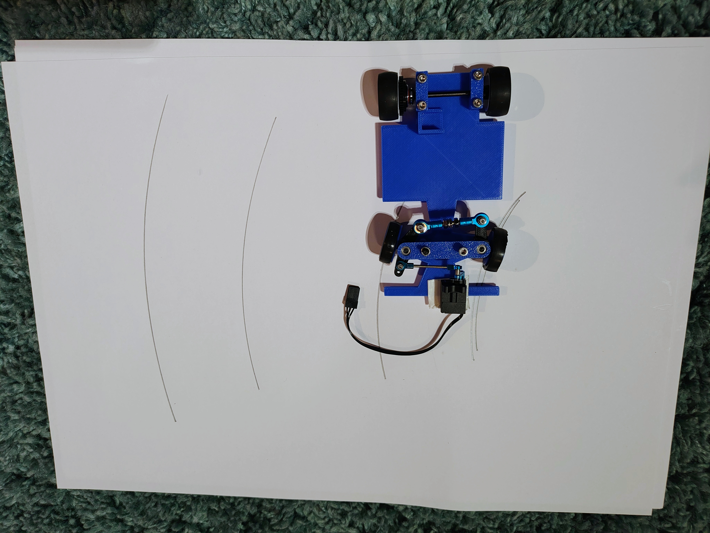
    </a>
</div>

Bei maximalem Lenkeinschlag erreicht das kurveninnere Rad 45° und das kurvenäußere 35°, woraus sich ergibt:

<div style="background-color: #B8D8EE; padding: 8px; text-align: center; color: #000000; margin-bottom: 20px;">
cot(35°) − cot(45°) = 1,43 − 1,00 = 0,43
</div>

Der erreichte Wert von 0,43 liegt deutlich unter dem Idealwert von 0,81. Bei unverändertem Außenwinkel von 35° müsste das Innenrad theoretisch etwa 58,5° erreichen, um die Ackermann-Bedingung vollständig zu erfüllen. Das ist jedoch konstruktiv nicht möglich, da das Innenrad bei 45° bereits am mechanischen Anschlag ist und ein größerer Winkel den verfügbaren Bauraum überschreiten würde. Alternativ müsste bei unverändertem Innenwinkel von 45° der Außenwinkel auf etwa 29° reduziert werden, wodurch das Auto weniger stark einlenken könnte. Die Lenkung erfüllt die ideale Ackermann-Bedingung daher nur teilweise. Dadurch schneiden sich die verlängerten Radachsen der Vorderräder nicht exakt in einem gemeinsamen Kurvenmittelpunkt, wodurch in engen Kurven leichter seitlicher Schlupf an den Vorderrädern entstehen kann:

#### Abbildung 5: Ackermann-Bedingung bei unserer Lenkung:
<div align="center">
    <a href="img/ackermann_englisch.png" target="_blank">
        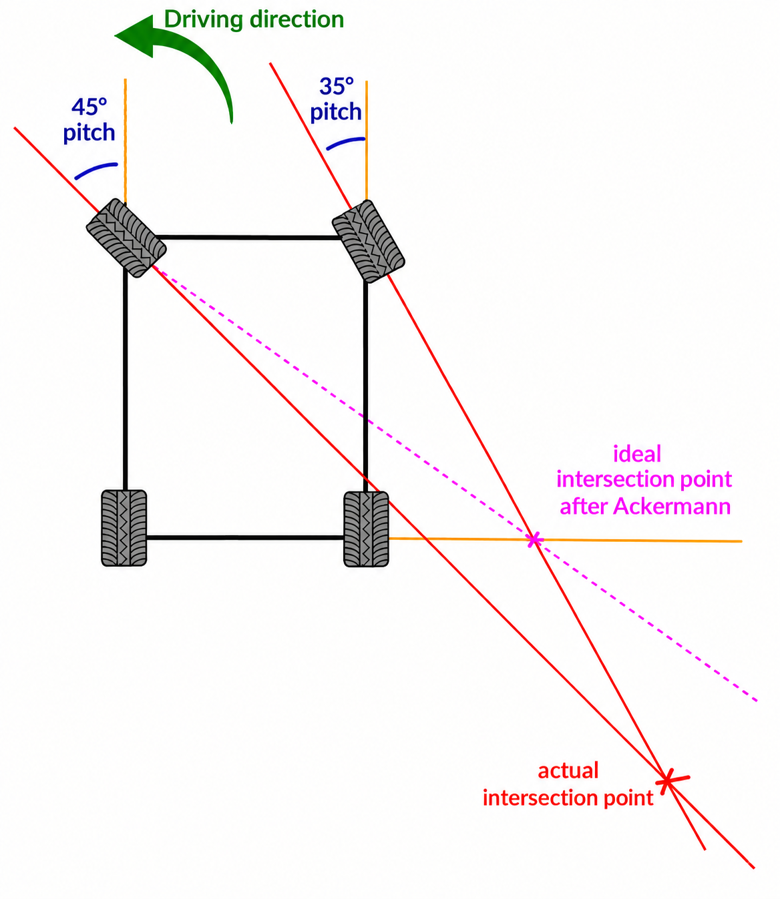
    </a>
</div>


### Minimaler Kurvenradius bei unserer Lenkung

Der minimale Kurvenradius (gemessen von Hinterachsmitte bis Kurvenmittelpunkt) berechnet sich so:

<div style="background-color: #B8D8EE; padding: 8px; text-align: center; color: #000000; margin-bottom: 20px;">
Minimaler Kurvenradius = Radstand / tan(δ<sub>außen</sub>)

</div>

Der **minimale Kurvenradius** beträgt bei unserem Auto näherungsweise **114 mm** (Saison 2025: 172mm). Für die Anforderungen der WRO-Strecke ist dieser Kurvenradius vollkommen ausreichend. In den Fahrversuchen zeigte sich, dass das Fahrzeug Kurven zuverlässig und stabil durchfährt. 

### Mechanische Präzision unserer Lenkung
Neben der Lenkgeometrie ist jedoch auch die **mechanische Präzision der Lagerung** entscheidend dafür, ob die berechneten Winkel im Fahrbetrieb tatsächlich reproduzierbar erreicht werden. Im letzten Jahr hatte unser Auto nur ein Kugellager pro Rad. Die Achsschenkel wurden in Gleitlagern gehalten. Dadurch hatten die Räder deutliches Spiel und sie wackelten seitlich hin und her. Um das Lenkspiel zu minimieren, verwendeten wir für die Lagerung der Vorderachse insgesamt acht Kugellager. Zwei pro Seite lagern die Achsschenkel, zwei weitere pro Seite lagern die Räder. Diese Kugellager sorgen für eine präzise Lenkung mit wenig Spiel sowie einen geringen Rollwiderstand.

#### Abbildung 6: Schnitt der Vorderachse:
<div align="center">
    <a href="img/schnitt schraeg.png" target="_blank">
        
    </a>
</div><div align="center">
    <a href="img/schnitt_gerade_eng.png" target="_blank">
        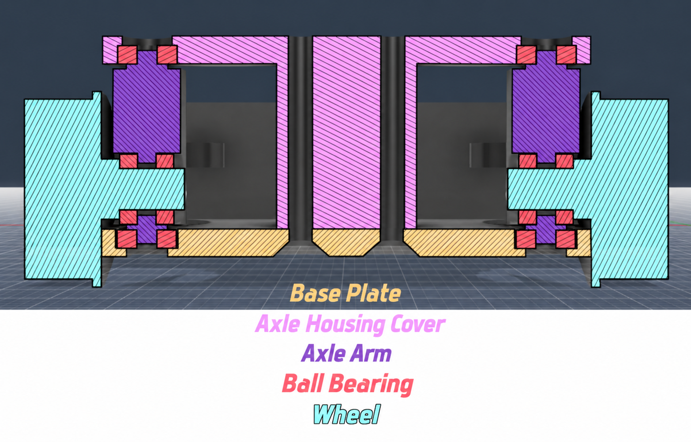
    </a>
</div>
<br>

## **Auswahl und Position des Servos**

Bei der **Auswahl** des Lenkservos waren neben der Baugröße vor allem die schnelle Beschaffbarkeit ausschlaggebend. Zunächst kam ein besonders kompakter und kostengünstiger Servo (ca. 2 €) mit Vollkunststoffgetriebe zum Einsatz. Das ausgeprägte Lenkspiel von schätzungsweise 5° erwies sich jedoch als unzureichend für eine präzise Regelung, weshalb der **INJORA N30 Nano** mit Coreless-Motor, Metallgetriebe und Aluminiumgehäuse als Ersatz gewählt wurde. Mit einem Gewicht von 7 g und den Abmessungen 15,2 × 13,0 × 21,3 mm bleibt er äußerst kompakt; bei 6 V stellt er ein Drehmoment von 1,3 kg·cm bei einer Stellgeschwindigkeit von 0,05 s/60° bereit. Da die Anforderungen an Kraft und Reaktionszeit im vorliegenden Anwendungsfall gering sind, hätte nahezu jeder handelsübliche Servo die Spezifikation erfüllt – entscheidend war allein das spielfreie Metallgetriebe.

Die **Positionierung des Servos** stellte eine eigenständige konstruktive Herausforderung dar. Die bei Modellfahrzeugen übliche Anordnung – Servo und Gestänge mittig im Fahrzeug – schied aus, weil wir für eine hohe Wendigkeit einen relativ kurzen Radstand benötigten und wir für einen niedrigen Schwerpunkt den Akku zwischen Vorder- und Hinterräder einbauen wollten. Nach dem Evaluieren zahlreicher Konfigurationen wurde der Servo vor die Vorderachse verlagert, das Gestänge hinter ihr geführt. So ließ sich der Bumperbereich konstruktiv nutzen, ohne Akku oder Platine umzuplatzieren; der Schwerpunkt blieb tief und zentral, und der erforderliche Lenkeinschlag wurde kollisionsfrei erreicht.

# **2. Energie und Sensoren**

## **Konzept**
Um das Designziel eines kleinen und schnellen Fahrzeugs zu erreichen, war ein grundlegender Umbau der Elektronik notwendig. Das Vorjahressystem nutzte einen RPLiDAR S2 zur Umfelderkennung sowie zwei optische Odometrie-Sensoren zur Positionsbestimmung. Die Steuerung war vollständig koordinatenbasiert – Fahrbefehle lauteten sinngemäß „Gehe zu Koordinate X/Y". Der LIDAR lieferte jedoch nur ~10 Updates pro Sekunde mit einer Verzögerung von 100–200 ms, weshalb Positionskorrekturen nur im Stillstand zuverlässig funktionierten. Die Odometrie übernahm die Positionsverfolgung während der Fahrt, begrenzte die Maximalgeschwindigkeit aber auf 0,5 m/s – darüber wurden ihre Messungen unzuverlässig.

Für das neue Fahrzeug wurde daher ein grundlegend anderer Ansatz gewählt: Mehrere **Time-of-Flight-Sensoren** (VL53L8CX) messen mit 30 Hz kontinuierlich die Abstände zu den Wänden und ermöglichen so eine Steuerung ohne Anhalten. Die Steuerlogik ist nun eventbasiert – statt „Gehe zu Koordinate X/Y" lautet ein Fahrbefehl beispielsweise „Fahre auf die Wand zu, bis der Abstand 20 cm beträgt". Da keine Stopps zur Positionskorrektur mehr nötig sind, fährt das Fahrzeug deutlich flüssiger und schneller.

Das Ergebnis: 2025 benötigte unser Fahrzeug im Hindernisrennen durchschnittlich 160 s für einen Lauf, 2026 erreichen wir je nach Aufbau zwischen ca. 35 s und 45 s. Damit haben wir unser Designziel von 30 Sekunden pro Runde zwar nicht ganz erreicht, aber unsere **Rundenzeit** immerhin **um den Faktor 4 verbessert**.
<br>

## **Aufbau der Elektronik**

Für die Elektronik wurde zunächst ein Testaufbau auf einem **Breadboard** aufgebaut. Damit konnten wir prüfen, ob die wichtigsten Komponenten grundsätzlich funktionieren, bevor wir eine eigene Platine fertigen ließen. Getestet wurden dabei unter anderem Mikrocontroller, Motor, Motor-Encoder, Motortreiber, Servo, Time-of-Flight-Sensoren und Kamera. Den vollständigen Aufbau der Elektronik zeigt der Verdrahtungsplan (vgl. Anhang 5.3: Abbildung A3 „Verdrahtungsplan“). Er stellt alle Verbindungen zwischen Baseboard, Raspberry Pi CM5, STM32, Sensoren, Motortreiber und Servo dar.

#### Abbildung 7: Verdrahtungsplan

</div><div align="center">
    <a href="img/plan_gesamt_Kopie.jpg" target="_blank">
        
    </a>
</div>


## **Kamera: Verwendung der Kamera und Kalibrierung**

### **Verwendung der Kamera** 
Wie im Vorjahr setzen wir auf die **Raspberry Pi Camera Module 3 Wide (12 MP)**, da sie sich bewährt hat. Drei Wochen vor dem Regionalwettbewerb entschieden wir uns, die Kamera auf 27 cm Höhe – knapp unter der Maximalhöhe – zu montieren. So kann das Fahrzeug vom Startplatz aus über die Bande hinweg alle Hindernisse auf einmal erfassen (**Vollscanstrategie**) und die optimale Route bereits vor der Abfahrt berechnen. Die Erkennung der Hindernisse ist so zwar deutlich anspruchsvoller (vgl. Kapitel 3.7.1 Maskenpipeline), das Abfahren des Kurses ist aber viel einfacher und schneller, da keine Zeit mehr verloren geht, um günstige Kamerapositionen anzufahren. Die durchschnittliche Rundenzeit sank dadurch nochmals von 56 s auf 38 s.


### **Kalibrierungsverfahren**

Die Kamera **kalibriert** Belichtungszeit, Weißabgleich und Verstärkung automatisch. Je nach Lichtverhältnissen vor Ort können jedoch manuelle Anpassungen der Farbmasken in <code>cameraAIO.py</code> nötig sein – insbesondere die Erkennung der schwarzen Wände reagiert empfindlich auf Beleuchtungsänderungen.

Vor jedem Wettbewerbslauf nehmen wir ein Testbild auf und prüfen im Debug-Bild, ob die Hindernisse vollständig in der Maske liegen und die schwarzen Wände eine geschlossene Flood-Fill-Barriere bilden. Falls nicht, passen wir zuerst den V-Maximalwert der Schwarzmaske und anschließend die H/S/V-Werte der Rot- und Grünmasken an. Da der Hue-Bereich in OpenCV von 0 bis 179° reicht und Rot als einzige Farbe an beiden Enden der Skala erscheint, werden für die Roterkennung zwei separate Masken erzeugt und anschließend addiert.

#### Tabelle 2: HSV-Farbmasken und Kalibrierparameter

<table align="center" border="1" style="border-collapse: collapse; border: 2px solid black;">

  <!-- Tabellenkopf -->
  <tr>
    <th bgcolor="#4A90C2" width="120" style="border: 1px solid black; border-bottom: 3px solid black; padding: 8px; color: white;">Farbe</th>
    <th bgcolor="#4A90C2" width="140" style="border: 1px solid black; border-bottom: 3px solid black; padding: 8px; color: white;">H (min–max)</th>
    <th bgcolor="#4A90C2" width="140" style="border: 1px solid black; border-bottom: 3px solid black; padding: 8px; color: white;">S (min–max)</th>
    <th bgcolor="#4A90C2" width="140" style="border: 1px solid black; border-bottom: 3px solid black; padding: 8px; color: white;">V (min–max)</th>
    <th bgcolor="#4A90C2" width="400" style="border: 1px solid black; border-bottom: 3px solid black; padding: 8px; color: white;">Begründung</th>
  </tr>

  <!-- Rot 1 -->
  <tr>
    <td bgcolor="#EAF4FB" style="border: 1px solid black; padding: 8px; text-align: center;"><b>Rot 1</b></td>
    <td bgcolor="#EAF4FB" style="border: 1px solid black; padding: 8px; text-align: center;">0–10</td>
    <td bgcolor="#EAF4FB" style="border: 1px solid black; padding: 8px; text-align: center;">190–255</td>
    <td bgcolor="#EAF4FB" style="border: 1px solid black; padding: 8px; text-align: center;">190–255</td>
    <td bgcolor="#EAF4FB" style="border: 1px solid black; padding: 8px;">
      Sattes, helles Rot (Hue nahe 0°); hohe S- und V-Schwellen filtern blasse Farbtöne
    </td>
  </tr>

  <!-- Rot 2 -->
  <tr>
    <td style="border: 1px solid black; padding: 8px; text-align: center;"><b>Rot 2</b></td>
    <td style="border: 1px solid black; padding: 8px; text-align: center;">160–179</td>
    <td style="border: 1px solid black; padding: 8px; text-align: center;">100–255</td>
    <td style="border: 1px solid black; padding: 8px; text-align: center;">20–255</td>
    <td style="border: 1px solid black; padding: 8px;">
      Rot am oberen Hue-Ende (Wrap-around bei 180°); breitere S/V-Grenzen, da diese Rottöne im Foto dunkler erscheinen
    </td>
  </tr>

  <!-- Grün -->
  <tr>
    <td bgcolor="#EAF4FB" style="border: 1px solid black; padding: 8px; text-align: center;"><b>Grün</b></td>
    <td bgcolor="#EAF4FB" style="border: 1px solid black; padding: 8px; text-align: center;">35–95</td>
    <td bgcolor="#EAF4FB" style="border: 1px solid black; padding: 8px; text-align: center;">100–255</td>
    <td bgcolor="#EAF4FB" style="border: 1px solid black; padding: 8px; text-align: center;">20–255</td>
    <td bgcolor="#EAF4FB" style="border: 1px solid black; padding: 8px;">
      Weiter Bereich von Gelbgrün bis Blaugrün; deckt unterschiedliche Beleuchtungstemperaturen ab
    </td>
  </tr>

  <!-- Schwarz -->
  <tr>
    <td style="border: 1px solid black; padding: 8px; text-align: center;"><b>Schwarz<br>(Wände)</b></td>
    <td style="border: 1px solid black; padding: 8px; text-align: center;">0–255</td>
    <td style="border: 1px solid black; padding: 8px; text-align: center;">0–255</td>
    <td style="border: 1px solid black; padding: 8px; text-align: center;">0–90</td>
    <td style="border: 1px solid black; padding: 8px;">
      Nur über den Helligkeitskanal V definiert
    </td>
  </tr>

</table>

Der kritischste Parameter ist der V-Maximalwert der Schwarzmaske (Standardwert: 90 – s. Tabelle). Bei starkem Umgebungslicht reflektieren schwarze Wände mehr Licht und erscheinen heller; der Wert muss dann auf 110–120 erhöht werden. Bei schwacher Beleuchtung kann er auf 70–80 gesenkt werden, um Fehldetektionen durch dunkle Schatten auf dem weißen Boden zu vermeiden. Problematisch ist teilweises Sonnenlicht: Schwarze Wände im direkten Sonnenlicht können einen höheren V-Wert erreichen als der weiße Boden im Schatten – eine Konstellation, für die wir bislang keine zuverlässige Lösung gefunden haben.

## **Entfernungssensoren**

### **Auswahl der Entfernungssensoren**

Für die Erkennung der Umgebung verwenden wir optische Entfernungssensoren beziehungsweise Time-of-Flight-Sensoren. Diese messen die Entfernung zu Objekten auf optischer Basis. Zur konkreten Auswahl verglichen wir die Datenblätter von unterschiedlichen  Sensoren.

<table align="center" border="1" style="border-collapse: collapse; border: 2px solid black;">

  <!-- Tabellenkopf -->
  <tr>
    <th bgcolor="#4A90C2" width="130" style="border: 1px solid black; border-bottom: 3px solid black; padding: 8px; color: white;">Sensor</th>
    <th bgcolor="#4A90C2" width="150" style="border: 1px solid black; border-bottom: 3px solid black; padding: 8px; color: white;">Hersteller</th>
    <th bgcolor="#4A90C2" width="150" style="border: 1px solid black; border-bottom: 3px solid black; padding: 8px; color: white;">Zonen-<br>Auflösung</th>
    <th bgcolor="#4A90C2" width="130" style="border: 1px solid black; border-bottom: 3px solid black; padding: 8px; color: white;">FOV<br>(gesamt)</th>
    <th bgcolor="#4A90C2" width="130" style="border: 1px solid black; border-bottom: 3px solid black; padding: 8px; color: white;">FOV/Zone</th>
    <th bgcolor="#4A90C2" width="120" style="border: 1px solid black; border-bottom: 3px solid black; padding: 8px; color: white;">Max.<br>Frequenz</th>
    <th bgcolor="#4A90C2" width="130" style="border: 1px solid black; border-bottom: 3px solid black; padding: 8px; color: white;">Reichweite</th>
    <th bgcolor="#4A90C2" width="140" style="border: 1px solid black; border-bottom: 3px solid black; padding: 8px; color: white;">Strom-<br>verbrauch</th>
    <th bgcolor="#4A90C2" width="130" style="border: 1px solid black; border-bottom: 3px solid black; padding: 8px; color: white;">Schnittstelle</th>
  </tr>

  <!-- VL53L9CX -->
  <tr>
    <td bgcolor="#EAF4FB" style="border: 1px solid black; padding: 8px; text-align: center;"><b>🟥 VL53L9CX<br>angekündigt</b></td>
    <td bgcolor="#EAF4FB" style="border: 1px solid black; padding: 8px; text-align: center;">STMicro-<br>electronics</td>
    <td bgcolor="#EAF4FB" style="border: 1px solid black; padding: 8px; text-align: center;">54×42<br>(2268 Zonen)</td>
    <td bgcolor="#EAF4FB" style="border: 1px solid black; padding: 8px; text-align: center;">55°×42°<br>(71° diag.)</td>
    <td bgcolor="#EAF4FB" style="border: 1px solid black; padding: 8px; text-align: center;">🟩 ~1,0°<br>(laut ST)</td>
    <td bgcolor="#EAF4FB" style="border: 1px solid black; padding: 8px; text-align: center;">🟩 100 Hz</td>
    <td bgcolor="#EAF4FB" style="border: 1px solid black; padding: 8px; text-align: center;">bis 880 cm</td>
    <td bgcolor="#EAF4FB" style="border: 1px solid black; padding: 8px; text-align: center;">~150 mW</td>
    <td bgcolor="#EAF4FB" style="border: 1px solid black; padding: 8px; text-align: center;">I3C /<br>MIPI CSI</td>
  </tr>

  <!-- VL53L1X -->
  <tr>
    <td style="border: 1px solid black; padding: 8px; text-align: center;"><b>VL53L1X</b></td>
    <td style="border: 1px solid black; padding: 8px; text-align: center;">STMicro-<br>electronics</td>
    <td style="border: 1px solid black; padding: 8px; text-align: center;">1 Zone</td>
    <td style="border: 1px solid black; padding: 8px; text-align: center;">27°</td>
    <td style="border: 1px solid black; padding: 8px; text-align: center;">27°<br>(1 Zone)</td>
    <td style="border: 1px solid black; padding: 8px; text-align: center;">50 Hz</td>
    <td style="border: 1px solid black; padding: 8px; text-align: center;">bis 400 cm</td>
    <td style="border: 1px solid black; padding: 8px; text-align: center;">~20 mW</td>
    <td style="border: 1px solid black; padding: 8px; text-align: center;">I²C</td>
  </tr>

  <!-- VL53L4CD -->
  <tr>
    <td bgcolor="#EAF4FB" style="border: 1px solid black; padding: 8px; text-align: center;"><b>VL53L4CD</b></td>
    <td bgcolor="#EAF4FB" style="border: 1px solid black; padding: 8px; text-align: center;">STMicro-<br>electronics</td>
    <td bgcolor="#EAF4FB" style="border: 1px solid black; padding: 8px; text-align: center;">1 Zone</td>
    <td bgcolor="#EAF4FB" style="border: 1px solid black; padding: 8px; text-align: center;">18°<br>diagonal</td>
    <td bgcolor="#EAF4FB" style="border: 1px solid black; padding: 8px; text-align: center;">18°<br>(1 Zone)</td>
    <td bgcolor="#EAF4FB" style="border: 1px solid black; padding: 8px; text-align: center;">100 Hz</td>
    <td bgcolor="#EAF4FB" style="border: 1px solid black; padding: 8px; text-align: center;">bis 120 cm</td>
    <td bgcolor="#EAF4FB" style="border: 1px solid black; padding: 8px; text-align: center;">0,15 mW<br>(ULP)</td>
    <td bgcolor="#EAF4FB" style="border: 1px solid black; padding: 8px; text-align: center;">I²C</td>
  </tr>

  <!-- TMF8828 -->
  <tr>
    <td style="border: 1px solid black; padding: 8px; text-align: center;"><b>🟨 TMF8828<br>engere Wahl</b></td>
    <td style="border: 1px solid black; padding: 8px; text-align: center;">ams-OSRAM</td>
    <td style="border: 1px solid black; padding: 8px; text-align: center;">8×8<br>(64 Zonen)</td>
    <td style="border: 1px solid black; padding: 8px; text-align: center;">~45°<br>diagonal</td>
    <td style="border: 1px solid black; padding: 8px; text-align: center;">🟨 ~4,0°<br>(32°÷8)</td>
    <td style="border: 1px solid black; padding: 8px; text-align: center;">🟨 30 Hz</td>
    <td style="border: 1px solid black; padding: 8px; text-align: center;">bis 500 cm</td>
    <td style="border: 1px solid black; padding: 8px; text-align: center;">~75 mW</td>
    <td style="border: 1px solid black; padding: 8px; text-align: center;">I²C / SPI</td>
  </tr>

  <!-- TMF8821 -->
  <tr>
    <td bgcolor="#EAF4FB" style="border: 1px solid black; padding: 8px; text-align: center;"><b>TMF8821</b></td>
    <td bgcolor="#EAF4FB" style="border: 1px solid black; padding: 8px; text-align: center;">ams-OSRAM</td>
    <td bgcolor="#EAF4FB" style="border: 1px solid black; padding: 8px; text-align: center;">3×3<br>(9 Zonen)</td>
    <td bgcolor="#EAF4FB" style="border: 1px solid black; padding: 8px; text-align: center;">~41°<br>diagonal</td>
    <td bgcolor="#EAF4FB" style="border: 1px solid black; padding: 8px; text-align: center;">~9,7°<br>(29°÷3)</td>
    <td bgcolor="#EAF4FB" style="border: 1px solid black; padding: 8px; text-align: center;">30 Hz</td>
    <td bgcolor="#EAF4FB" style="border: 1px solid black; padding: 8px; text-align: center;">bis 500 cm</td>
    <td bgcolor="#EAF4FB" style="border: 1px solid black; padding: 8px; text-align: center;">~90 mW</td>
    <td bgcolor="#EAF4FB" style="border: 1px solid black; padding: 8px; text-align: center;">I²C / SPI</td>
  </tr>

  <!-- VL53L8CX -->
  <tr>
    <td style="border: 1px solid black; border-top: 3px solid black; padding: 8px; text-align: center;"><b>🟩 VL53L8CX<br>ausgewählt</b></td>
    <td style="border: 1px solid black; border-top: 3px solid black; padding: 8px; text-align: center;">STMicro-<br>electronics</td>
    <td style="border: 1px solid black; border-top: 3px solid black; padding: 8px; text-align: center;">8×8<br>(64 Zonen)</td>
    <td style="border: 1px solid black; border-top: 3px solid black; padding: 8px; text-align: center;">65°<br>diagonal</td>
    <td style="border: 1px solid black; border-top: 3px solid black; padding: 8px; text-align: center;">🟩 ~5,75°<br>(46°÷8)</td>
    <td style="border: 1px solid black; border-top: 3px solid black; padding: 8px; text-align: center;">🟩 60 Hz</td>
    <td style="border: 1px solid black; border-top: 3px solid black; padding: 8px; text-align: center;">bis 400 cm</td>
    <td style="border: 1px solid black; border-top: 3px solid black; padding: 8px; text-align: center;">~28 mW<br>(15 Hz, 8×8)</td>
    <td style="border: 1px solid black; border-top: 3px solid black; padding: 8px; text-align: center;">I²C / SPI</td>
  </tr>

</table>

Bei der Sensorauswahl war entscheidend, dass einzelne Messzonen möglichst klein sind, um Wände aus größerer Entfernung vom Boden unterscheiden zu können (FOV/Zone in der Tabelle). Der VL53L9CX wäre aufgrund seiner höheren Auflösung ideal gewesen, war zum Entwicklungszeitpunkt jedoch noch nicht erhältlich. Zwischen VL53L8CX und TMF8828 fiel die Wahl auf den **VL53L8CX**, da dessen maximale Messfrequenz laut Datenblatt deutlich höher war und wir uns davon schnellere Reaktionszeiten der Hinderniserkennung versprachen. In der Praxis zeigte sich jedoch, dass im 8×8-Modus nur ~30 Hz erreichbar waren – womit der TMF8828 rückblickend vielleicht die bessere Wahl gewesen wäre. Ein Sensorwechsel war zu diesem Zeitpunkt aufgrund des fortgeschrittenen Entwicklungsstands jedoch nicht mehr realistisch.

### **Sensorevaluierung**

Der VL53L8CX bietet **zwei Betriebsmodi**: Im 4×4-Modus liefert er ein Messraster aus 16 Zonen bei höherer Messfrequenz, im 8×8-Modus stehen 64 Zonen bei geringerer Frequenz zur Verfügung. Um den für unser Fahrzeug geeigneten Modus zu bestimmen, haben wir beide Varianten systematisch getestet.

#### Abbildung 7: Testaufbau zur Sensorevaluierung

</div><div align="center">
    <a href="img/Sensorpruefung (1).jpg" target="_blank">
        
    </a>
</div>

Ein Problem bei der **Sensorplatzierung** ist die Einbauhöhe über dem Boden. Sitzt der Sensor zu tief, erfassen einzelne Messzonen den Boden statt die Wand, was zu Fehlmessungen führt. Sitzt er zu hoch, kann er die untere Kante einer Wand nicht mehr zuverlässig erfassen. Wir haben verschiedene Sensorhöhen getestet und gemessen, ab welchem Abstand die Wand sicher erkannt wird und ob Bodenreflexionen die Messung stören. 

Neben der Höhe untersuchten wir auch den Einfluss der Messfrequenz auf die maximale sichere Erkennungsreichweite. Eine höhere Frequenz ist für die Fahrstrategie vorteilhaft, da der STM32 häufiger aktualisierte Abstände erhält und früher reagieren kann. Allerdings kann eine höhere Frequenz zu erhöhtem Rauschen führen, was die maximale zuverlässige Reichweite reduziert. Die Tabelle 4 fasst die Ergebnisse zusammen.

#### Tabelle 4: Erkennungszuverlässigkeit bei verschiedenen Sensorhöhen 

<table align="center" border="1" style="border-collapse: collapse; border: 2px solid black;">

  <!-- Tabellenkopf -->
  <tr>
    <th bgcolor="#4A90C2" width="160" style="border: 1px solid black; border-bottom: 3px solid black; padding: 8px; color: white;">Sensorhöhe in mm</th>
    <th bgcolor="#4A90C2" width="170" style="border: 1px solid black; border-bottom: 3px solid black; padding: 8px; color: white;">Reichweite 4×4<br>60 Hz in cm</th>
    <th bgcolor="#4A90C2" width="170" style="border: 1px solid black; border-bottom: 3px solid black; padding: 8px; color: white;">Reichweite 4×4<br>30 Hz in cm</th>
    <th bgcolor="#4A90C2" width="170" style="border: 1px solid black; border-bottom: 3px solid black; padding: 8px; color: white;">Reichweite 8×8<br>50 Hz in cm</th>
    <th bgcolor="#4A90C2" width="170" style="border: 1px solid black; border-bottom: 3px solid black; padding: 8px; color: white;">Reichweite 8×8<br>30 Hz in cm</th>
  </tr>

  <!-- 30 mm -->
  <tr>
    <td bgcolor="#EAF4FB" style="border: 1px solid black; padding: 8px; text-align: center;">30</td>
    <td bgcolor="#EAF4FB" style="border: 1px solid black; padding: 8px; text-align: center;">40</td>
    <td bgcolor="#EAF4FB" style="border: 1px solid black; padding: 8px; text-align: center;">40</td>
    <td bgcolor="#EAF4FB" style="border: 1px solid black; padding: 8px; text-align: center;">40</td>
    <td bgcolor="#EAF4FB" style="border: 1px solid black; padding: 8px; text-align: center;">70</td>
  </tr>

  <!-- 40 mm -->
  <tr>
    <td style="border: 1px solid black; padding: 8px; text-align: center;">40</td>
    <td style="border: 1px solid black; padding: 8px; text-align: center;">50</td>
    <td style="border: 1px solid black; padding: 8px; text-align: center;">50</td>
    <td style="border: 1px solid black; padding: 8px; text-align: center;">40</td>
    <td style="border: 1px solid black; padding: 8px; text-align: center;">90</td>
  </tr>

  <!-- 50 mm -->
  <tr>
    <td bgcolor="#EAF4FB" style="border: 1px solid black; padding: 8px; text-align: center;">50</td>
    <td bgcolor="#EAF4FB" style="border: 1px solid black; padding: 8px; text-align: center;">60</td>
    <td bgcolor="#EAF4FB" style="border: 1px solid black; padding: 8px; text-align: center;">60</td>
    <td bgcolor="#EAF4FB" style="border: 1px solid black; padding: 8px; text-align: center;">50</td>
    <td bgcolor="#EAF4FB" style="border: 1px solid black; padding: 8px; text-align: center;">100</td>
  </tr>

  <!-- 60 mm -->
  <tr>
    <td style="border: 1px solid black; padding: 8px; text-align: center;"><b>🟩 60</b></td>
    <td style="border: 1px solid black; padding: 8px; text-align: center;">60</td>
    <td style="border: 1px solid black; padding: 8px; text-align: center;">60</td>
    <td style="border: 1px solid black; padding: 8px; text-align: center;">70</td>
    <td style="border: 1px solid black; padding: 8px; text-align: center;"><b>🟩 130</b></td>
  </tr>

  <!-- 70 mm -->
  <tr>
    <td bgcolor="#EAF4FB" style="border: 1px solid black; padding: 8px; text-align: center;">70</td>
    <td bgcolor="#EAF4FB" style="border: 1px solid black; padding: 8px; text-align: center;">60</td>
    <td bgcolor="#EAF4FB" style="border: 1px solid black; padding: 8px; text-align: center;">60</td>
    <td bgcolor="#EAF4FB" style="border: 1px solid black; padding: 8px; text-align: center;">70</td>
    <td bgcolor="#EAF4FB" style="border: 1px solid black; padding: 8px; text-align: center;">120</td>
  </tr>

  <!-- 80 mm -->
  <tr>
    <td style="border: 1px solid black; padding: 8px; text-align: center;">80</td>
    <td style="border: 1px solid black; padding: 8px; text-align: center;">60</td>
    <td style="border: 1px solid black; padding: 8px; text-align: center;">60</td>
    <td style="border: 1px solid black; padding: 8px; text-align: center;">60</td>
    <td style="border: 1px solid black; padding: 8px; text-align: center;">110</td>
  </tr>

  <!-- 90 mm -->
  <tr>
    <td bgcolor="#EAF4FB" style="border: 1px solid black; padding: 8px; text-align: center;">90</td>
    <td bgcolor="#EAF4FB" style="border: 1px solid black; padding: 8px; text-align: center;">50</td>
    <td bgcolor="#EAF4FB" style="border: 1px solid black; padding: 8px; text-align: center;">50</td>
    <td bgcolor="#EAF4FB" style="border: 1px solid black; padding: 8px; text-align: center;">60</td>
    <td bgcolor="#EAF4FB" style="border: 1px solid black; padding: 8px; text-align: center;">90</td>
  </tr>

</table>

Die Tests zeigten, dass der 4x4 Modus zwar eine höhere Messfrequenz liefert, aber leider die schmalen Wände nur auf eine zu kurze Distanz sicher erkennt. Ein einzelner Messpunkt ist dann so groß, dass er nicht nur die Wand erfasst, sondern zusätzlich den Boden. Deswegen haben wir den **8x8 Modus mit 30Hz** gewählt und die Sensoren wurden auf **60mm Höhe** eingebaut, weil dort die größte Reichweite erreicht wurde (s. Tabelle).

### **Sensorenplatzierung im Roboter**
Die verwendeten Time-of-Flight-Sensoren haben einen **Erfassungswinkel von ca. 60°**. Ursprünglich waren vier Sensoren geplant.

#### Abbildung 8: Frühe Version des Roboters mit vier Sensoren

</div><div align="center">
    <a href="img/fruehe version roboter.jpg" target="_blank">
        
    </a>
</div>


Jedoch zeigte sich in Fahrtests ein Problem: Bei einer Annäherung an eine Wand im 45°-Winkel entstand ein toter Winkel schräg vor dem Fahrzeug, da weder der vordere noch der seitliche Sensor diesen Bereich ausreichend abdeckten. 

#### Abbildung 9: Sensorabdeckung bei vier Sensoren

</div><div align="center">
    <a href="img/winkel_vier.png" target="_blank">
        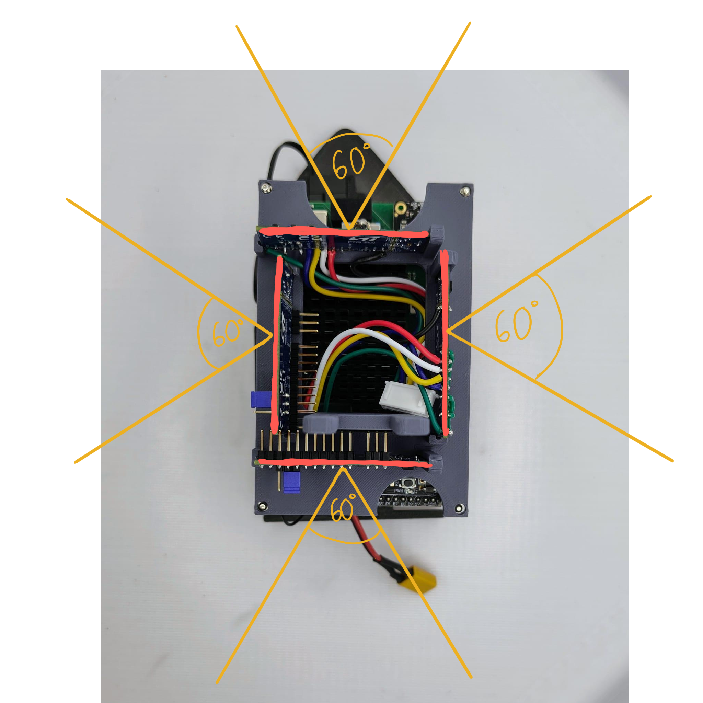
    </a>
</div>

Um dieses Problem zu lösen, wurden vorne zwei zusätzliche Sensoren ergänzt, die im 45°-Winkel nach vorne ausgerichtet sind. Diese sollten Wände bei schräger Anfahrt früher erkennen. Die Platzierung vorne am Fahrzeug erwies sich jedoch als problematisch, da die Sensoren das Kamerabild verdeckten, da die Kamera zu diesem Zeitpunkt noch nicht erhöht montiert war.

#### Abbildung 10: Abdeckung des 45°-Totwinkels durch zwei zusätzliche Sensoren vorne

 </div><div align="center">
    <a href="img/bild2.png" target="_blank">
        
    </a>
</div>

 Somit wurde nach einer Alternativlösung gesucht. Um Platz zu sparen, stiegen wir auf kleinere PCBs um, die mechanisch besser ins kompakte Chassis passten und bauten diese ein.

#### Abbildung 10: Größenvergleich der Sensor-PCBs

 </div><div align="center">
    <a href="img/bild1.png" target="_blank">
        
    </a>
</div>


#### Abbildung 11: Testposition eines zusätzlichen schräg nach vorne gerichteten Sensors

</div><div align="center">
    <a href="img/schraeg.jpg" target="_blank">
        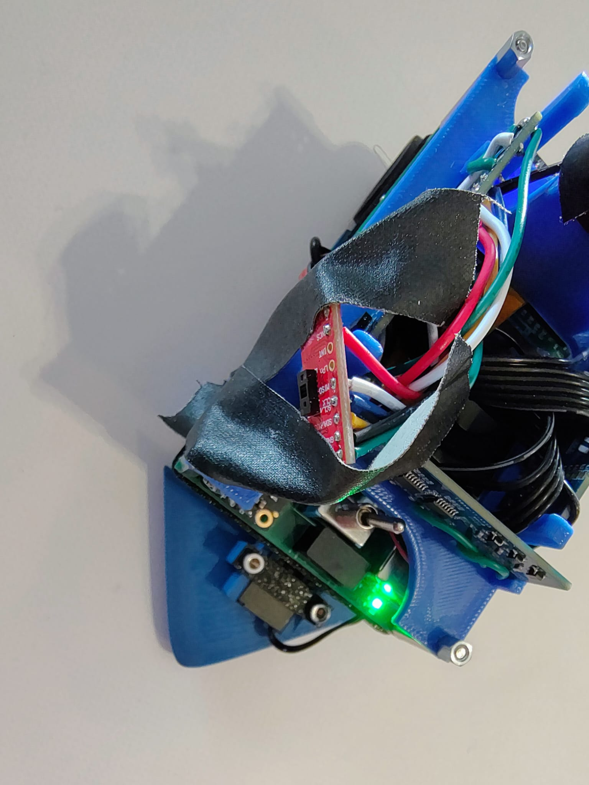
    </a>
</div>
 
 In Tests stellte sich jedoch heraus, dass diese kleinere Variante nicht zuverlässig genug arbeitete – bei mehr als zwei Sensoren brach die SPI-Kommunikation zusammen. 
Wir kehrten zu den größeren PCBs zurück und platzierten diese stattdessen hinten am Fahrzeug, um das Kamerabild freizuhalten. Aufgrund des begrenzten Platzes wurden sie dort hochkant verbaut. 

#### Abbildung 11: Position der schrägen ToF-Sensoren am Heck zur Abdeckung des 45°-Totwinkels

</div><div align="center">
    <a href="img/roboter spaetere version.jpg" target="_blank">
        
    </a>
</div>


#### Abbildung 10: Abdeckung des 45°-Totwinkels durch zwei zusätzliche Sensoren hinten

 </div><div align="center">
    <a href="img/bild3.png" target="_blank">
        
    </a>
</div>


Nach der Umstellung der Hinderniserkennung auf Vollscan (vgl. Kapitel 2.3 Kamera, 3.5 Fahrstrategie Hindernisrennen - Strategiewechsel) konnten wir auf die zusätzlichen Sensoren verzichten. Dadurch, dass keine günstigen Kamerapositionen angefahren werden müssen, nähert sich der Roboter keiner Wand im 45°-Winkel. 

#### Abbildung 12: Finaler Roboter mit vier Sensoren

</div><div align="center">
    <a href="img/rechts.jpg" target="_blank">
        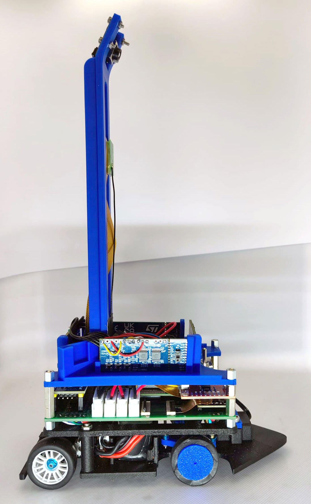
    </a>
</div>


## **Gyro**
Im Vorjahr hatten wir das Problem, dass der **Gyro** über die Dauer einer Mission mehrere Grad Drift entwickelte. Dieser Drift führte zu ernsthaften Problemen bei der Orientierung des Roboters. In dieser Saison  wollten wir deshalb einen **BNO055** mit eingebautem Magnetometer verwenden. Wenn das Magnetometer zuverlässig funktioniert, kann es den Drift theoretisch komplett ausgleichen. Unsere Tests haben allerdings gezeigt, dass das Magnetometer viel zu ungenau und unzuverlässig funktioniert. Es kam zu Abweichungen von 5 – 10 Grad, weswegen wir es deaktivieren mussten. Mit dieser Einschränkung funktioniert der BNO055 noch schlechter als der Gyro vom letzten Jahr. Pro gefahrener Runde hatten wir eine Abweichung von ca. zwei Grad, am Ende des Kurses von ca. sechs Grad. Die Abweichung ist über mehrere Läufe nicht konstant, und lässt sich deswegen nicht wegkalibrieren. Damit ist kein Navigieren mehr möglich. 

Deswegen sind wir kurzfristig auf einen **BNO086** umgestiegen. Diesen verwenden wir auch ohne Magnetometer, allerdings zeigt dieser Gyro einen deutlich geringeren und konstanteren Fehler. Eine **Bias-Kalibrierung** (Nullpunkt der Drehratensensoren) führen wir automatisch bei Programmstart durch, die **Rate-Kalibrierung** ermitteln wir von Hand, indem wir das Auto zehnmal um 360 Grad drehen. Dann vergleichen wir gemessene und reale Drehrate und ermitteln einen Korrekturfaktor. 

<div style="background-color: #B8D8EE; padding: 8px; text-align: center; color: #000000; margin-bottom: 20px;">
Korrekturfaktor = gemessene Drehung / erwartete Drehung

</div>

#### Tabelle 5: Zusammenfassung Gyro-Evaluierung

<table align="center" border="1" style="border-collapse: collapse; border: 2px solid black;">

  <!-- Tabellenkopf -->
  <tr>
    <th bgcolor="#4A90C2" width="130" style="border: 1px solid black; border-bottom: 3px solid black; padding: 8px; color: white;">Sensor</th>
    <th bgcolor="#4A90C2" width="220" style="border: 1px solid black; border-bottom: 3px solid black; padding: 8px; color: white;">Konfiguration</th>
    <th bgcolor="#4A90C2" width="150" style="border: 1px solid black; border-bottom: 3px solid black; padding: 8px; color: white;">Abw. nach<br>1 Runde</th>
    <th bgcolor="#4A90C2" width="170" style="border: 1px solid black; border-bottom: 3px solid black; padding: 8px; color: white;">Abw. nach<br>3 Runden</th>
    <th bgcolor="#4A90C2" width="170" style="border: 1px solid black; border-bottom: 3px solid black; padding: 8px; color: white;">Konstant<br>kalibrierbar?</th>
  </tr>

  <!-- BNO055 mit Magnetometer -->
  <tr>
    <td bgcolor="#EAF4FB" style="border: 1px solid black; padding: 8px; text-align: center;"><b>BNO055</b></td>
    <td bgcolor="#EAF4FB" style="border: 1px solid black; padding: 8px;">mit Magnetometer</td>
    <td bgcolor="#EAF4FB" style="border: 1px solid black; padding: 8px; text-align: center;">~5–10°</td>
    <td bgcolor="#EAF4FB" style="border: 1px solid black; padding: 8px; text-align: center;">nicht messbar<br>(Ausreißer)</td>
    <td bgcolor="#EAF4FB" style="border: 1px solid black; padding: 8px; text-align: center;">❌ Nein</td>
  </tr>

  <!-- BNO055 ohne Magnetometer -->
  <tr>
    <td style="border: 1px solid black; padding: 8px; text-align: center;"><b>BNO055</b></td>
    <td style="border: 1px solid black; padding: 8px;">ohne Magnetometer</td>
    <td style="border: 1px solid black; padding: 8px; text-align: center;">~2°</td>
    <td style="border: 1px solid black; padding: 8px; text-align: center;">~6°</td>
    <td style="border: 1px solid black; padding: 8px; text-align: center;">❌ Nein</td>
  </tr>

  <!-- BNO086 -->
  <tr>
    <td bgcolor="#EAF4FB" style="border: 1px solid black; padding: 8px; text-align: center;"><b>BNO086</b></td>
    <td bgcolor="#EAF4FB" style="border: 1px solid black; padding: 8px;">ohne Magnetometer<br>mit Rate-Kalibrierung</td>
    <td bgcolor="#EAF4FB" style="border: 1px solid black; padding: 8px; text-align: center;">~0,3°</td>
    <td bgcolor="#EAF4FB" style="border: 1px solid black; padding: 8px; text-align: center;">~1°</td>
    <td bgcolor="#EAF4FB" style="border: 1px solid black; padding: 8px; text-align: center;">✅ Ja</td>
  </tr>

</table>


Die Tabelle fasst die Ergebnisse unserer Gyro-Evaluierung zusammen. Jeder Wert ist der Durchschnitt aus fünf gemessenen Läufen auf unserem Testparcours. Der BNO086 war der einzige Sensor, bei dem die Abweichung über mehrere Läufe hinweg konstant und damit durch unseren Korrekturfaktor kompensierbar war. Damit kommen wir auf eine Abweichung von ca. einem Grad nach drei gefahrenen Runden. In der Praxis hat sich gezeigt, dass der Roboter bei dieser Abweichung die Strecke noch sauber abfahren kann.

## **Stromversorgung und Leistungsverbrauch**
Letztes Jahr verwendeten wir einen 2S 2200mAh Akku. Dieser ist für unser neues Auto viel zu groß, außerdem ist die **Spannung** nicht ausreichend, da unser neuer  Motortreiber bei 6,5V abschaltet. Mit Leitungsverlusten und unter Lastspitzen war beim Testen ein zuverlässiger Betrieb mit einem 2S Akku bei nachlassender Akkuspannung nicht mehr möglich, sodass wir früh auf einen 3S Akku wechselten. Dieser gibt uns auch mehr Leistungsreserve für höhere Geschwindigkeiten beim Motor. 

Nach der Spannung war das wichtigste Auswahlkriterium die **Einbaugröße** bei möglichst großer Kapazität. Unsere Wahl fiel auf einen **3S-LiPo-Akku mit 550 mAh**. Das ist der größte Akku, den wir im Chassis unterbringen konnten. Um zu ermitteln, ob der Akku brauchbar ist, hatten wir zunächst die Laufzeit theoretisch berechnet, dann praktisch gemessen (s. unten).

#### Tabelle 6: Leistungsverbrauch der eingesetzten Komponenten nach Datenblatt

<table align="center" border="1" style="border-collapse: collapse; border: 2px solid black;">

  <!-- Tabellenkopf -->
  <tr>
    <th bgcolor="#4A90C2" width="230" style="border: 1px solid black; border-bottom: 3px solid black; padding: 8px; color: white;">Komponente</th>
    <th bgcolor="#4A90C2" width="170" style="border: 1px solid black; border-bottom: 3px solid black; padding: 8px; color: white;">Betriebsspannung</th>
    <th bgcolor="#4A90C2" width="170" style="border: 1px solid black; border-bottom: 3px solid black; padding: 8px; color: white;">Typischer Strom</th>
    <th bgcolor="#4A90C2" width="150" style="border: 1px solid black; border-bottom: 3px solid black; padding: 8px; color: white;">Typische<br>Leistung</th>
    <th bgcolor="#4A90C2" width="380" style="border: 1px solid black; border-bottom: 3px solid black; padding: 8px; color: white;">Hinweis</th>
  </tr>

  <!-- Raspberry Pi Compute Module 5 -->
  <tr>
    <td bgcolor="#EAF4FB" style="border: 1px solid black; padding: 8px;"><b>Raspberry Pi Compute Module 5</b></td>
    <td bgcolor="#EAF4FB" style="border: 1px solid black; padding: 8px; text-align: center;">5 V</td>
    <td bgcolor="#EAF4FB" style="border: 1px solid black; padding: 8px; text-align: center;">600–1600 mA</td>
    <td bgcolor="#EAF4FB" style="border: 1px solid black; padding: 8px; text-align: center;">3–8 W</td>
    <td bgcolor="#EAF4FB" style="border: 1px solid black; padding: 8px;">Hauptrechner; abhängig von CPU-Auslastung</td>
  </tr>

  <!-- Raspberry Pi Camera Module 3 -->
  <tr>
    <td style="border: 1px solid black; padding: 8px;"><b>Raspberry Pi Camera Module 3</b></td>
    <td style="border: 1px solid black; padding: 8px; text-align: center;">intern via CM5</td>
    <td style="border: 1px solid black; padding: 8px; text-align: center;">ca. 200–400 mA<br>äquivalent</td>
    <td style="border: 1px solid black; padding: 8px; text-align: center;">ca. 1 W</td>
    <td style="border: 1px solid black; padding: 8px;">Versorgung direkt über MIPI-CSI des CM5; keine externe Spannungsquelle</td>
  </tr>

  <!-- 4x VL53L8CX -->
  <tr>
    <td bgcolor="#EAF4FB" style="border: 1px solid black; padding: 8px;"><b>4× VL53L8CX Time-of-Flight-Sensor</b></td>
    <td bgcolor="#EAF4FB" style="border: 1px solid black; padding: 8px; text-align: center;">3,3 V (AVDD) über eigenen Spannungsregler</td>
    <td bgcolor="#EAF4FB" style="border: 1px solid black; padding: 8px; text-align: center;">je ca. 85 mA</td>
    <td bgcolor="#EAF4FB" style="border: 1px solid black; padding: 8px; text-align: center;">gesamt<br>ca. 1,1 W</td>
    <td bgcolor="#EAF4FB" style="border: 1px solid black; padding: 8px;">Dauerbetrieb 30 Hz, 8×8; laut ST-Datenblatt DS13349</td>
  </tr>

  <!-- BNO086 -->
  <tr>
    <td style="border: 1px solid black; padding: 8px;"><b>BNO086 IMU</b></td>
    <td style="border: 1px solid black; padding: 8px; text-align: center;">3,3 V</td>
    <td style="border: 1px solid black; padding: 8px; text-align: center;">ca. 4 mA</td>
    <td style="border: 1px solid black; padding: 8px; text-align: center;">ca. 13 mW</td>
    <td style="border: 1px solid black; padding: 8px;">Vollständiger Fusions-Modus (NDOF); laut Herstellerdatenblatt</td>
  </tr>

  <!-- STM32F411 -->
  <tr>
    <td bgcolor="#EAF4FB" style="border: 1px solid black; padding: 8px;"><b>STM32F411 Black-Pill</b></td>
    <td bgcolor="#EAF4FB" style="border: 1px solid black; padding: 8px; text-align: center;">3,3 V</td>
    <td bgcolor="#EAF4FB" style="border: 1px solid black; padding: 8px; text-align: center;">ca. 45 mA</td>
    <td bgcolor="#EAF4FB" style="border: 1px solid black; padding: 8px; text-align: center;">ca. 150 mW</td>
    <td bgcolor="#EAF4FB" style="border: 1px solid black; padding: 8px;">100 MHz Betrieb, alle Peripherien aktiv; laut ST DS10314</td>
  </tr>

  <!-- N30 Motor -->
  <tr>
    <td style="border: 1px solid black; padding: 8px;"><b>N30-Motor mit Encoder</b></td>
    <td style="border: 1px solid black; padding: 8px; text-align: center;">11,1 V via DRV8871</td>
    <td style="border: 1px solid black; padding: 8px; text-align: center;">50–200 mA</td>
    <td style="border: 1px solid black; padding: 8px; text-align: center;">0,5–2 W</td>
    <td style="border: 1px solid black; padding: 8px;">Stark lastabhängig; Spitzenstrom bei Anfahrt</td>
  </tr>

  <!-- DRV8871 -->
  <tr>
    <td bgcolor="#EAF4FB" style="border: 1px solid black; padding: 8px;"><b>DRV8871 Motortreiber</b></td>
    <td bgcolor="#EAF4FB" style="border: 1px solid black; padding: 8px; text-align: center;">11,1 V</td>
    <td bgcolor="#EAF4FB" style="border: 1px solid black; padding: 8px; text-align: center;">Ruhestrom<br>ca. 5 mA</td>
    <td bgcolor="#EAF4FB" style="border: 1px solid black; padding: 8px; text-align: center;">ca. 55 mW</td>
    <td bgcolor="#EAF4FB" style="border: 1px solid black; padding: 8px;">H-Brücke, 6,5–45 V, max. 3,6 A; Motorstrom fließt direkt durch Treiber</td>
  </tr>

  <!-- Servo -->
  <tr>
    <td style="border: 1px solid black; padding: 8px;"><b>Servo (Lenkung)</b></td>
    <td style="border: 1px solid black; padding: 8px; text-align: center;">5 V</td>
    <td style="border: 1px solid black; padding: 8px; text-align: center;">150–800 mA<br>kurzzeitig</td>
    <td style="border: 1px solid black; padding: 8px; text-align: center;">0,5–2 W<br>kurzzeitig</td>
    <td style="border: 1px solid black; padding: 8px;">Stromspitzen bei Lenkbewegungen; Ruhestrom gering</td>
  </tr>

</table>

### **Gemessener Gesamtleistungsbedarf**
Der **gemessene Gesamtleistungsbedarf** des Systems liegt im Betrieb zwischen etwa 7 W (geringe Last) und 10 W (volle Rechenlast mit Fahrt).

### **Berechnung der Laufzeit** 
- **Energieinhalt Akku:** 11,1 V × 0,55 Ah = 6,1 Wh<br>
- **Stromverbrauch:** 7 bis 10 Watt <br>
- **Laufzeit theoretisch:** Daraus folgt eine Laufzeit von 36 bis 52 Minuten. <br>
- **Laufzeit praktisch:** Im Testbetrieb beträgt die gemessene Laufzeit bis zur Abschaltschwelle (3,5V/Zelle) meist ca. 40 Minuten und deckt sich damit gut mit den theoretischen Berechnungen.

### **Vermeidung von Tiefentladungen**
Um **Tiefentladungen** zu vermeiden, misst der STM32 die Akkuspannung, schaltet bei einer Zellspannung von 3,5 Volt den Motor aus und sendet ein Signal an den Raspberry, worauf dieser herunterfährt. Weiterhin bewegt er zyklisch den Lenkservo um auf die leere Batterie hinzuweisen.

### **Spannungsversorgung der einzelnen Komponenten**
- **11,1 V direkt**: N30-Motor über den DRV8871-Motortreiber (H-Brücke, 6,5–45 V, max. 3,6 A)
- **5 V über DC-DC Converter:** Raspberry Pi CM5 über die 100-Pin-Steckverbinder auf dem selbst entwickelten Baseboard; Servo und alle vier VL53L8CX ToF-Sensoren
- **3,3 V über Linearregler (AMS1117-3.3):** STM32F411, BNO086; Eingangsversorgung des AMS1117 kommt von der 5-V-Schiene über den GPIO-Header
- Das Raspberry Pi Camera Module wird ausschließlich über die **MIPI-CSI-Schnittstelle des CM5** versorgt; keine externe Verdrahtung notwendig
<br><br>

# **3. Entwicklung des Codes**
## **Softwarearchitektur**
Die Software ist in **zwei getrennte Verarbeitungsebenen** aufgeteilt. 

Auf dem Raspberry Pi Compute Module 5 (CM5) läuft die **High-Level-Logik**: Fahrstrategie, Bildverarbeitung, Gyro-Auswertung, Benutzeroberfläche und Logging. 

Auf dem STM32F411 liegt die **Low-Level-Regelung**: Motoransteuerung, Encoder-Auswertung, Servoansteuerung und das Einlesen der vier VL53L8CX Time-of-Flight-Sensoren mit fester Zykluszeit.

Diese Aufteilung hat zwei Vorteile: Der STM32 übernimmt zeitkritische Aufgaben ohne Betriebssystem-Overhead. Der CM5 kann gleichzeitig rechenintensive Aufgaben wie Bildverarbeitung und Gyro-Fusion ausführen, ohne die Sensor-Regelschleife zu blockieren. Die Kommunikation zwischen beiden Prozessoren erfolgt über UART mit 921 600 Baud.

#### Abbildung X: Übersicht über die Systemarchitektur

</div><div align="center">
    <a href="img/blockschaltbild_englisch.png" target="_blank">
        
    </a>
</div>

#### Tabelle X: Aufgabenverteilung der Softwaremodule

<table align="center" border="1" style="border-collapse: collapse; border: 2px solid black;">

  <!-- Tabellenkopf -->
  <tr>
    <th bgcolor="#4A90C2" width="240" style="border: 1px solid black; border-bottom: 3px solid black; padding: 8px; color: white;">Modul / Datei</th>
    <th bgcolor="#4A90C2" width="180" style="border: 1px solid black; border-bottom: 3px solid black; padding: 8px; color: white;">Prozessor</th>
    <th bgcolor="#4A90C2" width="520" style="border: 1px solid black; border-bottom: 3px solid black; padding: 8px; color: white;">Hauptaufgabe</th>
  </tr>

  <!-- main.py -->
  <tr>
    <td bgcolor="#EAF4FB" style="border: 1px solid black; padding: 8px;"><code>main.py</code></td>
    <td bgcolor="#EAF4FB" style="border: 1px solid black; padding: 8px;">Raspberry Pi CM5</td>
    <td bgcolor="#EAF4FB" style="border: 1px solid black; padding: 8px;">Systemstart, Threads starten</td>
  </tr>

  <!-- parser.py -->
  <tr>
    <td style="border: 1px solid black; padding: 8px;"><code>parser.py</code></td>
    <td style="border: 1px solid black; padding: 8px;">Raspberry Pi CM5</td>
    <td style="border: 1px solid black; padding: 8px;">Serielle Kommunikation mit STM32, BNO086-Gyro einlesen</td>
  </tr>

  <!-- driveController.py -->
  <tr>
    <td bgcolor="#EAF4FB" style="border: 1px solid black; padding: 8px;"><code>driveController.py</code></td>
    <td bgcolor="#EAF4FB" style="border: 1px solid black; padding: 8px;">Raspberry Pi CM5</td>
    <td bgcolor="#EAF4FB" style="border: 1px solid black; padding: 8px;">Fahrprimitive: Wandfolge, Kurven, Distanzfahrt, P-Regler-Lenkung</td>
  </tr>

  <!-- openChallenge.py -->
  <tr>
    <td style="border: 1px solid black; padding: 8px;"><code>openChallenge.py</code></td>
    <td style="border: 1px solid black; padding: 8px;">Raspberry Pi CM5</td>
    <td style="border: 1px solid black; padding: 8px;">Ablaufsteuerung Eröffnungsrennen (3 Runden)</td>
  </tr>

  <!-- obstacleChallengeSingle.py -->
  <tr>
    <td bgcolor="#EAF4FB" style="border: 1px solid black; padding: 8px;"><code>obstacleChallengeSingle.py</code></td>
    <td bgcolor="#EAF4FB" style="border: 1px solid black; padding: 8px;">Raspberry Pi CM5</td>
    <td bgcolor="#EAF4FB" style="border: 1px solid black; padding: 8px;">Scan-Phase, feste Routenausführung um Hindernisse</td>
  </tr>

  <!-- cameraIO.py -->
  <tr>
    <td style="border: 1px solid black; padding: 8px;"><code>cameraIO.py</code></td>
    <td style="border: 1px solid black; padding: 8px;">Raspberry Pi CM5</td>
    <td style="border: 1px solid black; padding: 8px;">Kamerabild einlesen, HSV-Masken, Flood-Fill, Konturanalyse</td>
  </tr>

  <!-- ui.py -->
  <tr>
    <td bgcolor="#EAF4FB" style="border: 1px solid black; padding: 8px;"><code>ui.py</code></td>
    <td bgcolor="#EAF4FB" style="border: 1px solid black; padding: 8px;">Raspberry Pi CM5</td>
    <td bgcolor="#EAF4FB" style="border: 1px solid black; padding: 8px;">Statusanzeige, Benutzereingaben</td>
  </tr>

  <!-- logger.py -->
  <tr>
    <td style="border: 1px solid black; padding: 8px;"><code>logger.py</code></td>
    <td style="border: 1px solid black; padding: 8px;">Raspberry Pi CM5</td>
    <td style="border: 1px solid black; padding: 8px;">Testprotokollierung</td>
  </tr>

  <!-- main.cpp -->
  <tr>
    <td bgcolor="#EAF4FB" style="border: 1px solid black; padding: 8px;"><code>main.cpp (STM32)</code></td>
    <td bgcolor="#EAF4FB" style="border: 1px solid black; padding: 8px;">STM32F411</td>
    <td bgcolor="#EAF4FB" style="border: 1px solid black; padding: 8px;">Motor-PWM, Encoder, Servo, ToF-Sensordaten über JSON senden</td>
  </tr>

</table>

## **Threading und Systemablauf**

Im Raspberry-Pi-Code laufen drei funktionale Ebenen parallel:

- Der **UI-Hauptthread** zeigt Statusdaten an und reagiert auf Tastatureingaben zum Starten und Stoppen. 
- Der **Parser-Thread** liest kontinuierlich die serielle Schnittstelle und aktualisiert die gemeinsam genutzten Sensorwerte: Distanzfelder aller sechs Sensoren, Drehzahl, Batteriespannung und Fahrtrichtung. 
- Der **Control-Loop** führt die eigentliche Fahrlogik aus und schreibt Sollwerte für Geschwindigkeit und Lenkwinkel zurück in die serielle Schnittstelle. 


## **Fahrprimitiven in driveController.py**
<code>driveController.py</code> bildet die Abstraktionsschicht zwischen rohen Sensorwerten und den Challenge-Skripten. Es stellt eine **Bibliothek von Fahrprimitiven** bereit, die intern Heading-Regelung und Beschleunigungsrampen kombinieren.

Die **Beschleunigungsrampe** begrenzt den Beschleunigungswert auf 1 m/s² und die Bremsbeschleunigung auf 8 m/s². Das verhindert, dass die Reifen durchdrehen oder blockieren, was die Odometriewerte und die gemessene Geschwindigkeit verfälschen würde.

Die **Lenkung** nutzt zwei P-Regler: <code>pidSteer (Kp = 1,0)</code> für das normale Fahren und <code>pidSteer2 (Kp = 0,5)</code> für weichere Kurvenführung mit weniger Überschwingen.

Bedeutung der Kp-Werte: Der Regler berechnet den Lenkwinkel-Offset (0–180°, Mitte = 90°) direkt aus dem Heading-Fehler in Grad:

<div style="background-color: #B8D8EE; padding: 8px; text-align: center; color: #000000; margin-bottom: 20px;">
steer = 90 − K<sub>p</sub> · error
</div>

Bei Kp = 1,0 entspricht 1° Heading-Fehler genau 1° Lenkkorrektur; die Sättigung (voller Einschlag) tritt bei |Fehler| ≥ 90° ein. Bei Kp = 0,5 tritt sie erst bei |Fehler| ≥ 180° auf, was zu weicherem, aber trägerem Regelverhalten führt.

**Ermittlung der Werte:** Die Kp-Werte wurden empirisch bestimmt. Ausgangspunkt war Kp = 1,0, da die 1:1-Abbildung eine intuitive Anfangseinschätzung erlaubt. Bei Geradeausfahrt zeigte das Fahrzeug kein Oszillieren – die mechanische Trägheit liefert ausreichende Dämpfung. Bei der schnelleren Kurveneinleitung (turn()) führte Kp = 1,0 jedoch zu Überschwingen am Ende der Kurve. Durch Halbieren auf Kp = 0,5 (pidSteer2) ließ sich das Überschwingen auf unter 3° reduzieren.

**Warum kein I- und D-Anteil:** Ein Integralanteil ist nicht notwendig, da der Gyro die absolute Orientierung misst und kein bleibender Offset entsteht. Ein D-Anteil würde auf das Messrauschen des BNO086 reagieren und die Lenkung destabilisieren.
Die Steuerung basiert auf folgenden Fahrprimitiven: <br>

#### Tabelle X: Wichtigste Fahrprimitive und ihre Funktion

<table align="center" border="1" style="border-collapse: collapse; border: 2px solid black;">

  <!-- Tabellenkopf -->
  <tr>
    <th bgcolor="#4A90C2" width="230" style="border: 1px solid black; border-bottom: 3px solid black; padding: 8px; color: white;">Funktion</th>
    <th bgcolor="#4A90C2" width="280" style="border: 1px solid black; border-bottom: 3px solid black; padding: 8px; color: white;">Eingabe</th>
    <th bgcolor="#4A90C2" width="500" style="border: 1px solid black; border-bottom: 3px solid black; padding: 8px; color: white;">Verhalten</th>
  </tr>

  <!-- driveAlongWall -->
  <tr>
    <td bgcolor="#EAF4FB" style="border: 1px solid black; padding: 8px;"><code>driveAlongWall</code></td>
    <td bgcolor="#EAF4FB" style="border: 1px solid black; padding: 8px;">speed, heading, Wand</td>
    <td bgcolor="#EAF4FB" style="border: 1px solid black; padding: 8px;">Fährt bis links oder rechts keine Wand zu sehen ist</td>
  </tr>

  <!-- driveToWall -->
  <tr>
    <td style="border: 1px solid black; padding: 8px;"><code>driveToWall</code></td>
    <td style="border: 1px solid black; padding: 8px;">speed, heading, Abstand, Wand</td>
    <td style="border: 1px solid black; padding: 8px;">Fährt bis Zielabstand zur Wand, ToF als Abbruchkriterium</td>
  </tr>

  <!-- driveAwayFromWall -->
  <tr>
    <td bgcolor="#EAF4FB" style="border: 1px solid black; padding: 8px;"><code>driveAwayFromWall</code></td>
    <td bgcolor="#EAF4FB" style="border: 1px solid black; padding: 8px;">speed, heading, Abstand, Wand</td>
    <td bgcolor="#EAF4FB" style="border: 1px solid black; padding: 8px;">Entfernt sich bis Mindestabstand von parametrierter Wand</td>
  </tr>

  <!-- driveDist -->
  <tr>
    <td style="border: 1px solid black; padding: 8px;"><code>driveDist</code></td>
    <td style="border: 1px solid black; padding: 8px;">speed, heading, Distanz [mm]</td>
    <td style="border: 1px solid black; padding: 8px;">Fährt feste Strecke, Encoder-basiert</td>
  </tr>

  <!-- turn -->
  <tr>
    <td bgcolor="#EAF4FB" style="border: 1px solid black; padding: 8px;"><code>turn</code></td>
    <td bgcolor="#EAF4FB" style="border: 1px solid black; padding: 8px;">speed, Ziel-Heading</td>
    <td bgcolor="#EAF4FB" style="border: 1px solid black; padding: 8px;">Normale Kurve, stoppt wenn Heading-Fehler &lt; Schwelle</td>
  </tr>

  <!-- quickTurn -->
  <tr>
    <td style="border: 1px solid black; padding: 8px;"><code>quickTurn</code></td>
    <td style="border: 1px solid black; padding: 8px;">speed, Ziel-Heading</td>
    <td style="border: 1px solid black; padding: 8px;">Schnelle Kurve, maximaler Lenkeinschlag</td>
  </tr>

  <!-- tightTurn -->
  <tr>
    <td bgcolor="#EAF4FB" style="border: 1px solid black; padding: 8px;"><code>tightTurn</code></td>
    <td bgcolor="#EAF4FB" style="border: 1px solid black; padding: 8px;">speed, Ziel-Heading</td>
    <td bgcolor="#EAF4FB" style="border: 1px solid black; padding: 8px;">Besonders enge Kurve</td>
  </tr>

  <!-- brake -->
  <tr>
    <td style="border: 1px solid black; padding: 8px;"><code>brake</code></td>
    <td style="border: 1px solid black; padding: 8px; text-align: center;">–</td>
    <td style="border: 1px solid black; padding: 8px;">Sollgeschwindigkeit = 0, Lenkung auf 0°</td>
  </tr>

</table>

Die konkreten **Parameter** für die Programme (z. B. der Abstand bei der <code>driveToWall</code> Funktion) wurden nicht berechnet, sondern empirisch in Fahrtests ermittelt. Beispiel: Bei <code>driveToWall</code> wurde das Fahrzeug mit verschiedenen Schwellwerten gefahren und der Wert übernommen, bei dem die darauffolgende Kurve sauber eingeleitet wurde, ohne eine Wand zu touchieren.

## **Fahrstrategie Eröffnungsrennen**
Im **Eröffnungsrennen** (<code>openChallenge.py</code>) fährt das Auto drei vollständige Runden. Das Auto fährt geradeaus, bis links oder rechts keine Wand erkannt wird, und merkt sich basierend darauf die Fahrtrichtung mit Hilfe der <code>findDirection</code> Funktion. Jede Runde besteht aus vier Geraden mit jeweils einer 90°-Kurve:
- <code>driveAlongWall</code> – entlang der Außenwand bis zum Kurvenbereich
- <code>turn(−90°)</code> – Kurve per P-Regler einleiten, Sollgeschwindigkeit 1,3 m/s
- <code>driveDist(750 mm) + driveAlongWall</code> – nächste Gerade, Sollgeschwindigkeit 2 m/s
- Wiederholen für alle vier Seiten des Parcours <br>

Das Muster aus Gerade und Kurve wiederholt sich viermal pro Runde (eine Seite des Parcours pro Iteration). Nach drei vollständigen Runden (3 x 4 = 12 Kurven gesamt) stoppt das Fahrzeug mit <code>driveAwayFromWall</code> in der Mitte der Startzone. Die Sollgeschwindigkeit von 2 m/s auf Geraden ist ein konfigurierter Parameterwert; die tatsächliche Endgeschwindigkeit hängt von der Beschleunigungsrampe und der verfügbaren Streckenlänge ab.

#### Abbildung X: Quellcode Eröffnungsrennen

</div><div align="center">
    <a href="img/code.png" target="_blank">
        
    </a>
</div>


## **Fahrstrategie Hindernissrennen - Strategiewechsel**
### **Alte Strategie: Scanning während der Fahrt**
Die **ursprüngliche Strategie** erkannte Hindernisse während der Fahrt. Am Anfang jeder Geraden wurde ein Foto aufgenommen und die Farbe des ersten Hindernisses bestimmt. Das System scannte zusätzlich bis zu zweimal pro Abschnitt nach weiteren Hindernissen. Diese Logik führte zu einem schwer wartbaren Zustandsautomaten: bis zu drei Scan-Punkte pro Abschnitt, abstandsabhängige Verzweigungen und Kamera unter Bewegung.


### **Neue Strategie: Vollscan, feste Route**
Die **neue Strategie trennt Erkennung und Fahrt vollständig**. Direkt nach Programmstart dreht das Auto sich in 3 definierten Winkeln (<code>tightTurn</code>) und fotografiert den gesamten Parcours. Aus diesen drei Fotos werden die Farben der Hindernisse auf allen vier Abschnitte auf einmal erkannt und in <code>parser.obstacles[0..11]</code> gespeichert. Danach wird die Kamera nicht mehr benutzt – die Route ist deterministisch festgelegt. 

#### Abbildung X: Zustandsdiagramm Hindernisrennen – Vollscan-Strategie

</div><div align="center">
    <a href="img/Zustandsdiagramm_Hindernisrennen.png" target="_blank">
        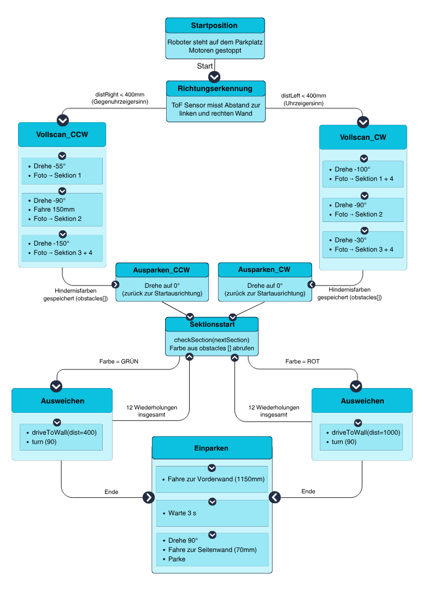
    </a>
</div>


## **Serielle Kommunikation und Datenmodell**
**CM5** und **STM32** kommunizieren über UART (/dev/ttyAMA0, 921 600 Baud). Pro Übertragungszyklus sendet der STM32 ein vollständiges Statuspaket an den CM5; dieser antwortet mit einem Steuerpaket. Der Parser-Thread auf dem CM5 verarbeitet eingehende Pakete asynchron und schreibt die Werte in gemeinsam genutzte Felder des Parser-Objekts.

#### Tabelle X: Datenmodell CM5 ↔ STM32

<table align="center" border="1" style="border-collapse: collapse; border: 2px solid black;">

  <!-- Tabellenkopf -->
  <tr>
    <th bgcolor="#4A90C2" width="180" style="border: 1px solid black; border-bottom: 3px solid black; padding: 8px; color: white;">Richtung</th>
    <th bgcolor="#4A90C2" width="180" style="border: 1px solid black; border-bottom: 3px solid black; padding: 8px; color: white;">Feld</th>
    <th bgcolor="#4A90C2" width="180" style="border: 1px solid black; border-bottom: 3px solid black; padding: 8px; color: white;">Typ / Größe</th>
    <th bgcolor="#4A90C2" width="500" style="border: 1px solid black; border-bottom: 3px solid black; padding: 8px; color: white;">Bedeutung</th>
  </tr>

  <!-- camValues -->
  <tr>
    <td bgcolor="#EAF4FB" style="border: 1px solid black; padding: 8px; text-align: center;">STM32 → CM5</td>
    <td bgcolor="#EAF4FB" style="border: 1px solid black; padding: 8px;"><code>camValues</code></td>
    <td bgcolor="#EAF4FB" style="border: 1px solid black; padding: 8px;"><code>int[6][64]</code></td>
    <td bgcolor="#EAF4FB" style="border: 1px solid black; padding: 8px;">8×8-Distanzwerte aller 4 ToF-Sensoren in mm</td>
  </tr>

  <!-- rps -->
  <tr>
    <td style="border: 1px solid black; padding: 8px; text-align: center;">STM32 → CM5</td>
    <td style="border: 1px solid black; padding: 8px;"><code>rps</code></td>
    <td style="border: 1px solid black; padding: 8px;"><code>int</code></td>
    <td style="border: 1px solid black; padding: 8px;">Encoder-Drehzahl in Umdrehungen/s</td>
  </tr>

  <!-- voltage -->
  <tr>
    <td bgcolor="#EAF4FB" style="border: 1px solid black; padding: 8px; text-align: center;">STM32 → CM5</td>
    <td bgcolor="#EAF4FB" style="border: 1px solid black; padding: 8px;"><code>voltage</code></td>
    <td bgcolor="#EAF4FB" style="border: 1px solid black; padding: 8px;"><code>float</code></td>
    <td bgcolor="#EAF4FB" style="border: 1px solid black; padding: 8px;">Batteriespannung in V</td>
  </tr>

  <!-- distance -->
  <tr>
    <td style="border: 1px solid black; padding: 8px; text-align: center;">STM32 → CM5</td>
    <td style="border: 1px solid black; padding: 8px;"><code>distance</code></td>
    <td style="border: 1px solid black; padding: 8px;"><code>int</code></td>
    <td style="border: 1px solid black; padding: 8px;">Zurückgelegte Strecke in mm (Encoder-akkumuliert)</td>
  </tr>

  <!-- sensorCaptures -->
  <tr>
    <td bgcolor="#EAF4FB" style="border: 1px solid black; padding: 8px; text-align: center;">STM32 → CM5</td>
    <td bgcolor="#EAF4FB" style="border: 1px solid black; padding: 8px;"><code>sensorCaptures</code></td>
    <td bgcolor="#EAF4FB" style="border: 1px solid black; padding: 8px;"><code>int[6]</code></td>
    <td bgcolor="#EAF4FB" style="border: 1px solid black; padding: 8px;">Anzahl abgeschlossener Messzyklen je Sensor</td>
  </tr>

  <!-- speed -->
  <tr>
    <td style="border: 1px solid black; padding: 8px; text-align: center;">CM5 → STM32</td>
    <td style="border: 1px solid black; padding: 8px;"><code>speed</code></td>
    <td style="border: 1px solid black; padding: 8px;"><code>float</code></td>
    <td style="border: 1px solid black; padding: 8px;">Sollgeschwindigkeit −3 bis +3 m/s</td>
  </tr>

  <!-- steer -->
  <tr>
    <td bgcolor="#EAF4FB" style="border: 1px solid black; padding: 8px; text-align: center;">CM5 → STM32</td>
    <td bgcolor="#EAF4FB" style="border: 1px solid black; padding: 8px;"><code>steer</code></td>
    <td bgcolor="#EAF4FB" style="border: 1px solid black; padding: 8px;"><code>int</code></td>
    <td bgcolor="#EAF4FB" style="border: 1px solid black; padding: 8px;">Lenkwinkel: 0 = voll links, 90 = gerade, 180 = voll rechts</td>
  </tr>

</table>

## **Kameraverarbeitung**

<code>cameraAIO.py</code> steuert die Raspberry Pi Camera Module 3 über Picamera2 in der SingleExposure-Konfiguration (Auflösung 1536 × 1152 Pixel). <code>captureImage()</code> nimmt ein Standbild auf und speichert es als Klassenattribut; die eigentliche Auswertung erfolgt durch <code>getObstacles1()</code>–<code>getObstacles4()</code>, die jeweils abschnittsangepasste Sichtbereiche analysieren.
<br>

### **Maskenpipeline**
Die Erkennung verläuft in 13 Schritten. Besonderheit: Statt eines einfachen Rechteck-ROI wird ein **Flood-Fill** verwendet, der die schwarzen Parcours-Wände als Barriere nutzt. Dadurch wird ausschließlich der tatsächlich befahrbare Bereich analysiert – farbige Gegenstände hinter Wänden oder außerhalb des Parcours werden automatisch herausgefiltert.

#### Tabelle X: Maskenpipeline – Verarbeitungsschritte

<table align="center" border="1" style="border-collapse: collapse; border: 2px solid black;">

  <!-- Tabellenkopf -->
  <tr>
    <th bgcolor="#4A90C2" width="60" style="border: 1px solid black; border-bottom: 3px solid black; padding: 8px; color: white;">#</th>
    <th bgcolor="#4A90C2" width="220" style="border: 1px solid black; border-bottom: 3px solid black; padding: 8px; color: white;">Operation</th>
    <th bgcolor="#4A90C2" width="300" style="border: 1px solid black; border-bottom: 3px solid black; padding: 8px; color: white;">Parameter / Werte</th>
    <th bgcolor="#4A90C2" width="360" style="border: 1px solid black; border-bottom: 3px solid black; padding: 8px; color: white;">Zweck</th>
    <th bgcolor="#4A90C2" width="240" style="border: 1px solid black; border-bottom: 3px solid black; padding: 8px; color: white;">Beispielbild</th>
  </tr>

  <!-- Schritt 1 -->
  <tr>
    <td bgcolor="#EAF4FB" style="border: 1px solid black; padding: 8px; text-align: center;"><b>1</b></td>
    <td bgcolor="#EAF4FB" style="border: 1px solid black; padding: 8px;"><b>Box-Blur</b></td>
    <td bgcolor="#EAF4FB" style="border: 1px solid black; padding: 8px;">10 × 10 px Kernel</td>
    <td bgcolor="#EAF4FB" style="border: 1px solid black; padding: 8px;">Rauschen reduzieren, Farbkanten weicher machen</td>
    <td bgcolor="#EAF4FB" style="border: 1px solid black; padding: 8px; text-align: center;">
      
    </td>
  </tr>

  <!-- Schritt 2 -->
  <tr>
    <td style="border: 1px solid black; padding: 8px; text-align: center;"><b>2</b></td>
    <td style="border: 1px solid black; padding: 8px;"><b>RGB → HSV</b></td>
    <td style="border: 1px solid black; padding: 8px;"><code>cv.COLOR_RGB2HSV</code></td>
    <td style="border: 1px solid black; padding: 8px;">Farberkennung unabhängig von Beleuchtungsstärke</td>
    <td style="border: 1px solid black; padding: 8px; text-align: center;">
      
    </td>
  </tr>

  <!-- Schritt 3 -->
  <tr>
    <td bgcolor="#EAF4FB" style="border: 1px solid black; padding: 8px; text-align: center;"><b>3</b></td>
    <td bgcolor="#EAF4FB" style="border: 1px solid black; padding: 8px;"><b>Rot-Maske Bereich 1</b></td>
    <td bgcolor="#EAF4FB" style="border: 1px solid black; padding: 8px;">H 0–10, S 190–255,<br>V 190–255</td>
    <td bgcolor="#EAF4FB" style="border: 1px solid black; padding: 8px;">Sattes, helles Rot (Hue nahe 0°)</td>
    <td bgcolor="#EAF4FB" style="border: 1px solid black; padding: 8px; text-align: center;">
      
    </td>
  </tr>

  <!-- Schritt 4 -->
  <tr>
    <td style="border: 1px solid black; padding: 8px; text-align: center;"><b>4</b></td>
    <td style="border: 1px solid black; padding: 8px;"><b>Rot-Maske Bereich 2</b></td>
    <td style="border: 1px solid black; padding: 8px;">H 160–179, S 100–255,<br>V 20–255</td>
    <td style="border: 1px solid black; padding: 8px;">Rot am oberen Hue-Ende (Wrap-around bei 180°)</td>
    <td style="border: 1px solid black; padding: 8px; text-align: center;">
      
    </td>
  </tr>

  <!-- Schritt 5 -->
  <tr>
    <td bgcolor="#EAF4FB" style="border: 1px solid black; padding: 8px; text-align: center;"><b>5</b></td>
    <td bgcolor="#EAF4FB" style="border: 1px solid black; padding: 8px;"><b>Gesamt-Rot-Maske</b></td>
    <td bgcolor="#EAF4FB" style="border: 1px solid black; padding: 8px;"><code>maskred = Maske1 + Maske2</code></td>
    <td bgcolor="#EAF4FB" style="border: 1px solid black; padding: 8px;">Beide Rot-Bereiche vereinigt</td>
    <td bgcolor="#EAF4FB" style="border: 1px solid black; padding: 8px; text-align: center;">
      
    </td>
  </tr>

  <!-- Schritt 6 -->
  <tr>
    <td style="border: 1px solid black; padding: 8px; text-align: center;"><b>6</b></td>
    <td style="border: 1px solid black; padding: 8px;"><b>Grün-Maske</b></td>
    <td style="border: 1px solid black; padding: 8px;">H 35–95, S 100–255,<br>V 20–255</td>
    <td style="border: 1px solid black; padding: 8px;">Grüntöne von Gelbgrün bis Cyan</td>
    <td style="border: 1px solid black; padding: 8px; text-align: center;">
      
    </td>
  </tr>

  <!-- Schritt 7 -->
  <tr>
    <td bgcolor="#EAF4FB" style="border: 1px solid black; padding: 8px; text-align: center;"><b>7</b></td>
    <td bgcolor="#EAF4FB" style="border: 1px solid black; padding: 8px;"><b>Schwarz-Maske</b></td>
    <td bgcolor="#EAF4FB" style="border: 1px solid black; padding: 8px;">H 0–255, S 0–255,<br>V 0–90</td>
    <td bgcolor="#EAF4FB" style="border: 1px solid black; padding: 8px;">Wände des Parcours (geringe Helligkeit)</td>
    <td bgcolor="#EAF4FB" style="border: 1px solid black; padding: 8px; text-align: center;">
      
    </td>
  </tr>

  <!-- Schritt 8 -->
  <tr>
    <td style="border: 1px solid black; padding: 8px; text-align: center;"><b>8</b></td>
    <td style="border: 1px solid black; padding: 8px;"><b>Rechteckige Region-Maske</b></td>
    <td style="border: 1px solid black; padding: 8px;">y/x-Rechteck je Abschnitt</td>
    <td style="border: 1px solid black; padding: 8px;">Sichtbereich auf relevante Bildregion einschränken</td>
    <td style="border: 1px solid black; padding: 8px; text-align: center;">
      
    </td>
  </tr>

  <!-- Schritt 9 -->
  <tr>
    <td bgcolor="#EAF4FB" style="border: 1px solid black; padding: 8px; text-align: center;"><b>9</b></td>
    <td bgcolor="#EAF4FB" style="border: 1px solid black; padding: 8px;"><b>Flood-Fill</b></td>
    <td bgcolor="#EAF4FB" style="border: 1px solid black; padding: 8px;">
      Start: (fillx, filly) im freien Bereich;<br>
      Barriere: Schwarz-Maske
    </td>
    <td bgcolor="#EAF4FB" style="border: 1px solid black; padding: 8px;">Zusammenhängenden freien Bereich mit 128 markieren</td>
    <td bgcolor="#EAF4FB" style="border: 1px solid black; padding: 8px; text-align: center;">
      
    </td>
  </tr>

  <!-- Schritt 10 -->
  <tr>
    <td style="border: 1px solid black; padding: 8px; text-align: center;"><b>10</b></td>
    <td style="border: 1px solid black; padding: 8px;"><b>Endmaske</b></td>
    <td style="border: 1px solid black; padding: 8px;">Alle Pixel mit Wert 128</td>
    <td style="border: 1px solid black; padding: 8px;">Nur freier Bereich ohne Wände</td>
    <td style="border: 1px solid black; padding: 8px; text-align: center;">
      
    </td>
  </tr>

  <!-- Schritt 11 -->
  <tr>
    <td bgcolor="#EAF4FB" style="border: 1px solid black; padding: 8px; text-align: center;"><b>11</b></td>
    <td bgcolor="#EAF4FB" style="border: 1px solid black; padding: 8px;"><b>Rot + Grün einschränken</b></td>
    <td bgcolor="#EAF4FB" style="border: 1px solid black; padding: 8px;"><code>bitwise_AND</code> mit Endmaske</td>
    <td bgcolor="#EAF4FB" style="border: 1px solid black; padding: 8px;">Hindernisse nur im freien Bereich betrachten</td>
    <td bgcolor="#EAF4FB" style="border: 1px solid black; padding: 8px; text-align: center;">
      
    </td>
  </tr>

  <!-- Schritt 12 -->
  <tr>
    <td style="border: 1px solid black; padding: 8px; text-align: center;"><b>12</b></td>
    <td style="border: 1px solid black; padding: 8px;"><b>Konturerkennung</b></td>
    <td style="border: 1px solid black; padding: 8px;">
      <code>RETR_EXTERNAL</code>,<br>
      Mindestfläche 200 px²
    </td>
    <td style="border: 1px solid black; padding: 8px;">Zusammenhängende Farbflächen finden</td>
    <td style="border: 1px solid black; padding: 8px; text-align: center;">
      
    </td>
  </tr>

  <!-- Schritt 13 -->
  <tr>
    <td bgcolor="#EAF4FB" style="border: 1px solid black; padding: 8px; text-align: center;"><b>13</b></td>
    <td bgcolor="#EAF4FB" style="border: 1px solid black; padding: 8px;"><b>Hindernis-Auswahl</b></td>
    <td bgcolor="#EAF4FB" style="border: 1px solid black; padding: 8px;">
      Region 1/3: max(cx)<br>
      Sonst: min(Distanz zum Fahrzeug)
    </td>
    <td bgcolor="#EAF4FB" style="border: 1px solid black; padding: 8px;">Relevantestes Hindernis pro Abschnitt bestimmen</td>
    <td bgcolor="#EAF4FB" style="border: 1px solid black; padding: 8px; text-align: center;">
      
    </td>
  </tr>

</table>

## **Softwareverbesserungen**
Im Verlauf der Entwicklung und der Testläufe wurden Fehler identifiziert, deren Ursachen analysiert und durch **gezielte Codeänderungen** behoben – eine Auswahl ist in der folgenden Tabelle dokumentiert.

#### Tabelle X: Softwareverbesserungen

<table align="center" border="1" style="border-collapse: collapse; border: 2px solid black;">

  <!-- Tabellenkopf -->
  <tr>
    <th bgcolor="#4A90C2" width="250" style="border: 1px solid black; border-bottom: 3px solid black; padding: 8px; color: white;">Beobachteter Fehler</th>
    <th bgcolor="#4A90C2" width="260" style="border: 1px solid black; border-bottom: 3px solid black; padding: 8px; color: white;">Ursache</th>
    <th bgcolor="#4A90C2" width="400" style="border: 1px solid black; border-bottom: 3px solid black; padding: 8px; color: white;">Änderung im Code</th>
    <th bgcolor="#4A90C2" width="260" style="border: 1px solid black; border-bottom: 3px solid black; padding: 8px; color: white;">Auswirkung</th>
  </tr>

  <!-- Fehler 1 -->
  <tr>
    <td bgcolor="#EAF4FB" style="border: 1px solid black; padding: 8px;"><b>Hindernis wurde nicht oder falsch erkannt</b></td>
    <td bgcolor="#EAF4FB" style="border: 1px solid black; padding: 8px;">Farbmaske passte nicht zu Lichtbedingungen</td>
    <td bgcolor="#EAF4FB" style="border: 1px solid black; padding: 8px;">HSV-Grenzwerte in <code>cameraAIO.py</code> angepasst</td>
    <td bgcolor="#EAF4FB" style="border: 1px solid black; padding: 8px;">Zuverlässigere Rot-/Grün-Erkennung</td>
  </tr>

  <!-- Fehler 2 -->
  <tr>
    <td style="border: 1px solid black; padding: 8px;"><b>Schwarze Wand wurde falsch segmentiert</b></td>
    <td style="border: 1px solid black; padding: 8px;">Beleuchtung veränderte Helligkeit der Wand</td>
    <td style="border: 1px solid black; padding: 8px;">Schwarzmaske und Flood-Fill angepasst</td>
    <td style="border: 1px solid black; padding: 8px;">Befahrbarer Bereich wurde sauberer erkannt</td>
  </tr>

  <!-- Fehler 3 -->
  <tr>
    <td bgcolor="#EAF4FB" style="border: 1px solid black; padding: 8px;"><b>Roboter fuhr Kurven zu aggressiv</b></td>
    <td bgcolor="#EAF4FB" style="border: 1px solid black; padding: 8px;">P-Regler überschwang bei hoher Geschwindigkeit</td>
    <td bgcolor="#EAF4FB" style="border: 1px solid black; padding: 8px;">Zweiter P-Regler <code>pidSteer2</code> mit kleinerem Kp-Wert für weichere Kurven</td>
    <td bgcolor="#EAF4FB" style="border: 1px solid black; padding: 8px;">Stabilere Kurvenfahrt</td>
  </tr>

  <!-- Fehler 4 -->
  <tr>
    <td style="border: 1px solid black; padding: 8px;"><b>Hindernisstrategie wurde unübersichtlich</b></td>
    <td style="border: 1px solid black; padding: 8px;">Zu viele Scanpunkte und Verzweigungen</td>
    <td style="border: 1px solid black; padding: 8px;">Umstieg auf Vollscan vor dem Start</td>
    <td style="border: 1px solid black; padding: 8px;">Einfacherer Zustandsautomat, weniger Fehlerquellen</td>
  </tr>

  <!-- Fehler 5 -->
  <tr>
    <td bgcolor="#EAF4FB" style="border: 1px solid black; padding: 8px;"><b>Kurveneinleitung zu spät – Auto fuhr zu weit außen</b></td>
    <td bgcolor="#EAF4FB" style="border: 1px solid black; padding: 8px;">ToF-Messfrequenz zu niedrig; Code wartete zu lange auf „Wand weg“-Signal</td>
    <td bgcolor="#EAF4FB" style="border: 1px solid black; padding: 8px;">ToF-Messfrequenz erhöht; Code optimiert für schnellstmögliche Kurveneinleitung nach fehlendem Wandsignal</td>
    <td bgcolor="#EAF4FB" style="border: 1px solid black; padding: 8px;">Engerer Kurvenradius, schnellere Rundenzeiten</td>
  </tr>

  <!-- Fehler 6 -->
  <tr>
    <td style="border: 1px solid black; padding: 8px;"><b>Roboter erkannte Wand bei <code>driveToWall()</code> zu spät und fuhr zu weit</b></td>
    <td style="border: 1px solid black; padding: 8px;">Reflektion eines Fensters verwirrte die ToF-Kamera</td>
    <td style="border: 1px solid black; padding: 8px;">Funktion gibt True zurück, wenn Seitenwand während der Fahrt verloren geht → Roboter fährt 530 mm rückwärts</td>
    <td style="border: 1px solid black; padding: 8px;">Roboter korrigiert Position nach Wandverlust</td>
  </tr>

  <!-- Fehler 7 -->
  <tr>
    <td bgcolor="#EAF4FB" style="border: 1px solid black; padding: 8px;"><b><code>driveAwayFromWall()</code> stoppte zu früh bei kurzzeitigem Wandverlust</b></td>
    <td bgcolor="#EAF4FB" style="border: 1px solid black; padding: 8px;">Kein Encoder-Fallback: Funktion beendete sich sofort, wenn Wand nicht erkannt</td>
    <td bgcolor="#EAF4FB" style="border: 1px solid black; padding: 8px;">Verbleibende Strecke (<code>leftToDrive</code>) wird gespeichert; Fahrt per Encoder fortgesetzt bis Sollabstand erreicht (<code>driveController.py</code>)</td>
    <td bgcolor="#EAF4FB" style="border: 1px solid black; padding: 8px;">Manöver wird auch bei kurzzeitigem Sensorausfall korrekt abgeschlossen</td>
  </tr>

  <!-- Fehler 8 -->
  <tr>
    <td style="border: 1px solid black; padding: 8px;"><b>Einparken (<code>parkCW</code>) landete an falscher Position</b></td>
    <td style="border: 1px solid black; padding: 8px;"><code>parkCW()</code> fuhr ohne Positionsprüfung blind rückwärts und vorwärts</td>
    <td style="border: 1px solid black; padding: 8px;">Abstand zu rechter Wand und Hinterwand wird vor dem Einparken gemessen; Recovery-Manöver je nach Sensorlage (<code>obstacleChallengeSingle.py</code>)</td>
    <td style="border: 1px solid black; padding: 8px;">Robusteres positionsabhängiges Einparken in den Parkplatz</td>
  </tr>

</table>
<br><br>

# **4. Gesamtsystem Roboter und technische Entscheidungen**

## **Unser Roboter**

#### Abbildung X: Finaler Roboter aus sechs Perspektiven mit Bemaßung:

</div><div align="center">
    <a href="img/sechs_ansichten Kopie.jpg" target="_blank">
        
    </a>
</div>

## **Technische Kenndaten (Bestückungsliste für Nachbau)**

#### Tabelle X: Technische Kenndaten

<table align="center" border="1" style="border-collapse: collapse; border: 2px solid black;">

  <!-- Tabellenkopf -->
  <tr>
    <th bgcolor="#4A90C2" width="220" style="border: 1px solid black; border-bottom: 3px solid black; padding: 8px; color: white;">Merkmal</th>
    <th bgcolor="#4A90C2" width="480" style="border: 1px solid black; border-bottom: 3px solid black; padding: 8px; color: white;">Wert</th>
    <th bgcolor="#4A90C2" width="180" style="border: 1px solid black; border-bottom: 3px solid black; padding: 8px; color: white;">Link zum Einkauf</th>
    <th bgcolor="#4A90C2" width="180" style="border: 1px solid black; border-bottom: 3px solid black; padding: 8px; color: white;">Bild</th>
  </tr>

  <!-- Gesamtgewicht -->
  <tr>
    <td bgcolor="#EAF4FB" style="border: 1px solid black; padding: 8px;"><b>Gesamtgewicht</b></td>
    <td bgcolor="#EAF4FB" style="border: 1px solid black; padding: 8px;">ca. 450 g</td>
    <td bgcolor="#EAF4FB" style="border: 1px solid black; padding: 8px; text-align: center;">–</td>
    <td bgcolor="#EAF4FB" style="border: 1px solid black; padding: 8px; text-align: center;">–</td>
  </tr>

  <!-- Maximale Geschwindigkeit -->
  <tr>
    <td style="border: 1px solid black; padding: 8px;"><b>Maximale Geschwindigkeit</b></td>
    <td style="border: 1px solid black; padding: 8px;">ca. 2,1 m/s (gemessen im Fahrzeug)</td>
    <td style="border: 1px solid black; padding: 8px; text-align: center;">–</td>
    <td style="border: 1px solid black; padding: 8px; text-align: center;">–</td>
  </tr>

  <!-- Radstand -->
  <tr>
    <td bgcolor="#EAF4FB" style="border: 1px solid black; padding: 8px;"><b>Radstand</b></td>
    <td bgcolor="#EAF4FB" style="border: 1px solid black; padding: 8px;">80 mm</td>
    <td bgcolor="#EAF4FB" style="border: 1px solid black; padding: 8px; text-align: center;">–</td>
    <td bgcolor="#EAF4FB" style="border: 1px solid black; padding: 8px; text-align: center;">–</td>
  </tr>

  <!-- Spurbreite -->
  <tr>
    <td style="border: 1px solid black; padding: 8px;"><b>Spurbreite</b></td>
    <td style="border: 1px solid black; padding: 8px;">65 mm</td>
    <td style="border: 1px solid black; padding: 8px; text-align: center;">–</td>
    <td style="border: 1px solid black; padding: 8px; text-align: center;">–</td>
  </tr>

  <!-- Minimaler Kurvenradius -->
  <tr>
    <td bgcolor="#EAF4FB" style="border: 1px solid black; padding: 8px;"><b>Minimaler Kurvenradius</b></td>
    <td bgcolor="#EAF4FB" style="border: 1px solid black; padding: 8px;">ca. 114 mm</td>
    <td bgcolor="#EAF4FB" style="border: 1px solid black; padding: 8px; text-align: center;">–</td>
    <td bgcolor="#EAF4FB" style="border: 1px solid black; padding: 8px; text-align: center;">–</td>
  </tr>

  <!-- Antrieb -->
  <tr>
    <td style="border: 1px solid black; padding: 8px;"><b>Antrieb</b></td>
    <td style="border: 1px solid black; padding: 8px;">N30 6V 1500 rpm, Gesamtübersetzung 24,4:1</td>
    <td style="border: 1px solid black; padding: 8px; text-align: center;">
      <a href="LINK_EINFÜGEN">Einkaufslink</a>
    </td>
    <td style="border: 1px solid black; padding: 8px; text-align: center;">
      
    </td>
  </tr>

  <!-- Lenkung -->
  <tr>
    <td bgcolor="#EAF4FB" style="border: 1px solid black; padding: 8px;"><b>Lenkung</b></td>
    <td bgcolor="#EAF4FB" style="border: 1px solid black; padding: 8px;">Ackermann-Lenkung, 1× Servo INJORA N30 Nano Servo</td>
    <td bgcolor="#EAF4FB" style="border: 1px solid black; padding: 8px; text-align: center;">
      <a href="LINK_EINFÜGEN">Einkaufslink</a>
    </td>
    <td bgcolor="#EAF4FB" style="border: 1px solid black; padding: 8px; text-align: center;">
      
    </td>
  </tr>

  <!-- Hauptrechner -->
  <tr>
    <td style="border: 1px solid black; padding: 8px;"><b>Hauptrechner</b></td>
    <td style="border: 1px solid black; padding: 8px;">Raspberry Pi CM5 auf eigenem Baseboard (Datei im GitHub)</td>
    <td style="border: 1px solid black; padding: 8px; text-align: center;">
      <a href="LINK_EINFÜGEN">Einkaufslink</a>
    </td>
    <td style="border: 1px solid black; padding: 8px; text-align: center;">
      
    </td>
  </tr>

  <!-- Mikrocontroller -->
  <tr>
    <td bgcolor="#EAF4FB" style="border: 1px solid black; padding: 8px;"><b>Mikrocontroller</b></td>
    <td bgcolor="#EAF4FB" style="border: 1px solid black; padding: 8px;">STM32F411 BlackPill</td>
    <td bgcolor="#EAF4FB" style="border: 1px solid black; padding: 8px; text-align: center;">
      <a href="LINK_EINFÜGEN">Einkaufslink</a>
    </td>
    <td bgcolor="#EAF4FB" style="border: 1px solid black; padding: 8px; text-align: center;">
      
    </td>
  </tr>

  <!-- Entfernungssensoren -->
  <tr>
    <td style="border: 1px solid black; padding: 8px;"><b>Entfernungssensoren</b></td>
    <td style="border: 1px solid black; padding: 8px;">4× VL53L8CX Time-of-Flight (30 Hz)</td>
    <td style="border: 1px solid black; padding: 8px; text-align: center;">
      <a href="LINK_EINFÜGEN">Einkaufslink</a>
    </td>
    <td style="border: 1px solid black; padding: 8px; text-align: center;">
      
    </td>
  </tr>

  <!-- Kamera -->
  <tr>
    <td bgcolor="#EAF4FB" style="border: 1px solid black; padding: 8px;"><b>Kamera</b></td>
    <td bgcolor="#EAF4FB" style="border: 1px solid black; padding: 8px;">Raspberry Pi Camera Module 3 Wide, 12 MP (Montagehöhe 27 cm)</td>
    <td bgcolor="#EAF4FB" style="border: 1px solid black; padding: 8px; text-align: center;">
      <a href="LINK_EINFÜGEN">Einkaufslink</a>
    </td>
    <td bgcolor="#EAF4FB" style="border: 1px solid black; padding: 8px; text-align: center;">
      
    </td>
  </tr>

  <!-- Lagesensor -->
  <tr>
    <td style="border: 1px solid black; padding: 8px;"><b>Lagesensor</b></td>
    <td style="border: 1px solid black; padding: 8px;">BNO086 (Gyroskop)</td>
    <td style="border: 1px solid black; padding: 8px; text-align: center;">
      <a href="LINK_EINFÜGEN">Einkaufslink</a>
    </td>
    <td style="border: 1px solid black; padding: 8px; text-align: center;">
      
    </td>
  </tr>

  <!-- Energieversorgung -->
  <tr>
    <td bgcolor="#EAF4FB" style="border: 1px solid black; padding: 8px;"><b>Energieversorgung</b></td>
    <td bgcolor="#EAF4FB" style="border: 1px solid black; padding: 8px;">3S-LiPo, 11,1 V, 550 mAh</td>
    <td bgcolor="#EAF4FB" style="border: 1px solid black; padding: 8px; text-align: center;">
      <a href="LINK_EINFÜGEN">Einkaufslink</a>
    </td>
    <td bgcolor="#EAF4FB" style="border: 1px solid black; padding: 8px; text-align: center;">
      
    </td>
  </tr>

  <!-- Leistungsverbrauch -->
  <tr>
    <td style="border: 1px solid black; padding: 8px;"><b>Leistungsverbrauch</b></td>
    <td style="border: 1px solid black; padding: 8px;">7–10 W (gemessen)</td>
    <td style="border: 1px solid black; padding: 8px; text-align: center;">–</td>
    <td style="border: 1px solid black; padding: 8px; text-align: center;">–</td>
  </tr>

  <!-- Akku-Laufzeit -->
  <tr>
    <td bgcolor="#EAF4FB" style="border: 1px solid black; padding: 8px;"><b>Akku-Laufzeit</b></td>
    <td bgcolor="#EAF4FB" style="border: 1px solid black; padding: 8px;">ca. 40 min (praktisch gemessen)</td>
    <td bgcolor="#EAF4FB" style="border: 1px solid black; padding: 8px; text-align: center;">–</td>
    <td bgcolor="#EAF4FB" style="border: 1px solid black; padding: 8px; text-align: center;">–</td>
  </tr>

  <!-- Chassis -->
  <tr>
    <td style="border: 1px solid black; padding: 8px;"><b>Chassis</b></td>
    <td style="border: 1px solid black; padding: 8px;">Dateien im GitHub / Material: PPA-CF (3D-Druck)</td>
    <td style="border: 1px solid black; padding: 8px; text-align: center;">–</td>
    <td style="border: 1px solid black; padding: 8px; text-align: center;">
      
    </td>
  </tr>

</table>

## **Systemarchitektur**
Die softwareseitige Aufgabenverteilung zwischen Raspberry Pi CM5 und STM32F411 – inklusive Modulübersicht und Kommunikationsprotokoll – ist in Abschnitt 3.1 beschrieben. Auf Systemebene ist die **gegenseitige Beeinflussung der mechanischen und elektronischen Komponenten** entscheidend. Die Abmessungen der selbst entwickelten Platine bestimmten die Länge des Chassis. Das kompakte Chassis erforderte eine entsprechend platzsparende Integration der Recheneinheit. Die erhöhte Kameraposition verbesserte die Sichtweite des Systems, beeinflusste jedoch den Schwerpunkt des Fahrzeugs. Die Sensoranordnung war vom verfügbaren Bauraum und dem benötigten Sichtfeld abhängig. Das folgende Blockschaltbild fasst diese Gesamtarchitektur zusammen und zeigt, wie Recheneinheiten, Aktoren und Sensoren im System zusammenwirken.

#### Abbildung X: Blockschaltbild der Systemarchitektur

</div><div align="center">
    <a href="img/blockschaltbild_englisch.png" target="_blank">
        
    </a>
</div>

## **Wichtige technische Entscheidungen**

Im Laufe der Entwicklung haben wir eine Reihe grundlegender Entscheidungen getroffen, die das Gesamtsystem maßgeblich geprägt haben. Die folgenden Abschnitte beschreiben einige dieser Entscheidungen, die jeweiligen Alternativen und die Gründe für unsere Wahl.
<br>

### **Raspberry Pi vs. reiner Microcontroller**

Die **grundlegendste Architekturentscheidung** war, ob wir einen vollwertigen Einplatinencomputer (Raspberry Pi) oder ausschließlich Mikrocontroller für die Steuerung einsetzen. Ein reiner Mikrocontroller-Ansatz hätte das Fahrzeug deutlich kleiner und stromsparender gemacht – der Raspberry Pi CM5 ist für sich allein der größte einzelne Energieverbraucher im System und nimmt einen erheblichen Teil des verfügbaren Bauraums ein.

Wir haben uns dennoch bewusst für den **Raspberry Pi** entschieden. Der ausschlaggebende Grund war die Entwicklungsgeschwindigkeit: Python auf dem Raspberry Pi ist uns als Entwicklungsumgebung vertraut, und die hohe Rechenleistung erlaubt es, komplexe Bildverarbeitung und Fahrstrategie in einer einfach handhabbaren Hochsprache zu implementieren. Ein rein mikrocontrollerbasierter Ansatz hätte die Bildverarbeitung erheblich erschwert oder auf ressourcenarmen Systemen stark eingeschränkt. Die bewusst in Kauf genommenen Nachteile wurden durch den Wechsel vom Raspberry Pi 5 auf das Compute Module 5 teilweise kompensiert.


### **Raspberry Pi 5 vs. Raspberry Pi CMS**
Innerhalb der Raspberry-Pi-Plattform entschieden wir uns gegen den Pi 5 und für das **Compute Module 5**. Der Pi 5 war schlicht zu groß für das angestrebte Chassis-Format und brachte viele Anschlüsse mit (HDMI, USB-A,…), die wir im Wettbewerbsbetrieb nicht benötigen. Das CM5 ist kompakter, erfordert aber ein eigenes Träger-PCB (Baseboard), das wir vollständig selbst entwickelt haben. Der Mehraufwand durch die Platinen-Eigenentwicklung war damit eine direkte Konsequenz dieser Entscheidung.

### **LiDAR vs. Time-of-Flight-Sensoren / Steuerungsparadigma**

Der Wechsel von LIDAR auf sechs **ToF-Sensoren** reduzierte die Messlatenz von 100–200 ms auf ca. 33 ms – und machte damit erstmals eine vollständig Steuerung ohne Anhalten möglich. Er hatte jedoch eine direkte Konsequenz für die gesamte Softwarearchitektur: Da die ToF-Sensoren keine Positionsbestimmung liefern, musste die koordinatenbasierte Steuerung aufgegeben werden. Fahrbefehle lauten seither nicht mehr „Gehe zu Koordinate X/Y", sondern „Fahre, bis Wandabstand 20 cm beträgt." → vgl. Kapitel 2.1, 2.3, 3.3

 ### **Kamerahöhe und Erkennungsstrategie** 

Drei Wochen vor dem deutschen Regionalwettbewerb wurde die Kamera auf **27 cm** angehoben, knapp unter die zulässige Maximalhöhe. Dadurch konnte das Fahrzeug alle Hindernisse vom Startplatz aus auf einmal erfassen und auf einen einmaligen **Vollscan** vor der Abfahrt umgestellt werden. Die Rundenzeit sank dadurch von **56 s auf 38 s**. Nachteil: Der Schwerpunkt verschob sich deutlich nach oben – beim Wettbewerb in Nordhorn kippte der Roboter in schnellen Kurven beinahe um, da die Matte dort deutlich griffiger war als unsere Übungsmatte. Als Konsequenz haben wir die Maximalgeschwindigkeit vor Ort reduziert. → vgl. Kapitel 2.4, 3.5.1, 3.5.2
<br>

### **Chassis-Material: PLA vs. PPA-CF**

**PLA** kriecht unter Motorlast und veränderte dadurch mit der Zeit sowohl das Zahnflankenspiel als auch die Sensorwinkel. **PPA-CF** beseitigte dieses Problem vollständig, allerdings musste die aufgrund der extremen Steifheit leicht verzogene Bodenplatte mit einem Heißluftfön nachgerichtet werden. → vgl. Kapitel 1.2

### **Gyro: BNO055 mit und ohne Magnetometer vs. BNO086 ohne Magnetometer**

Der BNO055 zeigte mit und ohne Magnetometer nicht tolerierbare bzw. nicht wegzukalibrierende Abweichungen. Der **BNO086 ohne Magnetometer** reduzierte die Abweichung auf ca. 1° nach drei Runden und war damit zuverlässig einsetzbar. → vgl. Kapitel 2.5

### **Hinterachse: Kugeldifferential vs. Starrachse**

Statt einer einfachen gedruckten Starrachse haben wir ein **Kugeldifferential** aus dem Modellbaubereich verbaut. Eine Starrachse hätte in Kurven zwangsläufig Schlupf verursacht, da beide Räder mit identischer Drehzahl drehen würden. Ein selbst gedrucktes Differential schied aus, da ein kompaktes Differential im 3D-Druck schwer herzustellen ist. → vgl. Kapitel 1.4

### **4.4.8 ToF-Sensor: VL53L8CX vs. TMF8828**

Die Wahl fiel seinerzeit auf den **VL53L8CX**, da das Datenblatt eine deutlich höhere Messfrequenz als beim TMF8828 auswies. In der Praxis zeigte sich jedoch, dass im 8×8-Modus lediglich rund 30 Hz erreichbar waren – womit der vermeintliche Vorteil entfiel. Rückblickend wäre der TMF8828 eine gleichwertige oder bessere Wahl gewesen; ein Wechsel war zum damaligen Zeitpunkt jedoch nicht mehr realistisch. → vgl. Kapitel 2.3.1


## **Meilensteine des Entwicklungsprozesses**

Der finale Roboter entstand nicht in einem einzelnen Entwicklungsschritt, sondern durch mehrere Iterationen aus Tests, Fehlversuchen und technischen Optimierungen. Die folgende Tabelle zeigt die wichtigsten Meilensteine und die daraus resultierenden Änderungen am System.

#### Tabelle x: Meilensteine der Entwicklung

<table align="center" border="1" style="border-collapse: collapse; border: 2px solid black;">

  <!-- Tabellenkopf -->
  <tr>
    <th bgcolor="#4A90C2" width="130" style="border: 1px solid black; border-bottom: 3px solid black; padding: 8px; color: white;">Zeitraum</th>
    <th bgcolor="#4A90C2" width="240" style="border: 1px solid black; border-bottom: 3px solid black; padding: 8px; color: white;">Meilenstein</th>
    <th bgcolor="#4A90C2" width="360" style="border: 1px solid black; border-bottom: 3px solid black; padding: 8px; color: white;">Auslöser / Problem / Idee</th>
    <th bgcolor="#4A90C2" width="400" style="border: 1px solid black; border-bottom: 3px solid black; padding: 8px; color: white;">Ergebnis</th>
  </tr>

  <tr>
    <td bgcolor="#EAF4FB" style="border: 1px solid black; padding: 8px;">Vor Saison 2026</td>
    <td bgcolor="#EAF4FB" style="border: 1px solid black; padding: 8px;"><b>Konzeptentscheidung</b></td>
    <td bgcolor="#EAF4FB" style="border: 1px solid black; padding: 8px;">Analyse der Schwächen des Vorjahresroboters (zu groß, zu langsam)</td>
    <td bgcolor="#EAF4FB" style="border: 1px solid black; padding: 8px;">Neukonstruktion von Chassis, Elektronik und Fahrstrategie (vgl. Kap. 1.1, 1.2, 2.1)</td>
  </tr>

  <tr>
    <td style="border: 1px solid black; padding: 8px;">Januar–Februar</td>
    <td style="border: 1px solid black; padding: 8px;"><b>Breadboard-Testphase</b></td>
    <td style="border: 1px solid black; padding: 8px;">Risikominimierung vor erster Platinen-Bestellung</td>
    <td style="border: 1px solid black; padding: 8px;">Alle Komponenten funktionieren im Zusammenspiel (vgl. Kap. 2.2)</td>
  </tr>

  <tr>
    <td bgcolor="#EAF4FB" style="border: 1px solid black; padding: 8px;">Mitte Februar</td>
    <td bgcolor="#EAF4FB" style="border: 1px solid black; padding: 8px;"><b>Design und Fertigung PCB Version 1</b></td>
    <td bgcolor="#EAF4FB" style="border: 1px solid black; padding: 8px;">Abschluss Breadboard-Phase; alle Komponenten validiert</td>
    <td bgcolor="#EAF4FB" style="border: 1px solid black; padding: 8px;">Platine bestellt (vgl. Kap. 2.2)</td>
  </tr>

  <tr>
    <td style="border: 1px solid black; padding: 8px;">Anfang März</td>
    <td style="border: 1px solid black; padding: 8px;"><b>Design und Fertigung PCB Version 2</b></td>
    <td style="border: 1px solid black; padding: 8px;">Falsches Footprint für STM32; Kameranschlüsse fehlerhaft → Platine vollständig unbrauchbar</td>
    <td style="border: 1px solid black; padding: 8px;">Platine neu designt und bestellt; danach alle Schnittstellen funktional; Platine einsatzbereit (vgl. Kap. 2.2)</td>
  </tr>

  <tr>
    <td bgcolor="#EAF4FB" style="border: 1px solid black; padding: 8px;">Mitte März</td>
    <td bgcolor="#EAF4FB" style="border: 1px solid black; padding: 8px;"><b>Design und Produktion Chassis, Hinterachse, Lenkung</b></td>
    <td bgcolor="#EAF4FB" style="border: 1px solid black; padding: 8px;">PCB Version 2 verfügbar; mechanische Integration kann beginnen</td>
    <td bgcolor="#EAF4FB" style="border: 1px solid black; padding: 8px;">Fahrzeug fährt; Motor u. Lenkung funktionieren – Elektronik noch nicht montiert (vgl. Kap. 1.2, 1.3, 1.4, 1.5)</td>
  </tr>

  <tr>
    <td style="border: 1px solid black; padding: 8px;">Mitte März</td>
    <td style="border: 1px solid black; padding: 8px;"><b>Design Mittelteil als Halterung für Haupt-PCB</b></td>
    <td style="border: 1px solid black; padding: 8px;">Platine verfügbar; Raspberry Pi und STM32 müssen montiert werden</td>
    <td style="border: 1px solid black; padding: 8px;">Raspberry Pi und STM32 montiert und mit Motor und Lenkung verbunden (vgl. Kap. 2.2)</td>
  </tr>

  <tr>
    <td bgcolor="#EAF4FB" style="border: 1px solid black; padding: 8px;">Ende März</td>
    <td bgcolor="#EAF4FB" style="border: 1px solid black; padding: 8px;"><b>Beginn Softwareentwicklung Raspberry Pi und STM32</b></td>
    <td bgcolor="#EAF4FB" style="border: 1px solid black; padding: 8px;">Mechanische Basis und Elektronik einsatzbereit</td>
    <td bgcolor="#EAF4FB" style="border: 1px solid black; padding: 8px;">Motor und Lenkung softwareseitig steuerbar; Geschwindigkeitsmessung für Motorauswahl (vgl. Kap. 1.3)</td>
  </tr>

  <tr>
    <td style="border: 1px solid black; padding: 8px;">Anfang April</td>
    <td style="border: 1px solid black; padding: 8px;"><b>Design und Produktion Oberdeck mit ToF-Sensoren und Kamera</b></td>
    <td style="border: 1px solid black; padding: 8px;">Sensorik und Kamera benötigten feste, reproduzierbare Montageposition</td>
    <td style="border: 1px solid black; padding: 8px;">Alle Sensoren und Kamera montiert; Fahrzeug mechanisch vollständig (vgl. Kap. 2.3, 2.4)</td>
  </tr>

  <tr>
    <td bgcolor="#EAF4FB" style="border: 1px solid black; padding: 8px;">Mitte April</td>
    <td bgcolor="#EAF4FB" style="border: 1px solid black; padding: 8px;"><b>Abschluss Hardwareentwicklung / Fokusverschiebung auf Softwareentwicklung</b></td>
    <td bgcolor="#EAF4FB" style="border: 1px solid black; padding: 8px;">Mechanischer Aufbau abgeschlossen</td>
    <td bgcolor="#EAF4FB" style="border: 1px solid black; padding: 8px;">Entwicklungsschwerpunkt wechselt auf Software; grundlegende Fahrfunktionen verfügbar, Eröffnungsrennen fertig (vgl. Kap. 3.3, 3.4)</td>
  </tr>

  <tr>
    <td style="border: 1px solid black; padding: 8px;">Mitte April</td>
    <td style="border: 1px solid black; padding: 8px;"><b>Chassis-Materialwechsel</b></td>
    <td style="border: 1px solid black; padding: 8px;">PLA kriecht unter Motorlast; Zahnflankenspiel verschlechtert sich</td>
    <td style="border: 1px solid black; padding: 8px;">Wechsel auf PPA-CF; Bodenplatte mit Heißluftfön nachgerichtet (vgl. Kap. 1.2)</td>
  </tr>

  <tr>
    <td bgcolor="#EAF4FB" style="border: 1px solid black; padding: 8px;">Ende April – Mitte Mai</td>
    <td bgcolor="#EAF4FB" style="border: 1px solid black; padding: 8px;"><b>Softwareentwicklung Hindernisrennen</b></td>
    <td bgcolor="#EAF4FB" style="border: 1px solid black; padding: 8px;">Eröffnungsrennen fertiggestellt; Hinderniserkennung noch ausstehend</td>
    <td bgcolor="#EAF4FB" style="border: 1px solid black; padding: 8px;">Erste Hinderniserkennung implementiert; Grundlogik für Fahrspurzuordnung funktionsfähig (vgl. Kap. 3.5.1)</td>
  </tr>

  <tr>
    <td style="border: 1px solid black; padding: 8px;">3 Wochen vor Nordhorn (11.5.)</td>
    <td style="border: 1px solid black; padding: 8px;"><b>Strategiewechsel Hinderniserkennung</b></td>
    <td style="border: 1px solid black; padding: 8px;">Idee: Position aller Hindernisse bereits beim Start ermitteln</td>
    <td style="border: 1px solid black; padding: 8px;">Kamera auf 27 cm erhöht; Vollscan aller Hindernisse beim Start; Logik deutlich vereinfacht, Rundenzeiten reduziert (vgl. Kap. 2.3, 3.5.2)</td>
  </tr>

  <tr>
    <td bgcolor="#EAF4FB" style="border: 1px solid black; padding: 8px;">1 Woche vor Nordhorn</td>
    <td bgcolor="#EAF4FB" style="border: 1px solid black; padding: 8px;"><b>Bereit für Nordhorn!</b></td>
    <td bgcolor="#EAF4FB" style="border: 1px solid black; padding: 8px;">Alle Subsysteme getestet; finale Probefahrten abgeschlossen</td>
    <td bgcolor="#EAF4FB" style="border: 1px solid black; padding: 8px;">Roboter vollständig einsatzbereit; Hindernisrennen und Eröffnungsrennen laufen zuverlässig (vgl. Kap. 4.1)</td>
  </tr>

  <tr>
    <td style="border: 1px solid black; padding: 8px;">Anfang Juni – Mitte Juni</td>
    <td style="border: 1px solid black; padding: 8px;"><b>Bereit für Trier!</b></td>
    <td style="border: 1px solid black; padding: 8px;">
      Probleme in Nordhorn:<br>
      • Parken gescheitert<br>
      • Farberkennung aufwendig<br>
      &nbsp;&nbsp;(Wechsel von Arbeitsplatz zu Übungs­matte)
    </td>
    <td style="border: 1px solid black; padding: 8px;">Parkfunktion verbessert<br>Kalibrierung der Farberkennung vor Ort vereinfacht</td>
  </tr>

</table>
<br><BR>

# **5. Construction guide**

This chapter provides a **step-by-step guide** through the **assembly** of our autonomous robot. The instructions are structured so that the robot is built from bottom to top, starting with the lower deck and ending with the upper LiDAR deck.

## **Assembly overview**

The robot consists of three main levels:
1. **Lower Deck**: Motor, gearbox, servo, ESC, odometry sensors
2. **Middle Deck**: Raspberry Pi, battery, servo controller, camera, voltage regulator
3. **Upper Deck**: LiDAR, status display

<table align="center" cellpadding="6" cellspacing="0">
    <tr>
        <td align="center" width="220">
            <a href="img/Bodenplatte3e.jpg" target="_blank">
                
            </a><br>
            <em>Lower Deck</em>
        </td>
        <td align="center" width="220">
            <a href="img/Mitteldeck3e.jpg" target="_blank">
                
            </a><br>
            <em>Middle Deck</em>
        </td>
        <td align="center" width="220">
            <a href="img/Oberdeck3e.jpg" target="_blank">
                
            </a><br>
            <em>Upper Deck</em>
        </td>
    </tr>
    </table>


## **Step 1: Preparing the 3D-printed parts**

**Required 3D-printed components:**
- Lower deck (PPA-CF material for maximum rigidity)
- Middle deck
- Upper deck with LiDAR mount
- Servo bracket for servo mounting
- 2x Side bars for ESC mounting
- Front axle components
- Front bumper


<div align="center">
    <a href="img/Masse/Lowerdeck.jpg" target="_blank">
        
    </a>
    <a href="img/Masse/Middledeck.jpg" target="_blank">
        
    </a>
    <a href="img/Masse/Lidar.jpg" target="_blank">
        
    </a>
    <a href="img/Masse/Lidar.jpg" target="_blank">
        
    </a>    
    <a href="img/Masse/Lidar.jpg" target="_blank">
        
    </a>        
    <a href="img/Masse/Lidar.jpg" target="_blank">
        
    </a>        
    <a href="img/Masse/Bumper.jpg" target="_blank">
        
    </a>

</div>


**Material Recommendations:**
- **Lower Deck**: PPA-CF (prevents bending and camera angle changes)
- **Front Bumper**: TPU as shock absorber
- **Other Parts**: PLA or PETG are sufficient, but can also be printed with PPA-CF


<br>

## **Step 2: Lower deck assembly**

### **2.1 Prepare LaTrax Rally back axle**
We need only the **motor, gearbox,** and **back axle with wheels** from the **LaTrax Rally car**. It is possible to get a used one to save some money.

<div align="center">
    <a href="img/chassis-top-screws.webp" target="_blank">
        
    </a>
</div>

**Remove** all the **red marked screws** from the upper side of the chassis. Then you can **remove the blue plate** that sits above the rear differential, the **rear chassis holder**, and the **top bridge** that holds the receiver and ESC.

<div align="center">
    <a href="img/chassis bottom screws.jpg" target="_blank">
        
    </a>
</div>

Now **remove the marked screws** from the bottom of the chassis. Do not throw away the screws; you will need them later. After that, you can **remove** the **rear axle** assembly together with the **gearbox** and the **motor** as one part.

<div align="center">
    <a href="img/Bodenplatte2-screws.jpeg" target="_blank">
        
    </a>
</div>

The **rear axle assembly** is mounted on top of the lower deck. It **fits** precisely into the **recesses in the plate**. Use the screws you saved from the previous step to secure it to the lower deck from underneath. The screw locations are marked in the drawing above. Be careful not to overtighten the screws.

For **better control**, you can **change the main gear and the pinion gear** (motor pinion: 14 teeth, main gear: 61 teeth). These gears are available as replacement parts for the LaTrax Rally.

Where to buy the gears: <a href="https://traxxas.com/parts-finder" target="_blank">https://traxxas.com/parts-finder</a>


### **2.2 Install steering servo**
**Component:** <ins>Traxxas Waterproof Sub-Micro Servo (2065A)</ins>

**Insert** the **servo** into the designated **lower-deck mounting bracket** and **secure** it with the **servo bracket**.
Make sure the **servo** is in the **center position** (by connecting it to a remote or a servo tester), then **add** the **servo saver** so that it is in an **upright position**.


### **2.3 Front axle**
**Component:** <ins>Front axle printed part</ins>

<div align="center">
    <a href="img/FrontAxleSxrews.jpeg" target="_blank">
        
    </a>
</div>

**Screw** the **front axle holder** to the **lower deck** with **two M3 screws** and **nuts**. The **screw locations** are marked in the picture.


**Component:** <ins>RC Metal Front and Rear Axle</ins>

Take the parts needed from the "**RC Metal Front and Rear Axle**".

<div align="center">
    <a href="img/Lenkstange.jpg" target="_blank">
        
    </a>
</div>

In the picture you can see how these parts should be **mounted** and **connected** to the **servo**:

<div align="center">
    <a href="img/vorderachse_detail.jpg" target="_blank">
        
    </a>
</div>

### **2.4 Mount bumper**
**Component:** <ins>3D-printed bumper</ins>

<div align="center">
    <a href="img/vorne.jpg" target="_blank">
        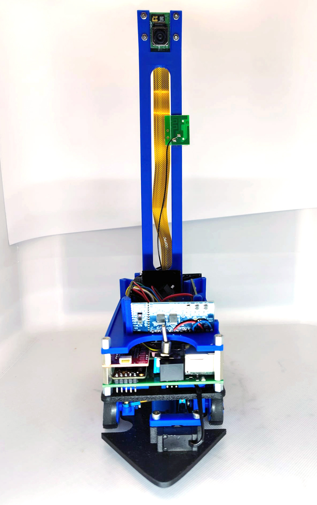
    </a>
</div>

**Attach** the **bumper** to the **front of the lower deck** using **two M3 screws** and **nuts**. 

### **2.5 Mount ESC (electronic speed controller)**
**Component:** <ins>Quicrun WP 1080–G2</ins> (specially designed for low-speed control)

<div align="center">
    <a href="img/LowerDeckStandoffBolts.jpeg" target="_blank">
        
    </a>
</div>

**Add** **four M3×50 mm standoff bolts** to the **lower deck** at the **marked positions**.


<div align="center">
    <a href="img/Bodenplatte3.jpg" target="_blank">
        
    </a>
</div>

The **ESC** sits **loosely** on the **lower deck**. **Slide** **two side bars** over the **standoff bolts** to keep it in place.


### **2.6 Install odometry sensors**
**Components:** <ins>2x SparkFun Qwiic Optical Tracking Odometry Sensors (OTOS)</ins>

**Insert** **eight M3×5 mm standoffs** around the **openings** in the **lower deck**. **Place** the **two OTOS modules** on the **standoffs**. Make sure the **optical sensor** **faces downward** through the holes. Ensure the **Y‑arrow** on the sensors **faces the front** of the car.

<br>

## **Step 3: Middle deck assembly**
### **3.1 Place the middle deck**

<div align="center">
    <a href="img/MitteldeckStandOffs.jpeg" target="_blank">
        
    </a>
</div>

**Place** the **middle deck** **on top** of the car. **Connect** it to the **lower deck** with the **standoffs**. **Use four M3×100 mm standoffs** to **secure** it. The **locations are marked** in the picture above.


### **3.2 Mount Raspberry Pi 5**
**Component:** <ins>Raspberry Pi 5</ins>
<div align="center">
    <a href="img/Mitteldeck2RaspberryScrews.jpeg" target="_blank">
        
    </a>
</div>

**Add** **four M2.5×5 mm standoffs** at the locations marked above. **Place** the **Raspberry Pi 5** on these standoffs and **secure** it with **M2.5 screws**. The Raspberry Pi’s **network port** should **face the outside** of the car.


### **3.3 Integrate camera**

**Component:** <ins>Raspberry Pi Camera Module 3 Wide (12 MP)</ins>

<div align="center">
    <a href="img/vorne.jpg" target="_blank">
        
    </a>
</div>


**Insert** the **camera** into the designated **middle‑deck mount** as shown in the picture. **Secure** it with **four M2.5 screws**. **Route** the **CSI cable** to the **Raspberry Pi**.

### **3.4 Mount servo controller and voltage regulator**
**Component:** <ins>Adafruit 16 Channel Servo Driver, 5 V Pololu step‑down converter</ins>

<div align="center">
    <a href="img/Mitteldeck3.jpg" target="_blank">
        
    </a>
</div>

These **components** **slide** into the **provided slots**.


### **3.5 Battery and power supply**
**Component:** <ins>7.4 V LiPo battery (2S, 2200 mAh)</ins>

The **battery** has **no permanent connection** to the chassis. It is placed in the **slot at the back**. The middle deck has holes, so you can use a **Velcro strap** to temporarily **secure** the battery and **swap** it **quickly**.

<br>

## **Step 4: Upper deck with LiDAR**

### **4.1 Mount LiDAR**
**Component:** <ins>RpLidar S2L</ins>

<div align="center">
    <a href="img/Oberdeck1.jpeg" target="_blank">
        
    </a>
</div>

**Assembly:**
**Mount** the **LiDAR** **upside down** beneath the upper deck. **Secure** it with **four M3 screws**. The LiDAR **cable** must **point to the back** of the car.


### **4.2 Install status display**
**Component:** <ins>LED matrix</ins>

<div align="center">
    <a href="img/oben.jpg" target="_blank">
        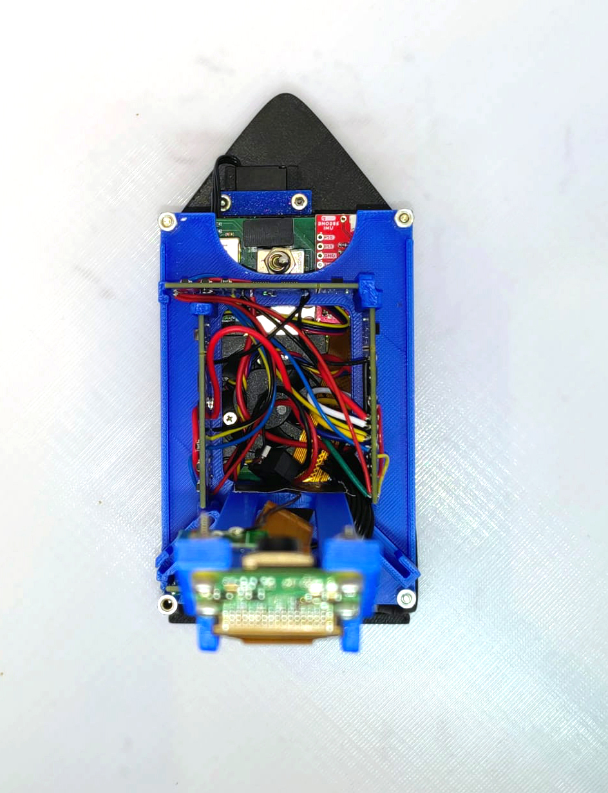
    </a>
</div>

**Mount** the **display** on the upper deck and **secure** it with **four M3 screws**.

<br>

## **Step 5: Wiring**

<div align="center">
    <a href="img/schaltplan.jpg" target="_blank">
        
    </a>
</div>

Refer to the **circuit diagram** to **connect all components**.

**I²C devices** can be connected using off-the-shelf **Qwiic cables**. For the other connections, **0.75 mm² cable** is sufficient because the currents are low. It can be helpful to use **silicone- or PTFE‑insulated cables** because they bend more easily and are easier to install, though this is optional. **Use cable ties** to secure the wiring so it does not block the Raspberry Pi’s fan or intrude into the optical path of the LiDAR or the camera. To connect the **battery**, the easiest option is to use **XT60 connectors** commonly used in RC models, as most batteries come pre‑equipped with them.

<br>
NEU 2026 !!
## **Step 6: Software installation**

### **6.1 Prepare Raspberry Pi OS**
Use "**Raspberry Pi OS (Bookworm, 64-bit)**" and install it on the CM5 boot medium (eMMC or SD card, depending on your CM5 variant/baseboard).


### **6.2 Install Python libraries**
```bash
# Camera stack (Raspberry Pi OS packages)
sudo apt update
sudo apt install -y python3-picamera2 python3-libcamera

# Python packages used by the CM5 control software
pip3 install pygame pyserial numpy opencv-python imutils

# IMU + board interface libraries
pip3 install adafruit-blinka adafruit-circuitpython-bno055 adafruit-circuitpython-bno08x
```

### **6.3 Install Battlepillars software**
```bash
git clone https://github.com/Battlepillars/Wro26.git
cd Wro26/src/pi
python3 main.py
```

### **6.4 Build, compile and upload to the controllers**

Our vehicle uses two controllers:
- **Raspberry Pi CM5** (high-level logic in Python)
- **STM32F411 BlackPill** (low-level control in C++/Arduino via PlatformIO)

#### **A) CM5: Start control software**
```bash
cd Wro26/src/pi
python3 main.py
```

#### **B) STM32: Compile and flash firmware**
Prerequisites:
- VS Code + PlatformIO extension
- STM32 connected via ST-Link

```bash
cd Wro26/src/stm32

# Compile firmware
pio run

# Upload firmware to STM32 via ST-Link
pio run -t upload

# Optional: monitor serial output
pio device monitor -b 921600
```

#### **C) Data exchange between both controllers**
- UART interface: `/dev/ttyAMA0`, **921600 Baud**
- **STM32 -> CM5**: sensor data (ToF distance arrays, rps, voltage, distance)
- **CM5 -> STM32**: actuator commands (speed, steer)

With these steps, the workflow is fully documented: code creation/setup, compilation, and transfer/start on both controllers.

### **6.5 Competition-day quick checklist (2 minutes)**
1. Connect ST-Link and run `pio run -t upload` in `Wro26/src/stm32`.
2. Power-cycle the robot and verify STM32 boots without serial errors.
3. On CM5, start `python3 main.py` in `Wro26/src/pi`.
4. Confirm UART link is alive: sensor values in UI update continuously (distance/rps/voltage).
5. Press start trigger once and verify steering + motor response before placing on field.
