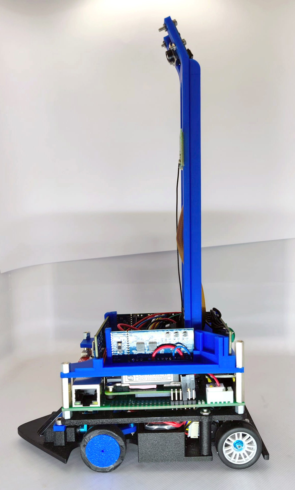
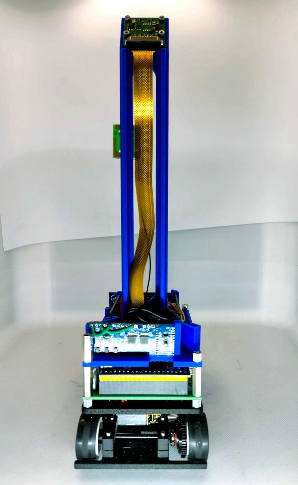

# Table of contents

<ul dir="auto">
    <li><details><summary><a href="#the-team">The team</a></summary>
        <ul dir="auto">
            <li><a href="#nils-stauff">Nils Stauff</a></li>
            <li><a href="#olivia-greilich">Olivia Greilich</a></li>
            <li><a href="#leonard-kolo">Leonard Kolo</a></li>
            <li><a href="#team-photo">Team photo</a></li>
            <li><a href="#funny-team-photo">Funny team photo</a></li>
        </ul>
        </details>
    </li>
    <li><details><summary><a href="#the-robot">The robot</a></summary>
        <ul dir="auto">
            <li><a href="#photos-of-the-robot">Photos of the robot</a></li>
        </ul>
        </details>
    </li>
    <li><details><summary><a href="#mobility-management">Mobility management</a></summary>
        <ul dir="auto">
            <li><a href="#chassis">Chassis</a></li>
            <li><a href="#modification-of-the-model-car">Modification of the model car</a>
                <ul dir="auto">
                    <li><a href="#chassis-plate">Chassis plate</a></li>
                    <li><a href="#middle-deck">Middle deck</a></li>
                    <li><a href="#upper-deck">Upper deck</a></li>
                </ul>
            </li>
            <li><a href="#potential-improvements---chassis">Potential improvements - chassis</a></li>
            <li><a href="#powertrain">Powertrain</a>
                <ul dir="auto">
                    <li><a href="#drivetrain">Drivetrain</a></li>
                    <li><a href="#motor">Motor</a></li>
                    <li><a href="#electronic-speed-controller">Electronic speed controller</a></li>
                    <li><a href="#functioning-of-the-drive-system">Functioning of the drive system</a></li>
                </ul>
            </li>
            <li><a href="#potential-improvements---powertrain">Potential improvements - powertrain</a></li>
            <li><a href="#steering">Steering</a>
                <ul dir="auto">
                    <li><a href="#new-front-axle">New front axle</a></li>
                    <li><a href="#servo-saver">Servo saver</a></li>
                    <li><a href="#servo-motor">Servo motor</a></li>
                </ul>
            </li>
            <li><a href="#potential-improvements---steering">Potential improvements - steering</a></li>
        </ul>
        </details>
    </li>
    <li><details><summary><a href="#power-and-sense-management">Power and sense management</a></summary>
        <ul dir="auto">
            <li><a href="#sensors">Sensors</a>
                <ul dir="auto">
                    <li><a href="#lidar">LiDAR</a></li>
                    <li><a href="#potential-improvements---lidar">Potential improvements - LiDAR</a></li>
                    <li><a href="#camera">Camera</a></li>
                    <li><a href="#potential-improvements---camera">Potential improvements - camera</a></li>
                    <li><a href="#odometry-sensor">Odometry sensor</a></li>
                    <li><a href="#potential-improvements---odometry-sensor">Potential improvements - odometry sensor</a></li>
                    <li><a href="#status-display">Status display</a></li>
                    <li><a href="#potential-improvements---status-display">Potential improvements - status display</a></li>
                </ul>
            </li>
            <li><a href="#vehicle-power-supply">Vehicle power supply</a>
                <ul dir="auto">
                    <li><a href="#lipo-battery">LiPo battery</a></li>
                    <li><a href="#component-power-consumption">Component power consumption</a></li>
                    <li><a href="#total-power-requirements">Total power requirements</a></li>
                    <li><a href="#power-supply">Power supply</a></li>
                    <li><a href="#safety-and-wiring">Safety and wiring</a></li>
                    <li><a href="#potential-improvements---power-supply">Potential improvements - power supply</a></li>
                </ul>
            </li>
            <li><a href="#circuit-diagram-of-components">Circuit diagram of components</a></li>
        </ul>
        </details>
    </li>
    <li><details><summary><a href="#obstacle-management">Obstacle management</a></summary>
        <ul dir="auto">
            <li><a href="#coordinate-system">Coordinate system</a>
                <ul dir="auto">
                    <li><a href="#coordinate-dimensions-and-origin">Coordinate dimensions and origin</a></li>
                    <li><a href="#coordinate-system-properties">Coordinate system properties</a></li>
                    <li><a href="#heading-angle-convention">Heading angle convention</a></li>
                </ul>
            </li>
            <li><a href="#waypoint-navigation-system">Waypoint navigation system</a>
                <ul dir="auto">
                    <li><a href="#command-example-drive-to-coordinate-4502500">Command example: drive to coordinate 450/2500</a></li>
                    <li><a href="#command-example-turn-robot-ccw-to-a-heading-of--90">Command example: turn robot CCW to a heading of -90°</a></li>
                </ul>
            </li>
            <li><a href="#initial-location-acquisition">Initial location acquisition</a></li>
            <li><a href="#position-updates-during-the-race">Position updates during the race</a>
                <ul dir="auto">
                    <li><a href="#optical-tracking-sensor-function">Optical tracking sensor function</a></li>
                    <li><a href="#sensor-failure-detection--health-status">Sensor failure detection / health status</a></li>
                </ul>
            </li>
            <li><a href="#position-corrections">Position corrections</a>
                <ul dir="auto">
                    <li><a href="#reposition-while-driving-pseudocode">Reposition while driving (pseudocode)</a></li>
                </ul>
            </li>
            <li><a href="#obstacle-recognition">Obstacle recognition</a>
                <ul dir="auto">
                    <li><a href="#determining-the-position-of-an-obstacle-within-a-course-section">Determining the position of an obstacle within a course section</a></li>
                    <li><a href="#determining-the-color-of-the-obstacle">Determining the color of the obstacle</a></li>
                    <li><a href="#complete-obstacle-detection-function">Complete obstacle detection function</a></li>
                    <li><a href="#angle-width-and-color-assignment-implementation-note">Angle width and color assignment (implementation note)</a></li>
                </ul>
            </li>
             <li><a href="#navigation-strategy-open-challenge">Navigation strategy open challenge</a>
                <ul dir="auto">
                    <li><a href="#complete-code-for-waypoint-generation">Complete code for waypoint generation</a></li>
                </ul>
            </li>
            <li><a href="#navigation-strategy-obstacle-challenge">Navigation strategy obstacle challenge</a>
                <ul dir="auto">
                    <li><a href="#unparking">Unparking</a></li>
                    <li><a href="#first-round-scanning">First round: scanning</a></li>
                    <li><a href="#second-and-third-round">Second and third round</a></li>
                    <li><a href="#parking">Parking</a></li>
                    <li><a href="#obstacle-avoidance-waypoint-generation">Obstacle avoidance waypoint generation</a></li>
                    <li><a href="#rotation-mapping">Rotation mapping</a></li>
                    <li><a href="#source-code-driveroundpy">Source code: driveRound.py</a></li>
                </ul>
            </li>
            <li><a href="#possible-improvements">Possible improvements</a></li>
        </ul>
        </details>
    </li>
    <li><details><summary><a href="#code-for-all-components">Code for all components</a></summary>
        <ul dir="auto">
            <li><a href="#servo">Servo</a>
                <ul dir="auto">
                    <li><a href="#software-implementation">Software implementation</a></li>
                    <li><a href="#steering-range-and-calibration">Steering range and calibration</a></li>
                </ul>
            </li>
            <li><a href="#drive-motor">Drive motor</a>
                <ul dir="auto">
                    <li><a href="#components">Components</a></li>
                    <li><a href="#hardware-interface">Hardware interface</a></li>
                    <li><a href="#software-implementation-1">Software implementation</a></li>
                    <li><a href="#pid-controller-implementation">PID controller implementation</a></li>
                    <li><a href="#advanced-control-features">Advanced control features</a></li>
                </ul>
            </li>
            <li><a href="#optical-tracking-odometry-sensors">Optical tracking odometry sensors</a>
                <ul dir="auto">
                    <li><a href="#position-and-speed-tracking">Position and speed tracking</a></li>
                    <li><a href="#sensor-health-monitoring-and-redundancy">Sensor health monitoring and redundancy</a></li>
                    <li><a href="#data-fusion-and-final-position-calculation">Data fusion and final position calculation</a></li>
                    <li><a href="#position-reset-and-calibration">Position reset and calibration</a></li>
                    <li><a href="#key-features-of-our-implementation">Key features of our implementation</a></li>
                </ul>
            </li>
            <li><a href="#lidar-1">LiDAR</a>
                <ul dir="auto">
                    <li><a href="#real-time-scanning-and-data-acquisition">Real-time scanning and data acquisition</a></li>
                    <li><a href="#position-detection-and-localization">Position detection and localization</a></li>
                    <li><a href="#dynamic-position-correction-during-driving">Dynamic position correction during driving</a></li>
                    <li><a href="#obstacle-detection-and-recognition">Obstacle detection and recognition</a></li>
                    <li><a href="#key-features-of-our-lidar-implementation">Key features of our LiDAR implementation</a></li>
                    <li><a href="#data-structure-and-access-patterns">Data structure and access patterns</a></li>
                </ul>
            </li>
            <li><a href="#camera-1">Camera</a>
                <ul dir="auto">
                    <li><a href="#image-capture-and-preprocessing">Image capture and preprocessing</a></li>
                    <li><a href="#color-detection">Color detection</a></li>
                    <li><a href="#angle-mapping-and-field-alignment">Angle mapping and field alignment</a></li>
                    <li><a href="#calibration-and-settings">Calibration and settings</a></li>
                    <li><a href="#key-features-of-our-camera-implementation">Key features of our camera implementation</a></li>
                </ul>
            </li>
            <li><a href="#potential-improvements---code-for-all-components">Potential improvements - code for all components</a></li>
        </ul>
        </details>
    </li>
    <li><details><summary><a href="#construction-guide">Construction guide</a></summary>
        <ul dir="auto">
            <li><a href="#assembly-overview">Assembly overview</a></li>
            <li><a href="#step-1-preparing-the-3d-printed-parts">Step 1: Preparing the 3D-printed parts</a></li>
            <li><a href="#step-2-lower-deck-assembly">Step 2: Lower deck assembly</a>
                <ul dir="auto">
                    <li><a href="#21-prepare-latrax-rally-back-axle">2.1 Prepare LaTrax Rally back axle</a></li>
                    <li><a href="#22-install-steering-servo">2.2 Install steering servo</a></li>
                    <li><a href="#23-front-axle">2.3 Front axle</a></li>
                    <li><a href="#24-mount-bumper">2.4 Mount Bumper</a></li>
                    <li><a href="#25-mount-esc-electronic-speed-controller">2.5 Mount ESC (electronic speed controller)</a></li>
                    <li><a href="#26-install-odometry-sensors">2.6 Install odometry sensors</a></li>
                </ul>
            </li>
            <li><a href="#step-3-middle-deck-assembly">Step 3: Middle deck assembly</a>
                <ul dir="auto">
                    <li><a href="#31-place-the-middle-deck">3.1 Place the middle deck</a></li>
                    <li><a href="#32-mount-raspberry-pi-5">3.2 Mount Raspberry Pi 5</a></li>
                    <li><a href="#33-integrate-camera">3.3 Integrate camera</a></li>
                    <li><a href="#34-mount-servo-controller-and-voltage-regulator">3.4 Mount servo controller and voltage regulator</a></li>
                    <li><a href="#35-battery-and-power-supply">3.5 Battery and power supply</a></li>
                </ul>
            </li>
            <li><a href="#step-4-upper-deck-with-lidar">Step 4: Upper deck with LiDAR</a>
                <ul dir="auto">
                    <li><a href="#41-mount-lidar">4.1 Mount LiDAR</a></li>
                    <li><a href="#42-install-status-display">4.2 Install status display</a></li>
                </ul>
            </li>
            <li><a href="#step-5-wiring">Step 5: Wiring</a></li>
            <li><a href="#step-6-software-installation">Step 6: Software installation</a>
                <ul dir="auto">
                    <li><a href="#61-prepare-raspberry-pi-os">6.1 Prepare Raspberry Pi OS</a></li>
                    <li><a href="#62-install-python-libraries">6.2 Install Python libraries</a></li>
                    <li><a href="#63-install-battlepillars-software">6.3 Install Battlepillars software</a></li>
                </ul>
            </li>
        </ul>
        </details>
    </li>
</ul>

# **The team** 
<div align="center">
    <a href="img/teamname.jpg" target="_blank">
        
    </a>
</div>
In this repository, you’ll find the documentation for the robot created by the "Battlepillars" for the 2025 World Robot Olympiad Future Engineers competition. The robot was the result of a collaborative effort by three students.

## **Nils Stauff**

<div align="center">
    <a href="img/nils.jpg" target="_blank">
        
    </a>
</div>

Hi! I’m Nils, and I’m 16 years old. I enjoy coding and solving technical problems. In my free time, I like scuba diving and exploring the underwater world. During winter, I often go skiing, and I’m also a big fan of cats.

For our WRO project, I’m responsible for developing the robot’s software and making sure it runs as intended. It can be challenging at times, but it’s very rewarding when everything works as planned!

## **Olivia Greilich**

<div align="center">
    <a href="img/olivia.jpg" target="_blank">
        
    </a>
</div>

Hello everyone! My name is Olivia Greilich and I'm 16, currently attending the Lise-Meitner Gymnasium in Anrath. Languages, communicating and connecting with people is my passion, same with painting, sculpting and crocheting!
One interesting fact about me is that I am simply enamored with jellyfish of all types, colors, shapes and sizes. I have two jellyfish lamps, tons of stickers, books and of course a phone charm.
In my free time, I usually occupy myself with writing fanfiction on Archive Of Our Own (AO3).

My part of the team effort is the documentation and images you'll see below.

## **Anton Wiesen**

<div align="center">
    <a href="img/leonard.jpg" target="_blank">
        
    </a>
</div>


## **Team photo**

<div align="center">
    <a href="img/team.jpg" target="_blank">
        
    </a>
</div>

## **Funny team photo**

<div align="center">
    <a href="img/teamfoto2.jpg" target="_blank">
        
    </a>
</div>
<br><br><br>

# **The robot**
## **Photos of the robot**
<div align="center">
    <a href="img/vorne.jpg" target="_blank">
        
    </a>
</div>
<br>
<div align="center">
    <a href="img/links.jpg" target="_blank">
        
    </a>
</div>
<br>
<div align="center">
    <a href="img/rechts.jpg" target="_blank">
        
    </a>
</div>
<br>
<div align="center">
    <a href="img/hinten.jpg" target="_blank">
        
    </a>
</div>
<br>
<div align="center">
    <a href="img/oben.jpg" target="_blank">
        
    </a>
</div>
<br>
<div align="center">
    <a href="img/unten.jpg" target="_blank">
        
    </a>
</div>
<br><br><br>

# **1. Mobilität und Mechanik**

## **Entwicklungsziel**
In der Saison 2025 haben wir bereits erfolgreich an der Kategorie Future Engineers teilgenommen und im Weltfinale in beiden Wertungsläufen die höchstmögliche Punktzahl erreicht. 
Ziel der Saison 2026 war es, nicht mehr nur zuverlässig die maximale Punktzahl zu erreichen, sondern die Strecke in möglichst kurzer Zeit zu absolvieren. Daraus ergaben sich drei zentrale mechanische Entwicklungsziele: ein kleineres und leichteres Chassis, ein schnellerer und effizienterer Antrieb sowie eine präzisere Lenkung. Diese Ziele führten zu einer vollständigen Neukonstruktion von Chassis, Antrieb, Vorderachse und Elektroniklayout.
Die kleinere Bauform sollte mehrere Vorteile bringen: Durch die kleine Größe des Autos sind kleinere Kurvenradien möglich und somit eine höhere Wendigkeit. Außerdem hat das Auto beim Hindernisrennen bei der Durchfahrt enger Passagen mehr Abstand zu den Hindernissen, was die Fahrt fehlertoleranter macht und höhere Geschwindigkeiten erlaubt.
<br>

## **Chassis und mechanischer Aufbau**

### **Konstruktion der Chassis**
Das Chassis wurde in Fusion 360 konstruiert. Während der Entwicklung wurde als Filament einfaches PLA verwendet, da es kostengünstig und einfach zu drucken ist. Allerdings funktionierte die Motorhalterung in PLA nicht zuverlässig, da das PLA kriecht (sich unter konstantem Druck verformt) und das Zahnflankenspiel am Motor dadurch nicht mehr passte. 
In der finalen Version wurde das Chassis aus PPA-CF-Filament gefertigt. PPA-CF ist deutlich steifer und kriecht nicht. Dadurch verändern sich die Winkel von Kamera und Sensoren nicht durch ein Durchbiegen des Chassis. Das verbessert die Reproduzierbarkeit der Sensordaten und sorgt für konsistentere Messwerte über den gesamten Lauf. 
Allerdings ergab sich dadurch ein neues Problem. Wenn die Radaufhängung nicht ganz genau gleich hoch war oder die Bodenplatte minimal verzogen war, schwebte ein Rad durch die extreme Steifheit des Materials leicht in der Luft und drehte durch. Bei den vorherigen Versionen in PLA wurde diese Problematik durch die federnden Eigenschaften des Materials ausgeglichen. Da wir aber auf die positiven Eigenschaften des PPA-CF-Filaments in Bezug auf die Sensordaten nicht verzichten wollten, erhitzten wir die Bodenplatte mit einem Heißluftfön und bogen diese vorsichtig, bis alle Räder guten Bodenkontakt hatten.
<br><br>

### **Iteration der Bodenplatte**

Zu Beginn bestand die Bodenplatte nur aus einem einfachen Rechteck. Diese erste Version diente dazu, die wichtigsten mechanischen Komponenten grob zu positionieren und die benötigte Grundfläche abzuschätzen. Als erster Anhaltspunkt dienten die Abmessungen der Hinterachse mit Kugeldifferential, die wir als vormontierte Baugruppe mit fest angebauter Hinterachse und Radnaben eingekauft hatten. Diese bestimmte den Radstand und damit die Breite der Bodenplatte. Die Länge der Bodenplatte wurde hingegen durch die Abmessungen der selbst entwickelten Platine vorgegeben, da diese als flächenmäßig größte Komponente längs ins Chassis eingebaut wurde. Für die Hinterachse haben wir ein Kugeldifferential aus dem Modellbau verwendet, da ein Differential in dieser Größe nur schwer zuverlässig zu drucken ist. Anschließend wurde die Bodenplatte schrittweise an die tatsächlichen mechanischen Anforderungen angepasst. Während dieses Prozesses wurden über fünfzehn Versionen der Bodenplatte erstellt und gedruckt, bis die finale Version mit allen notwendigen Aussparungen, Befestigungspunkten und Anpassungen für die Achsen, Räder, Sensoren und Elektronik fertiggestellt war (vgl. Anhang 5.1: Abbildung A1 „Wichtigste Versionen der Bodenplatte“). Für Lenkung und Radaufhängung wurden insgesamt zehn Kugellager verbaut.

### **Aufbau des Chassis**

Das Chassis ist in drei Ebenen aufgeteilt, die eine kompakte und übersichtliche Integration aller Komponenten ermöglichen: Die Bodenplatte trägt Antrieb, Akku, Differential und Lenkung, die Mittelplatte beherbergt Platine, den Raspberry Pi CM5 das Gyroskop und den Microcontroller, und das Oberdeck beinhaltet die Kamera und die ToF-Sensoren. Auf den folgenden Bildern ist zu erkennen, wie der Roboter zusammengebaut wird. Die zugehörigen Konstruktionsdateien sind in unserem GitHub hinterlegt (https://github.com/Battlepillars/Wro26).
Das fertige Fahrzeug mit allen Komponenten (Platine, Akku, Raspberry Pi CM5, Sensoren, Kamera) hat ein Gesamtgewicht von ca. 450 g. 


## **Antriebskonzept und Motorauswahl**

Unser Ziel war es, eine Runde in ungefähr 10 Sekunden zu fahren – ein Rennen besteht aus drei Runden, das wir damit in etwa 30 Sekunden absolvieren wollen. Die WRO-Strecke hat pro Runde einen Umfang (je nach Streckenführung) von etwa 8 m. Daraus ergibt sich eine benötigte Zielgeschwindigkeit von 8 m / 10 s = 0,8 m/s.  Allerdings können wir nicht permanent mit voller Geschwindigkeit fahren. Es braucht Zeit zum Beschleunigen und Abbremsen und für langsamere Kurvenfahrten. Außerdem geht Zeit zum Parken und für die Hinderniserkennung verloren. Diese Faktoren sind schwer zu berechnen, deswegen haben wir für unser Auto eine Zielgeschwindigkeit von 2m/s als Höchstgeschwindigkeit abgeschätzt.
Auf Grundlage der gewählten Räder (Durchmesser ca. 27 mm, Umfang ca. 84,8 mm) muss das Rad dafür ungefähr 23,7 Umdrehungen pro Sekunde (= 1410 RPM) ausführen. Um die benötigte Raddrehzahl von etwa 1410 RPM zu erreichen, muss der Getriebeausgang des Motors aufgrund der externen Übersetzung von 2,44:1 eine Drehzahl von ungefähr 3384 RPM liefern. Das ist die erste Anforderung an den Motor.
Die zweite Anforderung betrifft das Drehmoment. Ein Motor muss nicht nur eine hohe Drehzahl erreichen, sondern auch genug Drehmoment liefern, um das Fahrzeug unter realen Bedingungen zuverlässig zu beschleunigen. Das notwendige Drehmoment schätzten wir auf Basis des Fahrzeuggewichts von ca. 450 g ab. Bei einem angenommenen Rollreibungskoeffizienten von 0,05 und einem Radradius von 13,5 mm ergibt sich:

++ S. Dokument S.3 (graue Leiste)

Nach Rückrechnung durch die externe Getriebeübersetzung muss der Motor mindestens 3,0 / 2,44 ≈ 1,2 mNm Drehmoment aufbringen, zuzüglich Reserve für Kurvenfahrten und Beschleunigung.
Um einen geeigneten Motor zu finden, haben wir mehrere kleine Motoren der N20/N30-Klasse gekauft, die laut Datenblatt hohe Drehzahlen bei vertretbarem Drehmoment versprechen, und diese direkt im Fahrzeug getestet. Dafür haben wir ein Testprogramm geschrieben, das die Fahrgeschwindigkeit über den Encoder am Motor berechnet. Der STM32 liest einen Quadratur-Encoder aus und berechnet die Drehzahl. Die Umrechnung des Encoder-Zählerwerts in eine Fahrgeschwindigkeit erfolgt über den empirisch kalibrierten Faktor: 

++ S. Dokument S.4 (graue Leiste)

Der Faktor 5,165 wurde anhand von  Referenzmessungen bei bekannten Strecken bestimmt.

++ S. Dokument S.4 (Tabelle)

Wir haben uns für den N30 6V 1500 rpm entschieden, da er im Fahrzeug mit ca. 2 m/s die höchste reale Geschwindigkeit erreichte. Sein Nenndrehmoment von ca. 3 mNm liegt über dem berechneten Mindestbedarf von 1,2 mNm und liefert ausreichend Reserve. Laut Datenblatt erreicht er bei 6 V 1500 RPM; hochskaliert auf die Betriebsspannung von 11,1 V (3S-LiPo) ergibt sich eine extrapolierte Leerlaufdrehzahl von ca. 2775 RPM.  


## **Hinterachse und Differential**

TDer Motor treibt die Hinterräder nicht direkt an. Stattdessen verwenden wir ein Kugeldifferential an der Hinterachse. 
Der verwendete N30-Motor ist ein Getriebemotor mit interner Übersetzung von 1:10. Zusätzlich überträgt ein externes Zahnradpaar die Kraft auf die Hinterachse: Das Antriebsritzel am Motorausgang hat 18 Zähne, das Differentialzahnrad 44 Zähne, was einer zweiten Übersetzung von ≈ 2,44:1 entspricht. Insgesamt ergibt sich somit eine Gesamtuntersetzung von etwa 24,4:1 zwischen dem eigentlichen Elektromotor und der Hinterachse. 

Das Nenndrehmoment des N30-Motors liegt laut Datenblatt nach der internen Übersetzung bei ca. 3 mNm. Durch die zusätzliche externe Übersetzung erhöht sich das verfügbare Drehmoment auf  etwa 7,2 mNm an der Hinterachse. 		                   
Die Konstruktion der Hinterachse erfolgte in Fusion 360 auf Basis des Kugeldifferential. Eine Schwierigkeit war, dass sowohl die Motorhalterung als auch die Halterung des Differentials mechanisch präzise gefertigt werden mussten, damit das Zahnflankenspiel zwischen Motorritzel und Differentialzahnrad stimmte. Dies war durch Messen und Konstruieren praktisch allein nicht möglich, da die Maßhaltigkeit der gedruckten Teile nicht hoch genug war. Also wurde der richtige Abstand experimentell ermittelt, indem wir die Konstruktionsparameter änderten und die Bodenplatte neu druckten, bis es gepasst hat. 

## **Vorderachse und Lenkung**
Für die Vorderachse haben wir uns wie schon im letzten Jahr für eine Ackermann-Lenkung entschieden. Bei einer einfachen Parallellenkung drehen beide Vorderräder um denselben Winkel – das führt in Kurven zu seitlichem Schlupf, weil das kurveninnere Rad einen kleineren Radius fährt als das äußere und daher stärker einlenken müsste. Die Ackermann-Lenkung löst dieses Problem, indem die Lenkgeometrie so ausgelegt wird, dass sich die verlängerten Radachsen beider Vorderräder auf der Verlängerung der Hinterachse in einem gemeinsamen Punkt schneiden. Die ideale Bedingung dafür lautet:

++ S. Dokument S.5 (graue Leiste)

Mit unserer Spurbreite t = 65 mm und dem Radstand L = 80 mm ergibt sich ein Zielwert von t/L = 0,81.
Da für unsere kompakte Bauform keine geeigneten Fertigteile verfügbar waren, konstruierten wir die gesamte Vorderachse in Fusion 360 selbst und testeten verschiedene Varianten der Lenkgeometrie im 3D-Druck. Bei maximalem Lenkeinschlag erreicht das kurveninnere Rad 45° und das kurvenäußere 35°, woraus sich ergibt:

++ S. Dokument S.5 (graue Leiste)

Der erreichte Wert von 0,43 liegt deutlich unter dem Idealwert von 0,81. Bei unverändertem Außenwinkel von 35° müsste das Innenrad theoretisch etwa 58,5° erreichen, um die Ackermann-Bedingung vollständig zu erfüllen. Das ist jedoch konstruktiv nicht möglich, da das Innenrad bei 45° bereits am mechanischen Anschlag ist und ein größerer Winkel den verfügbaren Bauraum überschreiten würde. Alternativ müsste bei unverändertem Innenwinkel von 45° der Außenwinkel auf etwa 29° reduziert werden, wodurch das Auto weniger stark einlenken könnte. Die Lenkung erfüllt die ideale Ackermann-Bedingung daher nur teilweise. Dadurch schneiden sich die verlängerten Radachsen der Vorderräder nicht exakt in einem gemeinsamen Kurvenmittelpunkt, wodurch in engen Kurven leichter seitlicher Schlupf an den Vorderrädern entstehen kann (vgl. Anhang 5.2: Abbildung A2 „Ackermann-Lenkgeometrie“). 
Der minimale Kurvenradius (gemessen von Hinterachsmitte bis Kurvenmittelpunkt) berechnet sich so:

++ S. Dokument S.5 (graue Leiste)

Der minimale Kurvenradius beträgt bei unserem Auto näherungsweise 114 mm (Saison 2025: 172mm). Für die Anforderungen der WRO-Strecke ist dieser Kurvenradius vollkommen ausreichend. In den Fahrversuchen zeigte sich, dass das Fahrzeug Kurven zuverlässig und stabil durchfährt. 
Neben der Lenkgeometrie ist jedoch auch die mechanische Präzision der Lagerung entscheidend dafür, ob die berechneten Winkel im Fahrbetrieb tatsächlich reproduzierbar erreicht werden. Im letzten Jahr hatte unser Auto nur ein Kugellager pro Rad. Die Achsschenkel wurden in Gleitlagern gehalten. Dadurch hatten die Räder deutliches Spiel und sie wackelten seitlich hin und her. Um das Lenkspiel zu minimieren, verwendeten wir für die Lagerung der Vorderachse insgesamt acht Kugellager. Zwei pro Seite lagern die Achsschenkel, zwei weitere pro Seite lagern die Räder. Diese Kugellager sorgen für eine präzise Lenkung mit wenig Spiel sowie einen geringen Rollwiderstand.

<br>

## **Auswahl und Position des Servos**

Bei der Auswahl des Lenkservos waren neben der Baugröße vor allem die schnelle Beschaffbarkeit ausschlaggebend. Zunächst kam ein besonders kompakter und kostengünstiger Servo (ca. 2 €) mit Vollkunststoffgetriebe zum Einsatz. Das ausgeprägte Lenkspiel von schätzungsweise 5° erwies sich jedoch als unzureichend für eine präzise Regelung, weshalb der INJORA N30 Nano mit Coreless-Motor, Metallgetriebe und Aluminiumgehäuse als Ersatz gewählt wurde. Mit einem Gewicht von 7 g und den Abmessungen 15,2 × 13,0 × 21,3 mm bleibt er äußerst kompakt; bei 6 V stellt er ein Drehmoment von 1,3 kg·cm bei einer Stellgeschwindigkeit von 0,05 s/60° bereit. Da die Anforderungen an Kraft und Reaktionszeit im vorliegenden Anwendungsfall gering sind, hätte nahezu jeder handelsübliche Servo die Spezifikation erfüllt – entscheidend war allein das spielfreie Metallgetriebe.
Die Positionierung des Servos stellte eine eigenständige konstruktive Herausforderung dar. Die bei Modellfahrzeugen übliche Anordnung – Servo und Gestänge mittig im Fahrzeug – schied aus, weil wir für eine hohe Wendigkeit einen relativ kurzen Radstand benötigten und wir für einen niedrigen Schwerpunkt den Akku zwischen Vorder- und Hinterräder einbauen wollten. Nach dem Evaluieren zahlreicher Konfigurationen wurde der Servo vor die Vorderachse verlagert, das Gestänge hinter ihr geführt. So ließ sich der Bumperbereich konstruktiv nutzen, ohne Akku oder Platine umzuplatzieren; der Schwerpunkt blieb tief und zentral, und der erforderliche Lenkeinschlag wurde kollisionsfrei erreicht.

# **2. Energie und Sensoren**

## **Konzept**
Um das Designziel eines kleinen und schnellen Fahrzeugs zu erreichen, war ein grundlegender Umbau der Elektronik notwendig. Das Vorjahressystem nutzte einen RPLiDAR S2 zur Umfelderkennung sowie zwei optische Odometrie-Sensoren zur Positionsbestimmung. Die Steuerung war vollständig koordinatenbasiert – Fahrbefehle lauteten sinngemäß „Gehe zu Koordinate X/Y". Der LIDAR lieferte jedoch nur ~10 Updates pro Sekunde mit einer Verzögerung von 100–200 ms, weshalb Positionskorrekturen nur im Stillstand zuverlässig funktionierten. Die Odometrie übernahm die Positionsverfolgung während der Fahrt, begrenzte die Maximalgeschwindigkeit aber auf 0,5 m/s – darüber wurden ihre Messungen unzuverlässig.
Für das neue Fahrzeug wurde daher ein grundlegend anderer Ansatz gewählt: Mehrere Time-of-Flight-Sensoren (VL53L8CX) messen mit 30 Hz kontinuierlich die Abstände zu den Wänden und ermöglichen so eine Steuerung ohne Anhalten. Die Steuerlogik ist nun eventbasiert – statt „Gehe zu Koordinate X/Y" lautet ein Fahrbefehl beispielsweise „Fahre auf die Wand zu, bis der Abstand 20 cm beträgt". Da keine Stopps zur Positionskorrektur mehr nötig sind, fährt das Fahrzeug deutlich flüssiger und schneller.
Das Ergebnis: 2025 benötigte unser Fahrzeug im Hindernisrennen durchschnittlich 160 s für einen Lauf, 2026 erreichen wir je nach Aufbau zwischen ca. 35 s und 45 s. Damit haben wir unser Designziel von 30 Sekunden pro Runde zwar nicht ganz erreicht, aber unsere Rundenzeit immerhin um den Faktor 4 verbessert.


<br>

## **Aufbau der Elektronik**

Für die Elektronik wurde zunächst ein Testaufbau auf einem Breadboard aufgebaut. Damit konnten wir prüfen, ob die wichtigsten Komponenten grundsätzlich funktionieren, bevor wir eine eigene Platine fertigen ließen. Getestet wurden dabei unter anderem Mikrocontroller, Motor, Motor-Encoder, Motortreiber, Servo, Time-of-Flight-Sensoren und Kamera. Den vollständigen Aufbau der Elektronik zeigt der Verdrahtungsplan (vgl. Anhang 5.3: Abbildung A3 „Verdrahtungsplan“). Er stellt alle Verbindungen zwischen Baseboard, Raspberry Pi CM5, STM32, Sensoren, Motortreiber und Servo dar.


## **Kamera: Verwendung der Kamera und Kalibrierung**

### **Verwendung der Kamera** 
Wie im Vorjahr setzen wir auf die Raspberry Pi Camera Module 3 Wide (12 MP), da sie sich bewährt hat. Drei Wochen vor dem Regionalwettbewerb entschieden wir uns, die Kamera auf 27 cm Höhe – knapp unter der Maximalhöhe – zu montieren. So kann das Fahrzeug vom Startplatz aus über die Bande hinweg alle Hindernisse auf einmal erfassen (Vollscanstrategie) und die optimale Route bereits vor der Abfahrt berechnen. Die Erkennung der Hindernisse ist so zwar deutlich anspruchsvoller (vgl. Kapitel 3.7.1 Maskenpipeline), das Abfahren des Kurses ist aber viel einfacher und schneller, da keine Zeit mehr verloren geht, um günstige Kamerapositionen anzufahren. Die durchschnittliche Rundenzeit sank dadurch nochmals von 56 s auf 38 s.


### **Kalibrierungsverfahren**

Die Kamera kalibriert Belichtungszeit, Weißabgleich und Verstärkung automatisch. Je nach Lichtverhältnissen vor Ort können jedoch manuelle Anpassungen der Farbmasken in cameraAIO.py nötig sein – insbesondere die Erkennung der schwarzen Wände reagiert empfindlich auf Beleuchtungsänderungen.
Vor jedem Wettbewerbslauf nehmen wir ein Testbild auf und prüfen im Debug-Bild, ob die Hindernisse vollständig in der Maske liegen und die schwarzen Wände eine geschlossene Flood-Fill-Barriere bilden. Falls nicht, passen wir zuerst den V-Maximalwert der Schwarzmaske und anschließend die H/S/V-Werte der Rot- und Grünmasken an. Da der Hue-Bereich in OpenCV von 0 bis 179° reicht und Rot als einzige Farbe an beiden Enden der Skala erscheint, werden für die Roterkennung zwei separate Masken erzeugt und anschließend addiert.

++ S. Dokument S.6 (Tabelle)

Der kritischste Parameter ist der V-Maximalwert der Schwarzmaske (Standardwert: 90 – s. Tabelle). Bei starkem Umgebungslicht reflektieren schwarze Wände mehr Licht und erscheinen heller; der Wert muss dann auf 110–120 erhöht werden. Bei schwacher Beleuchtung kann er auf 70–80 gesenkt werden, um Fehldetektionen durch dunkle Schatten auf dem weißen Boden zu vermeiden. Problematisch ist teilweises Sonnenlicht: Schwarze Wände im direkten Sonnenlicht können einen höheren V-Wert erreichen als der weiße Boden im Schatten – eine Konstellation, für die wir bislang keine zuverlässige Lösung gefunden haben.

## **Entfernungssensoren**

### **Auswahl der Entfernungssensoren**

Für die Erkennung der Umgebung verwenden wir optische Entfernungssensoren beziehungsweise Time-of-Flight-Sensoren. Diese messen die Entfernung zu Objekten auf optischer Basis. Zur konkreten Auswahl verglichen wir die Datenblätter von unterschiedlichen  Sensoren.

++ S. Dokument S.7 (Tabelle)

Bei der Sensorauswahl war entscheidend, dass einzelne Messzonen möglichst klein sind, um Wände aus größerer Entfernung vom Boden unterscheiden zu können (FOV/Zone in der Tabelle). Der VL53L9CX wäre aufgrund seiner höheren Auflösung ideal gewesen, war zum Entwicklungszeitpunkt jedoch noch nicht erhältlich. Zwischen VL53L8CX und TMF8828 fiel die Wahl auf den VL53L8CX, da dessen maximale Messfrequenz laut Datenblatt deutlich höher war und wir uns davon schnellere Reaktionszeiten der Hinderniserkennung versprachen. In der Praxis zeigte sich jedoch, dass im 8×8-Modus nur ~30 Hz erreichbar waren – womit der TMF8828 rückblickend vielleicht die bessere Wahl gewesen wäre. Ein Sensorwechsel war zu diesem Zeitpunkt aufgrund des fortgeschrittenen Entwicklungsstands jedoch nicht mehr realistisch.

### **Sensorevaluierung**

Der VL53L8CX bietet zwei Betriebsmodi: Im 4×4-Modus liefert er ein Messraster aus 16 Zonen bei höherer Messfrequenz, im 8×8-Modus stehen 64 Zonen bei geringerer Frequenz zur Verfügung. Um den für unser Fahrzeug geeigneten Modus zu bestimmen, haben wir beide Varianten systematisch getestet.
Ein Problem bei der Sensorplatzierung ist die Einbauhöhe über dem Boden. Sitzt der Sensor zu tief, erfassen einzelne Messzonen den Boden statt die Wand, was zu Fehlmessungen führt. Sitzt er zu hoch, kann er die untere Kante einer Wand nicht mehr zuverlässig erfassen. Wir haben verschiedene Sensorhöhen getestet und gemessen, ab welchem Abstand die Wand sicher erkannt wird und ob Bodenreflexionen die Messung stören. 
Neben der Höhe untersuchten wir auch den Einfluss der Messfrequenz auf die maximale sichere Erkennungsreichweite. Eine höhere Frequenz ist für die Fahrstrategie vorteilhaft, da der STM32 häufiger aktualisierte Abstände erhält und früher reagieren kann. Allerdings kann eine höhere Frequenz zu erhöhtem Rauschen führen, was die maximale zuverlässige Reichweite reduziert. Die Tabelle 3 fasst die Ergebnisse zusammen.

++ S. Dokument S.7 (Tabelle)

Die Tests zeigten, dass der 4x4 Modus zwar eine höhere Messfrequenz liefert, aber leider die schmalen Wände nur auf eine zu kurze Distanz sicher erkennt. Ein einzelner Messpunkt ist dann so groß, dass er nicht nur die Wand erfasst, sondern zusätzlich den Boden. Deswegen haben wir den 8x8 Modus mit 30Hz gewählt und die Sensoren wurden auf 60mm Höhe eingebaut, weil dort die größte Reichweite erreicht wurde (s. Tabelle).

### **Sensorenplatzierung im Roboter**
Die verwendeten Time-of-Flight-Sensoren haben einen Erfassungswinkel von ca. 60°. Ursprünglich waren vier Sensoren geplant (vgl. Abbildung4), jedoch zeigte sich in Fahrtests ein Problem: Bei einer Annäherung an eine Wand im 45°-Winkel entstand ein toter Winkel schräg vor dem Fahrzeug, da weder der vordere noch der seitliche Sensor diesen Bereich ausreichend abdeckten. 
Um dieses Problem zu lösen, wurden zwei zusätzliche Sensoren ergänzt, die im 45°-Winkel nach vorne ausgerichtet sind. Diese sollten Wände bei schräger Anfahrt früher erkennen. Die Platzierung vorne am Fahrzeug erwies sich jedoch als problematisch, da die Sensoren das Kamerabild verdeckten. Da die Kamera zu diesem Zeitpunkt noch nicht erhöht montiert war, wurde nach einer Alternativlösung gesucht. Um Platz zu sparen, stiegen wir auf kleinere PCBs (vgl. Abbildung5) um, die mechanisch besser ins kompakte Chassis passten. In Tests stellte sich jedoch heraus, dass diese kleinere Variante nicht zuverlässig genug arbeitete – bei mehr als zwei Sensoren brach die SPI-Kommunikation zusammen. 
Wir kehrten zu den größeren PCBs zurück und platzierten diese stattdessen hinten am Fahrzeug, um das Kamerabild freizuhalten. Aufgrund des begrenzten Platzes wurden sie dort hochkant verbaut (vgl. Abbildung6). 
Nach der Umstellung der Hinderniserkennung auf Vollscan (vgl. Kapitel 2.3 Kamera, 3.5 Fahrstrategie Hindernisrennen - Strategiewechsel) konnten wir auf die zusätzlichen Sensoren verzichten (vgl. Abbildung 10). Dadurch, dass keine günstigen Kamerapositionen angefahren werden müssen, nähert sich der Roboter keiner Wand im 45°-Winkel. 


## **Gyro**
Im Vorjahr hatten wir das Problem, dass der Gyro über die Dauer einer Mission mehrere Grad Drift entwickelte. Dieser Drift führte zu ernsthaften Problemen bei der Orientierung des Roboters. In dieser Saison  wollten wir deshalb einen BNO055 mit eingebautem Magnetometer verwenden. Wenn das Magnetometer zuverlässig funktioniert, kann es den Drift theoretisch komplett ausgleichen. Unsere Tests haben allerdings gezeigt, dass das Magnetometer viel zu ungenau und unzuverlässig funktioniert. Es kam zu Abweichungen von 5 – 10 Grad, weswegen wir es deaktivieren mussten. Mit dieser Einschränkung funktioniert der BNO055 noch schlechter als der Gyro vom letzten Jahr. Pro gefahrener Runde hatten wir eine Abweichung von ca. zwei Grad, am Ende des Kurses von ca. sechs Grad. Die Abweichung ist über mehrere Läufe nicht konstant, und lässt sich deswegen nicht wegkalibrieren. Damit ist kein Navigieren mehr möglich. 
Deswegen sind wir kurzfristig auf einen BNO086 umgestiegen. Diesen verwenden wir auch ohne Magnetometer, allerdings zeigt dieser Gyro einen deutlich geringeren und konstanteren Fehler. Eine Bias-Kalibrierung (Nullpunkt der Drehratensensoren) führen wir automatisch bei Programmstart durch, die Rate-Kalibrierung ermitteln wir von Hand, indem wir das Auto zehnmal um 360 Grad drehen. Dann vergleichen wir gemessene und reale Drehrate und ermitteln einen Korrekturfaktor. 

++ S. Dokumentation S.9 (graue Leiste)

Damit kommen wir auf eine Abweichung von ca. einem Grad nach drei gefahrenen Runden. In der Praxis hat sich gezeigt, dass der Roboter bei dieser Abweichung die Strecke noch sauber abfahren kann.

## **Stromversorgung und Leistungsverbrauch**
Letztes Jahr verwendeten wir einen 2S 2200mAh Akku. Dieser ist für unser neues Auto viel zu groß, außerdem ist die Spannung nicht ausreichend, da unser neuer  Motortreiber bei 6,5V abschaltet. Mit Leitungsverlusten und unter Lastspitzen war beim Testen ein zuverlässiger Betrieb mit einem 2S Akku bei nachlassender Akkuspannung nicht mehr möglich, sodass wir früh auf einen 3S Akku wechselten. Dieser gibt uns auch mehr Leistungsreserve für höhere Geschwindigkeiten beim Motor. 
Nach der Spannung war das wichtigste Auswahlkriterium die Einbaugröße bei möglichst großer Kapazität. Unsere Wahl fiel auf einen 3S-LiPo-Akku mit 550 mAh. Das ist der größte Akku, den wir im Chassis unterbringen konnten. Um zu ermitteln, ob der Akku brauchbar ist, hatten wir zunächst die Laufzeit theoretisch berechnet, dann praktisch gemessen (s. unten). 

++ S. Dokument S.9 (Tabelle)

### **Gemessener Gesamtleistungsbedarf**
Der gemessene Gesamtleistungsbedarf des Systems liegt im Betrieb zwischen etwa 7 W (geringe Last) und 10 W (volle Rechenlast mit Fahrt).

### **Berechnung der Laufzeit und Vermeidung von Tiefentladungen**
Energieinhalt Akku: 	11,1 V × 0,55 Ah = 6,1 Wh
Stromverbrauch: 7 bis 10 Watt <br>
Laufzeit theoretisch:	Daraus folgt eine Laufzeit von 36 bis 52 Minuten. <br>
Laufzeit praktisch:	Im Testbetrieb beträgt die gemessene Laufzeit bis zur Abschaltschwelle (3,5V/Zelle) meist ca. 40 Minuten und deckt sich damit gut mit den theoretischen Berechnungen. <br>
Um Tiefentladungen zu vermeiden, misst der STM32 die Akkuspannung, schaltet bei einer Zellspannung von 3,5 Volt den Motor aus und sendet ein Signal an den Raspberry, worauf dieser herunterfährt. Weiterhin bewegt er zyklisch den Lenkservo um auf die leere Batterie hinzuweisen.

### **Spannungsversorgung der einzelnen Komponenten**
- 11,1 V direkt: N30-Motor über den DRV8871-Motortreiber (H-Brücke, 6,5–45 V, max. 3,6 A)
- 5 V über DC-DC Converter: Raspberry Pi CM5 über die 100-Pin-Steckverbinder auf dem selbst entwickelten Baseboard; Servo und alle vier VL53L8CX ToF-Sensoren
- 3,3 V über Linearregler (AMS1117-3.3): STM32F411, BNO086; Eingangsversorgung des AMS1117 kommt von der 5-V-Schiene über den GPIO-Header
- Das Raspberry Pi Camera Module 3 wird ausschließlich über die MIPI-CSI-Schnittstelle des CM5 versorgt; keine externe Verdrahtung notwendig


# **3. Entwicklung des Codes**
## **Softwarearchitektur**
Die Software ist in zwei getrennte Verarbeitungsebenen aufgeteilt. Auf dem Raspberry Pi Compute Module 5 (CM5) läuft die High-Level-Logik: Fahrstrategie, Bildverarbeitung, Gyro-Auswertung, Benutzeroberfläche und Logging. Auf dem STM32F411 liegt die Low-Level-Regelung: Motoransteuerung, Encoder-Auswertung, Servoansteuerung und das Einlesen der vier VL53L8CX Time-of-Flight-Sensoren mit fester Zykluszeit.
Diese Aufteilung hat zwei Vorteile: Der STM32 übernimmt zeitkritische Aufgaben ohne Betriebssystem-Overhead. Der CM5 kann gleichzeitig rechenintensive Aufgaben wie Bildverarbeitung und Gyro-Fusion ausführen, ohne die Sensor-Regelschleife zu blockieren. Die Kommunikation zwischen beiden Prozessoren erfolgt über UART mit 921 600 Baud.

++ S. Dokument S.10 (Tabelle, Bild)

## **Threading und Systemablauf**

Im Raspberry-Pi-Code laufen drei funktionale Ebenen parallel:
Der UI-Hauptthread zeigt Statusdaten an und reagiert auf Tastatureingaben zum Starten und Stoppen. 
Der Parser-Thread liest kontinuierlich die serielle Schnittstelle und aktualisiert die gemeinsam genutzten Sensorwerte: Distanzfelder aller sechs Sensoren, Drehzahl, Batteriespannung und Fahrtrichtung. 
Der Control-Loop führt die eigentliche Fahrlogik aus und schreibt Sollwerte für Geschwindigkeit und Lenkwinkel zurück in die serielle Schnittstelle. 


## **Fahrprimitiven in driveController.py**
driveController.py bildet die Abstraktionsschicht zwischen rohen Sensorwerten und den Challenge-Skripten. Es stellt eine Bibliothek von Fahrprimitiven bereit, die intern Heading-Regelung und Beschleunigungsrampen kombinieren.
Die Beschleunigungsrampe begrenzt den Beschleunigungswert auf 1 m/s² und die Bremsbeschleunigung auf 8 m/s². Das verhindert, dass die Reifen durchdrehen oder blockieren, was die Odometriewerte und die gemessene Geschwindigkeit verfälschen würde.
Die Lenkung nutzt zwei P-Regler: pidSteer (Kp = 1,0) für das normale Fahren und pidSteer2 (Kp = 0,5) für weichere Kurvenführung mit weniger Überschwingen. 
Bedeutung der Kp-Werte: Der Regler berechnet den Lenkwinkel-Offset (0–180°, Mitte = 90°) direkt aus dem Heading-Fehler in Grad:

++ S. Dokument S.10 (graue Leiste) <br>

Bei Kp = 1,0 entspricht 1° Heading-Fehler genau 1° Lenkkorrektur; die Sättigung (voller Einschlag) tritt bei |Fehler| ≥ 90° ein. Bei Kp = 0,5 tritt sie erst bei |Fehler| ≥ 180° auf, was zu weicherem, aber trägerem Regelverhalten führt.
Ermittlung der Werte: Die Kp-Werte wurden empirisch bestimmt. Ausgangspunkt war Kp = 1,0, da die 1:1-Abbildung eine intuitive Anfangseinschätzung erlaubt. Bei Geradeausfahrt zeigte das Fahrzeug kein Oszillieren – die mechanische Trägheit liefert ausreichende Dämpfung. Bei der schnelleren Kurveneinleitung (turn()) führte Kp = 1,0 jedoch zu Überschwingen am Ende der Kurve. Durch Halbieren auf Kp = 0,5 (pidSteer2) ließ sich das Überschwingen auf unter 3° reduzieren.
Warum kein I- und D-Anteil: Ein Integralanteil ist nicht notwendig, da der Gyro die absolute Orientierung misst und kein bleibender Offset entsteht. Ein D-Anteil würde auf das Messrauschen des BNO086 reagieren und die Lenkung destabilisieren.
Die Steuerung basiert auf folgenden Fahrprimitiven: <br>

++ S. Dokument S.11 (Tabelle) <br>

Die konkreten Parameter für die Programme (z. B. der Abstand bei der driveToWall Funktion) wurden nicht berechnet, sondern empirisch in Fahrtests ermittelt. Beispiel: Bei driveToWall wurde das Fahrzeug mit verschiedenen Schwellwerten gefahren und der Wert übernommen, bei dem die darauffolgende Kurve sauber eingeleitet wurde, ohne eine Wand zu touchieren.

## **Fahrstrategie Eröffnungsrennen**
Im Eröffnungsrennen (openChallenge.py) fährt das Auto drei vollständige Runden. Das Auto fährt geradeaus bis links oder rechts keine Wand erkannt wird und merkt sich basierend darauf die Fahrtrichtung mit Hilfe der findDirection Funktion. Jede Runde besteht aus vier Geraden mit jeweils einer 90°-Kurve:
- driveAlongWall – entlang der Außenwand bis zum Kurvenbereich
- turn(−90°) – Kurve per P-Regler einleiten, Sollgeschwindigkeit 1,3 m/s
- driveDist(750 mm) + driveAlongWall – nächste Gerade, Sollgeschwindigkeit 2 m/s
- Wiederholen für alle vier Seiten des Parcours <br>

Das Muster aus Gerade und Kurve wiederholt sich viermal pro Runde (eine Seite des Parcours pro Iteration). Nach drei vollständigen Runden (3 x 4 = 12 Kurven gesamt) stoppt das Fahrzeug mit driveAwayFromWall in der Mitte der Startzone. Die Sollgeschwindigkeit von 2 m/s auf Geraden ist ein konfigurierter Parameterwert; die tatsächliche Endgeschwindigkeit hängt von der Beschleunigungsrampe und der verfügbaren Streckenlänge ab.


## **Fahrstrategie Hindernissrennen - Strategiewechsel**
### **Alte Strategie: Scanning während der Fahrt**
Die ursprüngliche Strategie erkannte Hindernisse während der Fahrt. Am Anfang jeder Geraden wurde ein Foto aufgenommen und die Farbe des ersten Hindernisses bestimmt. Das System scannte zusätzlich bis zu zweimal pro Abschnitt nach weiteren Hindernissen. Diese Logik führte zu einem schwer wartbaren Zustandsautomaten: bis zu drei Scan-Punkte pro Abschnitt, abstandsabhängige Verzweigungen und Kamera unter Bewegung.


### **Neue Strategie: Vollscan, feste Route**
Die neue Strategie trennt Erkennung und Fahrt vollständig. Direkt nach Programmstart dreht das Auto sich in 3 definierten Winkeln (tightTurn) und fotografiert den gesamten Parcours. Aus diesen drei Fotos werden die Farben der Hindernisse auf allen vier Abschnitte auf einmal erkannt und in parser.obstacles[0..11] gespeichert. Danach wird die Kamera nicht mehr benutzt – die Route ist deterministisch festgelegt. Eine detaillierte Übersicht über den Programmablauf des Hindernisrennens zeigt das Zustandsdiagramm im Anhang (vgl. Anhang 5.4: Abbildung A4 „Zustandsdiagramm Hindernisrennen – Vollscan-Strategie“).

## **Serielle Kommunikation und Datenmodell**
CM5 und STM32 kommunizieren über UART (/dev/ttyAMA0, 921 600 Baud). Pro Übertragungszyklus sendet der STM32 ein vollständiges Statuspaket an den CM5; dieser antwortet mit einem Steuerpaket. Der Parser-Thread auf dem CM5 verarbeitet eingehende Pakete asynchron und schreibt die Werte in gemeinsam genutzte Felder des Parser-Objekts.


++ S. Dokument S.12 (Tabelle)

## **Kameraverarbeitung**

cameraAIO.py steuert die Raspberry Pi Camera Module 3 über Picamera2 in der SingleExposure-Konfiguration (Auflösung 1536 × 1152 Pixel). captureImage() nimmt ein Standbild auf und speichert es als Klassenattribut; die eigentliche Auswertung erfolgt durch getObstacles1()–getObstacles4(), die jeweils abschnittsangepasste Sichtbereiche analysieren.
<br>

### **Maskenpipeline**
Die Erkennung verläuft in 13 Schritten. Besonderheit: Statt eines einfachen Rechteck-ROI wird ein Flood-Fill verwendet, der die schwarzen Parcours-Wände als Barriere nutzt. Dadurch wird ausschließlich der tatsächlich befahrbare Bereich analysiert – farbige Gegenstände hinter Wänden oder außerhalb des Parcours werden automatisch herausgefiltert.

++ S. Dokument S.12-13 (Tabelle, Fotos)

## **Softwareverbesserungen**
Im Verlauf der Entwicklung und der Testläufe wurden Fehler identifiziert, deren Ursachen analysiert und durch gezielte Codeänderungen behoben – eine Auswahl ist in der folgenden Tabelle dokumentiert.

++ S. Dokument S.13 (Tabelle)

# **4. Gesamtsystem Roboter und technische Entscheidungen**

## **Unser Roboter**
Der fertige Roboter aus sechs Perspektiven mit Bemaßung:

++ S. Dokument S.15-16 (Bilder, Tabelle)

## **Systemarchitektur**
Die softwareseitige Aufgabenverteilung zwischen Raspberry Pi CM5 und STM32F411 – inklusive Modulübersicht und Kommunikationsprotokoll – ist in Abschnitt 3.1 beschrieben. Auf Systemebene ist die gegenseitige Beeinflussung der mechanischen und elektronischen Komponenten entscheidend. Die Abmessungen der selbst entwickelten Platine bestimmten die Länge des Chassis. Das kompakte Chassis erforderte eine entsprechend platzsparende Integration der Recheneinheit. Die erhöhte Kameraposition verbesserte die Sichtweite des Systems, beeinflusste jedoch den Schwerpunkt des Fahrzeugs. Die Sensoranordnung war vom verfügbaren Bauraum und dem benötigten Sichtfeld abhängig. Das folgende Blockschaltbild fasst diese Gesamtarchitektur zusammen und zeigt, wie Recheneinheiten, Aktoren und Sensoren im System zusammenwirken.

++ S. Dokument S.16 (Bild)

## **Wichtige technische Entscheidungen**

Im Laufe der Entwicklung haben wir eine Reihe grundlegender Entscheidungen getroffen, die das Gesamtsystem maßgeblich geprägt haben. Die folgenden Abschnitte beschreiben einige dieser Entscheidungen, die jeweiligen Alternativen und die Gründe für unsere Wahl.
<br>

### **Raspberry Pi vs. reiner Microcontroller**

Die grundlegendste Architekturentscheidung war, ob wir einen vollwertigen Einplatinencomputer (Raspberry Pi) oder ausschließlich Mikrocontroller für die Steuerung einsetzen. Ein reiner Mikrocontroller-Ansatz hätte das Fahrzeug deutlich kleiner und stromsparender gemacht – der Raspberry Pi CM5 ist für sich allein der größte einzelne Energieverbraucher im System und nimmt einen erheblichen Teil des verfügbaren Bauraums ein.
Wir haben uns dennoch bewusst für den Raspberry Pi entschieden. Der ausschlaggebende Grund war die Entwicklungsgeschwindigkeit: Python auf dem Raspberry Pi ist uns als Entwicklungsumgebung vertraut, und die hohe Rechenleistung erlaubt es, komplexe Bildverarbeitung und Fahrstrategie in einer einfach handhabbaren Hochsprache zu implementieren. Ein rein mikrocontrollerbasierter Ansatz hätte die Bildverarbeitung erheblich erschwert oder auf ressourcenarmen Systemen stark eingeschränkt. Die bewusst in Kauf genommenen Nachteile wurden durch den Wechsel vom Raspberry Pi 5 auf das Compute Module 5 teilweise kompensiert.


### **Raspberry Pi 5 vs. Raspberry Pi CMS**
Innerhalb der Raspberry-Pi-Plattform entschieden wir uns gegen den Pi 5 und für das Compute Module 5. Der Pi 5 war schlicht zu groß für das angestrebte Chassis-Format und brachte viele Anschlüsse mit (HDMI, USB-A,…), die wir im Wettbewerbsbetrieb nicht benötigen. Das CM5 ist kompakter, erfordert aber ein eigenes Träger-PCB (Baseboard), das wir vollständig selbst entwickelt haben. Der Mehraufwand durch die Platinen-Eigenentwicklung war damit eine direkte Konsequenz dieser Entscheidung.

### **LiDAR vs. Time-of-Flight-Sensoren / Steuerungsparadigma**

Der Wechsel von LIDAR auf sechs ToF-Sensoren reduzierte die Messlatenz von 100–200 ms auf ca. 33 ms – und machte damit erstmals eine vollständig Steuerung ohne Anhalten möglich. Er hatte jedoch eine direkte Konsequenz für die gesamte Softwarearchitektur: Da die ToF-Sensoren keine Positionsbestimmung liefern, musste die koordinatenbasierte Steuerung aufgegeben werden. Fahrbefehle lauten seither nicht mehr „Gehe zu Koordinate X/Y", sondern „Fahre, bis Wandabstand 20 cm beträgt." → vgl. Kapitel 2.1, 2.3, 3.3

<br><br>
 ### **Kamerahöhe und Erkennungsstrategie** 

Drei Wochen vor dem Wettbewerb in Nordhorn wurde die Kamera auf 27 cm angehoben, knapp unter die zulässige Maximalhöhe. Dadurch konnte das Fahrzeug alle Hindernisse vom Startplatz aus auf einmal erfassen und auf einen einmaligen Vollscan vor der Abfahrt umgestellt werden. Die Rundenzeit sank dadurch von 56 s auf 38 s. Nachteil: Der Schwerpunkt verschob sich deutlich nach oben – beim Wettbewerb in Nordhorn kippte der Roboter in schnellen Kurven beinahe um, da die Matte dort deutlich griffiger war als unsere Übungsmatte. Als Konsequenz haben wir die Maximalgeschwindigkeit vor Ort reduziert. → vgl. Kapitel 2.4, 3.5.1, 3.5.2
<br>

### **Chassis-Material: PLA vs. PPA-CF**

PLA kriecht unter Motorlast und veränderte dadurch mit der Zeit sowohl das Zahnflankenspiel als auch die Sensorwinkel. PPA-CF beseitigte dieses Problem vollständig, allerdings musste die aufgrund der extremen Steifheit leicht verzogene Bodenplatte mit einem Heißluftfön nachgerichtet werden. → vgl. Kapitel 1.2

### **Gyro: BNO055 mit und ohne Magnetometer vs. BNO086 ohne Magnetometer**

Der BNO055 zeigte mit und ohne Magnetometer nicht tolerierbare bzw. nicht wegzukalibrierende Abweichungen. Der BNO086 ohne Magnetometer reduzierte die Abweichung auf ca. 1° nach drei Runden und war damit zuverlässig einsetzbar. → vgl. Kapitel 2.5

### **Hinterachse: Kugeldifferential vs. Starrachse**

Statt einer einfachen gedruckten Starrachse haben wir ein Kugeldifferential aus dem Modellbaubereich verbaut. Eine Starrachse hätte in Kurven zwangsläufig Schlupf verursacht, da beide Räder mit identischer Drehzahl drehen würden. Ein selbst gedrucktes Differential schied aus, da ein kompaktes Differential im 3D-Druck schwer herzustellen ist. → vgl. Kapitel 1.4

## **Meilensteine des Entwicklungsprozesses**

Der finale Roboter entstand nicht in einem einzelnen Entwicklungsschritt, sondern durch mehrere Iterationen aus Tests, Fehlversuchen und technischen Optimierungen. Die folgende Tabelle zeigt die wichtigsten Meilensteine und die daraus resultierenden Änderungen am System.

++ S. Dokument S.18 (Tabelle)

# **5. Anhang**

++ S. Dokument S.19-22 (Bilder)


Based on the scanned obstacles, we generate waypoints to drive around them on the right side.
To make the **program** less complex, we **do not differentiate** between obstacles on the inner or outer side. We always drive in a way that **avoids both**. This results in **four different patterns** to drive around one set of obstacles: 

<div align="center">
    <a href="img/route1.jpg" target="_blank">
        
    </a>
    <p><em>Figure: If the robot scans red–green, it follows this route.</em></p>
</div>
<br>
<div align="center">
    <a href="img/route2.jpg" target="_blank">
        
    </a>
    <p><em>Figure: If the robot scans green-red, it follows this route.</em></p>
</div>
<BR>
<div align="center">
    <a href="img/route3.jpg" target="_blank">
        
    </a>
    <p><em>Figure: If the robot scans red once or twice, it follows this route, regardless of the obstacle positions.</em></p>
</div>
<BR>
<div align="center">
    <a href="img/route4.jpg" target="_blank">
        
    </a>
    <p><em>Figure: If the robot scans green once or twice, it follows this route, regardless of the obstacle positions.</em></p>
</div>

**Additional logic** is required to **switch** between avoidance patterns at the next segment boundary, aligning the robot’s exit pose with the entry pose expected by the next pattern.

### <ins>**Rotation mapping**</ins>


In our first program (for the German finals), we programmed the complete 360° course with individual code. Since the waypoints for the international finals are different, we had to **rewrite much of the waypoint generation**. This time, we programmed only one **90° segment** of the course. The waypoints for the other segments are generated by **rotating/mirroring** the original waypoints. This is done via the option `Order(rotation=…)` in the order command :
- Clockwise: `0, 90, 180, 270`
- Counter‑clockwise: `1000, 1090, 1180, 1500` 

Target angles are transformed in `Order.__init__` function. 

At the final segment, replace the normal corner handover with a dedicated **parking waypoint sequence**; see → [Parking](#parking) for the maneuver and precision requirements.

### <ins>**Source code: driveRound.py**</ins>

The `driveRound()` function **generates the waypoints** for the **second and third round**. 

```python
    
def driveRound(orders,Order, waitCompleteOrders, checkForColor, rotation, scanStart, last = False):
    """
    Generate adaptive waypoints for navigating one section of the obstacle challenge course.
    This function analyzes detected obstacles and generates appropriate waypoints to navigate around them
    while staying on the correct side of the field based on obstacle colors (red/green).
   
    Args:
        orders: Command queue for robot navigation (list of Order objects)
        Order: Order class for creating navigation commands
        waitCompleteOrders: Function to wait for command queue completion
        checkForColor: Function to check if specific color obstacle exists in range
                      checkForColor(color, startIdx, endIdx) -> bool
        rotation: Direction identifier (0–999=CW, 1000+=CCW)
                 Specific values: 0=CW-0°, 90=CW-90°, 180=CW-180°, 270=CW-270°
                                 1000=CCW-0°, 1090=CCW-90°, 
        scanStart: Starting index for obstacle scanning 
                  Identifies which of 3 sections we're currently navigating
        last: Boolean flag indicating if this is the last section before parking
    
    """
    
    # Step 1: Determine direction and configure obstacle colors
    if (rotation >= 1000):
        # Counter-clockwise direction (rotation IDs 1000–1999)
        direction = Order.CCW
        # Adjust scan indices for CCW (wrap around with -12 offset for negative indices)
        scan1=(scanStart+8-12, scanStart+12-12)  # Destination area obstacles (far pair)
        scan2=(scanStart+6-12, scanStart+10-12)  # Destination area obstacles (near pair)
        scan3=(scanStart+4, scanStart+6)         # Source area obstacles (near pair)
        scan4=(scanStart, scanStart+4)           # Source area obstacles (close pair)
        outer=Hindernisse.RED    # Outer obstacles (toward walls) are RED in CCW
        inner=Hindernisse.GREEN  # Inner obstacles (toward center) are GREEN in CCW
    else:
        # Clockwise direction (rotation IDs 0–999)
        direction = Order.CW
        scan1=(scanStart+6, scanStart+10)   # Destination area obstacles (near pair)
        scan2=(scanStart+8, scanStart+12)   # Destination area obstacles (far pair)
        scan3=(scanStart, scanStart+4)      # Source area obstacles (close pair)
        scan4=(scanStart+4, scanStart+6)    # Source area obstacles (near pair)
        outer=Hindernisse.GREEN  # Outer obstacles (toward walls) are GREEN in CW
        inner=Hindernisse.RED    # Inner obstacles (toward center) are RED in CW
    
    speedi = 0.5  # Target speed in m/s (constant throughout section)

    # Step 2: Analyze obstacle configuration in source and destination areas
    # Determine if inner obstacles are present in source area (where robot currently is)
    # Logic: Inner obstacles present if:
    #   - scan4 (close pair) has inner color, OR
    #   - scan4 has no outer color AND scan3 (near pair) has inner color
    # This handles cases where only one obstacle is present in the area
    sinside= checkForColor(inner, scan4[0], scan4[1])  or ((not checkForColor(outer, scan4[0], scan4[1])) and checkForColor(inner, scan3[0], scan3[1]))
    
    # Determine if inner obstacles are present in destination area (where robot is heading)
    # Same logic applied to destination scan ranges (scan1 and scan2)
    dinside= checkForColor(inner, scan1[0], scan1[1])  or ((not checkForColor(outer, scan1[0], scan1[1])) and checkForColor(inner, scan2[0], scan2[1]))
    
    # Step 3: Generate waypoints for first part of section (vertical movement, upper area)
    # Decision based on source area obstacle configuration in scan3 (near pair)
    # This determines the x-coordinate: 200 mm (tight), 400 mm (medium), or 800 mm (wide)
    if checkForColor(inner, scan3[0], scan3[1]) or (not checkForColor(outer, scan3[0], scan3[1]) and checkForColor(inner, scan4[0], scan4[1])):
        # Inner obstacles detected in source area - must take wide path to avoid them
        # Use x=800 mm to stay safely away from center obstacles
        orders.append(Order(x=800, y=2000,speed=speedi,brake=0,type=Order.DESTINATION,num=14, rotation=rotation))
        orders.append(Order(x=800, y=1750,speed=speedi,brake=0,type=Order.DESTINATION,num=15, rotation=rotation))
    else:
        # No inner obstacles in immediate area - can take tighter path closer to inner wall
        if rotation != 90 and rotation != 1500:
            # Standard tight path at x=200 mm (most sections)
            orders.append(Order(x=200, y=2000,speed=speedi,brake=0,type=Order.DESTINATION,num=16, rotation=rotation))
            orders.append(Order(x=200, y=1750,speed=speedi,brake=0,type=Order.DESTINATION,num=17, rotation=rotation))
        else:
            # Special case for 90-degree rotations - slightly wider at x=400mm
            # These rotations need more clearance due to approach angle
            orders.append(Order(x=400, y=2000,speed=speedi,brake=0,type=Order.DESTINATION,num=22, rotation=rotation))
            orders.append(Order(x=400, y=1750,speed=speedi,brake=0,type=Order.DESTINATION,num=23, rotation=rotation))

    # Step 4: Generate waypoints for middle part of section (transition area)
    # This waypoint (y≈1000–1200 mm) is critical as it's in the zone where both
    # source and destination obstacles can affect the path
    # Must consider both obstacle configurations to choose safe x-coordinate
    if checkForColor(inner, scan4[0], scan4[1]) or (not checkForColor(outer, scan4[0], scan4[1]) and checkForColor(inner, scan3[0], scan3[1])):
        # Source area has inner obstacles - already on wide path (x=800)
        if dinside:
            # Destination also has inner obstacles - stay wide and slightly higher
            # y=1050 mm gives more clearance when transitioning between obstacle zones
            orders.append(Order(x=800, y=1050,speed=speedi,brake=0,type=Order.DESTINATION,num=18, rotation=rotation))
        else:
            # Destination is clear - can move to lower y-coordinate
            # y=1000 mm for tighter transition
            orders.append(Order(x=800, y=1000,speed=speedi,brake=0,type=Order.DESTINATION,num=19, rotation=rotation))
    
    else:
        # Source area clear of inner obstacles - on tight path (x=200 or x=400)
        if rotation != 90 and rotation != 1500:
            # Standard tight path continues at x=200 mm
            # y=1100 mm provides clearance when approaching destination area
            orders.append(Order(x=200, y=1100,speed=speedi,brake=0,type=Order.DESTINATION,num=20, rotation=rotation))
        else:
            # Special 90-degree rotations continue at x=400 mm
            orders.append(Order(x=400, y=1000,speed=speedi,brake=0,type=Order.DESTINATION,num=24, rotation=rotation))

    # Step 5: Generate corner waypoint for section transition (if not last section)
    # The corner waypoint positions the robot for the next section
    # Skip if this is the last section - robot will proceed to parking instead
    if not last:
        # Re-evaluate obstacle configuration for more precise corner placement
        # This is necessary as we need final source/destination assessment
        sinside= checkForColor(inner, scan4[0], scan4[1])  or ((not checkForColor(outer, scan4[0], scan4[1])) and checkForColor(inner, scan3[0], scan3[1]))
        dinside= checkForColor(inner, scan1[0], scan1[1])  or ((not checkForColor(outer, scan1[0], scan1[1])) and checkForColor(inner, scan2[0], scan2[1]))
        
        # Debug output to verify obstacle detection logic
        print("Rotation: ",rotation, "  sinside: " ,sinside, "   dinside: ",dinside)
        
        # Choose corner waypoint based on combined source/destination obstacle configuration
        # Different corners needed for different rotation angles (standard vs 180-degree)
        if rotation != 180 and rotation != 1180:
            # Standard corner positions (most rotations: 0°, 90°, 270°)
            if ( sinside and not  dinside):
                # Source has inner obstacles, destination is outer-only
                # Use moderate corner at (600, 550) - wider x to clear source obstacles
                orders.append(Order(x=600, y=550,speed=speedi,brake=0,type=Order.DESTINATION,num=26, rotation=rotation))
            if ( not sinside and dinside):
                # Source is outer-only, destination has inner obstacles
                # Use higher corner at (400, 800) - extra y clearance for destination
                orders.append(Order(x=400, y=800,speed=speedi,brake=0,type=Order.DESTINATION,num=27, rotation=rotation))
            if ( not sinside and  not dinside):
                # Both areas have outer obstacles only - tightest safe corner
                # Use tight corner at (400, 500) for most efficient path
                orders.append(Order(x=400, y=500,speed=speedi,brake=0,type=Order.DESTINATION,num=28, rotation=rotation))
        else:
            # Special corner positions for 180-degree rotations
            # These rotations approach from opposite direction, need adjusted clearances
            if ( sinside and not  dinside):
                # Source inner, destination outer - wider corner needed
                orders.append(Order(x=700, y=700,speed=speedi,brake=0,type=Order.DESTINATION,num=261, rotation=rotation))
            if ( not sinside and dinside):
                # Source outer, destination inner - similar to standard
                orders.append(Order(x=400, y=800,speed=speedi,brake=0,type=Order.DESTINATION,num=272, rotation=rotation))
            if ( not sinside and  not dinside):
                # Both outer - slightly modified tight corner for 180° approach
                orders.append(Order(x=450, y=550,speed=speedi,brake=0,type=Order.DESTINATION,num=283, rotation=rotation))
```


## **Possible improvements**


- **Angle measurement:**
Currently we do not measure the heading during the course, but rely on the gyroscope. However, the gyroscope drifts noticeable during the course.
The heading could be updated by measuring the angle of the walls with the LiDAR.

- **Waypoint optimizations:**
The waypoint generation could be expanded to take inner and outer waypoints and some other details into account. This would allow shorter (and therefore faster) courses and more obstacle clearance.

- **Wall position (open challenge):**
The wall position on the open challenge could be detected and different waypoints generated. In this way, a shorter (faster) course could be driven.

- **Speed optimization:**
General driving speed can be increased until the course becomes unreliable.
Driving speed on uncritical parts could be increased even more.
<br><br><br>

# **Code for all components**


## **Servo**

The **steering** is controlled through an **Adafruit 16 Channel Servo Driver** connected to the **Raspberry Pi** via **I²C** communication. The servo driver board manages the **PWM** signal generation required for the servo positioning. For the communication with the board we use the **Adafruit servokit library**.

Hardware selection, geometry, and mechanical integration are covered in → [Steering](#steering).

### <ins>**Software implementation**</ins>

The servo control is implemented in the `motorController.py` file through the `setServoAngle()` function:

```python
def setServoAngle(kit, angle, slam=None):
    servoMitte = 80  # Center position (straight ahead)
    
    # Convert desired steering angle to servo position
    target = angle - 90 + servoMitte
    
    # Limit servo travel to prevent damage
    if target > 180:
        target = 180
    if target < 0:
        target = 0
    
    # Send command to servo on channel 0
    kit.servo[0].angle = target

```

### <ins>**Steering range and calibration**</ins>

- **Center Position**: 80° (servo angle) = straight ahead. This value needs to be set up by hand according to the exact servo arm mounting
- **Maximum Left**: 0° (servo angle) = full left lock
- **Maximum Right**: 180° (servo angle) = full right lock
- **Steering Input Range**: The function accepts angles where 90° represents straight ahead, with deviations from 90° controlling the steering direction

<br>

## **Drive motor**

### <ins>**Components**</ins>

The drive motor control system consists of **three main components**:

1. **Adafruit ServoKit PWM Driver**: Generates the PWM control signals for the motor driver
2. **Motor Driver (ESC)**: Converts PWM signals to appropriate power levels for the brushed DC motor  
3. **PID Control Algorithm**: Provides closed-loop speed control using feedback from odometry sensors

### <ins>**Hardware interface**</ins>

The motor is controlled via **PWM** signals sent to the **motor driver** through the **Adafruit ServoKit** library:

- **Control Channel**: Servo channel 3 on the ServoKit
- **PWM Range**: 90° to 180° (forward), 90° to 0° (reverse), 90° = neutral/brake
- **Communication**: I²C between Raspberry Pi and ServoKit
- **Update Rate**: 70 Hz depending on control loop timing

### <ins>**Software implementation**</ins>

The motor control is implemented in the `DriveBase` class within `motorController.py`. Here is a sample code that implements driving to a specific x/y coordinate. We have other functions that do different maneuvers in this class.

```python
class DriveBase:
    
    def driveTo(self, x, y, speed, brake):
        """
        Drive the robot to a specific coordinate (x, y) with controlled speed and optional braking.
        
        Args:
            x (float): Target x-coordinate in millimeters
            y (float): Target y-coordinate in millimeters  
            speed (float): Desired speed in m/s (positive for forward, negative for reverse)
            brake (int): Braking mode (1 = enable progressive braking near target, 0 = no braking)
            
        Returns:
            bool: True when target is reached (within 30 mm), False while still driving
        """
        # Set the target speed for the PID controller
        self.pidController.setpoint = speed
        
        # Calculate straight-line distance from current position to target
        distance = math.sqrt(math.pow((self.slam.xpos - x),2) + math.pow((self.slam.ypos - y),2))
        
        # Calculate the required heading angle to reach the target
        # atan2 gives angle from current position to target, negated to match robot coordinate system
        zielwinkel = -(math.atan2(self.slam.ypos - y, self.slam.xpos - x) / math.pi * 180)
        
        # Calculate heading error (difference between current and required heading)
        fehlerwinkel = -zielwinkel + self.slam.angle
        
        # Normalize heading error to [-180, +180] degree range
        # This ensures we always take the shortest angular path to the target
        while fehlerwinkel > 180:
            fehlerwinkel -= 360
        while fehlerwinkel < -180:
            fehlerwinkel += 360
        
        # Initialize target angle on first call (5000 is sentinel value for "not set")
        if self.zielWinkel == 5000:
            self.zielWinkel = zielwinkel
        
        # Calculate distance along the original target line (corrected for any heading drift)
        # This gives us the "useful" distance - how much progress we've made toward the target
        distanceLine = distance * math.cos((self.zielWinkel - zielwinkel) / 180 * math.pi)
        
        # Progressive braking: reduce speed as we approach the target
        # When within 200 mm and braking enabled, scale speed proportionally to remaining distance
        if (abs(distanceLine) < 200) and (brake == 1):
            self.pidController.setpoint = speed * distanceLine / 200
        
        # Calculate steering correction using PID controller
        # fehlerwinkel is the input, outputSteer is the steering angle correction
        outputSteer = self.pidSteer.compute(fehlerwinkel,1)
        
        # Calculate motor speed correction using PID controller
        # Compares actual speed (slam.speed) with target speed (setpoint)
        output = self.pidController.compute(self.slam.speed,0.5,self.slam)
        
        # Limit steering output to prevent excessive steering angles
        # ±55 degrees is the maximum safe steering for faster driving
        if (outputSteer>55):
            outputSteer = 55
        if (outputSteer<-55):
            outputSteer = -55
            
        # Apply steering: 90° is straight ahead, add correction for turning
        setServoAngle(self.kit,90 + outputSteer,self.slam)
        
        # Apply motor control: 99° is forward base speed, add PID correction
        self.kit.servo[3].angle = 99 + output
        
        # Check if we've reached the target (within 30 mm tolerance)
        if distanceLine < 30:
            # Reset target angle for next movement command
            self.zielWinkel = 5000
            # Stop the motor (90° = neutral position)
            self.kit.servo[3].angle = 90
            return True  # Target reached
        else:
            return False  # Still driving to target
```

### <ins>**PID controller implementation**</ins>

Our robot uses two separate **PID controllers** for **motion control**: one for **speed regulation** and another for **steering control**. The PID (Proportional-Integral-Derivative) controllers provide smooth and stable control by continuously adjusting outputs based on error feedback.

#### **<ins>PID controller class structure</ins>**

```python
class PIDController:
    def __init__(self, Kp, Ki, Kd, setpoint, min, max, drive=0):
        self.Kp = Kp              # Proportional gain
        self.Ki = Ki              # Integral gain  
        self.Kd = Kd              # Derivative gain
        self.setpoint = setpoint  # Target value
        self.previous_error = 0   # Previous error for derivative calculation
        self.integral = 0         # Accumulated error for integral term
        self.min = min           # Minimum output limit
        self.max = max           # Maximum output limit
        self.drive = drive       # Flag for drive motor (used for diagnostics)
    
    def reset(self):
        """Reset integral and derivative terms - used when changing direction"""
        self.previous_error = 0
        self.integral = 0
```

#### **<ins>PID computation algorithm</ins>**

```python
def compute(self, process_variable, dt, slam=None):
    """
    Calculate PID output based on current measurement and target setpoint
    
    Args:
        process_variable: Current measured value (speed, angle, etc.)
        dt: Time delta since last computation 
        slam: Optional SLAM object for diagnostics
        
    Returns:
        Control output value (within min/max bounds)
    """
    # Calculate error between target and actual value
    error = self.setpoint - process_variable
    
    # Proportional term: immediate response to current error
    P_out = self.Kp * error
    
    # Integral term: accumulated error over time (eliminates steady-state error)
    self.integral += error * dt
    
    # Integral windup protection: prevent integral from exceeding output limits
    if self.Ki * self.integral > self.max:
        self.integral = self.max / self.Ki
    if self.Ki * self.integral < self.min:
        self.integral = self.min / self.Ki
    I_out = self.Ki * self.integral
    
    # Derivative term: rate of error change (reduces oscillation)
    derivative = (error - self.previous_error) / dt
    D_out = self.Kd * derivative
    
    # Combine all three terms
    output = P_out + I_out + D_out
    
    # Update previous error for next derivative calculation
    self.previous_error = error
    
    # Apply output limits for safety
    if output > self.max:
        output = self.max
    if output < self.min:
        output = self.min
        
    return output
```

#### **<ins>Dual PID controller configuration</ins>**

Our robot uses two PID controllers with **different tuning parameters** optimized for their specific control tasks:

**Speed Control PID**:
```python
# --- Speed Control PID configuration ---
# Purpose: Maintains target linear velocity using closed-loop feedback.
# High Kp for responsive speed changes; Ki to remove steady-state error;
# small Kd for mild damping. Asymmetric output range handles different
# forward vs reverse characteristics of drivetrain.
self.pidController = PIDController(Kp=20, Ki=5, Kd=1.00, 
                                 setpoint=1, min=-50, max=40, drive=1)
```
- **Kp=20**: High proportional gain for responsive speed changes
- **Ki=5**: Moderate integral gain to eliminate steady-state speed errors  
- **Kd=1.0**: Small derivative gain to reduce speed oscillations
- **Range**: -50 to +40 (asymmetric for different forward/reverse characteristics)

**Steering Control PID**:
```python
# --- Steering (Heading) PID configuration ---
# Purpose: Correct heading error; only proportional term used to avoid
# integral wind-up and derivative noise for fast, smooth response.
# Output clamped to physical steering limits.
self.pidSteer = PIDController(Kp=2, Ki=0, Kd=0, 
                            setpoint=0, min=-90, max=90)
```
- **Kp=2**: Moderate proportional gain for smooth steering response
- **Ki=0**: No integral term (avoids steering drift accumulation)
- **Kd=0**: No derivative term (steering doesn't need oscillation damping)
- **Range**: ±90° maximum steering angle

#### **<ins>PID controllers in action</ins>**

**Speed Control Example**:
```python
# --- Speed control usage example ---
# 1. Update desired setpoint (m/s)
self.pidController.setpoint = speed  # Target speed in m/s
# 2. Compute PID output using measured speed and loop dt (0.5s here)
output = self.pidController.compute(self.slam.speed, 0.5, self.slam)
# 3. Apply PWM angle: 99 is forward neutral baseline, add correction
self.kit.servo[3].angle = 99 + output  # Base speed + PID adjustment
```

**Steering Control Example**:
```python
# --- Steering control usage example ---
# Compute instantaneous heading error (degrees)
fehlerwinkel = target_angle - current_angle  # Positive => needs CCW correction
# PID translate error to steering angle delta (dt=1s)
outputSteer = self.pidSteer.compute(fehlerwinkel, 1)
# Clamp for stability at speed (mechanical + control constraint)
if outputSteer > 55: outputSteer = 55
if outputSteer < -55: outputSteer = -55
# Apply servo command (90° = straight ahead baseline)
setServoAngle(self.kit, 90 + outputSteer, self.slam)
```


### <ins>**Advanced control features**</ins>

**Adaptive Braking**: The system implements intelligent braking that adjusts deceleration based on remaining distance:

```python
# --- Adaptive braking logic ---
# First zone: within 30 mm begin slow-down
if (distance_remaining < 30) and (brake == 1):
    if speed > 0:
        self.pidController.setpoint = 0.1  # Gentle deceleration
    else:
        self.pidController.setpoint = -0.1 # Gentle reverse deceleration

# Final zone: within 10 mm command full stop
if (distance_remaining < 10) and (brake == 1):
    self.pidController.setpoint = 0  # Full stop
```

**Direction-Dependent Control**: The system handles forward and reverse motion differently to account for mechanical asymmetries:

```python
# --- Direction-dependent PWM baseline ---
# Adjust neutral offset to compensate asymmetric ESC response forward/reverse.
if speed > 0:  # Forward motion path
    self.kit.servo[3].angle = 110 + output
else:          # Reverse motion path
    self.kit.servo[3].angle = 80 + output
```

**Safety Features**: 
- Automatic motor cutoff when target reached
- PID reset when changing directions to prevent windup
- Speed limiting for better reliability

<br>


## **Optical tracking odometry sensors**

The odometry system uses two **SparkFun Qwiic Optical Tracking Odometry Sensors (OTOS)** connected via **I²C** at addresses `0x17` and `0x19`. Here's how we implement the odometry system:

### <ins>**Position and speed tracking**</ins>

```python
def update(self):
    """Odometry loop: read sensors, derive incremental speeds, convert units."""
    # 1. Read raw positions (meters + heading)
    myPosition1 = self.myOtos1.getPosition()  # x,y,h
    myPosition2 = self.myOtos2.getPosition()

    # 2. Compute per-sensor delta speed (skip first iteration sentinel 5000)
    if self.lastXpos1 != 5000:
        dx1 = myPosition1.x - self.lastXpos1
        dy1 = myPosition1.y - self.lastYpos1
        self.speed1 = math.sqrt(dx1*dx1 + dy1*dy1) * 100  # Scale to pseudo m/s
    if self.lastXpos2 != 5000:
        dx2 = myPosition2.x - self.lastXpos2
        dy2 = myPosition2.y - self.lastYpos2
        self.speed2 = math.sqrt(dx2*dx2 + dy2*dy2) * 100

    # 3. Persist previous positions for next delta computation
    self.lastXpos1, self.lastYpos1 = myPosition1.x, myPosition1.y
    self.lastXpos2, self.lastYpos2 = myPosition2.x, myPosition2.y

    # 4. Transform coordinate system: invert axes + convert m→mm
    myPosition1.x = -myPosition1.x * 1000
    myPosition1.y = -myPosition1.y * 1000
    myPosition2.x = -myPosition2.x * 1000
    myPosition2.y = -myPosition2.y * 1000
```

### <ins>**Sensor health monitoring and redundancy**</ins>

```python
def update(self):
    """Health monitoring: detect drift, implausible speed, out-of-bounds."""
    if self.healthy1 == 1 and self.healthy2 == 1:
        # 1. Relative speed consistency (slower sensor may be obstructed)
        if self.speed1 + 0.15 < self.speed2:
            self.errorsOtos1 += 1
        elif self.errorsOtos1 > 0:
            self.errorsOtos1 -= 1
        if self.speed2 + 0.15 < self.speed1:
            self.errorsOtos2 += 1
        elif self.errorsOtos2 > 0:
            self.errorsOtos2 -= 1

        # 2. Implausible high speed spikes (>2 m/s)
        if self.speed1 > 2:
            self.errorsOtosSpeed1 += 1
        if self.speed2 > 2:
            self.errorsOtosSpeed2 += 1

        # 3. Field bounds violation (likely coordinate drift)
        if (myPosition1.x < -100 or myPosition1.x > 3100 or 
            myPosition1.y < -100 or myPosition1.y > 3100):
            self.healthy1 = -2

    # 4. Escalate error counters into unhealthy states
    if self.errorsOtos1 > 20:
        self.healthy1 = 0
        print(f"Sensor 1 unhealthy, errors: {self.errorsOtos1}")
    if self.errorsOtosSpeed1 > 5:
        self.healthy1 = -1
        print(f"Sensor 1 speed errors: {self.errorsOtosSpeed1}")
```

### <ins>**Data fusion and final position calculation**</ins>

```python
def update(self):
    """Fusion stage: choose best positional estimate based on health flags."""
    if self.healthy1 == 1 and self.healthy2 == 1:
        self.xpos = (myPosition1.y + myPosition2.y) / 2
        self.ypos = (myPosition1.x + myPosition2.x) / 2
        self.angle = meanAngle(myPosition1.h, myPosition2.h)
        self.speed = (self.speed1 + self.speed2) / 2
    elif self.healthy1 == 1:
        self.xpos, self.ypos, self.angle, self.speed = myPosition1.y, myPosition1.x, myPosition1.h, self.speed1
    else:
        self.xpos, self.ypos, self.angle, self.speed = myPosition2.y, myPosition2.x, myPosition2.h, self.speed2
```

### <ins>**Position reset and calibration**</ins>

```python
def setPosition(self, x, y, angle=-5000):
    """External absolute correction (e.g. LiDAR): synchronize both sensors."""
    # Sensor 1 transformation (mm→m plus coordinate inversion)
    pos1 = self.myOtos1.getPosition()
    pos1.y = -x / 1000
    pos1.x = -y / 1000
    if angle > -5000:
        pos1.h = angle
    self.myOtos1.setPosition(pos1)

    # Sensor 2 mirror update
    pos2 = self.myOtos2.getPosition()
    pos2.y = -x / 1000
    pos2.x = -y / 1000
    if angle > -5000:
        pos2.h = angle
    self.myOtos2.setPosition(pos2)

    # Internal state sync + skip next speed delta (jump)
    self.xpos = x
    self.ypos = y
    self.ignoreSpeedUpdate = 1
```


<br>


## **LiDAR** 

Our LiDAR system uses the **RpLidar S2** which provides 360-degree scanning with up to 32000 samples per second. The **Raspberry Pi** communicates with the LiDAR via a **serial UART** port at **1 Mbps**. The communication is handled by a library supplied by **Slamtec**.

### <ins>**Real-time scanning and data acquisition**</ins>

```python
def update(self):
    """LiDAR loop: throttle full scans for performance; populate distance array."""
    # Gather a new 360° frame every 10 cycles to match the update rate of the LiDAR
    if self.loopCounter >= 9:
        self.lidar.getScan(self.scan)  # Fill self.scan[0..359] in mm
        self.loopCounter = 0
    else:
        self.loopCounter += 1
    # After fill: self.scan[angle] gives radial distance; e.g. scan[90] right side
```

### <ins>**Position detection and localization**</ins>

```python
def startpostionsetzen(self):
    """Initial spawn detection: average forward samples and match templates."""
    average = 0
    scans = 0
    for i in range(-5, 6):            # Symmetric small forward sector
        if self.scan[i] > 0:           # Valid measurement
            average += self.scan[i]
            scans += 1
    average /= scans

    # Match measured front distance to known spawn ranges
    if 1870 < average < 1970:          # Configuration A
        self.direction = self.CW
        self.eventType = self.ER
        self.setPosition(average, 3000 - self.scan[90], 0)
    elif 1345 < average < 1450:        # Configuration B
        self.direction = self.CCW
        self.setPosition(self.scan[180], 3000 - self.scan[-90], 180)
    # Additional configurations can be appended here.
```

### <ins>**Dynamic position correction during driving**</ins>

Runtime strategy and gating for LiDAR-based correction while driving are explained under Obstacle management → [Position Corrections](#position-corrections).

Relevant APIs:
- `slam.repositionDrive()` – auto‑triggered corrections during motion based on quadrant visibility
- `slam.repositionOneDirFront(angleCheck)` – snap X/Y to walls using front/side scans when stationary
- `slam.setPosition(x, y, angle)` – applies fused position update

### <ins>**Obstacle detection and recognition**</ins>

Summary: **LiDAR detections** at **predefined world coordinates** are matched with **camera color detections** by **angle**; see the canonical implementation under Obstacle management → [Complete obstacle detection function](#complete-obstacle-detection-function).


### <ins>**Data structure and access patterns**</ins>

```python
# LiDAR scan data structure
self.scan[0]     # Distance to front (0°)
self.scan[90]    # Distance to right (90°) 
self.scan[180]   # Distance to back (180°)
self.scan[270]   # Distance to left (270°/-90°)

# Example: check if path is clear ahead
if self.scan[0] > 500:  # More than 500 mm clear ahead
    # Safe to drive forward
    
# Example: distance to nearest wall on right side
right_wall_distance = min(self.scan[80:100])  # Check 80°-100° range
```

<br>

## **Camera**

The **camera** provides **color recognition** for obstacles and outputs **detected angles** relative to the image center. 

Hardware selection and mechanical integration are documented under Sensors → [Camera](#camera). The fusion of camera colors with LiDAR positions is explained in Obstacle management → [Determining the color of the obstacle](#determining-the-color-of-the-obstacle) and the combined routine in Obstacle management → [Complete obstacle detection function](#complete-obstacle-detection-function).

### <ins>**Image capture and preprocessing**</ins>

We use **Picamera2**/**libcamera** on the **Raspberry Pi** with a resolution of `1536×846`. The capture pipeline applies a **light blur** and processes **a thin horizontal scan band** to **reduce false detections** from objets outside the play area or obstacles that are behind each other.

```python
from picamera2 import Picamera2
from libcamera import Transform

class Camera:
    def __init__(self):
        self.picam2 = Picamera2()
        self.picam2.set_controls({'HdrMode': libcamera.controls.HdrModeEnum.SingleExposure})
        resolution = (1536, 846)
        self.config = self.picam2.create_still_configuration(
            transform=Transform(vflip=False, hflip=True),
            main={"size": resolution}
        )
        self.picam2.configure(self.config)
        self.picam2.start()

    def captureImage(self, checkHeightNear):
        img = self.picam2.capture_array()
        img = cv.blur(img, (10, 10))
        # scan band (y) selection; shift down when near
        checkStart = 450
        if checkHeightNear:
            checkStart += 150
        checkEnd = checkStart + 30
        band = img[checkStart:checkEnd, 0:1535]
```

### <ins>**Color detection**</ins>

We convert the scan band to **HSV** and threshold for **RED** and **GREEN**. RED uses two hue ranges (wrap-around at 0°/360°). Contours are found and their centers are used as detection points.

```python
hsv = cv.cvtColor(band, cv.COLOR_RGB2HSV)

# RED in two ranges
lower1, upper1 = np.array([0, 100, 20]),  np.array([10, 255, 255])
lower2, upper2 = np.array([160,100,20]), np.array([179,255,255])
maskred = cv.inRange(hsv, lower1, upper1) + cv.inRange(hsv, lower2, upper2)

# GREEN
lowerG, upperG = np.array([35, 100, 20]), np.array([95, 255, 255])
maskgreen = cv.inRange(hsv, lowerG, upperG)

cntsred   = imutils.grab_contours(cv.findContours(maskred.copy(),  cv.RETR_EXTERNAL, cv.CHAIN_APPROX_SIMPLE))
cntsgreen = imutils.grab_contours(cv.findContours(maskgreen.copy(), cv.RETR_EXTERNAL, cv.CHAIN_APPROX_SIMPLE))
```

### <ins>**Angle mapping and field alignment**</ins>

Each detected contour center `cX` is mapped to an angle using a calibrated midpoint and scaling:

```python
mid = 788      # image center (pixels)
split = 19.12  # pixel→degree scale

angle_deg = (mid - cX) / split   # 0° = straight ahead; sign encodes left/right
self.blocksAngle.append(angle_deg)
self.blocksColor.append(self.RED or self.GREEN)
```

This angle list is fused with LiDAR detections in the obstacle pipeline; see → [Determining the color of the obstacle](#determining-the-color-of-the-obstacle).

### <ins>**Calibration and settings**</ins>

- **Hardware**: **Raspberry Pi Camera Module 3 Wide (12 MP)**; hardware rationale under Sensors → [Camera](#camera)
- **Exposure/HDR**: `SingleExposure` via libcamera controls
- **Color thresholds**: HSV ranges derived empirically per WRO guide; see `opencv color table.png` (repository root) for reference
- **Scan band**: `checkStart=450`, `checkHeight=30`; `checkHeightNear=True` shifts the band down by 150 px for near scanning
- **Geometry**: Tune `mid` and `split` if lens/FOV changes
- **Artifacts**: Light blur reduces noise; using a narrow band minimizes processing latency


<br>

## **Potential improvements - code for all components:**

- **Crash detection and recovery**: Implement automatic detection of collisions (using accelerometer data or sudden motor load changes) and recovery procedures such as backing up, to prevent getting stuck on walls.

- **Error recovery mechanisms**: Add more automatic recovery routines for sensor failures, communication timeouts, and unexpected situations to improve system robustness.

- **Performance optimization**: Optimize critical loops and data structures using profiling tools to reduce computational load and improve real-time performance.

- **Configuration management**: Implement a centralized configuration system to easily adjust parameters without code changes for different competition scenarios.

- **Logging and diagnostics**: Enhance logging system with structured data output and real-time performance metrics for better analysis and troubleshooting.

- **Backup navigation modes**: Implement fallback navigation strategies when primary sensors fail, such as wall-following or simple waypoint navigation.

<br><br>
# **Construction guide**

This chapter provides a **step-by-step guide** through the **assembly** of our autonomous robot. The instructions are structured so that the robot is built from bottom to top, starting with the lower deck and ending with the upper LiDAR deck.

## **Assembly overview**

The robot consists of three main levels:
1. **Lower Deck**: Motor, gearbox, servo, ESC, odometry sensors
2. **Middle Deck**: Raspberry Pi, battery, servo controller, camera, voltage regulator
3. **Upper Deck**: LiDAR, status display

<table align="center" cellpadding="6" cellspacing="0">
    <tr>
        <td align="center" width="220">
            <a href="img/Bodenplatte3e.jpg" target="_blank">
                
            </a><br>
            <em>Lower Deck</em>
        </td>
        <td align="center" width="220">
            <a href="img/Mitteldeck3e.jpg" target="_blank">
                
            </a><br>
            <em>Middle Deck</em>
        </td>
        <td align="center" width="220">
            <a href="img/Oberdeck3e.jpg" target="_blank">
                
            </a><br>
            <em>Upper Deck</em>
        </td>
    </tr>
    </table>


## **Step 1: Preparing the 3D-printed parts**

**Required 3D-printed components:**
- Lower deck (PPA-CF material for maximum rigidity)
- Middle deck
- Upper deck with LiDAR mount
- Servo bracket for servo mounting
- 2x Side bars for ESC mounting
- Front axle components
- Front bumper


<div align="center">
    <a href="img/Masse/Lowerdeck.jpg" target="_blank">
        
    </a>
    <a href="img/Masse/Middledeck.jpg" target="_blank">
        
    </a>
    <a href="img/Masse/Lidar.jpg" target="_blank">
        
    </a>
    <a href="img/Masse/Lidar.jpg" target="_blank">
        
    </a>    
    <a href="img/Masse/Lidar.jpg" target="_blank">
        
    </a>        
    <a href="img/Masse/Lidar.jpg" target="_blank">
        
    </a>        
    <a href="img/Masse/Bumper.jpg" target="_blank">
        
    </a>

</div>


**Material Recommendations:**
- **Lower Deck**: PPA-CF (prevents bending and camera angle changes)
- **Front Bumper**: TPU as shock absorber
- **Other Parts**: PLA or PETG are sufficient, but can also be printed with PPA-CF


<br>

## **Step 2: Lower deck assembly**

### **2.1 Prepare LaTrax Rally back axle**
We need only the **motor, gearbox,** and **back axle with wheels** from the **LaTrax Rally car**. It is possible to get a used one to save some money.

<div align="center">
    <a href="img/chassis-top-screws.webp" target="_blank">
        
    </a>
</div>

**Remove** all the **red marked screws** from the upper side of the chassis. Then you can **remove the blue plate** that sits above the rear differential, the **rear chassis holder**, and the **top bridge** that holds the receiver and ESC.

<div align="center">
    <a href="img/chassis bottom screws.jpg" target="_blank">
        
    </a>
</div>

Now **remove the marked screws** from the bottom of the chassis. Do not throw away the screws; you will need them later. After that, you can **remove** the **rear axle** assembly together with the **gearbox** and the **motor** as one part.

<div align="center">
    <a href="img/Bodenplatte2-screws.jpeg" target="_blank">
        
    </a>
</div>

The **rear axle assembly** is mounted on top of the lower deck. It **fits** precisely into the **recesses in the plate**. Use the screws you saved from the previous step to secure it to the lower deck from underneath. The screw locations are marked in the drawing above. Be careful not to overtighten the screws.

For **better control**, you can **change the main gear and the pinion gear** (motor pinion: 14 teeth, main gear: 61 teeth). These gears are available as replacement parts for the LaTrax Rally.

Where to buy the gears: <a href="https://traxxas.com/parts-finder" target="_blank">https://traxxas.com/parts-finder</a>


### **2.2 Install steering servo**
**Component:** <ins>Traxxas Waterproof Sub-Micro Servo (2065A)</ins>

**Insert** the **servo** into the designated **lower-deck mounting bracket** and **secure** it with the **servo bracket**.
Make sure the **servo** is in the **center position** (by connecting it to a remote or a servo tester), then **add** the **servo saver** so that it is in an **upright position**.


### **2.3 Front axle**
**Component:** <ins>Front axle printed part</ins>

<div align="center">
    <a href="img/FrontAxleSxrews.jpeg" target="_blank">
        
    </a>
</div>

**Screw** the **front axle holder** to the **lower deck** with **two M3 screws** and **nuts**. The **screw locations** are marked in the picture.


**Component:** <ins>RC Metal Front and Rear Axle</ins>

Take the parts needed from the "**RC Metal Front and Rear Axle**".

<div align="center">
    <a href="img/Lenkstange.jpg" target="_blank">
        
    </a>
</div>

In the picture you can see how these parts should be **mounted** and **connected** to the **servo**:

<div align="center">
    <a href="img/vorderachse_detail.jpg" target="_blank">
        
    </a>
</div>

### **2.4 Mount bumper**
**Component:** <ins>3D-printed bumper</ins>

<div align="center">
    <a href="img/vorne.jpg" target="_blank">
        
    </a>
</div>

**Attach** the **bumper** to the **front of the lower deck** using **two M3 screws** and **nuts**. 

### **2.5 Mount ESC (electronic speed controller)**
**Component:** <ins>Quicrun WP 1080–G2</ins> (specially designed for low-speed control)

<div align="center">
    <a href="img/LowerDeckStandoffBolts.jpeg" target="_blank">
        
    </a>
</div>

**Add** **four M3×50 mm standoff bolts** to the **lower deck** at the **marked positions**.


<div align="center">
    <a href="img/Bodenplatte3.jpg" target="_blank">
        
    </a>
</div>

The **ESC** sits **loosely** on the **lower deck**. **Slide** **two side bars** over the **standoff bolts** to keep it in place.


### **2.6 Install odometry sensors**
**Components:** <ins>2x SparkFun Qwiic Optical Tracking Odometry Sensors (OTOS)</ins>

**Insert** **eight M3×5 mm standoffs** around the **openings** in the **lower deck**. **Place** the **two OTOS modules** on the **standoffs**. Make sure the **optical sensor** **faces downward** through the holes. Ensure the **Y‑arrow** on the sensors **faces the front** of the car.

<br>

## **Step 3: Middle deck assembly**
### **3.1 Place the middle deck**

<div align="center">
    <a href="img/MitteldeckStandOffs.jpeg" target="_blank">
        
    </a>
</div>

**Place** the **middle deck** **on top** of the car. **Connect** it to the **lower deck** with the **standoffs**. **Use four M3×100 mm standoffs** to **secure** it. The **locations are marked** in the picture above.


### **3.2 Mount Raspberry Pi 5**
**Component:** <ins>Raspberry Pi 5</ins>
<div align="center">
    <a href="img/Mitteldeck2RaspberryScrews.jpeg" target="_blank">
        
    </a>
</div>

**Add** **four M2.5×5 mm standoffs** at the locations marked above. **Place** the **Raspberry Pi 5** on these standoffs and **secure** it with **M2.5 screws**. The Raspberry Pi’s **network port** should **face the outside** of the car.


### **3.3 Integrate camera**

**Component:** <ins>Raspberry Pi Camera Module 3 Wide (12 MP)</ins>

<div align="center">
    <a href="img/vorne.jpg" target="_blank">
        
    </a>
</div>


**Insert** the **camera** into the designated **middle‑deck mount** as shown in the picture. **Secure** it with **four M2.5 screws**. **Route** the **CSI cable** to the **Raspberry Pi**.

### **3.4 Mount servo controller and voltage regulator**
**Component:** <ins>Adafruit 16 Channel Servo Driver, 5 V Pololu step‑down converter</ins>

<div align="center">
    <a href="img/Mitteldeck3.jpg" target="_blank">
        
    </a>
</div>

These **components** **slide** into the **provided slots**.


### **3.5 Battery and power supply**
**Component:** <ins>7.4 V LiPo battery (2S, 2200 mAh)</ins>

The **battery** has **no permanent connection** to the chassis. It is placed in the **slot at the back**. The middle deck has holes, so you can use a **Velcro strap** to temporarily **secure** the battery and **swap** it **quickly**.

<br>

## **Step 4: Upper deck with LiDAR**

### **4.1 Mount LiDAR**
**Component:** <ins>RpLidar S2L</ins>

<div align="center">
    <a href="img/Oberdeck1.jpeg" target="_blank">
        
    </a>
</div>

**Assembly:**
**Mount** the **LiDAR** **upside down** beneath the upper deck. **Secure** it with **four M3 screws**. The LiDAR **cable** must **point to the back** of the car.


### **4.2 Install status display**
**Component:** <ins>LED matrix</ins>

<div align="center">
    <a href="img/oben.jpg" target="_blank">
        
    </a>
</div>

**Mount** the **display** on the upper deck and **secure** it with **four M3 screws**.

<br>

## **Step 5: Wiring**

<div align="center">
    <a href="img/schaltplan.jpg" target="_blank">
        
    </a>
</div>

Refer to the **circuit diagram** to **connect all components**.

**I²C devices** can be connected using off-the-shelf **Qwiic cables**. For the other connections, **0.75 mm² cable** is sufficient because the currents are low. It can be helpful to use **silicone- or PTFE‑insulated cables** because they bend more easily and are easier to install, though this is optional. **Use cable ties** to secure the wiring so it does not block the Raspberry Pi’s fan or intrude into the optical path of the LiDAR or the camera. To connect the **battery**, the easiest option is to use **XT60 connectors** commonly used in RC models, as most batteries come pre‑equipped with them.

<br>

## **Step 6: Software installation**

### **6.1 Prepare Raspberry Pi OS**
Use "**Raspberry Pi OS Full**" and install it on an SD card. 


### **6.2 Install Python libraries**
```bash
# Adafruit ServoKit for servo/motor control
pip install adafruit-circuitpython-servokit

# LiDAR library from Slamtec
pip install rplidar

# OpenCV for camera image processing
pip install opencv-python

# SparkFun OTOS for odometry
pip install sparkfun-qwiic-otos
```

### **6.3 Install Battlepillars software**
```bash
git clone https://github.com/Battlepillars/Wro.git
```
