<div align="left">

# Table of contents

<ul dir="auto">
    <li><details><summary><a href="#the-team">The team</a></summary>
        <ul dir="auto">
            <li><a href="#nils-stauff">Nils Stauff</a></li>
            <li><a href="#olivia-greilich">Olivia Greilich</a></li>
            <li><a href="#anton-wiesen">Anton Wiesen</a></li>
            <li><a href="#team-photo">Team photo</a></li>
        </ul>
        </details>
      </li>
    <li><a href="#videos-of-the-robot">Videos of the robot</a></li>
    <li><details><summary><a href="#mobility-and-mechanics">1. Mobility and mechanics</a></summary>
        <ul dir="auto">
            <li><a href="#development-goal">Development goal</a></li>
            <li><a href="#chassis-and-mechanical-structure">Chassis and mechanical structure</a>
              <ul dir="auto">
                <li><a href="#chassis-design">Chassis design</a></li>
                <li><a href="#base-deck-iteration">Base deck iteration</a></li>
                <li><a href="#chassis-structure">Chassis structure</a></li>
              </ul>
            </li>
            <li><a href="#drivetrain-concept-and-motor-selection">Drivetrain concept and motor selection</a></li>
            <li><a href="#rear-axle-and-differential">Rear axle and differential</a></li>
            <li><a href="#front-axle-and-steering">Front axle and steering</a>
              <ul dir="auto">
                <li><a href="#ackermann-condition-in-our-steering">Ackermann condition in our steering</a></li>
                <li><a href="#mechanical-precision-of-our-steering">Mechanical precision of our steering</a></li>
                <li><a href="#front-axle-rims-and-tires">Front axle rims and tires</a></li>
              </ul>
            </li>
            <li><a href="#servo-selection-and-position">Servo selection and position</a>
              <ul dir="auto">
                <li><a href="#servo-selection">Servo selection</a></li>
                <li><a href="#servo-position">Servo position</a></li>
              </ul>
            </li>
          </ul>
          </details>
        </li>
        <li><details><summary><a href="#power-and-sensors">2. Power and sensors</a></summary>
        <ul dir="auto">
            <li><a href="#concept">Concept</a></li>
            <li><a href="#electronics-setup">Electronics setup</a></li>
            <li><a href="#camera-use-of-the-camera-and-calibration">Camera: use of the camera and calibration</a>
              <ul dir="auto">
                <li><a href="#use-of-the-camera">Use of the camera</a></li>
                <li><a href="#further-development-rotating-camera-tower">Further development: rotating camera tower</a></li>
                <li><a href="#calibration-procedure">Calibration procedure</a></li>
              </ul>
            </li>
            <li><a href="#distance-sensors">Distance sensors</a>
                <ul dir="auto">
                    <li><a href="#selection-of-distance-sensors">Selection of distance sensors</a></li>
                    <li><a href="#sensor-evaluation">Sensor evaluation</a></li>
                    <li><a href="#sensor-placement-in-the-robot">Sensor placement in the robot</a></li>
                </ul>
            </li>
            <li><a href="#gyro">Gyro</a></li>
            <li><a href="#power-budget-power-supply-and-consumption">Power budget: power supply and consumption</a>
                <ul dir="auto">
                    <li><a href="#worst-case-peak-current-and-regulator-sizing">Worst-case peak current and regulator sizing</a></li>
                    <li><a href="#measured-total-power-requirement">Measured total power requirement</a></li>
                    <li><a href="#runtime-calculation">Runtime calculation</a></li>
                    <li><a href="#avoiding-deep-discharge">Avoiding deep discharge</a></li>
                    <li><a href="#voltage-supply-of-the-individual-components">Voltage supply of the individual components</a></li>
                    <li><a href="#failure-modes-in-sensors-and-power-supply">Failure modes in sensors and power supply</a></li>
                </ul>
            </li>
          </ul>
          </details>
        </li>
        <li><details><summary><a href="#software-development">3. Software development</a></summary>
        <ul dir="auto">
            <li><a href="#software-architecture">Software architecture</a></li>
            <li><a href="#threading-and-system-flow">Threading and system flow</a></li>
            <li><a href="#driving-primitives-in-drivecontrollerpy">Driving primitives in driveController.py</a></li>
            <li><a href="#opening-challenge-driving-strategy">Opening challenge driving strategy</a></li>
            <li><a href="#obstacle-challenge-driving-strategy---strategy-change">Obstacle challenge driving strategy - strategy change</a>
              <ul dir="auto">
                <li><a href="#old-strategy-scanning-while-driving">Old strategy: scanning while driving</a></li>
                <li><a href="#new-strategy-full-scan-fixed-route">New strategy: full scan, fixed route</a></li>
                <li><a href="#passing-two-obstacles-in-one-section">Passing two obstacles in one section</a></li>
                <li><a href="#parking-and-un-parking">Parking and un-parking</a></li>
              </ul>
            </li>
            <li><a href="#serial-communication-and-data-model">Serial communication and data model</a></li>
            <li><a href="#camera-processing">Camera processing</a>
              <ul dir="auto">
                <li><a href="#mask-pipeline">Mask pipeline</a></li>
              </ul>
            </li>
            <li><a href="#software-improvements">Software improvements</a></li>
          </ul>
          </details>
        </li>
        <li><details><summary><a href="#overall-robot-system-and-technical-decisions">4. Overall robot system and technical decisions</a></summary>
        <ul dir="auto">
            <li><a href="#design-constraints">Design constraints</a></li>
            <li><a href="#system-level-risks">System-level risks</a></li>
            <li><a href="#our-robot">Our robot</a></li>
            <li><a href="#technical-specifications">Technical specifications</a></li>
            <li><a href="#system-architecture">System architecture</a></li>
            <li><a href="#key-technical-decisions">Key technical decisions</a>
              <ul dir="auto">
                <li><a href="#raspberry-pi-vs-pure-microcontroller">Raspberry Pi vs. pure microcontroller</a></li>
                <li><a href="#raspberry-pi-5-vs-raspberry-pi-cm5">Raspberry Pi 5 vs. Raspberry Pi CM5</a></li>
                <li><a href="#lidar-vs-time-of-flight-sensors--control-paradigm">LiDAR vs. time-of-flight sensors / control paradigm</a></li>
                <li><a href="#camera-height-and-detection-strategy">Camera height and detection strategy</a></li>
                <li><a href="#chassis-material-pla-vs-ppa-cf">Chassis material: PLA vs. PPA-CF</a></li>
                <li><a href="#gyro-bno055-with-and-without-magnetometer-vs-bno086-without-magnetometer">Gyro: BNO055 with and without magnetometer vs. BNO086 without magnetometer</a></li>
                <li><a href="#rear-axle-ball-differential-vs-rigid-axle">Rear axle: ball differential vs. rigid axle</a></li>
                <li><a href="#tof-sensor-vl53l8cx-vs-tmf8828">ToF sensor: VL53L8CX vs. TMF8828</a></li>
              </ul>
            </li>
            <li><a href="#development-milestones">Development milestones</a></li>
          </ul>
          </details>
        </li>
        <li><details><summary><a href="#5-construction-guide">5. Construction guide</a></summary>
        <ul dir="auto">
            <li><a href="#assembly-overview">Assembly overview</a></li>
            <li><a href="#step-1-preparing-the-3d-printed-parts">Step 1: Preparing the 3D-printed parts</a></li>
            <li><a href="#step-2-lower-deck-assembly">Step 2: Lower deck assembly</a>
              <ul dir="auto">
                <li><a href="#21-drive-motor-and-rear-axle-bearings">2.1 Drive motor and rear-axle bearings</a></li>
                <li><a href="#22-front-axle--steering-knuckles">2.2 Front axle / steering knuckles</a></li>
                <li><a href="#23-rear-axle-front-wheels-and-steering-linkage">2.3 Rear axle, front wheels and steering linkage</a></li>
              </ul>
            </li>
            <li><a href="#step-3-middle-deck-assembly">Step 3: Middle deck assembly</a>
              <ul dir="auto">
                <li><a href="#31-support-bridge-and-middle-deck">3.1 Support bridge and middle deck</a></li>
                <li><a href="#32-mount-the-baseboard-and-connect-all-components">3.2 Mount the baseboard and connect all components</a></li>
              </ul>
            </li>
            <li><a href="#step-4-upper-deck--tof-sensors-and-rotating-camera-tower">Step 4: Upper deck – ToF sensors and rotating camera tower</a>
              <ul dir="auto">
                <li><a href="#41-mount-the-upper-deck">4.1 Mount the upper deck</a></li>
                <li><a href="#42-insert-the-distance-sensors">4.2 Insert the distance sensors</a></li>
                <li><a href="#43-mount-the-camera-tower-and-camera">4.3 Mount the camera tower and camera</a></li>
                <li><a href="#44-connect-the-camera-pan-servo">4.4 Connect the camera pan servo</a></li>
              </ul>
            </li>
            <li><a href="#step-5-wiring">Step 5: Wiring</a></li>
            <li><a href="#step-6-software-installation">Step 6: Software installation</a>
              <ul dir="auto">
                <li><a href="#61-prepare-raspberry-pi-os">6.1 Prepare Raspberry Pi OS</a></li>
                <li><a href="#62-install-python-libraries">6.2 Install Python libraries</a></li>
                <li><a href="#63-install-battlepillars-software">6.3 Install Battlepillars software</a></li>
                <li><a href="#64-build-compile-and-upload-to-the-controllers">6.4 Build, compile and upload to the controllers</a></li>
              </ul>
            </li>
          </ul>
          </details>
        </li>
</ul>

# **The team** 
<div align="center">
    <a href="img/teamname.jpg" target="_blank">
        
    </a>
</div>
In this repository, you’ll find the documentation for the robot created by the "Battlepillars" for the 2026 World Robot Olympiad Future Engineers competition. The robot was the result of a collaborative effort by three students.

## **Nils Stauff**

<div align="center">
    <a href="img/nils.jpg" target="_blank">
        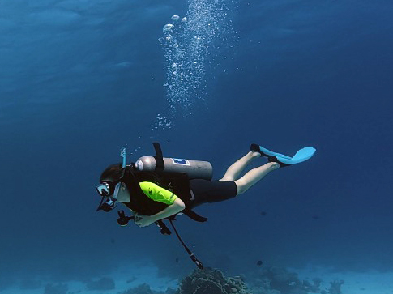
    </a>
</div>

Hi! I’m Nils, and I’m 17 years old. I enjoy coding and solving technical problems. In my free time, I like scuba diving and exploring the underwater world. During winter, I often go skiing, and I’m also a big fan of cats.

For our WRO project, I’m responsible for developing the robot’s software and making sure it runs as intended. It can be challenging at times, but it’s very rewarding when everything works as planned!

## **Olivia Greilich**

<div align="center">
    <a href="img/olivia.jpg" target="_blank">
        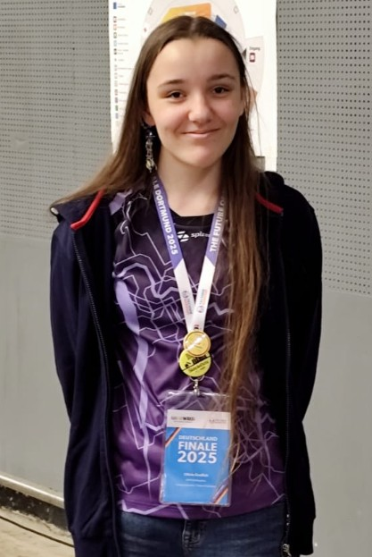
    </a>
</div>

Hello everyone! My name is Olivia Greilich and I'm 17, currently attending the Lise-Meitner Gymnasium in Anrath. Languages, communicating and connecting with people is my passion, same with painting, sculpting and crocheting!
One interesting fact about me is that I am simply enamored with jellyfish of all types, colors, shapes and sizes. I have two jellyfish lamps, tons of stickers, books and of course a phone charm.
In my free time, I usually occupy myself with writing fanfiction on Archive Of Our Own (AO3).

My part of the team effort is the documentation and images you'll see below.

## **Anton Wiesen**

<div align="center">
    <a href="img/Einstellung_Lenkung.jpg" target="_blank">
        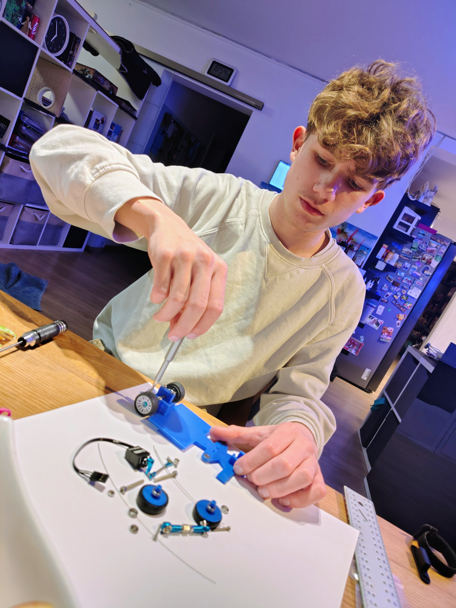
    </a>
</div>

Hello! My name is Anton Wiesen, and I am 16 years old. I am responsible for the mechanical design of the robot and its technical components. My interests mainly lie in designing and building technology for robots. I am also quite experienced with 3D modelling software such as Fusion 360. In my free time, I like hanging out with friends and playing badminton at a sports club.


## **Team photo**

<div align="center">
    <a href="img/team.png" target="_blank">
        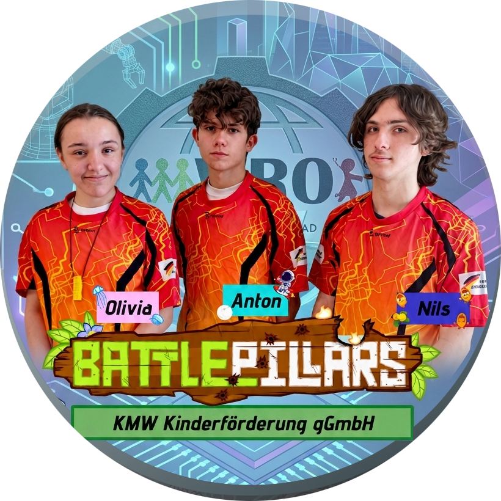
    </a>
</div>
<br>


# **Videos of the robot**

The following videos show the vehicle operating autonomously, one video per run:

| Run | Link |
|---|---|
| Open Challenge | [](https://youtu.be/xgsjbz8JtRs?is=9g74XXmeAL3ZztfQ) |
| Obstacle Challenge | [](https://youtu.be/dZyoW23Dgi8?is=IOlfB-I18UwgznLK) |


<br><br>

# **Mobility and mechanics**

## **Development goal**
In the 2025 season, we already successfully competed in the Future Engineers category and achieved the highest possible score in both runs at the World Final. 
<br><br>
**The goal for the 2026 season** was no longer just to reliably achieve the maximum score, but to complete the **course in the shortest possible time**. This led to three central mechanical development goals: a smaller and lighter chassis, a faster and more efficient drivetrain, and more precise steering. These goals led to a complete redesign of the chassis, drivetrain, front axle, and electronics layout.
<br><br>
The smaller form factor was meant to bring several advantages: the small size of the car allows for smaller turning radii and therefore higher agility. In addition, during the obstacle challenge, the car has more clearance to obstacles when passing through narrow sections, which makes driving more fault-tolerant and allows for higher speeds.

#### Figure 1: Comparison of the 2025 and 2026 robot designs:

<div align="center">
    <a href="img/vergleich_roboter.png" target="_blank">
        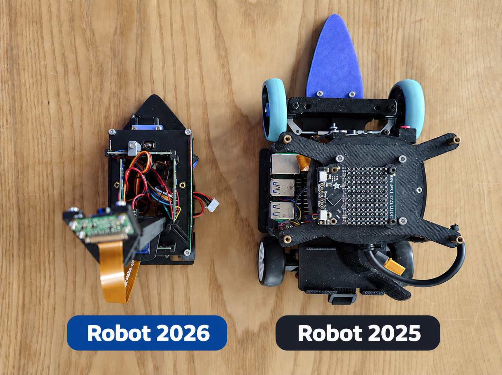
    </a>
</div>

<br>

## **Chassis and mechanical structure**

### **Chassis design**
The **chassis** was designed in Fusion 360. During development, **plain PLA** was used as filament since it is inexpensive and easy to print. However, the motor mount in PLA did not work reliably, since PLA creeps (deforms under constant pressure), which caused the gear backlash at the motor to drift out of tolerance.
<br><br>
In the final version, the chassis was manufactured from **PPA-CF filament**. PPA-CF is significantly stiffer and does not creep. As a result, the angles of the camera and sensors no longer change due to chassis flex. This improves the reproducibility of the sensor data and provides more consistent readings over the entire run.
<br><br>
However, this created a new problem. If the suspension was not exactly the same height on all sides, or the base deck was slightly warped, a wheel would hover slightly off the ground due to the extreme stiffness of the material and spin freely. In the previous PLA versions, this issue was compensated for by the springy properties of the material. Since we did not want to give up the positive properties of PPA-CF filament with respect to sensor data, we heated the base deck with a heat gun and carefully bent it until all wheels had good ground contact.

#### Table 1: Mechanical iterations in the chassis design:

<table align="center" border="1" style="border-collapse: collapse; border: 2px solid black; margin: 12px 0;">
  <tr>
    <th bgcolor="#4A90C2" style="border: 1px solid black; border-bottom: 3px solid black; padding: 8px; color: white;">Starting version</th>
    <th bgcolor="#4A90C2" style="border: 1px solid black; border-bottom: 3px solid black; padding: 8px; color: white;">Problem</th>
    <th bgcolor="#4A90C2" style="border: 1px solid black; border-bottom: 3px solid black; padding: 8px; color: white;">Observation before</th>
    <th bgcolor="#4A90C2" style="border: 1px solid black; border-bottom: 3px solid black; padding: 8px; color: white;">Change</th>
    <th bgcolor="#4A90C2" style="border: 1px solid black; border-bottom: 3px solid black; padding: 8px; color: white;">Observation after</th>
    <th bgcolor="#4A90C2" style="border: 1px solid black; border-bottom: 3px solid black; padding: 8px; color: white;">Decision</th>
  </tr>
  <tr>
    <td bgcolor="#EAF4FB" style="border: 1px solid black; padding: 8px;">Chassis made of PLA</td>
    <td bgcolor="#EAF4FB" style="border: 1px solid black; padding: 8px;">Motor mount deformed under continuous load, gear backlash drifted out of tolerance</td>
    <td bgcolor="#EAF4FB" style="border: 1px solid black; padding: 8px;">Backlash changed measurably after a few runs (creep), motor ran roughly</td>
    <td bgcolor="#EAF4FB" style="border: 1px solid black; padding: 8px;">Switched filament to PPA-CF</td>
    <td bgcolor="#EAF4FB" style="border: 1px solid black; padding: 8px;">Gear backlash constant, but new problem: wheel hovers slightly off the ground because base deck is too stiff</td>
    <td bgcolor="#EAF4FB" style="border: 1px solid black; padding: 8px;"><b>PPA-CF kept; new problem solved by manually rebending the base deck</b></td>
  </tr>
</table>
<br>

### **Base deck iteration**

At the start, the **base deck** consisted only of a simple rectangle. This first version served to roughly position the most important mechanical components and estimate the required footprint. The dimensions of the rear axle with ball differential, which we purchased as a pre-assembled unit with a fixed rear axle and wheel hubs, served as the initial reference point. This determined the wheelbase and thus the width of the base deck. The length of the base deck, on the other hand, was dictated by the dimensions of our self-developed PCB, since this was the largest component by area and was installed lengthwise in the chassis. For the rear axle we used a ball differential from the model-making sector, since a differential of this size is difficult to print reliably. The base deck was then gradually adapted to the actual mechanical requirements. During this process, more than fifteen versions of the base deck were created and printed until the final version was completed with all necessary cutouts, mounting points, and adaptations for the axles, wheels, sensors, and electronics. A total of ten ball bearings were used for the steering and suspension.

#### Figure 2: Iterations of the base deck:

<div align="center">
    <a href="img/iterationen_bodenplatte_eng.png" target="_blank">
        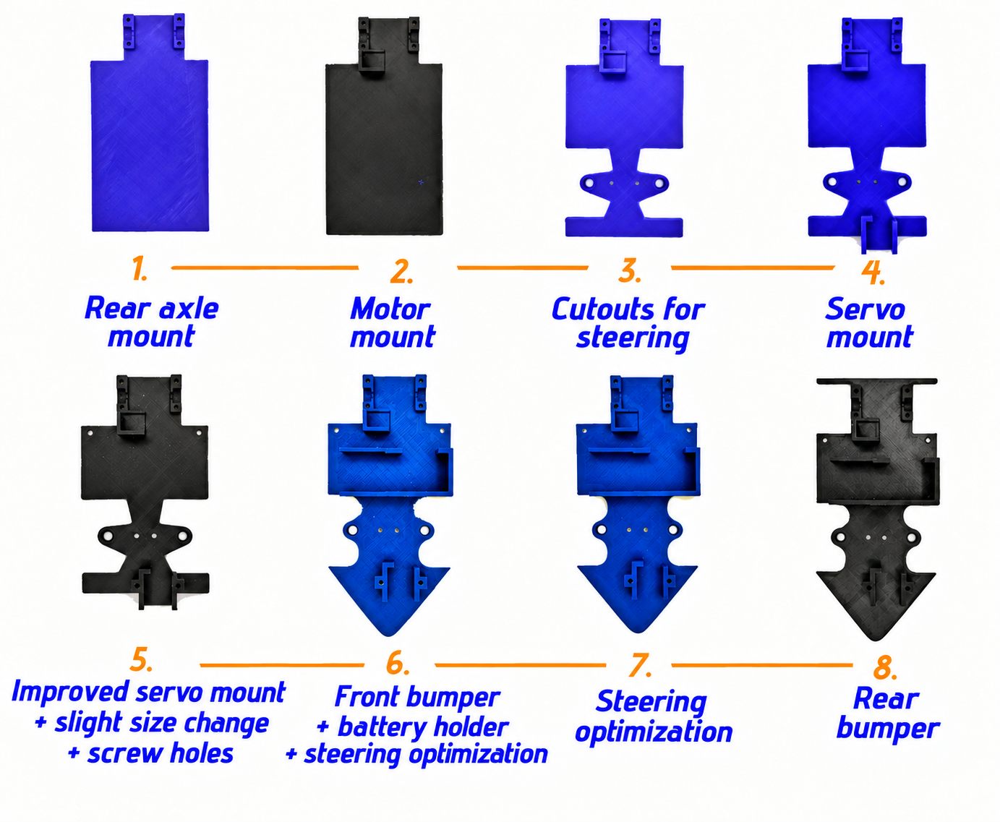
    </a>
</div>

### **Chassis structure**

The **chassis is split into three levels**, allowing a compact and clear integration of all components: 
<br>
<li>The base deck carries the drivetrain, battery, differential, and steering.</li>
<li>The middle deck houses the PCB, the Raspberry Pi CM5, the gyroscope, and the microcontroller.
<li>The top deck contains the camera and the ToF sensors.</li>
<br>

The finished vehicle with all components (PCB, battery, Raspberry Pi CM5, sensors, camera) has a **total weight of approx. 400 g**. 
<br>
#### Figure 3: Structure of the robot:

<div align="center">
    <a href="img/ebenen.jpg" target="_blank">
        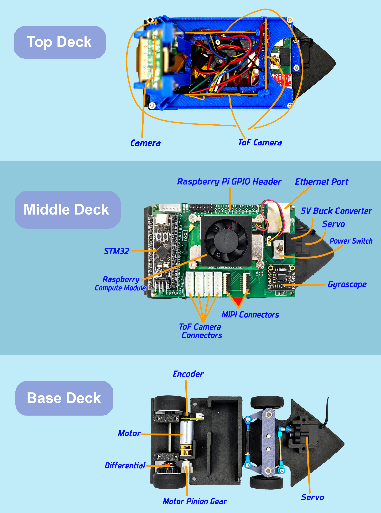
    </a>
</div>


## **Drivetrain concept and motor selection**

Our goal was to **drive one lap in about 10 seconds** – a race consists of three laps, which we therefore wanted to complete in about 30 seconds. The WRO track has a lap circumference (depending on the track layout) of about 8 m. This results in a required target speed of 8 m / 10 s = 0.8 m/s. However, we cannot drive at full speed permanently. Time is needed for acceleration and braking and for slower cornering. In addition, time is lost for parking and obstacle detection. These factors are hard to calculate, so we estimated a target speed of **2 m/s as the maximum speed** for our car.
<br><br>
Based on the chosen wheels (diameter approx. 27 mm, circumference approx. 84.8 mm), the wheel needs to complete about 23.7 revolutions per second (= 1410 RPM). To achieve the required wheel speed of about 1410 RPM, the gearbox output of the motor must deliver a **speed** of about 3384 RPM, due to the external gear ratio of 2.44:1. That is the first requirement for the motor.
<br><br>
The second requirement concerns **torque**. A motor must not only reach a high speed, but also deliver enough torque to reliably accelerate the vehicle under real conditions. We estimated the required torque based on the vehicle weight of approx. 450 g. Assuming a rolling friction coefficient of 0.05 and a wheel radius of 13.5 mm, this results in:
<br>
<table align="center" width="100%" cellpadding="8" cellspacing="0" border="0"><tr><td bgcolor="#B8D8EE" align="center">
Rolling resistance force: F<sub>roll</sub> = 0.45 kg × 9.81 m/s² × 0.05 ≈ 0.22 N<br>
Torque at the wheel: M<sub>wheel</sub> = 0.22 N × 0.0135 m ≈ 3.0 mNm
</td></tr></table>

Working backward through the external gear ratio, the motor must deliver at least 3.0 / 2.44 ≈ 1.2 mNm of torque, plus reserve for cornering and acceleration.

To find a suitable motor, we bought several small motors of the N20/N30 class that, according to their datasheets, promise high speeds at reasonable torque, and tested these directly in the vehicle. For this we wrote a **test program** that calculates the driving speed via the encoder on the motor. The STM32 reads a quadrature encoder and calculates the rotational speed. The encoder count is converted into a driving speed using the empirically calibrated factor: 

<table align="center" width="100%" cellpadding="8" cellspacing="0" border="0"><tr><td bgcolor="#B8D8EE" align="center">
v [m/s] = encoder count × 30 / (5.165 × 1000)</td></tr></table>

The factor 5.165 was determined from reference measurements over known distances.

 #### Table 2: Comparison of tested motors

<table align="center" border="1" style="border-collapse: collapse; border: 2px solid black;">

  <!-- Table header -->
  <tr>
    <th bgcolor="#4A90C2" width="120" style="border: 1px solid black; border-bottom: 3px solid black; padding: 8px; color: white;">Motor</th>
    <th bgcolor="#4A90C2" width="160" style="border: 1px solid black; border-bottom: 3px solid black; padding: 8px; color: white;">No-load speed<br>(datasheet)</th>
    <th bgcolor="#4A90C2" width="160" style="border: 1px solid black; border-bottom: 3px solid black; padding: 8px; color: white;">Rated torque<br>(datasheet)</th>
    <th bgcolor="#4A90C2" width="160" style="border: 1px solid black; border-bottom: 3px solid black; padding: 8px; color: white;">Measured<br>speed</th>
    <th bgcolor="#4A90C2" width="260" style="border: 1px solid black; border-bottom: 3px solid black; padding: 8px; color: white;">Observations</th>
    <th bgcolor="#4A90C2" width="120" style="border: 1px solid black; border-bottom: 3px solid black; padding: 8px; color: white;">Decision</th>
  </tr>

  <!-- N20 6V 600 rpm -->
  <tr>
    <td bgcolor="#EAF4FB" style="border: 1px solid black; padding: 8px;"><b>N20 6V<br>600 rpm</b></td>
    <td bgcolor="#EAF4FB" style="border: 1px solid black; padding: 8px; text-align: center;">600 rpm</td>
    <td bgcolor="#EAF4FB" style="border: 1px solid black; padding: 8px; text-align: center;">approx. 5 mNm</td>
    <td bgcolor="#EAF4FB" style="border: 1px solid black; padding: 8px; text-align: center;">approx. 0.7 m/s</td>
    <td bgcolor="#EAF4FB" style="border: 1px solid black; padding: 8px;">
      • too slow<br>
      • torque sufficient
    </td>
    <td bgcolor="#EAF4FB" style="border: 1px solid black; padding: 8px; text-align: center;">rejected</td>
  </tr>

  <!-- N20 6V 1500 rpm -->
  <tr>
    <td style="border: 1px solid black; padding: 8px;"><b>N20 6V<br>1500 rpm</b></td>
    <td style="border: 1px solid black; padding: 8px; text-align: center;">1500 rpm</td>
    <td style="border: 1px solid black; padding: 8px; text-align: center;">approx. 2 mNm</td>
    <td style="border: 1px solid black; padding: 8px; text-align: center;">approx. 1.5 m/s</td>
    <td style="border: 1px solid black; padding: 8px;">
      • motor gets very hot<br>
      • torque too low
    </td>
    <td style="border: 1px solid black; padding: 8px; text-align: center;">rejected</td>
  </tr>

  <!-- N30 6V 500 rpm -->
  <tr>
    <td bgcolor="#EAF4FB" style="border: 1px solid black; padding: 8px;"><b>N30 6V<br>500 rpm</b></td>
    <td bgcolor="#EAF4FB" style="border: 1px solid black; padding: 8px; text-align: center;">500 rpm</td>
    <td bgcolor="#EAF4FB" style="border: 1px solid black; padding: 8px; text-align: center;">approx. 9 mNm</td>
    <td bgcolor="#EAF4FB" style="border: 1px solid black; padding: 8px; text-align: center;">approx. 0.8 m/s</td>
    <td bgcolor="#EAF4FB" style="border: 1px solid black; padding: 8px;">
      • high torque<br>
      • speed too low
    </td>
    <td bgcolor="#EAF4FB" style="border: 1px solid black; padding: 8px; text-align: center;">rejected</td>
  </tr>

  <!-- N30 6V 1500 rpm – chosen motor -->
  <tr>
    <td style="border: 1px solid black; border-top: 3px solid black; padding: 8px;"><b>N30 6V<br>1500 rpm</b></td>
    <td style="border: 1px solid black; border-top: 3px solid black; padding: 8px; text-align: center;">1500 rpm</td>
    <td style="border: 1px solid black; border-top: 3px solid black; padding: 8px; text-align: center;">approx. 3 mNm</td>
    <td style="border: 1px solid black; border-top: 3px solid black; padding: 8px; text-align: center;"><b>approx. 2.1 m/s</b></td>
    <td style="border: 1px solid black; border-top: 3px solid black; padding: 8px;">
      • best speed
    </td>
    <td style="border: 1px solid black; border-top: 3px solid black; padding: 8px; text-align: center;"><b>used</b></td>
  </tr>

</table>


We chose the **N30 6V 1500 rpm**, since it achieved the highest real speed in the vehicle at approx. 2 m/s. Its rated torque of approx. 3 mNm is above the calculated minimum requirement of 1.2 mNm and provides sufficient reserve. According to the datasheet it reaches 1500 RPM at 6 V; scaled up to the operating voltage of 11.1 V (3S LiPo), this results in an extrapolated no-load speed of approx. 2775 RPM.  


## **Rear axle and differential**
#### Figure 4: Structure of the rear axle:
<div align="center">
    <a href="img/hinterachse.jpeg" target="_blank">
        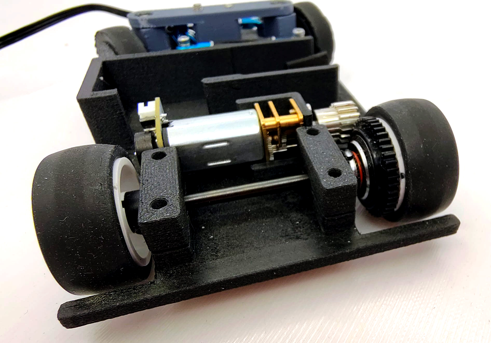
    </a>
</div>

The motor does not drive the rear wheels directly. Instead, we use a **ball differential** on the rear axle. This ball differential was procured as an assembly together with the corresponding Mini-Z wheel hubs and rear wheel rims. Therefore, we use the **Mini-Z rims** that belong to the system on the rear axle, since they are directly compatible with the differential without additional adapters. We use Mini-Z tires on all four wheels.

The N30 motor used is a geared motor with an internal ratio of 10:1. In addition, an external gear pair transmits the power to the rear axle: the drive pinion at the motor output has 18 teeth, the differential gear has 44 teeth, corresponding to a second ratio of 2.44:1. Both figures (10:1 and 2.44:1) are noted in the same power-flow direction motor → gearbox → axle. Overall, this results in a **total reduction** of about 24.4:1 (10:1 × 2.44:1) between the actual electric motor and the rear axle. 

The **rated torque** of the N30 motor is approx. 3 mNm according to the datasheet, after the internal ratio. This is a calculated, not a measured value: scaled up with the external ratio of 2.44:1, this results in an available torque of 3 mNm × 2.44 ≈ 7.3 mNm at the rear axle. 	

The **design** of the rear axle was carried out in Fusion 360 based on the ball differential. One challenge was that both the motor mount and the differential mount had to be manufactured mechanically precisely, so that the gear backlash between the motor pinion and the differential gear was correct. This was practically impossible to achieve by measuring and designing alone, since the dimensional accuracy of the printed parts was not high enough. So the correct distance was determined experimentally by changing the design parameters and reprinting the base deck until it fit. 

#### Table 3: Mechanical iterations in the rear axle design:

<table align="center" border="1" style="border-collapse: collapse; border: 2px solid black; margin: 12px 0;">
  <tr>
    <th bgcolor="#4A90C2" style="border: 1px solid black; border-bottom: 3px solid black; padding: 8px; color: white;">Starting version</th>
    <th bgcolor="#4A90C2" style="border: 1px solid black; border-bottom: 3px solid black; padding: 8px; color: white;">Problem</th>
    <th bgcolor="#4A90C2" style="border: 1px solid black; border-bottom: 3px solid black; padding: 8px; color: white;">Observation before</th>
    <th bgcolor="#4A90C2" style="border: 1px solid black; border-bottom: 3px solid black; padding: 8px; color: white;">Change</th>
    <th bgcolor="#4A90C2" style="border: 1px solid black; border-bottom: 3px solid black; padding: 8px; color: white;">Observation after</th>
    <th bgcolor="#4A90C2" style="border: 1px solid black; border-bottom: 3px solid black; padding: 8px; color: white;">Decision</th>
  </tr>
  <tr>
    <td bgcolor="#EAF4FB" style="border: 1px solid black; padding: 8px;">Calculated nominal distance, base deck version 1</td>
    <td bgcolor="#EAF4FB" style="border: 1px solid black; padding: 8px;">Gear backlash between motor pinion/differential could not be hit purely by calculation (print tolerances)</td>
    <td bgcolor="#EAF4FB" style="border: 1px solid black; padding: 8px;">Gearbox ran roughly, occasionally jammed/rattled</td>
    <td bgcolor="#EAF4FB" style="border: 1px solid black; padding: 8px;">Distance narrowed (1st tightening)</td>
    <td bgcolor="#EAF4FB" style="border: 1px solid black; padding: 8px;">Still rattling/backlash noticeable</td>
    <td bgcolor="#EAF4FB" style="border: 1px solid black; padding: 8px;">Narrow further</td>
  </tr>
  <tr>
    <td bgcolor="#EAF4FB" style="border: 1px solid black; padding: 8px;">Base deck after 1st tightening</td>
    <td bgcolor="#EAF4FB" style="border: 1px solid black; padding: 8px;">Backlash still too large</td>
    <td bgcolor="#EAF4FB" style="border: 1px solid black; padding: 8px;">Rattling reduced but still present</td>
    <td bgcolor="#EAF4FB" style="border: 1px solid black; padding: 8px;">Distance narrowed again (2nd tightening)</td>
    <td bgcolor="#EAF4FB" style="border: 1px solid black; padding: 8px;">Rattling nearly gone, but running slightly less smooth</td>
    <td bgcolor="#EAF4FB" style="border: 1px solid black; padding: 8px;">Narrow further</td>
  </tr>
  <tr>
    <td bgcolor="#EAF4FB" style="border: 1px solid black; padding: 8px;">Base deck after 2nd tightening</td>
    <td bgcolor="#EAF4FB" style="border: 1px solid black; padding: 8px;">Distance still not minimal enough</td>
    <td bgcolor="#EAF4FB" style="border: 1px solid black; padding: 8px;">Slight resistance in the gear mesh</td>
    <td bgcolor="#EAF4FB" style="border: 1px solid black; padding: 8px;">Distance narrowed a third time (3rd tightening)</td>
    <td bgcolor="#EAF4FB" style="border: 1px solid black; padding: 8px;">Gearbox now too tight, occasionally jammed/bound</td>
    <td bgcolor="#EAF4FB" style="border: 1px solid black; padding: 8px;">Widen again</td>
  </tr>
  <tr>
    <td bgcolor="#EAF4FB" style="border: 1px solid black; padding: 8px;">Base deck after 3rd tightening</td>
    <td bgcolor="#EAF4FB" style="border: 1px solid black; padding: 8px;">Distance too small, gearbox binding</td>
    <td bgcolor="#EAF4FB" style="border: 1px solid black; padding: 8px;">Gearbox occasionally jammed/bound</td>
    <td bgcolor="#EAF4FB" style="border: 1px solid black; padding: 8px;">Distance widened again slightly</td>
    <td bgcolor="#EAF4FB" style="border: 1px solid black; padding: 8px;">Quiet, smooth running without rattling/jamming</td>
    <td bgcolor="#EAF4FB" style="border: 1px solid black; padding: 8px;"><b>Final base-deck geometry adopted</b></td>
  </tr>
</table>

## **Front axle and steering**

### Ackermann condition in our steering
For the front axle, as in the previous year, we chose **Ackermann steering**. With simple parallel steering, both front wheels turn by the same angle – in corners this leads to lateral slip, because the inner wheel travels a smaller radius than the outer wheel and would therefore need to turn in more. Ackermann steering solves this problem by designing the steering geometry so that the extended wheel axes of both front wheels intersect at a common point on the extension of the rear axle. The ideal condition for this is:

<table align="center" width="100%" cellpadding="8" cellspacing="0" border="0"><tr><td bgcolor="#B8D8EE" align="center">cot(δ<sub>outer</sub>) − cot(δ<sub>inner</sub>) = track width t / wheelbase L</td></tr></table>

With our track width t = 65 mm and wheelbase L = 80 mm, this results in a **target value of t/L = 0.81.**

Since no suitable off-the-shelf parts were available for our compact form factor, we designed the entire front axle ourselves in Fusion 360 and tested various steering geometry variants via 3D printing. 

#### Figure 5: Adjusting the steering geometry:
<div align="center">
    <a href="img/Einstellung_Lenkung2.jpg" target="_blank">
        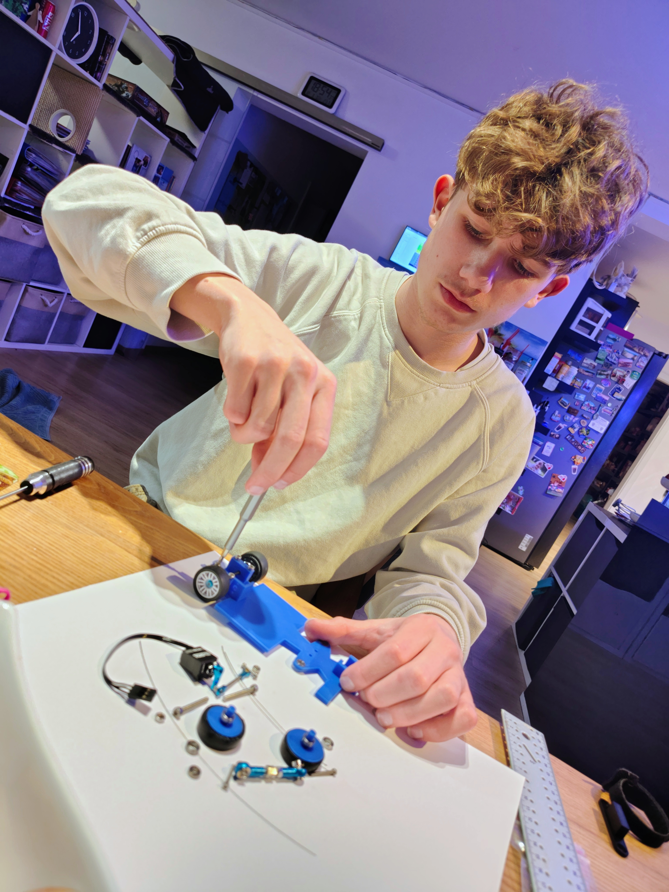
    </a>
</div>

#### Figure 6: Experimental validation of the Ackermann steering geometry using different steering angles and driving curves
<div align="center">
    <a href="img/ackermann_radien.jpg" target="_blank">
        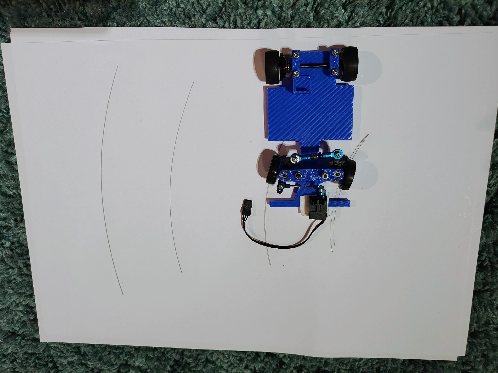
    </a>
</div>

At maximum steering lock, the inner wheel reaches 45° and the outer wheel 35°, which gives:

<table align="center" width="100%" cellpadding="8" cellspacing="0" border="0"><tr><td bgcolor="#B8D8EE" align="center">
cot(35°) − cot(45°) = 1.43 − 1.00 = 0.43
</td></tr></table>

The achieved value of 0.43 is clearly below the ideal value of 0.81. With an unchanged outer angle of 35°, the inner wheel would theoretically need to reach about 58.5° to fully satisfy the Ackermann condition. However, this is not mechanically possible, since the inner wheel is already at its mechanical stop at 45° and a larger angle would exceed the available installation space. Alternatively, with an unchanged inner angle of 45°, the outer angle would need to be reduced to about 29°, which would reduce how sharply the car could turn. The steering therefore only partially satisfies the ideal Ackermann condition. As a result, the extended wheel axes of the front wheels do not intersect exactly at a common turning center, which can more easily cause lateral slip at the front wheels in tight corners:
#### Figure 7: Ackermann condition in our steering:
<div align="center">
    <a href="img/ackermann_englisch.png" target="_blank">
        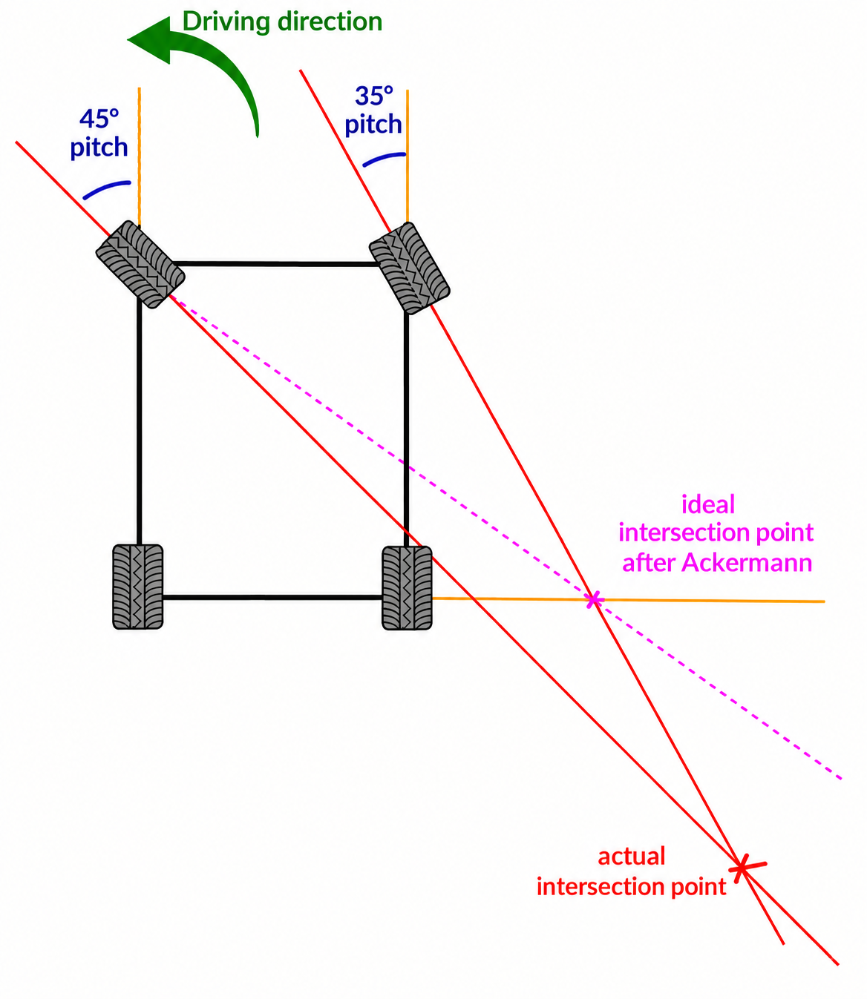
    </a>
</div>

The minimum turning radius (measured from the center of the rear axle to the center of the curve) is calculated as follows:

<table align="center" width="100%" cellpadding="8" cellspacing="0" border="0"><tr><td bgcolor="#B8D8EE" align="center">
Minimum turning radius = wheelbase / tan(δ<sub>outer</sub>)
</td></tr></table>

We had not set an exact target turning radius in advance, only the **requirement for the highest possible agility**. For reference: with the alternative possible outer angle of 29° (with an unchanged inner angle of 45°, see above), the minimum turning radius would have been 80 mm / tan(29°) ≈ 144 mm, compared to 114 mm with our actually chosen outer angle of 35°. Even 144 mm would still have been sufficient for the requirements of the WRO track, but would have noticeably reduced agility. We therefore deliberately chose the larger outer angle of 35° and thus decided against fully satisfying the Ackermann condition.


#### Table 4: Steering geometry trade-off – Ackermann compliance vs. agility:

<table align="center" border="1" style="border-collapse: collapse; border: 2px solid black; margin: 12px 0;">
  <tr>
    <th bgcolor="#4A90C2" style="border: 1px solid black; border-bottom: 3px solid black; padding: 8px; color: white;">Criterion</th>
    <th bgcolor="#4A90C2" style="border: 1px solid black; border-bottom: 3px solid black; padding: 8px; color: white;">Ideal Ackermann design</th>
    <th bgcolor="#4A90C2" style="border: 1px solid black; border-bottom: 3px solid black; padding: 8px; color: white;">Variant A:<br>optimal possible Ackermann compliance</th>
    <th bgcolor="#4A90C2" style="border: 1px solid black; border-bottom: 3px solid black; padding: 8px; color: white;">Variant B:<br>higher agility (chosen)</th>
  </tr>
  <tr>
    <td bgcolor="#EAF4FB" style="border: 1px solid black; padding: 8px;"><b>Outer angle δ<sub>outer</sub></b></td>
    <td bgcolor="#EAF4FB" style="border: 1px solid black; padding: 8px; text-align: center;">35°</td>
    <td bgcolor="#EAF4FB" style="border: 1px solid black; padding: 8px; text-align: center;">29°</td>
    <td style="border: 1px solid black; padding: 8px; text-align: center;"><b>35°</b></td>
  </tr>
  <tr>
    <td bgcolor="#EAF4FB" style="border: 1px solid black; padding: 8px;"><b>Inner angle δ<sub>inner</sub></b></td>
    <td bgcolor="#EAF4FB" style="border: 1px solid black; padding: 8px; text-align: center;">58.5°</td>
    <td bgcolor="#EAF4FB" style="border: 1px solid black; padding: 8px; text-align: center;">45° (mechanical cap)</td>
    <td style="border: 1px solid black; padding: 8px; text-align: center;"><b>45° (mechanical cap)</b></td>
  </tr>
  <tr>
    <td bgcolor="#EAF4FB" style="border: 1px solid black; padding: 8px;"><b>Ackermann figure<br>cot δ<sub>outer</sub> − cot δ<sub>inner</sub></b></td>
    <td bgcolor="#EAF4FB" style="border: 1px solid black; padding: 8px; text-align: center;">t/L = 0.81</td>
    <td bgcolor="#EAF4FB" style="border: 1px solid black; padding: 8px; text-align: center;">cot(29°) - cot(45°) = 0.80</td>
    <td style="border: 1px solid black; padding: 8px; text-align: center;"><b>0.43</b></td>
  </tr>
  <tr>
    <td bgcolor="#EAF4FB" style="border: 1px solid black; padding: 8px;"><b>Minimum turning radius</b></td>
    <td bgcolor="#EAF4FB" style="border: 1px solid black; padding: 8px; text-align: center;">n/a</td>
    <td bgcolor="#EAF4FB" style="border: 1px solid black; padding: 8px; text-align: center;">≈ 144 mm</td>
    <td style="border: 1px solid black; padding: 8px; text-align: center;"><b>≈ 114 mm</b></td>
  </tr>
  <tr>
    <td bgcolor="#EAF4FB" style="border: 1px solid black; padding: 8px;"><b>Agility</b></td>
    <td bgcolor="#EAF4FB" style="border: 1px solid black; padding: 8px; text-align: center;">n/a</td>
    <td bgcolor="#EAF4FB" style="border: 1px solid black; padding: 8px; text-align: center;">lower</td>
    <td style="border: 1px solid black; padding: 8px; text-align: center;"><b>higher</b></td>
  </tr>
  <tr>
    <td bgcolor="#EAF4FB" style="border: 1px solid black; border-top: 3px solid black; padding: 8px;"><b>Decision</b></td>
    <td bgcolor="#EAF4FB" style="border: 1px solid black; border-top: 3px solid black; padding: 8px; text-align: center;">not achievable by design</td>
    <td bgcolor="#EAF4FB" style="border: 1px solid black; border-top: 3px solid black; padding: 8px; text-align: center;">rejected</td>
    <td style="border: 1px solid black; border-top: 3px solid black; padding: 8px; text-align: center;"><b>chosen</b></td>
  </tr>
</table>


### Mechanical precision of our steering
However, in addition to the steering geometry, the **mechanical precision of the bearings** is also crucial for whether the calculated angles are actually reproducible during driving. Last year, our car only had one ball bearing per wheel. The steering knuckles were held in plain bearings. As a result, the wheels had noticeable lateral play (about 0.8 mm at the top edge of the wheel, see table) and wobbled back and forth. To minimize steering play, we used a total of eight ball bearings for the front axle bearings. Two per side support the steering knuckles, another two per side support the wheels. These ball bearings ensure precise steering with little play as well as low rolling resistance.

#### Table 5: Mechanical iterations in the front axle bearing:

<table align="center" border="1" style="border-collapse: collapse; border: 2px solid black; margin: 12px 0;">
  <tr>
    <th bgcolor="#4A90C2" style="border: 1px solid black; border-bottom: 3px solid black; padding: 8px; color: white;">Starting version</th>
    <th bgcolor="#4A90C2" style="border: 1px solid black; border-bottom: 3px solid black; padding: 8px; color: white;">Problem</th>
    <th bgcolor="#4A90C2" style="border: 1px solid black; border-bottom: 3px solid black; padding: 8px; color: white;">Measured value before</th>
    <th bgcolor="#4A90C2" style="border: 1px solid black; border-bottom: 3px solid black; padding: 8px; color: white;">Change</th>
    <th bgcolor="#4A90C2" style="border: 1px solid black; border-bottom: 3px solid black; padding: 8px; color: white;">Measured value after</th>
    <th bgcolor="#4A90C2" style="border: 1px solid black; border-bottom: 3px solid black; padding: 8px; color: white;">Decision</th>
  </tr>
  <tr>
    <td bgcolor="#EAF4FB" style="border: 1px solid black; padding: 8px;">Plain-bearing steering knuckles + 1 ball bearing/wheel (2025 season)</td>
    <td bgcolor="#EAF4FB" style="border: 1px solid black; padding: 8px;">Front wheels had lateral play, steering angle not reproducible while driving</td>
    <td bgcolor="#EAF4FB" style="border: 1px solid black; padding: 8px;">≈ 0.8 mm (corresponds to ≈ 2.5° tilt play)</td>
    <td bgcolor="#EAF4FB" style="border: 1px solid black; padding: 8px;">Switched to 8 ball bearings (2× steering knuckle + 2× wheel per side)</td>
    <td bgcolor="#EAF4FB" style="border: 1px solid black; padding: 8px;">&lt; 0.1 mm (no longer noticeable)</td>
    <td bgcolor="#EAF4FB" style="border: 1px solid black; padding: 8px;"><b>8-ball-bearing solution adopted</b></td>
  </tr>
</table>

<sub><b>Measurement method (lateral wheel play):</b> Vehicle fixed, wheel aligned straight. The wheel is pushed by hand (without tools) alternately inward and outward at the top edge until the noticeable play limit is reached. The total lateral deflection at the top edge of the wheel is measured with a caliper against a fixed reference point. The conversion to a tilt angle is done via the wheel radius (≈ 18 mm): angle = arctan(deflection / wheel radius). The average of n = 5 measurements is given.</sub>

#### Figure 8: Cross-section of the front axle (top: angled cut, bottom: straight cut):
<div align="center">
    <a href="img/schnitt schraeg.png" target="_blank">
        
    </a>
    <br><sub>Angled cut: the four ball bearings per steering-knuckle side (marked in red) are visible, which support the steering knuckle (steering motion).</sub>
</div>
<br><br>
<div align="center">
    <a href="img/schnitt_gerade_eng.png" target="_blank">
      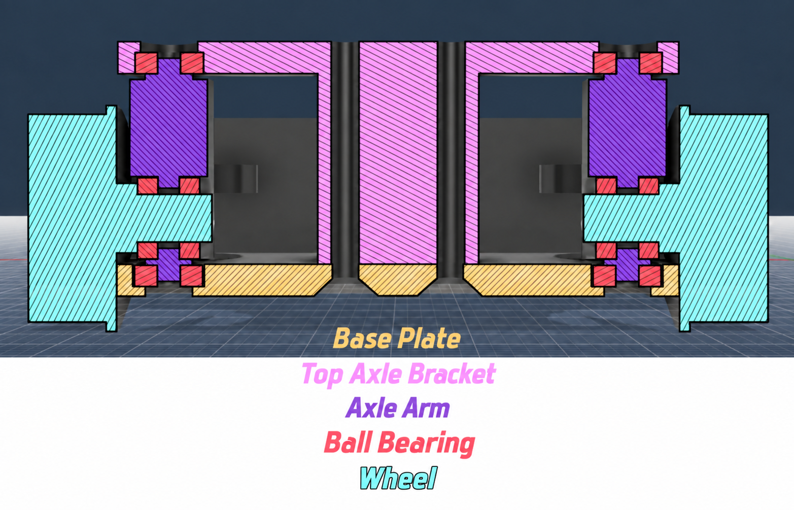
    </a>
    <br><sub>Straight cut: the ball bearings of the wheel suspension (wheel axle) are visible, in addition to the steering-knuckle bearings in the left image.</sub>
</div>
<br>

### Front axle rims and tires
Since the front axle was fully designed by us, we do not use Mini-Z rims there, but **our own 3D-printed rims**. These were dimensioned so that the same Mini-Z tires used on the rear axle could be mounted on them. This means that all four wheels use the same tire type, while the rims are each adapted to the design of the front or rear axle respectively.

## **Servo selection and position**

### Servo selection
When **selecting** the steering servo, besides the size, quick availability was the main deciding factor. Initially, a particularly compact and inexpensive servo (approx. €2) with an all-plastic gearbox was used. However, the pronounced steering play of about 5° (measured, see table) proved insufficient for precise control, which is why the **INJORA N30 Nano** with a coreless motor, metal gearbox, and aluminum housing was chosen as a replacement. At 7 g and dimensions of 15.2 × 13.0 × 21.3 mm, it remains extremely compact; at 6 V it provides a torque of 1.3 kg·cm at an actuation speed of 0.05 s/60°. Since the force and reaction-time requirements in this application are low, almost any commercially available servo would have met the specification – the only decisive factor was the backlash-free metal gearbox.

#### Table 6: Mechanical iterations in the steering servo selection:

<table align="center" border="1" style="border-collapse: collapse; border: 2px solid black; margin: 12px 0;">
  <tr>
    <th bgcolor="#4A90C2" style="border: 1px solid black; border-bottom: 3px solid black; padding: 8px; color: white;">Starting version</th>
    <th bgcolor="#4A90C2" style="border: 1px solid black; border-bottom: 3px solid black; padding: 8px; color: white;">Problem</th>
    <th bgcolor="#4A90C2" style="border: 1px solid black; border-bottom: 3px solid black; padding: 8px; color: white;">Measured value before</th>
    <th bgcolor="#4A90C2" style="border: 1px solid black; border-bottom: 3px solid black; padding: 8px; color: white;">Change</th>
    <th bgcolor="#4A90C2" style="border: 1px solid black; border-bottom: 3px solid black; padding: 8px; color: white;">Measured value after</th>
    <th bgcolor="#4A90C2" style="border: 1px solid black; border-bottom: 3px solid black; padding: 8px; color: white;">Decision</th>
  </tr>
  <tr>
    <td bgcolor="#EAF4FB" style="border: 1px solid black; padding: 8px;">Compact servo with plastic gearbox (approx. €2)</td>
    <td bgcolor="#EAF4FB" style="border: 1px solid black; padding: 8px;">All-plastic gearbox showed noticeable steering play, leading to imprecise steering control</td>
    <td bgcolor="#EAF4FB" style="border: 1px solid black; padding: 8px;">≈ 5° (Δs ≈ 9 mm at r = 100 mm)</td>
    <td bgcolor="#EAF4FB" style="border: 1px solid black; padding: 8px;">Replaced with INJORA N30 Nano with metal gearbox</td>
    <td bgcolor="#EAF4FB" style="border: 1px solid black; padding: 8px;">≤ 1° (Δs ≤ 1.7 mm at r = 100 mm)</td>
    <td bgcolor="#EAF4FB" style="border: 1px solid black; padding: 8px;"><b>INJORA N30 Nano adopted</b></td>
  </tr>
</table>

<sub><b>Measurement method (steering play):</b> The servo is powered and actively holds the center position. A long, rigid pointer (e.g. a skewer, effective radius r = 100 mm) is attached to the steering arm/wheel. The wheel is pushed by hand with low force alternately in both directions until the noticeable play limit is reached, and the total lateral deflection Δs at the pointer tip is read against a fixed scale. The play angle results as angle = arctan(Δs / r). The average of n = 5 measurements is given.</sub>

### Servo position
The **positioning of the servo** presented an independent design challenge. The arrangement common in model vehicles – servo and linkage centered in the vehicle – was ruled out, because we needed a relatively short wheelbase for high agility and wanted to fit the battery between the front and rear wheels for a low center of gravity. After evaluating numerous configurations, the servo was moved in front of the front axle, with the linkage routed behind it. This allowed the bumper area to be used constructively without having to relocate the battery or the PCB; the center of gravity remained low and central, and the required steering lock was achieved without collisions.

<table width="100%" cellpadding="10" cellspacing="0" border="0"><tr><td bgcolor="#2E8B57" width="1%">&nbsp;</td><td bgcolor="#E2F3E5">
 <b>Result:</b> Ball-bearing front axle, metal-gear servo, and the new steering geometry together reduce the minimum turning radius from <b>172 mm to 114 mm</b> and eliminate noticeable steering play compared to the 2025 season.
</td></tr></table>

<br>

# **Power and sensors**

## **Concept**
To achieve the design goal of a small and fast vehicle, a fundamental overhaul of the electronics was necessary. The previous year's system used an RPLiDAR S2 for environment detection as well as two optical odometry sensors for position determination. Control was entirely coordinate-based – driving commands effectively read "go to coordinate X/Y". However, the LiDAR only provided ~10 updates per second with a delay of 100–200 ms, which meant position corrections only worked reliably while stationary. Odometry took over position tracking while driving, but limited the maximum speed to 0.5 m/s – above that, its measurements became unreliable.

For the new vehicle we therefore chose a fundamentally different approach: several **time-of-flight sensors** (VL53L8CX) continuously measure the distances to the walls at 30 Hz, enabling control without stopping. The control logic is now event-based – instead of "go to coordinate X/Y", a driving command now reads, for example, "drive toward the wall until the distance is 20 cm". Since no more stops are needed for position correction, the vehicle drives noticeably more smoothly and faster.

<table width="100%" cellpadding="10" cellspacing="0" border="0"><tr><td bgcolor="#2E8B57" width="1%">&nbsp;</td><td bgcolor="#E2F3E5">
 <b>Result:</b> The average time for a run in the obstacle challenge dropped from <b>160 s (2025)</b> to <b>35–45 s (2026)</b> – an improvement of about a factor of 4. The design goal of 30 s per run was thus narrowly missed.
</td></tr></table>
<br>

## **Electronics setup**

For the electronics, a test setup was first built on a **breadboard**. This allowed us to check whether the key components fundamentally worked before having our own PCB manufactured. Among other things, we tested the microcontroller, motor, motor encoder, motor driver, servo, time-of-flight sensors, and camera.

We developed the **PCB (baseboard)** ourselves using the open-source EDA tool **KiCad** (project files: <code>kicad/baseboard</code>). It is a two-layer PCB (2 copper layers) connected directly to the Raspberry Pi CM5 via a Hirose FH12-22S high-speed connector. It also carries the STM32F411, the voltage regulators, and the connectors for the motor, servo, gyroscope, and ToF sensors. The manufacturing files (Gerber data, bill of materials, position data) were exported with a KiCad fabrication-toolkit plugin (see <code>kicad/baseboard/production</code>); manufacturing and assembly were done externally. 

The complete electronics setup is shown in the wiring diagram below, which shows all connections between the baseboard, Raspberry Pi CM5, STM32, sensors, motor driver, and servo.

#### Figure 9: Wiring diagram

</div><div align="center">
    <a href="img/plan_gesamt%20Kopie.jpg" target="_blank">
        
    </a>
</div>


## **Camera: use of the camera and calibration**

### **Use of the camera** 
As in the previous year, we use the **Raspberry Pi Camera Module 3 Wide (12 MP)**, since it has proven itself.

Initially, the camera was mounted lower on the vehicle and the robot used a "scanning while driving" strategy. It drove to predefined positions and captured images of the course from there. However, reaching these positions took additional time and even small deviations in the robot's position could affect image recognition.

Three weeks before the regional competition in Germany, we therefore decided to mount the camera at a height of 27 cm – just below the maximum allowed height. From this position, the camera can see over the barriers and capture all relevant obstacles directly from the starting position.

This change – explained in detail later (cf. [Obstacle challenge driving strategy – strategy change](#obstacle-challenge-driving-strategy---strategy-change)) – enabled us to introduce a completely new full-scan strategy. Instead of scanning the course while driving, the robot now captures the required information before it starts moving. Based on this scan, the optimal route is calculated before the vehicle even sets off.

This approach makes obstacle detection considerably more demanding (cf. [mask pipeline](#mask-pipeline)), but simplifies the actual driving process significantly. Since the robot no longer needs to move to favorable camera positions during the run, valuable time can be saved.

<table width="100%" cellpadding="10" cellspacing="0" border="0"><tr><td bgcolor="#2E8B57" width="1%">&nbsp;</td><td bgcolor="#E2F3E5">
 <b>Result:</b> With the old <b>"scanning while driving"</b> strategy, we needed <b>56 s</b> on average per run, whereas the new <b>"full-scan strategy"</b> dropped this to only <b>38 s</b>.
</td></tr></table>

### **Further development: rotating camera tower**

Although the full-scan strategy significantly improved our driving time, the fixed camera still had limitations. A fixed viewing direction restricts the angles from which different areas of the course can be observed, making reliable obstacle detection more difficult in certain situations.

After the German national final in Trier, we therefore developed the system further for the **competition in Croatia**. Instead of using a fixed bracket, we mounted the **camera on a servo-driven, rotatable tower**.

The Raspberry Pi can now command the STM32 to rotate the tower to a specific angle (<code>setTowerAngle()</code> → <code>servo_tower</code> command). This allows the camera to be aimed precisely at different sections of the course instead of only looking straight ahead (cf. [Development milestones](#development-milestones)).

We expected this approach to improve the accuracy and reliability of obstacle detection, as the camera can actively select a suitable viewing angle for each relevant area rather than relying on a single fixed perspective.

<video src="https://github.com/Battlepillars/Wro26/raw/main/img/kamera_dreh.mp4" controls width="500"></video>

#### Video: First tests of the rotating camera


### **Calibration procedure**

The camera automatically calibrates its exposure time, white balance, and gain. Depending on the on-site lighting conditions, manual adjustments to the color masks in <code>cameraTower.py</code> may be necessary.

Before each competition run, we take a test image and check whether the obstacles are detected correctly. If they are not, we adjust the HSV values for the red and green masks. In OpenCV, the hue scale ranges from 0 to 179. Since red is the only color that appears at both ends of the scale, we create two separate masks to detect red and then combine them.

#### Table 7: HSV color masks and calibration parameters

<table align="center" border="1" style="border-collapse: collapse; border: 2px solid black;">

  <!-- Table header -->
  <tr>
    <th bgcolor="#4A90C2" width="120" style="border: 1px solid black; border-bottom: 3px solid black; padding: 8px; color: white;">Color</th>
    <th bgcolor="#4A90C2" width="140" style="border: 1px solid black; border-bottom: 3px solid black; padding: 8px; color: white;">H (min–max)</th>
    <th bgcolor="#4A90C2" width="140" style="border: 1px solid black; border-bottom: 3px solid black; padding: 8px; color: white;">S (min–max)</th>
    <th bgcolor="#4A90C2" width="140" style="border: 1px solid black; border-bottom: 3px solid black; padding: 8px; color: white;">V (min–max)</th>
    <th bgcolor="#4A90C2" width="400" style="border: 1px solid black; border-bottom: 3px solid black; padding: 8px; color: white;">Rationale</th>
  </tr>

  <!-- Red 1 -->
  <tr>
    <td bgcolor="#EAF4FB" style="border: 1px solid black; padding: 8px; text-align: center;"><b>Red 1</b></td>
    <td bgcolor="#EAF4FB" style="border: 1px solid black; padding: 8px; text-align: center;">0–10</td>
    <td bgcolor="#EAF4FB" style="border: 1px solid black; padding: 8px; text-align: center;">190–255</td>
    <td bgcolor="#EAF4FB" style="border: 1px solid black; padding: 8px; text-align: center;">190–255</td>
    <td bgcolor="#EAF4FB" style="border: 1px solid black; padding: 8px;">
      Rich, bright red (hue near 0°); high S and V thresholds filter out pale shades
    </td>
  </tr>

  <!-- Red 2 -->
  <tr>
    <td style="border: 1px solid black; padding: 8px; text-align: center;"><b>Red 2</b></td>
    <td style="border: 1px solid black; padding: 8px; text-align: center;">160–179</td>
    <td style="border: 1px solid black; padding: 8px; text-align: center;">100–255</td>
    <td style="border: 1px solid black; padding: 8px; text-align: center;">20–255</td>
    <td style="border: 1px solid black; padding: 8px;">
      Red at the upper hue end (wrap-around at 180°); wider S/V limits, since these red tones appear darker in the photo
    </td>
  </tr>

  <!-- Green -->
  <tr>
    <td bgcolor="#EAF4FB" style="border: 1px solid black; padding: 8px; text-align: center;"><b>Green</b></td>
    <td bgcolor="#EAF4FB" style="border: 1px solid black; padding: 8px; text-align: center;">35–95</td>
    <td bgcolor="#EAF4FB" style="border: 1px solid black; padding: 8px; text-align: center;">100–255</td>
    <td bgcolor="#EAF4FB" style="border: 1px solid black; padding: 8px; text-align: center;">20–255</td>
    <td bgcolor="#EAF4FB" style="border: 1px solid black; padding: 8px;">
      Wide range from yellow-green to blue-green; covers different lighting temperatures
    </td>
  </tr>

</table>

## **Distance sensors**

### **Selection of distance sensors**

For detecting the environment we use optical distance sensors, i.e. time-of-flight sensors. These measure the distance to objects optically. To make a concrete selection, we compared the datasheets of different sensors.

#### Table 8: Comparison of distance sensors

<table align="center" border="1" style="border-collapse: collapse; border: 2px solid black;">

  <!-- Table header -->
  <tr>
    <th bgcolor="#4A90C2" width="130" style="border: 1px solid black; border-bottom: 3px solid black; padding: 8px; color: white;">Sensor</th>
    <th bgcolor="#4A90C2" width="150" style="border: 1px solid black; border-bottom: 3px solid black; padding: 8px; color: white;">Manufacturer</th>
    <th bgcolor="#4A90C2" width="150" style="border: 1px solid black; border-bottom: 3px solid black; padding: 8px; color: white;">Zone<br>resolution</th>
    <th bgcolor="#4A90C2" width="130" style="border: 1px solid black; border-bottom: 3px solid black; padding: 8px; color: white;">FOV<br>(total)</th>
    <th bgcolor="#4A90C2" width="130" style="border: 1px solid black; border-bottom: 3px solid black; padding: 8px; color: white;">FOV/zone</th>
    <th bgcolor="#4A90C2" width="120" style="border: 1px solid black; border-bottom: 3px solid black; padding: 8px; color: white;">Max.<br>frequency</th>
    <th bgcolor="#4A90C2" width="130" style="border: 1px solid black; border-bottom: 3px solid black; padding: 8px; color: white;">Range</th>
    <th bgcolor="#4A90C2" width="140" style="border: 1px solid black; border-bottom: 3px solid black; padding: 8px; color: white;">Power<br>consumption</th>
    <th bgcolor="#4A90C2" width="130" style="border: 1px solid black; border-bottom: 3px solid black; padding: 8px; color: white;">Interface</th>
  </tr>

  <!-- VL53L9CX -->
  <tr>
    <td bgcolor="#EAF4FB" style="border: 1px solid black; padding: 8px; text-align: center;"><b>🟥 VL53L9CX<br>announced</b></td>
    <td bgcolor="#EAF4FB" style="border: 1px solid black; padding: 8px; text-align: center;">STMicro-<br>electronics</td>
    <td bgcolor="#EAF4FB" style="border: 1px solid black; padding: 8px; text-align: center;">54×42<br>(2268 zones)</td>
    <td bgcolor="#EAF4FB" style="border: 1px solid black; padding: 8px; text-align: center;">55°×42°<br>(71° diag.)</td>
    <td bgcolor="#EAF4FB" style="border: 1px solid black; padding: 8px; text-align: center;">🟩 ~1.0°<br>(per ST)</td>
    <td bgcolor="#EAF4FB" style="border: 1px solid black; padding: 8px; text-align: center;">🟩 100 Hz</td>
    <td bgcolor="#EAF4FB" style="border: 1px solid black; padding: 8px; text-align: center;">up to 880 cm</td>
    <td bgcolor="#EAF4FB" style="border: 1px solid black; padding: 8px; text-align: center;">~150 mW</td>
    <td bgcolor="#EAF4FB" style="border: 1px solid black; padding: 8px; text-align: center;">I3C /<br>MIPI CSI</td>
  </tr>

  <!-- VL53L1X -->
  <tr>
    <td style="border: 1px solid black; padding: 8px; text-align: center;"><b>VL53L1X</b></td>
    <td style="border: 1px solid black; padding: 8px; text-align: center;">STMicro-<br>electronics</td>
    <td style="border: 1px solid black; padding: 8px; text-align: center;">1 zone</td>
    <td style="border: 1px solid black; padding: 8px; text-align: center;">27°</td>
    <td style="border: 1px solid black; padding: 8px; text-align: center;">27°<br>(1 zone)</td>
    <td style="border: 1px solid black; padding: 8px; text-align: center;">50 Hz</td>
    <td style="border: 1px solid black; padding: 8px; text-align: center;">up to 400 cm</td>
    <td style="border: 1px solid black; padding: 8px; text-align: center;">~20 mW</td>
    <td style="border: 1px solid black; padding: 8px; text-align: center;">I²C</td>
  </tr>

  <!-- VL53L4CD -->
  <tr>
    <td bgcolor="#EAF4FB" style="border: 1px solid black; padding: 8px; text-align: center;"><b>VL53L4CD</b></td>
    <td bgcolor="#EAF4FB" style="border: 1px solid black; padding: 8px; text-align: center;">STMicro-<br>electronics</td>
    <td bgcolor="#EAF4FB" style="border: 1px solid black; padding: 8px; text-align: center;">1 zone</td>
    <td bgcolor="#EAF4FB" style="border: 1px solid black; padding: 8px; text-align: center;">18°<br>diagonal</td>
    <td bgcolor="#EAF4FB" style="border: 1px solid black; padding: 8px; text-align: center;">18°<br>(1 zone)</td>
    <td bgcolor="#EAF4FB" style="border: 1px solid black; padding: 8px; text-align: center;">100 Hz</td>
    <td bgcolor="#EAF4FB" style="border: 1px solid black; padding: 8px; text-align: center;">up to 120 cm</td>
    <td bgcolor="#EAF4FB" style="border: 1px solid black; padding: 8px; text-align: center;">0.15 mW<br>(ULP)</td>
    <td bgcolor="#EAF4FB" style="border: 1px solid black; padding: 8px; text-align: center;">I²C</td>
  </tr>

  <!-- TMF8828 -->
  <tr>
    <td style="border: 1px solid black; padding: 8px; text-align: center;"><b>🟨 TMF8828<br>close runner-up</b></td>
    <td style="border: 1px solid black; padding: 8px; text-align: center;">ams-OSRAM</td>
    <td style="border: 1px solid black; padding: 8px; text-align: center;">8×8<br>(64 zones)</td>
    <td style="border: 1px solid black; padding: 8px; text-align: center;">~45°<br>diagonal</td>
    <td style="border: 1px solid black; padding: 8px; text-align: center;">🟨 ~4.0°<br>(32°÷8)</td>
    <td style="border: 1px solid black; padding: 8px; text-align: center;">🟨 30 Hz</td>
    <td style="border: 1px solid black; padding: 8px; text-align: center;">up to 500 cm</td>
    <td style="border: 1px solid black; padding: 8px; text-align: center;">~75 mW</td>
    <td style="border: 1px solid black; padding: 8px; text-align: center;">I²C / SPI</td>
  </tr>

  <!-- TMF8821 -->
  <tr>
    <td bgcolor="#EAF4FB" style="border: 1px solid black; padding: 8px; text-align: center;"><b>TMF8821</b></td>
    <td bgcolor="#EAF4FB" style="border: 1px solid black; padding: 8px; text-align: center;">ams-OSRAM</td>
    <td bgcolor="#EAF4FB" style="border: 1px solid black; padding: 8px; text-align: center;">3×3<br>(9 zones)</td>
    <td bgcolor="#EAF4FB" style="border: 1px solid black; padding: 8px; text-align: center;">~41°<br>diagonal</td>
    <td bgcolor="#EAF4FB" style="border: 1px solid black; padding: 8px; text-align: center;">~9.7°<br>(29°÷3)</td>
    <td bgcolor="#EAF4FB" style="border: 1px solid black; padding: 8px; text-align: center;">30 Hz</td>
    <td bgcolor="#EAF4FB" style="border: 1px solid black; padding: 8px; text-align: center;">up to 500 cm</td>
    <td bgcolor="#EAF4FB" style="border: 1px solid black; padding: 8px; text-align: center;">~90 mW</td>
    <td bgcolor="#EAF4FB" style="border: 1px solid black; padding: 8px; text-align: center;">I²C / SPI</td>
  </tr>

  <!-- VL53L8CX -->
  <tr>
    <td style="border: 1px solid black; border-top: 3px solid black; padding: 8px; text-align: center;"><b>🟩 VL53L8CX<br>selected</b></td>
    <td style="border: 1px solid black; border-top: 3px solid black; padding: 8px; text-align: center;">STMicro-<br>electronics</td>
    <td style="border: 1px solid black; border-top: 3px solid black; padding: 8px; text-align: center;">8×8<br>(64 zones)</td>
    <td style="border: 1px solid black; border-top: 3px solid black; padding: 8px; text-align: center;">65°<br>diagonal</td>
    <td style="border: 1px solid black; border-top: 3px solid black; padding: 8px; text-align: center;">🟩 ~5.75°<br>(46°÷8)</td>
    <td style="border: 1px solid black; border-top: 3px solid black; padding: 8px; text-align: center;">🟩 60 Hz</td>
    <td style="border: 1px solid black; border-top: 3px solid black; padding: 8px; text-align: center;">up to 400 cm</td>
    <td style="border: 1px solid black; border-top: 3px solid black; padding: 8px; text-align: center;">~28 mW<br>(15 Hz, 8×8)</td>
    <td style="border: 1px solid black; border-top: 3px solid black; padding: 8px; text-align: center;">I²C / SPI</td>
  </tr>

</table>

A key criterion in sensor selection was that individual measurement zones should be as small as possible, so that walls can be distinguished from the floor at greater distances (FOV/zone in the table). The VL53L9CX would have been ideal due to its higher resolution, but was not yet available at the time of development. Between the VL53L8CX and the TMF8828, we chose the **VL53L8CX**, since its maximum measurement frequency according to the datasheet was significantly higher, and we expected faster obstacle-detection reaction times from it. In practice, however, it turned out that only ~30 Hz was achievable in 8×8 mode – meaning the TMF8828 might, in hindsight, have been the better choice. A sensor swap was no longer realistic at this point due to the advanced state of development.

### **Sensor evaluation**

The VL53L8CX offers **two operating modes**: in 4×4 mode it provides a measurement grid of 16 zones at a higher measurement frequency, while in 8×8 mode 64 zones are available at a lower frequency. To determine the mode suitable for our vehicle, we systematically tested both variants.

#### Figure 10: Test setup for sensor evaluation (distance measurement against a wall in defined steps)

</div><div align="center">
    <a href="img/Sensorpruefung (1).jpg" target="_blank">
        
    </a>
</div>

One problem with **sensor placement** is the mounting height above the ground. If the sensor sits too low, individual measurement zones detect the floor instead of the wall, leading to measurement errors. If it sits too high, it can no longer reliably detect the lower edge of a wall. We tested various sensor heights and measured from which distance the wall is reliably detected and whether floor reflections disturb the measurement. 

Besides the height, we also investigated the influence of the measurement frequency on the maximum safe detection range. A higher frequency is beneficial for the driving strategy, since the STM32 receives updated distances more often and can react earlier. However, a higher frequency can lead to increased noise, which reduces the maximum reliable range. Table 9 summarizes the results.

#### Table 9: Detection reliability at different sensor heights 

<table align="center" border="1" style="border-collapse: collapse; border: 2px solid black;">

  <!-- Table header -->
  <tr>
    <th bgcolor="#4A90C2" width="160" style="border: 1px solid black; border-bottom: 3px solid black; padding: 8px; color: white;">Sensor height in mm</th>
    <th bgcolor="#4A90C2" width="170" style="border: 1px solid black; border-bottom: 3px solid black; padding: 8px; color: white;">Range 4×4<br>60 Hz in cm</th>
    <th bgcolor="#4A90C2" width="170" style="border: 1px solid black; border-bottom: 3px solid black; padding: 8px; color: white;">Range 4×4<br>30 Hz in cm</th>
    <th bgcolor="#4A90C2" width="170" style="border: 1px solid black; border-bottom: 3px solid black; padding: 8px; color: white;">Range 8×8<br>50 Hz in cm</th>
    <th bgcolor="#4A90C2" width="170" style="border: 1px solid black; border-bottom: 3px solid black; padding: 8px; color: white;">Range 8×8<br>30 Hz in cm</th>
  </tr>

  <!-- 30 mm -->
  <tr>
    <td bgcolor="#EAF4FB" style="border: 1px solid black; padding: 8px; text-align: center;">30</td>
    <td bgcolor="#EAF4FB" style="border: 1px solid black; padding: 8px; text-align: center;">40</td>
    <td bgcolor="#EAF4FB" style="border: 1px solid black; padding: 8px; text-align: center;">40</td>
    <td bgcolor="#EAF4FB" style="border: 1px solid black; padding: 8px; text-align: center;">40</td>
    <td bgcolor="#EAF4FB" style="border: 1px solid black; padding: 8px; text-align: center;">70</td>
  </tr>

  <!-- 40 mm -->
  <tr>
    <td style="border: 1px solid black; padding: 8px; text-align: center;">40</td>
    <td style="border: 1px solid black; padding: 8px; text-align: center;">50</td>
    <td style="border: 1px solid black; padding: 8px; text-align: center;">50</td>
    <td style="border: 1px solid black; padding: 8px; text-align: center;">40</td>
    <td style="border: 1px solid black; padding: 8px; text-align: center;">90</td>
  </tr>

  <!-- 50 mm -->
  <tr>
    <td bgcolor="#EAF4FB" style="border: 1px solid black; padding: 8px; text-align: center;">50</td>
    <td bgcolor="#EAF4FB" style="border: 1px solid black; padding: 8px; text-align: center;">60</td>
    <td bgcolor="#EAF4FB" style="border: 1px solid black; padding: 8px; text-align: center;">60</td>
    <td bgcolor="#EAF4FB" style="border: 1px solid black; padding: 8px; text-align: center;">50</td>
    <td bgcolor="#EAF4FB" style="border: 1px solid black; padding: 8px; text-align: center;">100</td>
  </tr>

  <!-- 60 mm -->
  <tr>
    <td style="border: 1px solid black; padding: 8px; text-align: center;"><b>🟩 60</b></td>
    <td style="border: 1px solid black; padding: 8px; text-align: center;">60</td>
    <td style="border: 1px solid black; padding: 8px; text-align: center;">60</td>
    <td style="border: 1px solid black; padding: 8px; text-align: center;">70</td>
    <td style="border: 1px solid black; padding: 8px; text-align: center;"><b>🟩 130</b></td>
  </tr>

  <!-- 70 mm -->
  <tr>
    <td bgcolor="#EAF4FB" style="border: 1px solid black; padding: 8px; text-align: center;">70</td>
    <td bgcolor="#EAF4FB" style="border: 1px solid black; padding: 8px; text-align: center;">60</td>
    <td bgcolor="#EAF4FB" style="border: 1px solid black; padding: 8px; text-align: center;">60</td>
    <td bgcolor="#EAF4FB" style="border: 1px solid black; padding: 8px; text-align: center;">70</td>
    <td bgcolor="#EAF4FB" style="border: 1px solid black; padding: 8px; text-align: center;">120</td>
  </tr>

  <!-- 80 mm -->
  <tr>
    <td style="border: 1px solid black; padding: 8px; text-align: center;">80</td>
    <td style="border: 1px solid black; padding: 8px; text-align: center;">60</td>
    <td style="border: 1px solid black; padding: 8px; text-align: center;">60</td>
    <td style="border: 1px solid black; padding: 8px; text-align: center;">60</td>
    <td style="border: 1px solid black; padding: 8px; text-align: center;">110</td>
  </tr>

  <!-- 90 mm -->
  <tr>
    <td bgcolor="#EAF4FB" style="border: 1px solid black; padding: 8px; text-align: center;">90</td>
    <td bgcolor="#EAF4FB" style="border: 1px solid black; padding: 8px; text-align: center;">50</td>
    <td bgcolor="#EAF4FB" style="border: 1px solid black; padding: 8px; text-align: center;">50</td>
    <td bgcolor="#EAF4FB" style="border: 1px solid black; padding: 8px; text-align: center;">60</td>
    <td bgcolor="#EAF4FB" style="border: 1px solid black; padding: 8px; text-align: center;">90</td>
  </tr>

</table>

Testing showed that although the 4x4 mode delivers a higher measurement frequency, it unfortunately only reliably detects narrow walls at a too-short distance. A single measurement point is then so large that it captures not only the wall but also the floor. That's why we chose the **8x8 mode at 30 Hz** and mounted the sensors at a **height of 60 mm**, since this achieved the greatest range (see table).

### **Sensor placement in the robot**
The time-of-flight sensors used have a **field of view of approx. 60°**. Originally, four sensors were planned.

#### Figure 11: Early version of the robot with four sensors

</div><div align="center">
    <a href="img/fruehe version roboter.jpg" target="_blank">
        
    </a>
</div>


However, driving tests revealed a problem: when approaching a wall at a 45° angle, a blind spot formed diagonally in front of the vehicle, since neither the front nor the side sensor sufficiently covered this area. 

#### Figure 12: Sensor coverage with four sensors

</div><div align="center">
    <a href="img/sensorabdeckung.png" target="_blank">
        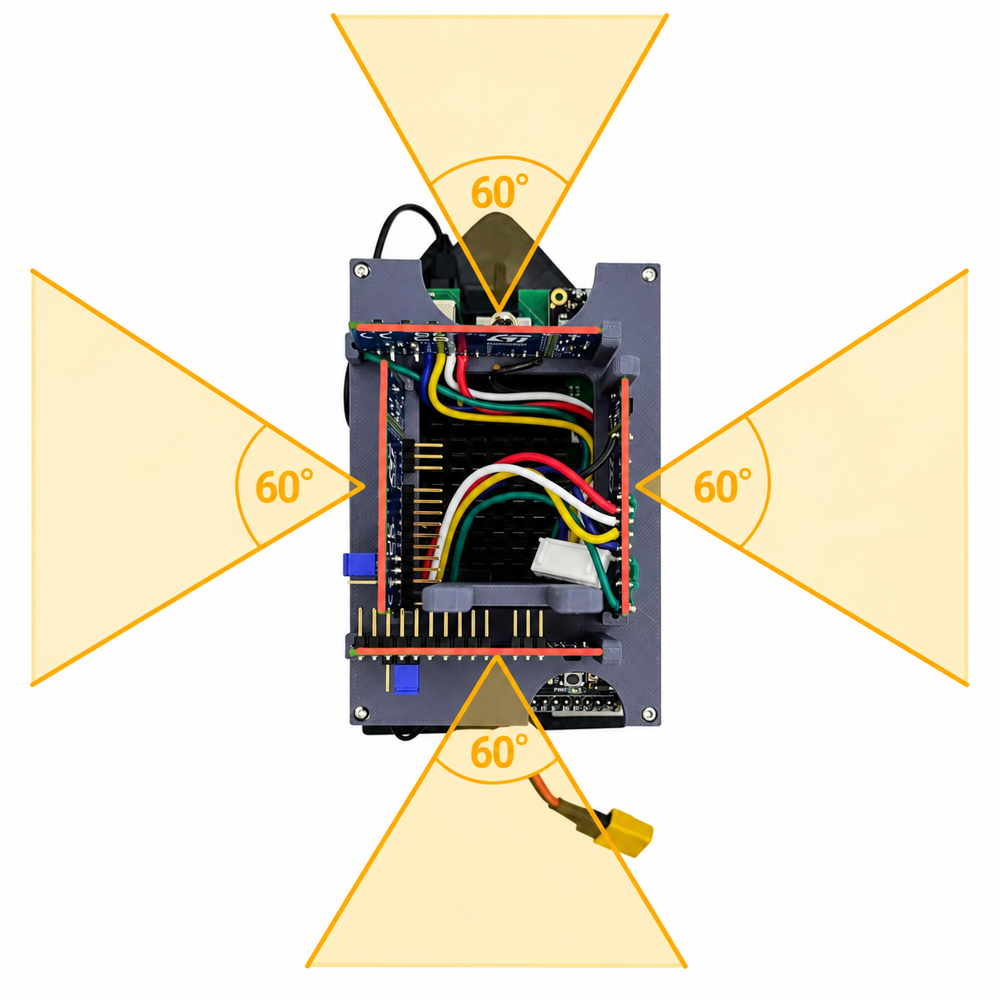
    </a>
</div>

To solve this problem, two additional sensors were added at the front, angled 45° forward. These were meant to detect walls earlier during diagonal approach. However, placing them at the front of the vehicle proved problematic, since the sensors blocked the camera's view, as the camera was not yet mounted at an elevated position at that time.

#### Figure 13: Coverage of the 45° blind spot by two additional sensors at the front

 </div><div align="center">
    <a href="img/sensorabdeckung_vorne.png" target="_blank">
        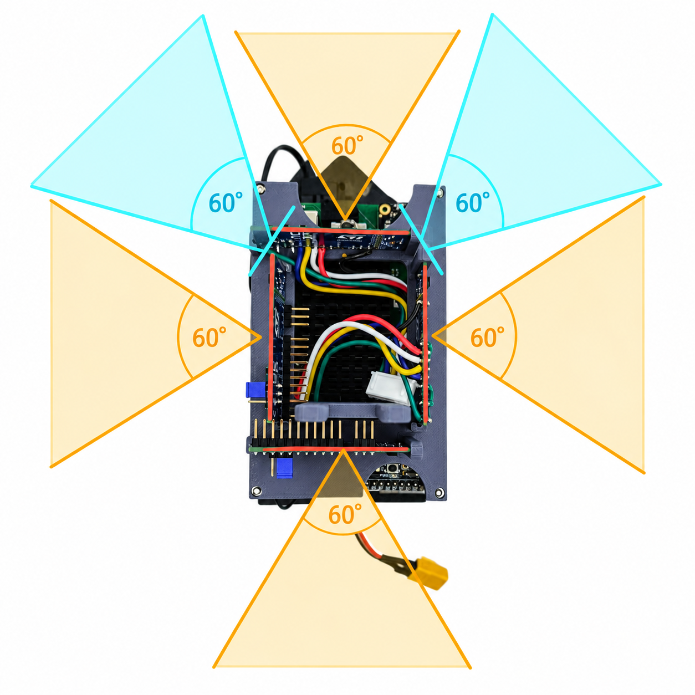
    </a>
</div>

 So we looked for an alternative solution. To save space, we switched to smaller PCBs that fit better mechanically into the compact chassis and installed them.

#### Figure 14: Size comparison of the sensor PCBs

 </div><div align="center">
    <a href="img/vergleich.jfif" target="_blank">
        
    </a>
</div>


#### Figure 15: Test position of an additional sensor angled forward diagonally

</div><div align="center">
    <a href="img/schraeg.jpg" target="_blank">
        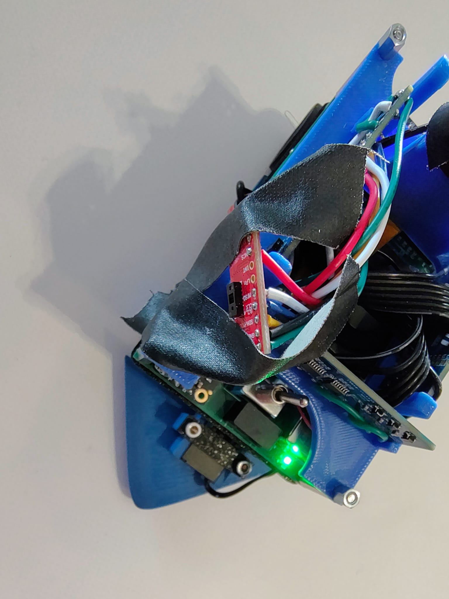
    </a>
</div>
 
 However, tests showed that this smaller variant did not work reliably enough – with more than two sensors, SPI communication broke down. 
We went back to the larger PCBs and instead placed them at the rear of the vehicle to keep the camera's view clear. Due to limited space, they were installed there in a vertical orientation. 

#### Figure 16: Position of the angled ToF sensors at the rear to cover the 45° blind spot

</div><div align="center">
    <a href="img/roboter spaetere version.jpg" target="_blank">
        
    </a>
</div>


#### Figure 17: Coverage of the 45° blind spot by two additional sensors at the rear

 </div><div align="center">
    <a href="img/sensorabdeckung_hinten.png" target="_blank">
        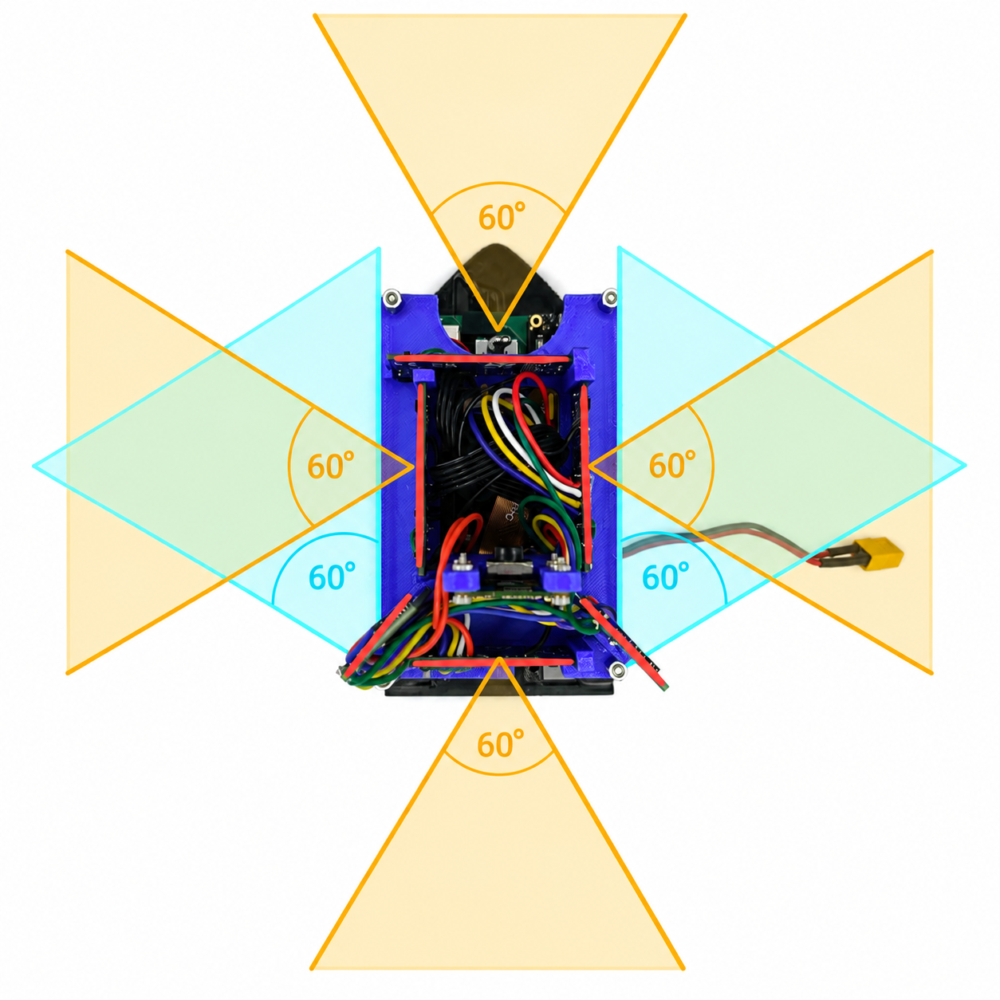
    </a>
</div>


After switching obstacle detection to a full scan (cf. [Camera](#camera-use-of-the-camera-and-calibration), [Obstacle challenge driving strategy – strategy change](#obstacle-challenge-driving-strategy---strategy-change)), we were able to do without the additional sensors. Since no favorable camera positions need to be approached anymore, the robot never approaches a wall at a 45° angle. 

#### Figure 18: Final robot with four sensors

</div><div align="center">
    <a href="img/endversion_tof.jpeg" target="_blank">
        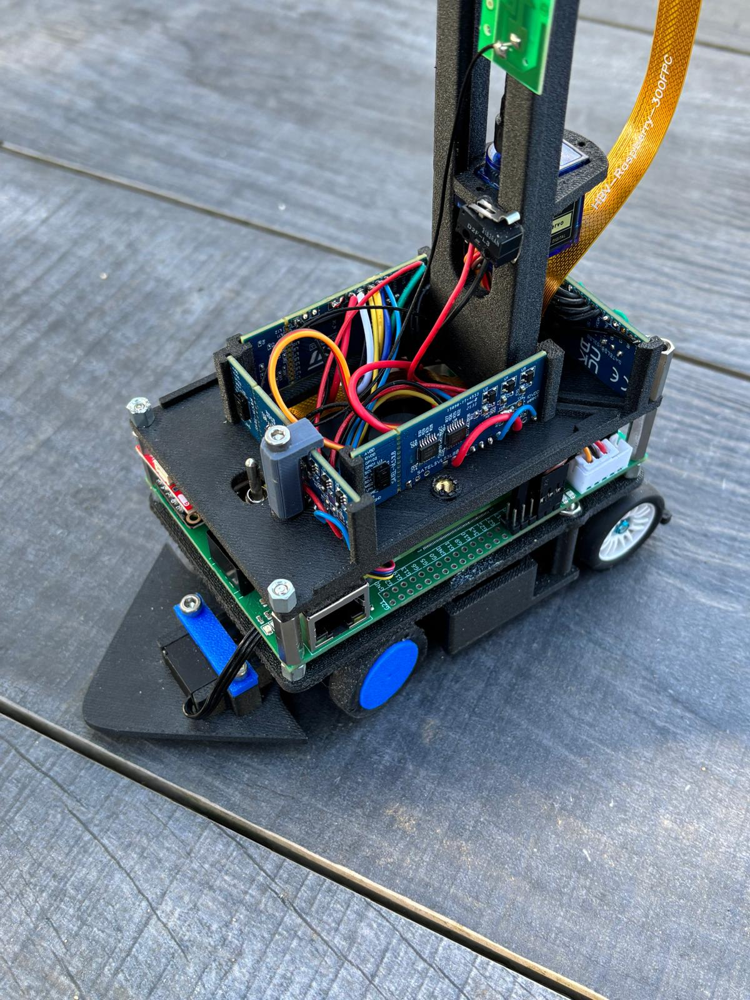
    </a>
</div>


## **Gyro**
In the previous year, we had the problem that the **gyro** developed several degrees of drift over the course of a mission. This drift caused serious problems for the robot's orientation. This season we therefore wanted to use a **BNO055** with a built-in magnetometer. If the magnetometer works reliably, it can theoretically compensate for the drift completely. However, our tests showed that the magnetometer works far too imprecisely and unreliably. Deviations of 5–10 degrees occurred, which is why we had to disable it. With this limitation, the BNO055 performs even worse than last year's gyro. We had a deviation of about two degrees per lap driven, and about six degrees by the end of the course. The deviation is not constant across multiple runs, and therefore cannot be calibrated away. This makes navigation impossible. 

We therefore switched to a **BNO086** on short notice. We use this one without a magnetometer as well, but this gyro shows a significantly smaller and more consistent error. We perform a **bias calibration** (zero point of the rate sensors) automatically at program start; we determine the **rate calibration** manually by rotating the car ten times by 360 degrees. We then compare the measured and actual rotation and determine a correction factor. 

<table align="center" width="100%" cellpadding="8" cellspacing="0" border="0"><tr><td bgcolor="#B8D8EE" align="center">
Correction factor = measured rotation / expected rotation
</td></tr></table>

#### Table 10: Summary of gyro evaluation

<table align="center" border="1" style="border-collapse: collapse; border: 2px solid black;">

  <!-- Table header -->
  <tr>
    <th bgcolor="#4A90C2" width="130" style="border: 1px solid black; border-bottom: 3px solid black; padding: 8px; color: white;">Sensor</th>
    <th bgcolor="#4A90C2" width="220" style="border: 1px solid black; border-bottom: 3px solid black; padding: 8px; color: white;">Configuration</th>
    <th bgcolor="#4A90C2" width="150" style="border: 1px solid black; border-bottom: 3px solid black; padding: 8px; color: white;">Dev. after<br>1 lap</th>
    <th bgcolor="#4A90C2" width="170" style="border: 1px solid black; border-bottom: 3px solid black; padding: 8px; color: white;">Dev. after<br>3 laps</th>
    <th bgcolor="#4A90C2" width="170" style="border: 1px solid black; border-bottom: 3px solid black; padding: 8px; color: white;">Consistently<br>calibratable?</th>
  </tr>

  <!-- BNO055 with magnetometer -->
  <tr>
    <td bgcolor="#EAF4FB" style="border: 1px solid black; padding: 8px; text-align: center;"><b>BNO055</b></td>
    <td bgcolor="#EAF4FB" style="border: 1px solid black; padding: 8px;">with magnetometer</td>
    <td bgcolor="#EAF4FB" style="border: 1px solid black; padding: 8px; text-align: center;">~5–10°</td>
    <td bgcolor="#EAF4FB" style="border: 1px solid black; padding: 8px; text-align: center;">not measurable<br>(outlier)</td>
    <td bgcolor="#EAF4FB" style="border: 1px solid black; padding: 8px; text-align: center;">No</td>
  </tr>

  <!-- BNO055 without magnetometer -->
  <tr>
    <td style="border: 1px solid black; padding: 8px; text-align: center;"><b>BNO055</b></td>
    <td style="border: 1px solid black; padding: 8px;">without magnetometer</td>
    <td style="border: 1px solid black; padding: 8px; text-align: center;">~2°</td>
    <td style="border: 1px solid black; padding: 8px; text-align: center;">~6°</td>
    <td style="border: 1px solid black; padding: 8px; text-align: center;">No</td>
  </tr>

  <!-- BNO086 -->
  <tr>
    <td bgcolor="#EAF4FB" style="border: 1px solid black; padding: 8px; text-align: center;"><b>BNO086</b></td>
    <td bgcolor="#EAF4FB" style="border: 1px solid black; padding: 8px;">without magnetometer<br>with rate calibration</td>
    <td bgcolor="#EAF4FB" style="border: 1px solid black; padding: 8px; text-align: center;">~0.3°</td>
    <td bgcolor="#EAF4FB" style="border: 1px solid black; padding: 8px; text-align: center;">~1°</td>
    <td bgcolor="#EAF4FB" style="border: 1px solid black; padding: 8px; text-align: center;">Yes</td>
  </tr>

</table>


The table summarizes the results of our gyro evaluation. Each value is the average of five measured runs on our test course. The BNO086 was the only sensor for which the deviation was consistent across multiple runs and could therefore be compensated by our correction factor. In practice, it has been shown that the robot can still drive the course cleanly with this deviation.

<table width="100%" cellpadding="10" cellspacing="0" border="0"><tr><td bgcolor="#2E8B57" width="1%">&nbsp;</td><td bgcolor="#E2F3E5">
 <b>Result:</b> With the BNO086 and rate calibration, the gyro deviation is only about <b>1°</b> after three laps driven – precise enough to reliably drive the course.
</td></tr></table>

## **Power budget: power supply and consumption**
Last year we used a 2S 2200 mAh battery. This is far too large for our new car, and additionally the **voltage** is insufficient, since our new motor driver shuts off at 6.5 V. With line losses and under load spikes, reliable operation with a 2S battery as the battery voltage dropped was no longer possible during testing, so we switched to a 3S battery early on. This also gives us more power reserve for higher motor speeds. 

After voltage, the most important selection criterion was the **installation size** at the highest possible capacity. We chose a **3S LiPo battery with 550 mAh**. This is the largest battery we could fit in the chassis. To determine whether the battery was usable, we first calculated the runtime theoretically, then measured it in practice (see below).

#### Table 11: Power consumption of the components used, per datasheet

<table align="center" border="1" style="border-collapse: collapse; border: 2px solid black;">

  <!-- Table header -->
  <tr>
    <th bgcolor="#4A90C2" width="230" style="border: 1px solid black; border-bottom: 3px solid black; padding: 8px; color: white;">Component</th>
    <th bgcolor="#4A90C2" width="170" style="border: 1px solid black; border-bottom: 3px solid black; padding: 8px; color: white;">Operating voltage</th>
    <th bgcolor="#4A90C2" width="170" style="border: 1px solid black; border-bottom: 3px solid black; padding: 8px; color: white;">Typical current</th>
    <th bgcolor="#4A90C2" width="150" style="border: 1px solid black; border-bottom: 3px solid black; padding: 8px; color: white;">Typical<br>power</th>
    <th bgcolor="#4A90C2" width="380" style="border: 1px solid black; border-bottom: 3px solid black; padding: 8px; color: white;">Note</th>
  </tr>

  <!-- Raspberry Pi Compute Module 5 -->
  <tr>
    <td bgcolor="#EAF4FB" style="border: 1px solid black; padding: 8px;"><b>Raspberry Pi Compute Module 5</b></td>
    <td bgcolor="#EAF4FB" style="border: 1px solid black; padding: 8px; text-align: center;">5 V</td>
    <td bgcolor="#EAF4FB" style="border: 1px solid black; padding: 8px; text-align: center;">600–1600 mA</td>
    <td bgcolor="#EAF4FB" style="border: 1px solid black; padding: 8px; text-align: center;">3–8 W</td>
    <td bgcolor="#EAF4FB" style="border: 1px solid black; padding: 8px;">Main computer; depends on CPU load</td>
  </tr>

  <!-- Raspberry Pi Camera Module 3 -->
  <tr>
    <td style="border: 1px solid black; padding: 8px;"><b>Raspberry Pi Camera Module 3</b></td>
    <td style="border: 1px solid black; padding: 8px; text-align: center;">internal via CM5</td>
    <td style="border: 1px solid black; padding: 8px; text-align: center;">approx. 200–400 mA<br>equivalent</td>
    <td style="border: 1px solid black; padding: 8px; text-align: center;">approx. 1 W</td>
    <td style="border: 1px solid black; padding: 8px;">Powered directly via the CM5's MIPI CSI; no external power source</td>
  </tr>

  <!-- 4x VL53L8CX -->
  <tr>
    <td bgcolor="#EAF4FB" style="border: 1px solid black; padding: 8px;"><b>4× VL53L8CX time-of-flight sensor</b></td>
    <td bgcolor="#EAF4FB" style="border: 1px solid black; padding: 8px; text-align: center;">3.3 V (AVDD) via own voltage regulator</td>
    <td bgcolor="#EAF4FB" style="border: 1px solid black; padding: 8px; text-align: center;">approx. 85 mA each</td>
    <td bgcolor="#EAF4FB" style="border: 1px solid black; padding: 8px; text-align: center;">total<br>approx. 1.1 W</td>
    <td bgcolor="#EAF4FB" style="border: 1px solid black; padding: 8px;">Continuous operation 30 Hz, 8×8; per ST datasheet DS13349</td>
  </tr>

  <!-- BNO086 -->
  <tr>
    <td style="border: 1px solid black; padding: 8px;"><b>BNO086 IMU</b></td>
    <td style="border: 1px solid black; padding: 8px; text-align: center;">3.3 V</td>
    <td style="border: 1px solid black; padding: 8px; text-align: center;">approx. 4 mA</td>
    <td style="border: 1px solid black; padding: 8px; text-align: center;">approx. 13 mW</td>
    <td style="border: 1px solid black; padding: 8px;">Full fusion mode (NDOF); per manufacturer datasheet</td>
  </tr>

  <!-- STM32F411 -->
  <tr>
    <td bgcolor="#EAF4FB" style="border: 1px solid black; padding: 8px;"><b>STM32F411 Black Pill</b></td>
    <td bgcolor="#EAF4FB" style="border: 1px solid black; padding: 8px; text-align: center;">3.3 V</td>
    <td bgcolor="#EAF4FB" style="border: 1px solid black; padding: 8px; text-align: center;">approx. 45 mA</td>
    <td bgcolor="#EAF4FB" style="border: 1px solid black; padding: 8px; text-align: center;">approx. 150 mW</td>
    <td bgcolor="#EAF4FB" style="border: 1px solid black; padding: 8px;">100 MHz operation, all peripherals active; per ST DS10314</td>
  </tr>

  <!-- N30 Motor -->
  <tr>
    <td style="border: 1px solid black; padding: 8px;"><b>N30 motor with encoder</b></td>
    <td style="border: 1px solid black; padding: 8px; text-align: center;">11.1 V via DRV8871</td>
    <td style="border: 1px solid black; padding: 8px; text-align: center;">50–200 mA</td>
    <td style="border: 1px solid black; padding: 8px; text-align: center;">0.5–2 W</td>
    <td style="border: 1px solid black; padding: 8px;">Strongly load-dependent; peak current on start-up</td>
  </tr>

  <!-- DRV8871 -->
  <tr>
    <td bgcolor="#EAF4FB" style="border: 1px solid black; padding: 8px;"><b>DRV8871 motor driver</b></td>
    <td bgcolor="#EAF4FB" style="border: 1px solid black; padding: 8px; text-align: center;">11.1 V</td>
    <td bgcolor="#EAF4FB" style="border: 1px solid black; padding: 8px; text-align: center;">quiescent current<br>approx. 5 mA</td>
    <td bgcolor="#EAF4FB" style="border: 1px solid black; padding: 8px; text-align: center;">approx. 55 mW</td>
    <td bgcolor="#EAF4FB" style="border: 1px solid black; padding: 8px;">H-bridge, 6.5–45 V, max. 3.6 A; motor current flows directly through the driver</td>
  </tr>

  <!-- Servo -->
  <tr>
    <td style="border: 1px solid black; padding: 8px;"><b>Servo (steering)</b></td>
    <td style="border: 1px solid black; padding: 8px; text-align: center;">5 V</td>
    <td style="border: 1px solid black; padding: 8px; text-align: center;">150–800 mA<br>briefly</td>
    <td style="border: 1px solid black; padding: 8px; text-align: center;">0.5–2 W<br>briefly</td>
    <td style="border: 1px solid black; padding: 8px;">Current spikes during steering movements; low quiescent current</td>
  </tr>

</table>

### **Worst-case peak current and regulator sizing**
In addition to the typical values from Table 11, the **worst case** is decisive for sizing the voltage regulators, in which several consumers draw their peak current simultaneously on the 5 V rail:

- Raspberry Pi CM5 (peak load): 1600 mA
- Camera (powered internally via CM5, conservatively added here as well): 400 mA
- Servo (steering movement, briefly): 800 mA
- 4× VL53L8CX ToF sensors: 4 × 85 mA = 340 mA
- STM32F411 + BNO086 via AMS1117-3.3 (input current of the linear regulator comes from the 5 V rail): approx. 50 mA

**Worst-case peak current on the 5 V rail: ≈ 3.2 A**

On the 5 V rail we use an **AP3441SHE-7B** synchronous buck regulator (Diodes Inc., rated current 3 A per datasheet). The purely calculated worst case is thus just above the regulator's continuous current rating. In practice, full CM5 load, servo peak current, and maximum ToF activity never occur at exactly the same time; the measured total power of the complete system (7–10 W, see below) confirms a significantly lower real current demand. For future revisions, this is nevertheless noted as a point for improvement: a regulator with higher continuous current (e.g. 4 A) would create additional safety margin if further consumers are added.

<table width="100%" cellpadding="10" cellspacing="0" border="0"><tr><td bgcolor="#2E8B57" width="1%">&nbsp;</td><td bgcolor="#E2F3E5">
 <b>Result:</b> Worst-case peak current on the 5 V rail ≈ <b>3.2 A</b> versus a regulator capacity of <b>3 A</b> (AP3441SHE-7B) – however, the measured practical load of 7–10 W is significantly lower, since not all peaks occur simultaneously.
</td></tr></table>

### **Measured total power requirement**
The **measured total power requirement** of the system during operation is between about 7 W (low load) and 10 W (full computational load while driving).

### **Runtime calculation** 
- **Battery energy content:** 11.1 V × 0.55 Ah = 6.1 Wh<br>
- **Power consumption:** 7 to 10 watts <br>
- **Runtime (theoretical):** This results in a runtime of 36 to 52 minutes. <br>
- **Runtime (practical):** In test operation, the measured runtime to the shutdown threshold (3.5 V/cell) is usually about 40 minutes and thus matches the theoretical calculations well.

<table width="100%" cellpadding="10" cellspacing="0" border="0"><tr><td bgcolor="#2E8B57" width="1%">&nbsp;</td><td bgcolor="#E2F3E5">
 <b>Result:</b> The 3S LiPo (550 mAh) delivers a practical runtime of approx. <b>40 minutes</b> in test operation – this matches the theoretical calculation (36–52 min) and is sufficient for several competition runs per battery charge.
</td></tr></table>

### **Avoiding deep discharge**
To **avoid deep discharge**, the STM32 measures the battery voltage, switches off the motor at a cell voltage of 3.5 volts, and sends a signal to the Raspberry Pi, which then shuts down. It also cyclically moves the steering servo to indicate the empty battery.

### **Voltage supply of the individual components**
- **11.1 V direct**: N30 motor via the DRV8871 motor driver (H-bridge, 6.5–45 V, max. 3.6 A)
- **5 V via DC-DC converter:** Raspberry Pi CM5 via the 100-pin connectors on the self-developed baseboard; servo and all four VL53L8CX ToF sensors
- **3.3 V via linear regulator (AMS1117-3.3):** STM32F411, BNO086; the AMS1117's input supply comes from the 5 V rail via the GPIO header
- The Raspberry Pi Camera Module is powered exclusively via the **CM5's MIPI CSI interface**; no external wiring necessary

### **Failure modes in sensors and power supply**
To increase the reliability of our sensors and electronics, we have systematically summarized the main sources of error observed during development, along with their detection, effects, and countermeasures.

#### Table 12: Failure modes, detection, and countermeasures

<table align="center" border="1" style="border-collapse: collapse; border: 2px solid black;">

  <tr>
    <th bgcolor="#4A90C2" width="200" style="border: 1px solid black; border-bottom: 3px solid black; padding: 8px; color: white;">Failure</th>
    <th bgcolor="#4A90C2" width="260" style="border: 1px solid black; border-bottom: 3px solid black; padding: 8px; color: white;">Detection</th>
    <th bgcolor="#4A90C2" width="260" style="border: 1px solid black; border-bottom: 3px solid black; padding: 8px; color: white;">Effect</th>
    <th bgcolor="#4A90C2" width="260" style="border: 1px solid black; border-bottom: 3px solid black; padding: 8px; color: white;">Mitigation</th>
  </tr>

  <tr>
    <td bgcolor="#EAF4FB" style="border: 1px solid black; padding: 8px;">Gyro drift (residual error of the BNO086 accumulating over multiple laps)</td>
    <td bgcolor="#EAF4FB" style="border: 1px solid black; padding: 8px;">Deviation of the calculated heading from known target angles at turning points of the track</td>
    <td bgcolor="#EAF4FB" style="border: 1px solid black; padding: 8px;">Vehicle misses walls/corners, imprecise lane tracking</td>
    <td bgcolor="#EAF4FB" style="border: 1px solid black; padding: 8px;">Switch from BNO055 to the lower-drift <b>BNO086</b>; remaining residual error is compensated by a <b>rate calibration</b> before each run (cf. <a href="#table-10-summary-of-gyro-evaluation">Table 10</a>).</td>
  </tr>

  <tr>
    <td style="border: 1px solid black; padding: 8px;">ToF wall loss (sensor no longer detects a valid wall)</td>
    <td style="border: 1px solid black; padding: 8px;">Distance value is outside the plausibility range or timeout on the STM32</td>
    <td style="border: 1px solid black; padding: 8px;">Control logic receives no valid distance value and cannot safely execute the driving command</td>
    <td style="border: 1px solid black; padding: 8px;">Sensor height/mode optimized for maximum range (8×8/30 Hz, 130 cm); <b>last valid value is held until timeout</b></td>
  </tr>

  <tr>
    <td bgcolor="#EAF4FB" style="border: 1px solid black; padding: 8px;">Poor lighting (camera color detection disturbed by ambient light)</td>
    <td bgcolor="#EAF4FB" style="border: 1px solid black; padding: 8px;">Debug image before each run shows incomplete masks or an open flood-fill barrier at the black walls</td>
    <td bgcolor="#EAF4FB" style="border: 1px solid black; padding: 8px;">Obstacles/walls are detected incorrectly, route planning becomes faulty</td>
    <td bgcolor="#EAF4FB" style="border: 1px solid black; padding: 8px;"><b>Manual readjustment</b> of the V-maximum value and H/S/V limits before the competition (cf. <a href="#table-7-hsv-color-masks-and-calibration-parameters">Table 7</a>)</td>
  </tr>

  <tr>
    <td style="border: 1px solid black; padding: 8px;">Communication failure of small sensor boards
(unstable communication with more than two sensors)</td>
    <td style="border: 1px solid black; padding: 8px;">Missing/invalid sensor values and polling timeouts in tests with multiple sensors simultaneously</td>
    <td style="border: 1px solid black; padding: 8px;">Failure of the additional 45° sensors, resulting in a blind spot during diagonal wall approach</td>
    <td style="border: 1px solid black; padding: 8px;">Smaller sensor PCB design abandoned, reverted to the larger, stable boards. <b>The later full-scan strategy made the additional sensors unnecessary anyway.</b></td>
  </tr>

  <tr>
    <td bgcolor="#EAF4FB" style="border: 1px solid black; padding: 8px;">Undervoltage (battery voltage falls below shutdown threshold)</td>
    <td bgcolor="#EAF4FB" style="border: 1px solid black; padding: 8px;">STM32 continuously measures the battery cell voltage</td>
    <td bgcolor="#EAF4FB" style="border: 1px solid black; padding: 8px;">Motor/servo lose power, unreliable behavior up to a hard shutdown</td>
    <td bgcolor="#EAF4FB" style="border: 1px solid black; padding: 8px;"><b>Automatic shutdown at 3.5 V/cell</b>, signal to Raspberry Pi for an orderly shutdown, cyclic servo movement as a warning</td>
  </tr>

</table>
<br><br>

# **Software development**

## **Software architecture**
The software is split into **two separate processing layers**. 

The **high-level logic** runs on the Raspberry Pi Compute Module 5 (CM5): driving strategy, image processing, gyro evaluation, user interface, and logging. 

The **low-level control** resides on the STM32F411: motor control, encoder evaluation, servo control, and reading the four VL53L8CX time-of-flight sensors with a fixed cycle time.

This split has two advantages: the STM32 handles time-critical tasks without operating-system overhead. The CM5 can simultaneously perform computationally intensive tasks such as image processing and gyro fusion without blocking the sensor control loop. Communication between the two processors is via UART at 921,600 baud.

#### Figure 19: Overview of the system architecture

</div><div align="center">
    <a href="img/systemarchitektur_eng.png" target="_blank">
        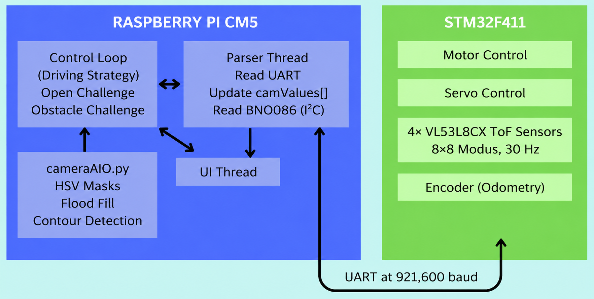
    </a>
</div>

#### Table 13: Task distribution of the software modules

<table align="center" border="1" style="border-collapse: collapse; border: 2px solid black;">

  <!-- Table header -->
  <tr>
    <th bgcolor="#4A90C2" width="240" style="border: 1px solid black; border-bottom: 3px solid black; padding: 8px; color: white;">Module / file</th>
    <th bgcolor="#4A90C2" width="180" style="border: 1px solid black; border-bottom: 3px solid black; padding: 8px; color: white;">Processor</th>
    <th bgcolor="#4A90C2" width="520" style="border: 1px solid black; border-bottom: 3px solid black; padding: 8px; color: white;">Main task</th>
  </tr>

  <!-- main.py -->
  <tr>
    <td bgcolor="#EAF4FB" style="border: 1px solid black; padding: 8px;"><code>main.py</code></td>
    <td bgcolor="#EAF4FB" style="border: 1px solid black; padding: 8px;">Raspberry Pi CM5</td>
    <td bgcolor="#EAF4FB" style="border: 1px solid black; padding: 8px;">System startup, start threads</td>
  </tr>

  <!-- parser.py -->
  <tr>
    <td style="border: 1px solid black; padding: 8px;"><code>parser.py</code></td>
    <td style="border: 1px solid black; padding: 8px;">Raspberry Pi CM5</td>
    <td style="border: 1px solid black; padding: 8px;">Serial communication with STM32, read BNO086 gyro</td>
  </tr>

  <!-- driveController.py -->
  <tr>
    <td bgcolor="#EAF4FB" style="border: 1px solid black; padding: 8px;"><code>driveController.py</code></td>
    <td bgcolor="#EAF4FB" style="border: 1px solid black; padding: 8px;">Raspberry Pi CM5</td>
    <td bgcolor="#EAF4FB" style="border: 1px solid black; padding: 8px;">Driving primitives: wall following, turns, distance driving, P-controller steering</td>
  </tr>

  <!-- openChallenge.py -->
  <tr>
    <td style="border: 1px solid black; padding: 8px;"><code>openChallenge.py</code></td>
    <td style="border: 1px solid black; padding: 8px;">Raspberry Pi CM5</td>
    <td style="border: 1px solid black; padding: 8px;">Opening challenge sequence control (3 laps)</td>
  </tr>

  <!-- obstacleChallenge.py -->
  <tr>
    <td bgcolor="#EAF4FB" style="border: 1px solid black; padding: 8px;"><code>obstacleChallenge.py</code>,<br><code>obstacleChallengeSingle.py</code></td>
    <td bgcolor="#EAF4FB" style="border: 1px solid black; padding: 8px;">Raspberry Pi CM5</td>
    <td bgcolor="#EAF4FB" style="border: 1px solid black; padding: 8px;">Scan phase, deterministic route, single- and two-obstacle handling per section</td>
  </tr>

  <!-- cameraAIO.py -->
  <tr>
    <td style="border: 1px solid black; padding: 8px;"><code>cameraAIO.py</code></td>
    <td style="border: 1px solid black; padding: 8px;">Raspberry Pi CM5</td>
    <td style="border: 1px solid black; padding: 8px;">Read camera image, HSV masks, flood fill, contour analysis</td>
  </tr>

  <!-- ui.py -->
  <tr>
    <td bgcolor="#EAF4FB" style="border: 1px solid black; padding: 8px;"><code>ui.py</code></td>
    <td bgcolor="#EAF4FB" style="border: 1px solid black; padding: 8px;">Raspberry Pi CM5</td>
    <td bgcolor="#EAF4FB" style="border: 1px solid black; padding: 8px;">Status display, user input</td>
  </tr>

  <!-- logger.py -->
  <tr>
    <td style="border: 1px solid black; padding: 8px;"><code>logger.py</code></td>
    <td style="border: 1px solid black; padding: 8px;">Raspberry Pi CM5</td>
    <td style="border: 1px solid black; padding: 8px;">Test logging</td>
  </tr>

  <!-- main.cpp -->
  <tr>
    <td bgcolor="#EAF4FB" style="border: 1px solid black; padding: 8px;"><code>main.cpp (STM32)</code></td>
    <td bgcolor="#EAF4FB" style="border: 1px solid black; padding: 8px;">STM32F411</td>
    <td bgcolor="#EAF4FB" style="border: 1px solid black; padding: 8px;">Motor PWM, encoder, servo, send ToF sensor data via JSON</td>
  </tr>

</table>

## **Threading and system flow**

Three functional layers run in parallel in the Raspberry Pi code:

- The **UI main thread** displays status data and reacts to keyboard input for starting and stopping. 
- The **parser thread** continuously reads the serial interface and updates the shared sensor values: distance fields of all four sensors, rotational speed, battery voltage, and heading. 
- The **control loop** executes the actual driving logic and writes target values for speed and steering angle back to the serial interface. 


## **Driving primitives in driveController.py**
<code>driveController.py</code> forms the abstraction layer between raw sensor values and the challenge scripts. It provides a **library of driving primitives** that internally combine heading control and acceleration ramps.

The **acceleration ramp** limits acceleration to 3 m/s² and braking deceleration to 8 m/s². This prevents the tires from spinning or locking up, which would distort the odometry values and the measured speed.

**Steering** uses two P-controllers: <code>pidSteer (Kp = 1.0)</code> for normal driving and <code>pidSteer2 (Kp = 0.5)</code> for smoother cornering with less overshoot.

Meaning of the Kp values: the controller calculates the steering angle offset (0–180°, center = 90°) directly from the heading error in degrees:

<table align="center" width="100%" cellpadding="8" cellspacing="0" border="0"><tr><td bgcolor="#B8D8EE" align="center">
steer = 90 − K<sub>p</sub> · error
</td></tr></table>

At Kp = 1.0, a 1° heading error corresponds exactly to a 1° steering correction; saturation (full lock) occurs at |error| ≥ 90°. At Kp = 0.5, it only occurs at |error| ≥ 180°, resulting in softer but more sluggish control behavior.

**Determining the values:** The Kp values were determined empirically. The starting point was Kp = 1.0, since the 1:1 mapping allows an intuitive initial estimate. When driving straight, the vehicle showed no oscillation – the mechanical inertia provides sufficient damping. During faster corner entry (turn()), however, Kp = 1.0 led to overshoot at the end of the turn. Halving it to Kp = 0.5 (pidSteer2) reduced the overshoot to below 3°.

**Why no I and D component:** An integral component is not necessary, since the gyro measures the absolute orientation and no permanent offset occurs. A D component would react to the measurement noise of the BNO086 and destabilize the steering.

**Wall-parallel distance keeping (side obedience):** When a primitive is called with an <code>avoidWall</code> parameter, <code>calcAccel()</code> additionally keeps the followed side wall within a target band of 150–350 mm using the corresponding side ToF sensor. If the car comes closer than 150 mm, an 8° steering bias away from the wall is applied; between 350 mm and 500 mm the bias points 8° toward the wall. A hysteresis (each correction is held for 250 mm of travel) prevents the steering from oscillating. This keeps the car parallel to the outer wall on the straights and provides the side obedience required in the obstacle challenge.

**Turn variants:** All three turning primitives first apply full steering lock and only hand over to the P-controller close to the target heading – <code>turn()</code> within 50°, <code>quickTurn()</code> within 20°. <code>tightTurn()</code> instead keeps full lock the whole time and tapers the speed (0.3 → 0.2 → 0.1 m/s) as the heading error shrinks, producing the tightest possible rotation for the scan positions and for parking.

The control is based on the following driving primitives: <br>

#### Table 14: Most important driving primitives and their function

<table align="center" border="1" style="border-collapse: collapse; border: 2px solid black;">

  <!-- Table header -->
  <tr>
    <th bgcolor="#4A90C2" width="230" style="border: 1px solid black; border-bottom: 3px solid black; padding: 8px; color: white;">Function</th>
    <th bgcolor="#4A90C2" width="280" style="border: 1px solid black; border-bottom: 3px solid black; padding: 8px; color: white;">Input</th>
    <th bgcolor="#4A90C2" width="500" style="border: 1px solid black; border-bottom: 3px solid black; padding: 8px; color: white;">Behavior</th>
  </tr>

  <!-- driveAlongWall -->
  <tr>
    <td bgcolor="#EAF4FB" style="border: 1px solid black; padding: 8px;"><code>driveAlongWall</code></td>
    <td bgcolor="#EAF4FB" style="border: 1px solid black; padding: 8px;">speed, heading, wall</td>
    <td bgcolor="#EAF4FB" style="border: 1px solid black; padding: 8px;">Drives until no wall is visible on the left or right</td>
  </tr>

  <!-- driveToWall -->
  <tr>
    <td style="border: 1px solid black; padding: 8px;"><code>driveToWall</code></td>
    <td style="border: 1px solid black; padding: 8px;">speed, heading, distance, wall</td>
    <td style="border: 1px solid black; padding: 8px;">Drives to target distance from the wall, ToF as stop criterion</td>
  </tr>

  <!-- driveAwayFromWall -->
  <tr>
    <td bgcolor="#EAF4FB" style="border: 1px solid black; padding: 8px;"><code>driveAwayFromWall</code></td>
    <td bgcolor="#EAF4FB" style="border: 1px solid black; padding: 8px;">speed, heading, distance, wall</td>
    <td bgcolor="#EAF4FB" style="border: 1px solid black; padding: 8px;">Moves away until minimum distance from the parameterized wall</td>
  </tr>

  <!-- driveDist -->
  <tr>
    <td style="border: 1px solid black; padding: 8px;"><code>driveDist</code></td>
    <td style="border: 1px solid black; padding: 8px;">speed, heading, distance [mm]</td>
    <td style="border: 1px solid black; padding: 8px;">Drives a fixed distance, encoder-based</td>
  </tr>

  <!-- turn -->
  <tr>
    <td bgcolor="#EAF4FB" style="border: 1px solid black; padding: 8px;"><code>turn</code></td>
    <td bgcolor="#EAF4FB" style="border: 1px solid black; padding: 8px;">speed, target heading</td>
    <td bgcolor="#EAF4FB" style="border: 1px solid black; padding: 8px;">Normal turn, stops when heading error &lt; threshold</td>
  </tr>

  <!-- quickTurn -->
  <tr>
    <td style="border: 1px solid black; padding: 8px;"><code>quickTurn</code></td>
    <td style="border: 1px solid black; padding: 8px;">speed, target heading</td>
    <td style="border: 1px solid black; padding: 8px;">Fast turn, maximum steering lock</td>
  </tr>

  <!-- tightTurn -->
  <tr>
    <td bgcolor="#EAF4FB" style="border: 1px solid black; padding: 8px;"><code>tightTurn</code></td>
    <td bgcolor="#EAF4FB" style="border: 1px solid black; padding: 8px;">speed, target heading</td>
    <td bgcolor="#EAF4FB" style="border: 1px solid black; padding: 8px;">Especially tight turn</td>
  </tr>

  <!-- brake -->
  <tr>
    <td style="border: 1px solid black; padding: 8px;"><code>brake</code></td>
    <td style="border: 1px solid black; padding: 8px; text-align: center;">–</td>
    <td style="border: 1px solid black; padding: 8px;">Target speed = 0, steering to 0°</td>
  </tr>

</table>

The specific **parameters** for the routines (e.g. the distance in the <code>driveToWall</code> function) were not calculated, but determined empirically through driving tests. Example: for <code>driveToWall</code>, the vehicle was driven with various threshold values and the value was adopted at which the following turn was initiated cleanly, without touching a wall.

## **Opening challenge driving strategy**
In the **opening challenge** (<code>openChallenge.py</code>), the car drives three complete laps. The car drives straight ahead until no wall is detected on the left or right, and remembers the driving direction based on this using the <code>findDirection</code> function. Each lap consists of four straights, each with a 90° turn:
- <code>driveAlongWall</code> – along the outer wall to the turn area
- <code>turn(−90°)</code> – initiate the turn via P-controller, target speed 1.8 m/s
- <code>driveDist(750 mm) + driveAlongWall</code> – next straight, target speed 2 m/s
- Repeat for all four sides of the course <br>

The pattern of straight and turn repeats four times per lap (one side of the course per iteration). After three complete laps (3 x 4 = 12 turns total), the vehicle stops with <code>driveAwayFromWall</code> in the middle of the starting zone. The target speed of 2 m/s on straights is a configured parameter value; the actual final speed depends on the acceleration ramp and the available track length.

#### Figure 20: Source code for the opening challenge

</div><div align="center">
    <a href="img/Code.png" target="_blank">
        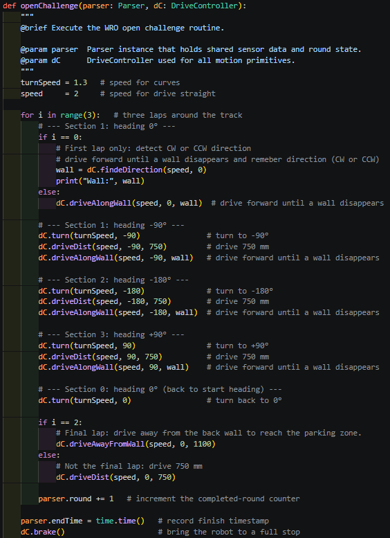
    </a>
</div>


## **Obstacle challenge driving strategy - strategy change**
### **Old strategy: scanning while driving**
The **original strategy** detected obstacles while driving. At the start of each straight, a photo was taken and the color of the first obstacle was determined. The system additionally scanned up to twice per section for further obstacles. This logic led to a state machine that was hard to maintain: up to three scan points per section, distance-dependent branches, and the camera in motion.


### **New strategy: full scan, fixed route**
The **new strategy fully separates detection and driving**. Right after program start, the car turns to 3 defined angles (<code>tightTurn</code>) and photographs the entire course. From these three photos, the colors of the obstacles across all four sections are detected at once and stored in <code>parser.obstacles[0..11]</code>. After that, the camera is no longer used – the route is deterministically fixed.  This version was the strategy we used for the **German national final in Trier**.

#### Figure 21: State diagram obstacle challenge – full-scan strategy

</div><div align="center">
    <a href="img/Zustandsdiagramm_Hindernisrennen_en.png" target="_blank">
        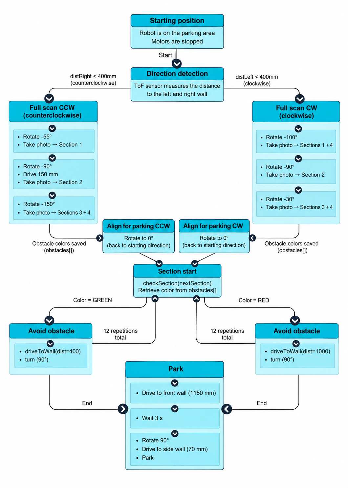
    </a>
</div>


For the competition in Croatia, we developed the full-scan approach further: instead of physically turning the whole car to three different angles, the car now stays in a single fixed position and orientation, and only the **camera** is rotated – via the rotating camera tower described above (cf. [Further development: rotating camera tower](#further-development-rotating-camera-tower)). Using <code>parser.setTowerAngle()</code>, the tower is aimed at three different angles and a picture is taken at each of them. From these three images, all twelve obstacle slots <code>parser.obstacles[0..11]</code> are read by evaluating the direction-specific crop regions (<code>quaders</code>) defined in <code>cameraTower.py</code>. This eliminates the three separate turn-and-photograph maneuvers of the car entirely, making the scan faster and more repeatable, since the car no longer has to reach three different positions precisely before every run.


### **Passing two obstacles in one section**
The **German national rules limit each section to at most one obstacle**, so our original driving logic only ever had to react to a single obstacle color per section. The **international rules used in Croatia allow up to two obstacles in the same section**, which our old logic could not handle correctly: it evaluated only the first obstacle it detected and then drove straight to the next wall, ignoring a second obstacle that might require the car to switch sides. This is why the two-obstacle handling described below was implemented only when we started preparing for the competition in Croatia.

Each of the four course sections has three obstacle slots in <code>parser.obstacles[0..11]</code>, but the robot only ever has to react to **the obstacles actually present**. <code>parser.checkSectionMulti(section, mirror, colorMirror)</code> reads these slots and returns an ordered list of the colors found in that section, in the order in which the obstacles will be reached while driving. If a section contains only one obstacle, its color is duplicated in the list (<code>obstacleList[0] = obstacleList[1]</code>), so every section can be handled as if it always had exactly two entries — no special case is needed for sections with a single obstacle.

In <code>obstacleChallenge.py</code>, driving through a section is split into three steps:
- <code>FirstObstacle()</code> only looks at <code>sectionObstacleList[0]</code>. If the first obstacle is **green**, the robot turns left; if it is **red**, it first drives straight to the front wall before turning - identical to the original single-obstacle logic.
- If both list entries have the same color, <code>SameObstacles()</code> simply continues **driving straight** to the end of the section, using <code>driveToWall(..., avoidWall=dC.leftWall/dC.rightWall)</code> to avoid overshooting.
- If the two entries differ (red→green or green→red), <code>SecondObstacle()</code> drives only **half the distance** to the far wall (<code>driveDist(..., 300)</code>) before calling <code>wallDrive()</code>. This function steers the car 90° toward the wall on the **opposite** side, realigns its heading using the gyro (<code>dC.turn(0)</code>), and then continues driving straight to the end of the section.

<code>driveToWall(..., avoidWall=...)</code> continuously checks whether the inner wall is still present when the robot is driving on the left side of the section. If the wall is no longer detected, the robot has overshot the end of the section, so it briefly drives backwards.

To reuse the same functions for both driving directions, <code>checkSectionMulti</code> takes a <code>mirror</code> flag that swaps sections 1 and 3 and inverts the detected colors. This allows the same <code>FirstObstacle</code>/<code>SameObstacles</code>/<code>SecondObstacle</code> functions to work whether the robot drives clockwise or counter-clockwise.

### **Parking and un-parking**
The obstacle challenge starts and ends in the parking lot, so every run is framed by two dedicated maneuvers: **un-parking** at the start (<code>unParkCW</code>/<code>unParkCCW</code>) and **parking** at the end (<code>parkCW</code>/<code>parkCCW</code>). Because the parking lot is always positioned on the same side, mirroring the (un-)parking functions is not possible, so the two directions have separate implementations.

**Un-parking CW:** The un-parking maneuver is different based on if the first obstacle in the first section is red or green.
green:
1. turn to 40°
2. drive 200mm straight
3. turn back to 0°
4. drive to the end of the section <code>driveToWall()</code>
red:
1. turn to 90°
2. drive to inner wall <code>driveToWall()</code>
3. turn back to 0°
4. drive to the end of the section <code>driveToWall()</code>

**Un-parking CCW:** The un-parking maneuver is different based on if the first obstacle in the first section is red or green.
green:
1. turn to 90°
2. drive to inner wall <code>driveToWall()</code>
3. turn back to 0°
red:
1. turn to 40°
2. drive 350 mm straight (this drives between the right most obstacle and the outer parking lot wall)

**Parking:**
The parallel maneuver runs entirely at low speed (0.3–0.6 m/s) for precision and uses the ToF sensors on three sides for alignment:

1. Approach the front wall of the lot (<code>driveToWall</code>, front ToF) and straighten the heading (<code>tightTurn(0°)</code>).
2. Set the lateral position next to the lot from the side-wall ToF (<code>driveToWall</code> to 180 mm from the left/right wall), with an additional 300 mm offset if the previous section's last obstacle was green.
3. Swing the tail in with a forward–reverse–forward wiggle (<code>tightTurn(-45°)</code> forward, <code>tightTurn(-70°)</code> in reverse, <code>tightTurn(-90°)</code> forward).
4. Reverse into the lot until the rear ToF reports the back wall (<code>driveToWall</code> backward, back ToF) and finally straighten out (<code>tightTurn(0°)</code>).


## **Serial communication and data model**
**CM5** and **STM32** communicate via UART (/dev/ttyAMA0, 921,600 baud). Per transmission cycle, the STM32 sends a complete status packet to the CM5; the CM5 responds with a control packet. The parser thread on the CM5 processes incoming packets asynchronously and writes the values into shared fields of the parser object.

#### Table 15: Data model CM5 ↔ STM32

<table align="center" border="1" style="border-collapse: collapse; border: 2px solid black;">

  <!-- Table header -->
  <tr>
    <th bgcolor="#4A90C2" width="180" style="border: 1px solid black; border-bottom: 3px solid black; padding: 8px; color: white;">Direction</th>
    <th bgcolor="#4A90C2" width="180" style="border: 1px solid black; border-bottom: 3px solid black; padding: 8px; color: white;">Field</th>
    <th bgcolor="#4A90C2" width="180" style="border: 1px solid black; border-bottom: 3px solid black; padding: 8px; color: white;">Type / size</th>
    <th bgcolor="#4A90C2" width="500" style="border: 1px solid black; border-bottom: 3px solid black; padding: 8px; color: white;">Meaning</th>
  </tr>

  <!-- camValues -->
  <tr>
    <td bgcolor="#EAF4FB" style="border: 1px solid black; padding: 8px; text-align: center;">STM32 → CM5</td>
    <td bgcolor="#EAF4FB" style="border: 1px solid black; padding: 8px;"><code>camValues</code></td>
    <td bgcolor="#EAF4FB" style="border: 1px solid black; padding: 8px;"><code>int[6][64]</code></td>
    <td bgcolor="#EAF4FB" style="border: 1px solid black; padding: 8px;">8×8 distance values of all 4 ToF sensors in mm</td>
  </tr>

  <!-- rps -->
  <tr>
    <td style="border: 1px solid black; padding: 8px; text-align: center;">STM32 → CM5</td>
    <td style="border: 1px solid black; padding: 8px;"><code>rps</code></td>
    <td style="border: 1px solid black; padding: 8px;"><code>int</code></td>
    <td style="border: 1px solid black; padding: 8px;">Encoder speed in revolutions/s</td>
  </tr>

  <!-- voltage -->
  <tr>
    <td bgcolor="#EAF4FB" style="border: 1px solid black; padding: 8px; text-align: center;">STM32 → CM5</td>
    <td bgcolor="#EAF4FB" style="border: 1px solid black; padding: 8px;"><code>voltage</code></td>
    <td bgcolor="#EAF4FB" style="border: 1px solid black; padding: 8px;"><code>float</code></td>
    <td bgcolor="#EAF4FB" style="border: 1px solid black; padding: 8px;">Battery voltage in V</td>
  </tr>

  <!-- distance -->
  <tr>
    <td style="border: 1px solid black; padding: 8px; text-align: center;">STM32 → CM5</td>
    <td style="border: 1px solid black; padding: 8px;"><code>distance</code></td>
    <td style="border: 1px solid black; padding: 8px;"><code>int</code></td>
    <td style="border: 1px solid black; padding: 8px;">Distance traveled in mm (encoder-accumulated)</td>
  </tr>

  <!-- sensorCaptures -->
  <tr>
    <td bgcolor="#EAF4FB" style="border: 1px solid black; padding: 8px; text-align: center;">STM32 → CM5</td>
    <td bgcolor="#EAF4FB" style="border: 1px solid black; padding: 8px;"><code>sensorCaptures</code></td>
    <td bgcolor="#EAF4FB" style="border: 1px solid black; padding: 8px;"><code>int[6]</code></td>
    <td bgcolor="#EAF4FB" style="border: 1px solid black; padding: 8px;">Number of completed measurement cycles per sensor</td>
  </tr>

  <!-- speed -->
  <tr>
    <td style="border: 1px solid black; padding: 8px; text-align: center;">CM5 → STM32</td>
    <td style="border: 1px solid black; padding: 8px;"><code>speed</code></td>
    <td style="border: 1px solid black; padding: 8px;"><code>float</code></td>
    <td style="border: 1px solid black; padding: 8px;">Target speed −3 to +3 m/s</td>
  </tr>

  <!-- steer -->
  <tr>
    <td bgcolor="#EAF4FB" style="border: 1px solid black; padding: 8px; text-align: center;">CM5 → STM32</td>
    <td bgcolor="#EAF4FB" style="border: 1px solid black; padding: 8px;"><code>steer</code></td>
    <td bgcolor="#EAF4FB" style="border: 1px solid black; padding: 8px;"><code>int</code></td>
    <td bgcolor="#EAF4FB" style="border: 1px solid black; padding: 8px;">Steering angle: 0 = full left, 90 = straight, 180 = full right</td>
  </tr>

</table>

## **Camera processing**

<code>cameraAIO.py</code> controls the Raspberry Pi Camera Module 3 via Picamera2 in the SingleExposure configuration (resolution 1536 × 1152 pixels). <code>captureImage()</code> takes a still image and stores it as a class attribute; the actual analysis is done by <code>getObstacles1()</code>–<code>getObstacles4()</code>, each of which analyzes a section-adapted field of view.
<br>

### **Mask pipeline**
Detection proceeds in 13 steps. A special feature: instead of a simple rectangular ROI, a **flood fill** is used, which uses the black course walls as a barrier. This means only the actually drivable area is analyzed – colored objects behind walls or outside the course are automatically filtered out.

#### Table 16: Mask pipeline – processing steps

<table align="center" border="1" style="border-collapse: collapse; border: 2px solid black;">

  <!-- Table header -->
  <tr>
    <th bgcolor="#4A90C2" width="60" style="border: 1px solid black; border-bottom: 3px solid black; padding: 8px; color: white;">#</th>
    <th bgcolor="#4A90C2" width="220" style="border: 1px solid black; border-bottom: 3px solid black; padding: 8px; color: white;">Operation</th>
    <th bgcolor="#4A90C2" width="300" style="border: 1px solid black; border-bottom: 3px solid black; padding: 8px; color: white;">Parameters / values</th>
    <th bgcolor="#4A90C2" width="360" style="border: 1px solid black; border-bottom: 3px solid black; padding: 8px; color: white;">Purpose</th>
    <th bgcolor="#4A90C2" width="240" style="border: 1px solid black; border-bottom: 3px solid black; padding: 8px; color: white;">Example image</th>
  </tr>

  <!-- Step 1 -->
  <tr>
    <td bgcolor="#EAF4FB" style="border: 1px solid black; padding: 8px; text-align: center;"><b>1</b></td>
    <td bgcolor="#EAF4FB" style="border: 1px solid black; padding: 8px;"><b>Box blur</b></td>
    <td bgcolor="#EAF4FB" style="border: 1px solid black; padding: 8px;">10 × 10 px kernel</td>
    <td bgcolor="#EAF4FB" style="border: 1px solid black; padding: 8px;">Reduce noise, soften color edges</td>
    <td bgcolor="#EAF4FB" style="border: 1px solid black; padding: 8px; text-align: center;">
      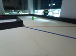
    </td>
  </tr>

  <!-- Step 2 -->
  <tr>
    <td style="border: 1px solid black; padding: 8px; text-align: center;"><b>2</b></td>
    <td style="border: 1px solid black; padding: 8px;"><b>RGB → HSV</b></td>
    <td style="border: 1px solid black; padding: 8px;"><code>cv.COLOR_RGB2HSV</code></td>
    <td style="border: 1px solid black; padding: 8px;">Color detection independent of light intensity</td>
    <td style="border: 1px solid black; padding: 8px; text-align: center;">
      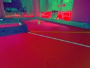
    </td>
  </tr>

  <!-- Step 3 -->
  <tr>
    <td bgcolor="#EAF4FB" style="border: 1px solid black; padding: 8px; text-align: center;"><b>3</b></td>
    <td bgcolor="#EAF4FB" style="border: 1px solid black; padding: 8px;"><b>Red mask range 1</b></td>
    <td bgcolor="#EAF4FB" style="border: 1px solid black; padding: 8px;">H 0–10, S 190–255,<br>V 190–255</td>
    <td bgcolor="#EAF4FB" style="border: 1px solid black; padding: 8px;">Rich, bright red (hue near 0°)</td>
    <td bgcolor="#EAF4FB" style="border: 1px solid black; padding: 8px; text-align: center;">
      -
    </td>
  </tr>

  <!-- Step 4 -->
  <tr>
    <td style="border: 1px solid black; padding: 8px; text-align: center;"><b>4</b></td>
    <td style="border: 1px solid black; padding: 8px;"><b>Red mask range 2</b></td>
    <td style="border: 1px solid black; padding: 8px;">H 160–179, S 100–255,<br>V 20–255</td>
    <td style="border: 1px solid black; padding: 8px;">Red at the upper hue end (wrap-around at 180°)</td>
    <td style="border: 1px solid black; padding: 8px; text-align: center;">
      -
    </td>
  </tr>

  <!-- Step 5 -->
  <tr>
    <td bgcolor="#EAF4FB" style="border: 1px solid black; padding: 8px; text-align: center;"><b>5</b></td>
    <td bgcolor="#EAF4FB" style="border: 1px solid black; padding: 8px;"><b>Combined red mask</b></td>
    <td bgcolor="#EAF4FB" style="border: 1px solid black; padding: 8px;"><code>maskred = mask1 + mask2</code></td>
    <td bgcolor="#EAF4FB" style="border: 1px solid black; padding: 8px;">Both red ranges combined</td>
    <td bgcolor="#EAF4FB" style="border: 1px solid black; padding: 8px; text-align: center;">
      
    </td>
  </tr>

  <!-- Step 6 -->
  <tr>
    <td style="border: 1px solid black; padding: 8px; text-align: center;"><b>6</b></td>
    <td style="border: 1px solid black; padding: 8px;"><b>Green mask</b></td>
    <td style="border: 1px solid black; padding: 8px;">H 35–95, S 100–255,<br>V 20–255</td>
    <td style="border: 1px solid black; padding: 8px;">Green tones from yellow-green to cyan</td>
    <td style="border: 1px solid black; padding: 8px; text-align: center;">
      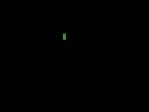
    </td>
  </tr>

  <!-- Step 7 -->
  <tr>
    <td bgcolor="#EAF4FB" style="border: 1px solid black; padding: 8px; text-align: center;"><b>7</b></td>
    <td bgcolor="#EAF4FB" style="border: 1px solid black; padding: 8px;"><b>Black mask</b></td>
    <td bgcolor="#EAF4FB" style="border: 1px solid black; padding: 8px;">H 0–255, S 0–255,<br>V 0–90</td>
    <td bgcolor="#EAF4FB" style="border: 1px solid black; padding: 8px;">Course walls (low brightness)</td>
    <td bgcolor="#EAF4FB" style="border: 1px solid black; padding: 8px; text-align: center;">
      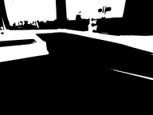
    </td>
  </tr>

  <!-- Step 8 -->
  <tr>
    <td style="border: 1px solid black; padding: 8px; text-align: center;"><b>8</b></td>
    <td style="border: 1px solid black; padding: 8px;"><b>Rectangular region mask</b></td>
    <td style="border: 1px solid black; padding: 8px;">y/x rectangle per section</td>
    <td style="border: 1px solid black; padding: 8px;">Restrict the field of view to the relevant image region</td>
    <td style="border: 1px solid black; padding: 8px; text-align: center;">
      
    </td>
  </tr>

  <!-- Step 9 -->
  <tr>
    <td bgcolor="#EAF4FB" style="border: 1px solid black; padding: 8px; text-align: center;"><b>9</b></td>
    <td bgcolor="#EAF4FB" style="border: 1px solid black; padding: 8px;"><b>Flood fill</b></td>
    <td bgcolor="#EAF4FB" style="border: 1px solid black; padding: 8px;">
      Start: (fillx, filly) in the open area;<br>
      Barrier: black mask
    </td>
    <td bgcolor="#EAF4FB" style="border: 1px solid black; padding: 8px;">Mark the connected open area with 128</td>
    <td bgcolor="#EAF4FB" style="border: 1px solid black; padding: 8px; text-align: center;">
      
    </td>
  </tr>

  <!-- Step 10 -->
  <tr>
    <td style="border: 1px solid black; padding: 8px; text-align: center;"><b>10</b></td>
    <td style="border: 1px solid black; padding: 8px;"><b>Final mask</b></td>
    <td style="border: 1px solid black; padding: 8px;">All pixels with value 128</td>
    <td style="border: 1px solid black; padding: 8px;">Open area only, no walls</td>
    <td style="border: 1px solid black; padding: 8px; text-align: center;">
      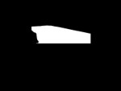
    </td>
  </tr>

  <!-- Step 10b -->
  <tr>
    <td style="border: 1px solid black; padding: 8px; text-align: center;"><b>10b</b></td>
    <td style="border: 1px solid black; padding: 8px;"><b>Final mask applied to Image 1</b></td>
    <td style="border: 1px solid black; padding: 8px;">For debugging only</td>
    <td style="border: 1px solid black; padding: 8px;"></td>
    <td style="border: 1px solid black; padding: 8px; text-align: center;">
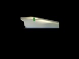
    </td>
  </tr>

  <!-- Step 11 -->
  <tr>
    <td bgcolor="#EAF4FB" style="border: 1px solid black; padding: 8px; text-align: center;"><b>11</b></td>
    <td bgcolor="#EAF4FB" style="border: 1px solid black; padding: 8px;"><b>Restrict red + green</b></td>
    <td bgcolor="#EAF4FB" style="border: 1px solid black; padding: 8px;"><code>bitwise_AND</code> with final mask</td>
    <td bgcolor="#EAF4FB" style="border: 1px solid black; padding: 8px;">Only consider obstacles within the open area</td>
    <td bgcolor="#EAF4FB" style="border: 1px solid black; padding: 8px; text-align: center;">
      -
    </td>
  </tr>

  <!-- Step 12 -->
  <tr>
    <td style="border: 1px solid black; padding: 8px; text-align: center;"><b>12</b></td>
    <td style="border: 1px solid black; padding: 8px;"><b>Contour detection</b></td>
    <td style="border: 1px solid black; padding: 8px;">
      <code>RETR_EXTERNAL</code>,<br>
      minimum area 200 px²
    </td>
    <td style="border: 1px solid black; padding: 8px;">Find connected colored areas</td>
    <td style="border: 1px solid black; padding: 8px; text-align: center;">
      -
    </td>
  </tr>

  <!-- Step 13 -->
  <tr>
    <td bgcolor="#EAF4FB" style="border: 1px solid black; padding: 8px; text-align: center;"><b>13</b></td>
    <td bgcolor="#EAF4FB" style="border: 1px solid black; padding: 8px;"><b>Obstacle selection</b></td>
    <td bgcolor="#EAF4FB" style="border: 1px solid black; padding: 8px;">
      Region 1/3: max(cx)<br>
      Otherwise: min(distance to vehicle)
    </td>
    <td bgcolor="#EAF4FB" style="border: 1px solid black; padding: 8px;">Determine the most relevant obstacle per section</td>
    <td bgcolor="#EAF4FB" style="border: 1px solid black; padding: 8px; text-align: center;">
      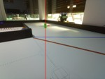
    </td>
  </tr>

</table>

## **Software improvements**
During development and test runs, errors were identified, their causes analyzed, and fixed through **targeted code changes**. The two largest iterations – softening the steering with a second P-controller (<code>pidSteer2</code>) and replacing the scan-while-driving logic with the full-scan strategy – are described together with their testing rationale in the [driving primitives](#driving-primitives-in-drivecontrollerpy) and [obstacle challenge](#obstacle-challenge-driving-strategy---strategy-change) sections above. The remaining perception and recovery fixes are summarized in the following table.

#### Table 17: Software improvements

<table align="center" border="1" style="border-collapse: collapse; border: 2px solid black;">

  <!-- Table header -->
  <tr>
    <th bgcolor="#4A90C2" width="250" style="border: 1px solid black; border-bottom: 3px solid black; padding: 8px; color: white;">Observed error</th>
    <th bgcolor="#4A90C2" width="260" style="border: 1px solid black; border-bottom: 3px solid black; padding: 8px; color: white;">Cause</th>
    <th bgcolor="#4A90C2" width="400" style="border: 1px solid black; border-bottom: 3px solid black; padding: 8px; color: white;">Code change</th>
    <th bgcolor="#4A90C2" width="260" style="border: 1px solid black; border-bottom: 3px solid black; padding: 8px; color: white;">Effect</th>
  </tr>

  <!-- Perception 1 -->
  <tr>
    <td bgcolor="#EAF4FB" style="border: 1px solid black; padding: 8px;"><b>Obstacle was not detected or detected incorrectly</b></td>
    <td bgcolor="#EAF4FB" style="border: 1px solid black; padding: 8px;">Color mask did not match lighting conditions</td>
    <td bgcolor="#EAF4FB" style="border: 1px solid black; padding: 8px;">Adjusted HSV thresholds in <code>cameraAIO.py</code></td>
    <td bgcolor="#EAF4FB" style="border: 1px solid black; padding: 8px;">More reliable red/green detection</td>
  </tr>

  <!-- Perception 2 -->
  <tr>
    <td style="border: 1px solid black; padding: 8px;"><b>Black wall was segmented incorrectly</b></td>
    <td style="border: 1px solid black; padding: 8px;">Lighting changed the brightness of the wall</td>
    <td style="border: 1px solid black; padding: 8px;">Adjusted black mask and flood fill</td>
    <td style="border: 1px solid black; padding: 8px;">Drivable area was detected more cleanly</td>
  </tr>

  <!-- Recovery 1 -->
  <tr>
    <td bgcolor="#EAF4FB" style="border: 1px solid black; padding: 8px;"><b>Corner entry too late – car drove too wide</b></td>
    <td bgcolor="#EAF4FB" style="border: 1px solid black; padding: 8px;">A window's reflection confused the ToF camera</td>
    <td bgcolor="#EAF4FB" style="border: 1px solid black; padding: 8px;">Function returns True if the side wall is lost while driving → robot reverses 510 mm</td>
    <td bgcolor="#EAF4FB" style="border: 1px solid black; padding: 8px;">Robot corrects its position after wall loss</td>
  </tr>

  <!-- Recovery 2 -->
  <tr>
    <td style="border: 1px solid black; padding: 8px;"><b><code>driveAwayFromWall()</code> stopped too early on brief wall loss</b></td>
    <td style="border: 1px solid black; padding: 8px;">No encoder fallback: function ended immediately if the wall was not detected</td>
    <td style="border: 1px solid black; padding: 8px;">Remaining distance (<code>leftToDrive</code>) is stored; driving continues via encoder until the target distance is reached (<code>driveController.py</code>)</td>
    <td style="border: 1px solid black; padding: 8px;">Maneuver completes correctly even with brief sensor dropout</td>
  </tr>

  <!-- Recovery 3 -->
  <tr>
    <td bgcolor="#EAF4FB" style="border: 1px solid black; padding: 8px;"><b>Parking (<code>parkCW</code>) ended up in the wrong position</b></td>
    <td bgcolor="#EAF4FB" style="border: 1px solid black; padding: 8px;"><code>parkCW()</code> drove blindly backward and forward without checking position</td>
    <td bgcolor="#EAF4FB" style="border: 1px solid black; padding: 8px;">Distance to the side wall and rear wall is measured before parking; recovery maneuver depending on sensor readings (<code>obstacleChallenge.py</code>)</td>
    <td bgcolor="#EAF4FB" style="border: 1px solid black; padding: 8px;">More robust, position-dependent parking into the parking spot</td>
  </tr>

</table>


<br><br>

# **Overall robot system and technical decisions**

## **Design constraints**

Before going into the individual architecture decisions, we summarize the main constraints that limited our design from the start – and the specific consequence each had for the vehicle.

#### Table 18: Design constraints and their consequences

<table align="center" border="1" style="border-collapse: collapse; border: 2px solid black;">

  <tr>
    <th bgcolor="#4A90C2" width="360" style="border: 1px solid black; border-bottom: 3px solid black; padding: 8px; color: white;">Constraint</th>
    <th bgcolor="#4A90C2" width="440" style="border: 1px solid black; border-bottom: 3px solid black; padding: 8px; color: white;">Consequence for the design</th>
  </tr>

  <tr>
    <td bgcolor="#EAF4FB" style="border: 1px solid black; padding: 8px;"><b>Maximum vehicle dimensions (WRO competition rules)</b></td>
    <td bgcolor="#EAF4FB" style="border: 1px solid black; padding: 8px;">Compact Compute Module 5 instead of Raspberry Pi 5, own baseboard developed (cf. <a href="#raspberry-pi-5-vs-raspberry-pi-cm5">„Raspberry Pi 5 vs. Raspberry Pi CM5“</a>)</td>
  </tr>

  <tr>
    <td style="border: 1px solid black; padding: 8px;"><b>Goal: significantly shorter lap time than the previous year's model</b></td>
    <td style="border: 1px solid black; padding: 8px;">Switch from LiDAR to ToF sensors (measurement latency 100–200 ms → approx. 33 ms), control without stopping (cf. <a href="#distance-sensors">Distance sensors</a>, <a href="#lidar-vs-time-of-flight-sensors--control-paradigm">„LiDAR vs. time-of-flight sensors / control paradigm“</a>)</td>
  </tr>

  <tr>
    <td bgcolor="#EAF4FB" style="border: 1px solid black; padding: 8px;"><b>Limited space in the chassis for PCB, axles, and sensors</b></td>
    <td bgcolor="#EAF4FB" style="border: 1px solid black; padding: 8px;">Base-deck dimensions dictated by PCB size, over 15 iteratively adapted base-deck versions (cf. <a href="#chassis-and-mechanical-structure">Chassis and mechanical structure</a>)</td>
  </tr>

  <tr>
    <td style="border: 1px solid black; padding: 8px;"><b>Variable lighting conditions in the competition environment</b></td>
    <td style="border: 1px solid black; padding: 8px;">HSV color masks must be recalibrated before each run (cf. <a href="#table-7-hsv-color-masks-and-calibration-parameters">Table 7</a>)</td>
  </tr>

  <tr>
    <td bgcolor="#EAF4FB" style="border: 1px solid black; padding: 8px;"><b>Limited measurement frequency of the ToF sensors in 8×8 mode</b></td>
    <td bgcolor="#EAF4FB" style="border: 1px solid black; padding: 8px;">Only approx. 30 Hz instead of the higher frequency expected from the datasheet; sensor height/position optimized for this (cf. <a href="#table-9-detection-reliability-at-different-sensor-heights">Table 9</a>)</td>
  </tr>

  <tr>
    <td style="border: 1px solid black; padding: 8px;"><b>Raised center of gravity due to 27 cm camera height</b></td>
    <td style="border: 1px solid black; padding: 8px;">Speed limit in tight corners on grippy surfaces (cf. <a href="#camera-height-and-detection-strategy">„Camera height and detection strategy“</a>)</td>
  </tr>

  <tr>
    <td bgcolor="#EAF4FB" style="border: 1px solid black; padding: 8px;"><b>Limited battery capacity and space for the energy storage</b></td>
    <td bgcolor="#EAF4FB" style="border: 1px solid black; padding: 8px;">3S instead of 2S battery, regulator sized for a worst-case peak current of approx. 3.2 A (cf. <a href="#power-budget-power-supply-and-consumption">Power budget</a>)</td>
  </tr>

</table>
<br>

## **System-level risks**

The [Power and sensors section](#power-and-sensors) already documents component-specific failure modes in sensors and power supply ([Table 12](#table-12-failure-modes-detection-and-countermeasures)). Here we add a risk/FMEA-light view at the **system level** – i.e. risks arising from the interplay of multiple subsystems.

#### Table 19: System risks, detection, and countermeasures

<table align="center" border="1" style="border-collapse: collapse; border: 2px solid black;">

  <tr>
    <th bgcolor="#4A90C2" width="260" style="border: 1px solid black; border-bottom: 3px solid black; padding: 8px; color: white;">Risk</th>
    <th bgcolor="#4A90C2" width="180" style="border: 1px solid black; border-bottom: 3px solid black; padding: 8px; color: white;">Probability / impact</th>
    <th bgcolor="#4A90C2" width="260" style="border: 1px solid black; border-bottom: 3px solid black; padding: 8px; color: white;">Detection</th>
    <th bgcolor="#4A90C2" width="280" style="border: 1px solid black; border-bottom: 3px solid black; padding: 8px; color: white;">Countermeasure</th>
  </tr>

  <tr>
    <td bgcolor="#EAF4FB" style="border: 1px solid black; padding: 8px;">Center-of-gravity shift due to raised camera position (27 cm) → tipping in fast corners</td>
    <td bgcolor="#EAF4FB" style="border: 1px solid black; padding: 8px;">Medium / High (complete run abort)</td>
    <td bgcolor="#EAF4FB" style="border: 1px solid black; padding: 8px;">Observed during the test run in Nordhorn on a grippier mat – vehicle nearly tipped over in fast corners</td>
    <td bgcolor="#EAF4FB" style="border: 1px solid black; padding: 8px;"><b>Reduced maximum cornering speed</b> on site (cf. <a href="#camera-height-and-detection-strategy">„Camera height and detection strategy“</a>)</td>
  </tr>

  <tr>
    <td style="border: 1px solid black; padding: 8px;">Single point of failure: one central, self-developed baseboard carries the CM5, STM32, motor driver, and sensors simultaneously</td>
    <td style="border: 1px solid black; padding: 8px;">Low / Very high (total robot failure)</td>
    <td style="border: 1px solid black; padding: 8px;">Layout/footprint errors on PCB version 2 (wrong STM32 footprint, defective camera connectors)</td>
    <td style="border: 1px solid black; padding: 8px;"><b>Extensive breadboard test phase</b> before the first PCB order; faulty board <b>identified and redesigned</b> (cf. milestone „Breadboard test phase“ in the <a href="#development-milestones">Development milestones</a> section)</td>
  </tr>

  <tr>
    <td bgcolor="#EAF4FB" style="border: 1px solid black; padding: 8px;">Simultaneous peak load of multiple subsystems (servo + CM5 + 4× ToF) on a shared battery/regulator</td>
    <td bgcolor="#EAF4FB" style="border: 1px solid black; padding: 8px;">Low / High (voltage drop, reset of the whole system)</td>
    <td bgcolor="#EAF4FB" style="border: 1px solid black; padding: 8px;">Worst-case calculation in the power budget (approx. 3.2 A peak current, cf. <a href="#worst-case-peak-current-and-regulator-sizing">Worst-case peak current and regulator sizing</a>)</td>
    <td bgcolor="#EAF4FB" style="border: 1px solid black; padding: 8px;"><b>3S battery with sufficient reserve</b>, <b>regulator sized for peak current</b>; actual measurement confirms significantly lower continuous consumption (7–10 W)</td>
  </tr>

  <tr>
    <td style="border: 1px solid black; padding: 8px;">Communication failure between CM5 and STM32 (UART, 921,600 baud) → high-level logic loses control over driving</td>
    <td style="border: 1px solid black; padding: 8px;">Low / High (vehicle no longer responds to target values)</td>
    <td style="border: 1px solid black; padding: 8px;">No dedicated detection implemented so far (no watchdog/timeout)</td>
    <td style="border: 1px solid black; padding: 8px;"><b>Commands are sent cyclically</b>, so a lost command is automatically retransmitted in the next cycle. Persistent connection loss remains an open item for the next version (e.g. <b>watchdog timer</b> and <b>defined fail-safe behavior</b>).</td>
  </tr>

</table>
<br>

## **Our robot**

#### Figure 22: Final robot from six perspectives with dimensions:

</div><div align="center">
    <a href="img/sechs_ansichten.png" target="_blank">
        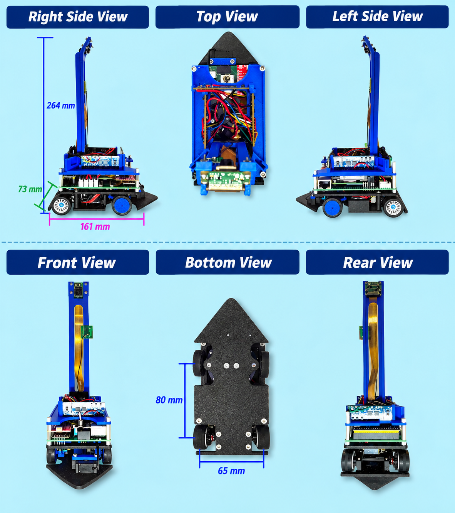
    </a>
</div>

## **Technical specifications**

#### Table 20: Technical specifications

<table align="center" border="1" style="border-collapse: collapse; border: 2px solid black;">

  <!-- Table header -->
  <tr>
    <th bgcolor="#4A90C2" width="320" style="border: 1px solid black; border-bottom: 3px solid black; padding: 8px; color: white;">Characteristic</th>
    <th bgcolor="#4A90C2" width="560" style="border: 1px solid black; border-bottom: 3px solid black; padding: 8px; color: white;">Value</th>
  </tr>

  <!-- Total weight -->
  <tr>
    <td bgcolor="#EAF4FB" style="border: 1px solid black; padding: 8px;"><b>Total weight</b></td>
    <td bgcolor="#EAF4FB" style="border: 1px solid black; padding: 8px;">approx. 400 g</td>
  </tr>

  <!-- Maximum speed -->
  <tr>
    <td style="border: 1px solid black; padding: 8px;"><b>Maximum speed</b></td>
    <td style="border: 1px solid black; padding: 8px;">approx. 2.1 m/s (measured in the vehicle)</td>
  </tr>

  <!-- Wheelbase -->
  <tr>
    <td bgcolor="#EAF4FB" style="border: 1px solid black; padding: 8px;"><b>Wheelbase</b></td>
    <td bgcolor="#EAF4FB" style="border: 1px solid black; padding: 8px;">80 mm</td>
  </tr>

  <!-- Track width -->
  <tr>
    <td style="border: 1px solid black; padding: 8px;"><b>Track width</b></td>
    <td style="border: 1px solid black; padding: 8px;">65 mm</td>
  </tr>

  <!-- Minimum turning radius -->
  <tr>
    <td bgcolor="#EAF4FB" style="border: 1px solid black; padding: 8px;"><b>Minimum turning radius</b></td>
    <td bgcolor="#EAF4FB" style="border: 1px solid black; padding: 8px;">approx. 114 mm</td>
  </tr>

  <!-- Drivetrain -->
  <tr>
    <td style="border: 1px solid black; padding: 8px;"><b>Drivetrain</b></td>
    <td style="border: 1px solid black; padding: 8px;">N30 6V 1500 rpm, total gear ratio 24.4:1</td>
  </tr>

  <!-- Steering -->
  <tr>
    <td bgcolor="#EAF4FB" style="border: 1px solid black; padding: 8px;"><b>Steering</b></td>
    <td bgcolor="#EAF4FB" style="border: 1px solid black; padding: 8px;">Ackermann steering, 1× INJORA N30 Nano servo</td>
  </tr>

  <!-- Front axle bearings -->
  <tr>
    <td style="border: 1px solid black; padding: 8px;"><b>Front axle bearings</b></td>
    <td style="border: 1px solid black; padding: 8px;">10× ball bearings (8× front axle: 2× steering knuckle + 2× wheel per side)</td>
  </tr>

  <!-- Rear axle -->
  <tr>
    <td bgcolor="#EAF4FB" style="border: 1px solid black; padding: 8px;"><b>Rear axle</b></td>
    <td bgcolor="#EAF4FB" style="border: 1px solid black; padding: 8px;">Ball differential (model-making purchased part), instead of a printed rigid axle</td>
  </tr>

  <!-- Main computer -->
  <tr>
    <td style="border: 1px solid black; padding: 8px;"><b>Main computer</b></td>
    <td style="border: 1px solid black; padding: 8px;">Raspberry Pi CM5 on our own baseboard</td>
  </tr>

  <!-- Own carrier board (baseboard) -->
  <tr>
    <td bgcolor="#EAF4FB" style="border: 1px solid black; padding: 8px;"><b>Own carrier board (baseboard)</b></td>
    <td bgcolor="#EAF4FB" style="border: 1px solid black; padding: 8px;">Self-developed PCB for CM5, STM32, sensors, and motor driver (KiCad project: <code>kicad/baseboard</code>)</td>
  </tr>

  <!-- Microcontroller -->
  <tr>
    <td style="border: 1px solid black; padding: 8px;"><b>Mikrocontroller</b></td>
    <td style="border: 1px solid black; padding: 8px;">STM32F411 BlackPill</td>
  </tr>

  <!-- Distance sensors -->
  <tr>
    <td bgcolor="#EAF4FB" style="border: 1px solid black; padding: 8px;"><b>Distance sensors</b></td>
    <td bgcolor="#EAF4FB" style="border: 1px solid black; padding: 8px;">4× VL53L8CX time-of-flight (30 Hz)</td>
  </tr>

  <!-- Camera -->
  <tr>
    <td style="border: 1px solid black; padding: 8px;"><b>Camera</b></td>
    <td style="border: 1px solid black; padding: 8px;">Raspberry Pi Camera Module 3 Wide, 12 MP (mounting height 27 cm)</td>
  </tr>

  <!-- Orientation sensor -->
  <tr>
    <td bgcolor="#EAF4FB" style="border: 1px solid black; padding: 8px;"><b>Orientation sensor</b></td>
    <td bgcolor="#EAF4FB" style="border: 1px solid black; padding: 8px;">BNO086 (gyroscope)</td>
  </tr>

  <!-- Power supply -->
  <tr>
    <td style="border: 1px solid black; padding: 8px;"><b>Battery</b></td>
    <td style="border: 1px solid black; padding: 8px;">3S LiPo, 11.1 V, 550 mAh</td>
  </tr>

  <!-- Power consumption -->
  <tr>
    <td bgcolor="#EAF4FB" style="border: 1px solid black; padding: 8px;"><b>Power consumption</b></td>
    <td bgcolor="#EAF4FB" style="border: 1px solid black; padding: 8px;">7–10 W (measured)</td>
  </tr>

  <!-- Battery runtime -->
  <tr>
    <td style="border: 1px solid black; padding: 8px;"><b>Battery runtime</b></td>
    <td style="border: 1px solid black; padding: 8px;">approx. 40 min (measured in practice)</td>
  </tr>

  <!-- Chassis -->
  <tr>
    <td bgcolor="#EAF4FB" style="border: 1px solid black; padding: 8px;"><b>Chassis</b></td>
    <td bgcolor="#EAF4FB" style="border: 1px solid black; padding: 8px;">3-part chassis (lower, middle, upper deck), material PPA-CF (3D printed)</td>
  </tr>

</table>

A complete shopping list with sources, photos, and the required CAD files for replication is at the beginning of [Chapter 5](#5-construction-guide).

## **System architecture**
The software-side task distribution between the Raspberry Pi CM5 and STM32F411 – including a module overview and the communication protocol – is described in the sections [Software architecture](#software-architecture) and [Serial communication and data model](#serial-communication-and-data-model). At the system level, the **mutual influence of the mechanical and electronic components** is decisive. The dimensions of the self-developed PCB determined the length of the chassis. The compact chassis required a correspondingly space-saving integration of the computing unit. The raised camera position improved the system's field of view, but affected the vehicle's center of gravity. The sensor layout depended on the available installation space and the required field of view. The following block diagram summarizes this overall architecture and shows how computing units, actuators, and sensors interact in the system.

#### Figure 23: Block diagram of the system architecture

</div><div align="center">
    <a href="img/Blockschaltbild_englisch.png" target="_blank">
        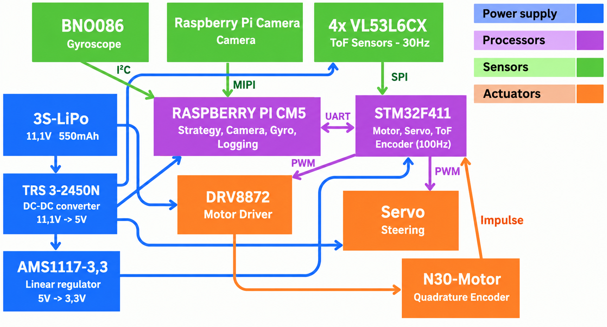
    </a>
</div>

## **Key technical decisions**

Over the course of development, we made a number of fundamental decisions that significantly shaped the overall system. The following sections describe the most important of these decisions – in each case following the pattern **constraint → alternatives → evidence → decision → consequence**, i.e. the boundary condition we faced, the options we considered, the measurements or observations behind our choice, the decision itself, and the downside we consciously accepted.

### **Raspberry Pi vs. pure microcontroller**

The **most fundamental architecture decision** was whether to use a full single-board computer (Raspberry Pi) or exclusively microcontrollers for control. A pure microcontroller approach would have made the vehicle significantly smaller and more power-efficient – the Raspberry Pi CM5 alone is the single largest power consumer in the system and takes up a considerable portion of the available installation space.

We nevertheless deliberately chose the **Raspberry Pi**. The decisive reason was development speed: Python on the Raspberry Pi is a development environment we are familiar with, and the high computing power allows complex image processing and driving strategy to be implemented in an easy-to-handle high-level language. A purely microcontroller-based approach would have made image processing considerably harder or severely limited on resource-constrained systems. The consciously accepted downsides were partially compensated for by switching from the Raspberry Pi 5 to the Compute Module 5.


### **Raspberry Pi 5 vs. Raspberry Pi CM5**
Within the Raspberry Pi platform, we decided against the Pi 5 and in favor of the **Compute Module 5**. The Pi 5 was simply too large for the intended chassis format and brought many connectors (HDMI, USB-A, …) that we do not need in competition operation. The CM5 is more compact, but requires its own carrier PCB (baseboard), which we developed entirely ourselves. The additional effort of developing our own PCB was thus a direct consequence of this decision.

### **LiDAR vs. time-of-flight sensors / control paradigm**

The switch from LiDAR to four **ToF sensors** reduced the measurement latency from 100–200 ms to approx. 33 ms – making fully stop-free control possible for the first time. However, it had a direct consequence for the entire software architecture: since the ToF sensors do not provide position determination, the coordinate-based control had to be abandoned. Driving commands since then no longer read "go to coordinate X/Y", but "drive until the wall distance is 20 cm". → cf. [Concept](#concept), [Distance sensors](#distance-sensors), [Driving primitives in driveController.py](#driving-primitives-in-drivecontrollerpy)

 ### **Camera height and detection strategy** 

Three weeks before the German regional competition, the camera was raised to **27 cm**, just below the permitted maximum height. This allowed the vehicle to capture all obstacles from the starting position at once and switch to a one-time **full scan** before setting off. The time per run dropped from **56 s to 38 s**. Downside: the center of gravity shifted noticeably upward – at the competition in Nordhorn, the robot nearly tipped over in fast corners, since the mat there was significantly grippier than our practice mat. As a consequence, we reduced the maximum speed on site. → cf. [Camera](#camera-use-of-the-camera-and-calibration), [Old strategy: scanning while driving](#old-strategy-scanning-while-driving), [New strategy: full scan, fixed route](#new-strategy-full-scan-fixed-route)
<br>

### **Chassis material: PLA vs. PPA-CF**

**PLA** creeps under motor load and thereby changes both the gear backlash and the sensor angles over time. **PPA-CF** eliminated this problem completely, although the base deck, slightly warped due to the extreme stiffness, had to be corrected with a heat gun. → cf. [Chassis design](#chassis-design)

### **Gyro: BNO055 with and without magnetometer vs. BNO086 without magnetometer**

The BNO055 showed intolerable, non-calibratable deviations both with and without a magnetometer. The **BNO086 without magnetometer** reduced the deviation to approx. 1° after three laps and was therefore reliably usable – at the cost of giving up a magnetometer-assisted absolute heading reference. → cf. [Gyro](#gyro)

### **Rear axle: ball differential vs. rigid axle**

Instead of a simple printed rigid axle, we installed a **ball differential** from the model-making sector. A rigid axle would inevitably have caused slip in corners, since both wheels would rotate at identical speed. A self-printed differential was ruled out, since a compact differential is difficult to manufacture by 3D printing. → cf. [Rear axle and differential](#rear-axle-and-differential)

### **ToF sensor: VL53L8CX vs. TMF8828**

At the time, the choice fell on the **VL53L8CX**, since the datasheet indicated a significantly higher measurement frequency than the TMF8828. In practice, however, it turned out that only about 30 Hz was achievable in 8×8 mode – eliminating the supposed advantage. In hindsight, the TMF8828 would have been an equally good or better choice; a switch was no longer realistic at that point in time. → cf. [Selection of distance sensors](#selection-of-distance-sensors)


## **Development milestones**

The final robot did not emerge from a single development step, but through multiple iterations of tests, failed attempts, and technical optimizations. The following table shows the most important milestones and the resulting changes to the system.

#### Table 21: Development milestones

<table align="center" border="1" style="border-collapse: collapse; border: 2px solid black;">

  <!-- Table header -->
  <tr>
    <th bgcolor="#4A90C2" width="130" style="border: 1px solid black; border-bottom: 3px solid black; padding: 8px; color: white;">Period</th>
    <th bgcolor="#4A90C2" width="240" style="border: 1px solid black; border-bottom: 3px solid black; padding: 8px; color: white;">Milestone</th>
    <th bgcolor="#4A90C2" width="360" style="border: 1px solid black; border-bottom: 3px solid black; padding: 8px; color: white;">Trigger / problem / idea</th>
    <th bgcolor="#4A90C2" width="400" style="border: 1px solid black; border-bottom: 3px solid black; padding: 8px; color: white;">Result</th>
  </tr>

  <tr>
    <td bgcolor="#EAF4FB" style="border: 1px solid black; padding: 8px;">Before 2026 season</td>
    <td bgcolor="#EAF4FB" style="border: 1px solid black; padding: 8px;"><b>Concept decision</b></td>
    <td bgcolor="#EAF4FB" style="border: 1px solid black; padding: 8px;">Analysis of the previous year's robot's weaknesses (too large, too slow)</td>
    <td bgcolor="#EAF4FB" style="border: 1px solid black; padding: 8px;">Redesign of chassis, electronics, and driving strategy (cf. <a href="#development-goal">Development goal</a>, <a href="#concept">Concept</a>)</td>
  </tr>

  <tr>
    <td style="border: 1px solid black; padding: 8px;">January–February</td>
    <td style="border: 1px solid black; padding: 8px;"><b>Breadboard test phase</b></td>
    <td style="border: 1px solid black; padding: 8px;">Risk reduction before the first PCB order</td>
    <td style="border: 1px solid black; padding: 8px;">All components work together (cf. <a href="#electronics-setup">Electronics setup</a>)</td>
  </tr>

  <tr>
    <td bgcolor="#EAF4FB" style="border: 1px solid black; padding: 8px;">Mid-February</td>
    <td bgcolor="#EAF4FB" style="border: 1px solid black; padding: 8px;"><b>Design and manufacturing of PCB version 1</b></td>
    <td bgcolor="#EAF4FB" style="border: 1px solid black; padding: 8px;">Breadboard phase complete; all components validated</td>
    <td bgcolor="#EAF4FB" style="border: 1px solid black; padding: 8px;">Board ordered (cf. <a href="#electronics-setup">Electronics setup</a>)</td>
  </tr>

  <tr>
    <td style="border: 1px solid black; padding: 8px;">Early March</td>
    <td style="border: 1px solid black; padding: 8px;"><b>Design and manufacturing of PCB version 2</b></td>
    <td style="border: 1px solid black; padding: 8px;">Wrong footprint for the STM32; camera connectors faulty → board completely unusable</td>
    <td style="border: 1px solid black; padding: 8px;">Board redesigned and reordered; all interfaces functional afterward; board ready for use (cf. <a href="#electronics-setup">Electronics setup</a>)</td>
  </tr>

  <tr>
    <td bgcolor="#EAF4FB" style="border: 1px solid black; padding: 8px;">Mid-March</td>
    <td bgcolor="#EAF4FB" style="border: 1px solid black; padding: 8px;"><b>Design and production of chassis, rear axle, steering</b></td>
    <td bgcolor="#EAF4FB" style="border: 1px solid black; padding: 8px;">PCB version 2 available; mechanical integration can begin</td>
    <td bgcolor="#EAF4FB" style="border: 1px solid black; padding: 8px;">Vehicle drives; motor and steering work – electronics not yet mounted (cf. <a href="#chassis-and-mechanical-structure">Chassis and mechanical structure</a>, <a href="#drivetrain-concept-and-motor-selection">Drivetrain concept and motor selection</a>, <a href="#rear-axle-and-differential">Rear axle and differential</a>, <a href="#front-axle-and-steering">Front axle and steering</a>)</td>
  </tr>

  <tr>
    <td style="border: 1px solid black; padding: 8px;">Mid-March</td>
    <td style="border: 1px solid black; padding: 8px;"><b>Design of the middle part as a mount for the main PCB</b></td>
    <td style="border: 1px solid black; padding: 8px;">Board available; Raspberry Pi and STM32 need to be mounted</td>
    <td style="border: 1px solid black; padding: 8px;">Raspberry Pi and STM32 mounted and connected to motor and steering (cf. <a href="#electronics-setup">Electronics setup</a>)</td>
  </tr>

  <tr>
    <td bgcolor="#EAF4FB" style="border: 1px solid black; padding: 8px;">Late March</td>
    <td bgcolor="#EAF4FB" style="border: 1px solid black; padding: 8px;"><b>Start of software development for Raspberry Pi and STM32</b></td>
    <td bgcolor="#EAF4FB" style="border: 1px solid black; padding: 8px;">Mechanical base and electronics ready for use</td>
    <td bgcolor="#EAF4FB" style="border: 1px solid black; padding: 8px;">Motor and steering controllable via software; speed measurement for motor selection (cf. <a href="#drivetrain-concept-and-motor-selection">Drivetrain concept and motor selection</a>)</td>
  </tr>

  <tr>
    <td style="border: 1px solid black; padding: 8px;">Early April</td>
    <td style="border: 1px solid black; padding: 8px;"><b>Design and production of the upper deck with ToF sensors and camera</b></td>
    <td style="border: 1px solid black; padding: 8px;">Sensors and camera needed a fixed, reproducible mounting position</td>
    <td style="border: 1px solid black; padding: 8px;">All sensors and camera mounted; vehicle mechanically complete (cf. <a href="#camera-use-of-the-camera-and-calibration">Camera</a>, <a href="#distance-sensors">Distance sensors</a>)</td>
  </tr>

  <tr>
    <td bgcolor="#EAF4FB" style="border: 1px solid black; padding: 8px;">Mid-April</td>
    <td bgcolor="#EAF4FB" style="border: 1px solid black; padding: 8px;"><b>Hardware development completed / focus shift to software development</b></td>
    <td bgcolor="#EAF4FB" style="border: 1px solid black; padding: 8px;">Mechanical build completed</td>
    <td bgcolor="#EAF4FB" style="border: 1px solid black; padding: 8px;">Development focus shifts to software; basic driving functions available, opening challenge complete (cf. <a href="#driving-primitives-in-drivecontrollerpy">Driving primitives in driveController.py</a>, <a href="#opening-challenge-driving-strategy">Opening challenge driving strategy</a>)</td>
  </tr>

  <tr>
    <td style="border: 1px solid black; padding: 8px;">Mid-April</td>
    <td style="border: 1px solid black; padding: 8px;"><b>Chassis material change</b></td>
    <td style="border: 1px solid black; padding: 8px;">PLA creeps under motor load; gear backlash worsens</td>
    <td style="border: 1px solid black; padding: 8px;">Switched to PPA-CF; base deck corrected with heat gun (cf. <a href="#chassis-design">Chassis design</a>)</td>
  </tr>

  <tr>
    <td bgcolor="#EAF4FB" style="border: 1px solid black; padding: 8px;">Late April – mid-May</td>
    <td bgcolor="#EAF4FB" style="border: 1px solid black; padding: 8px;"><b>Obstacle challenge software development</b></td>
    <td bgcolor="#EAF4FB" style="border: 1px solid black; padding: 8px;">Opening challenge completed; obstacle detection still pending</td>
    <td bgcolor="#EAF4FB" style="border: 1px solid black; padding: 8px;">First obstacle detection implemented; basic logic for lane assignment functional (cf. <a href="#old-strategy-scanning-while-driving">Old strategy: scanning while driving</a>)</td>
  </tr>

  <tr>
    <td style="border: 1px solid black; padding: 8px;">3 weeks before Nordhorn (May 11)</td>
    <td style="border: 1px solid black; padding: 8px;"><b>Strategy change for obstacle detection</b></td>
    <td style="border: 1px solid black; padding: 8px;">Idea: determine the position of all obstacles right at the start</td>
    <td style="border: 1px solid black; padding: 8px;">Camera raised to 27 cm; full scan of all obstacles at start; logic significantly simplified, lap times reduced (cf. <a href="#camera-use-of-the-camera-and-calibration">Camera</a>, <a href="#new-strategy-full-scan-fixed-route">New strategy: full scan, fixed route</a>)</td>
  </tr>

  <tr>
    <td bgcolor="#EAF4FB" style="border: 1px solid black; padding: 8px;">1 week before Nordhorn</td>
    <td bgcolor="#EAF4FB" style="border: 1px solid black; padding: 8px;"><b>Ready for Nordhorn!</b></td>
    <td bgcolor="#EAF4FB" style="border: 1px solid black; padding: 8px;">All subsystems tested; final test drives completed</td>
    <td bgcolor="#EAF4FB" style="border: 1px solid black; padding: 8px;">Robot fully ready for use; obstacle challenge and opening challenge run reliably (cf. <a href="#our-robot">Our robot</a>)</td>
  </tr>

  <tr>
    <td style="border: 1px solid black; padding: 8px;">Early June – mid-June</td>
    <td style="border: 1px solid black; padding: 8px;"><b>Ready for Trier!</b></td>
    <td style="border: 1px solid black; padding: 8px;">
      Problems in Nordhorn:<br>
      • Parking failed<br>
      • Color detection cumbersome<br>
      &nbsp;&nbsp;(switch from workspace to practice mat)
    </td>
    <td style="border: 1px solid black; padding: 8px;">• Parking function improved<br>
    • On-site color detection calibration simplified</td>
  </tr>

  <tr>
    <td bgcolor="#EAF4FB" style="border: 1px solid black; padding: 8px;">Juli - September</td>
    <td bgcolor="#EAF4FB" style="border: 1px solid black; padding: 8px;"><b>Ready for Zagreb, Croatia!</b></td>
    <td bgcolor="#EAF4FB" style="border: 1px solid black; padding: 8px;">
      • Previous obstacle challenge logic could only handle one obstacle per section; sections with two obstacles were not handled correctly<br>
      • Fixed driving positions for scan pictures were not always reached with exact precision, causing slight deviations that occasionally led to image-recognition problems
    </td>
    <td bgcolor="#EAF4FB" style="border: 1px solid black; padding: 8px;">• Drive logic upgraded to <b>correctly handle two obstacles in the same section</b> (cf. <a href="#passing-two-obstacles-in-one-section">Passing two obstacles in one section</a>).<br>
    • Camera mounted on a new <b>servo-driven rotating tower</b> instead of a fixed position, allowing it to be aimed precisely at the relevant area regardless of small positioning errors (cf. <a href="#further-development-rotating-camera-tower">Further development: rotating camera tower</a> and <a href="#new-strategy-full-scan-fixed-route">New strategy: full scan, fixed route</a>)</td>
  </tr>

</table>
<br><BR>

# **5. Construction guide**

#### Table 22: Bill of materials for replication (purchased parts & CAD files)

<table align="center" border="1" style="border-collapse: collapse; border: 2px solid black;">

  <!-- Table header -->
  <tr>
    <th bgcolor="#4A90C2" width="180" style="border: 1px solid black; border-bottom: 3px solid black; padding: 8px; color: white;">Component</th>
    <th bgcolor="#4A90C2" width="300" style="border: 1px solid black; border-bottom: 3px solid black; padding: 8px; color: white;">Description</th>
    <th bgcolor="#4A90C2" width="150" style="border: 1px solid black; border-bottom: 3px solid black; padding: 8px; color: white;">Purchase link</th>
    <th bgcolor="#4A90C2" width="120" style="border: 1px solid black; border-bottom: 3px solid black; padding: 8px; color: white;">Image</th>
    <th bgcolor="#4A90C2" width="230" style="border: 1px solid black; border-bottom: 3px solid black; padding: 8px; color: white;">CAD / design file</th>
  </tr>

  <!-- Drive motor -->
  <tr>
    <td bgcolor="#EAF4FB" style="border: 1px solid black; padding: 8px;"><b>Drive motor</b></td>
    <td bgcolor="#EAF4FB" style="border: 1px solid black; padding: 8px;">N30 6V 1500 rpm, total gear ratio 24.4:1</td>
    <td bgcolor="#EAF4FB" style="border: 1px solid black; padding: 8px; text-align: center;">
      <a href="https://www.amazon.de/HUJWLBWF-Electronic-Starter-100RPM-1000RPM/dp/B0DFGZJPYX">Purchase link</a>
    </td>
    <td bgcolor="#EAF4FB" style="border: 1px solid black; padding: 8px; text-align: center;">
      
    </td>
    <td bgcolor="#EAF4FB" style="border: 1px solid black; padding: 8px; text-align: center;">n/a (purchased part)</td>
  </tr>

  <!-- Steering servo -->
  <tr>
    <td style="border: 1px solid black; padding: 8px;"><b>Steering servo</b></td>
    <td style="border: 1px solid black; padding: 8px;">INJORA N30 Nano servo</td>
    <td style="border: 1px solid black; padding: 8px; text-align: center;">
      <a href="https://www.amazon.de/INJORA-Aluminium-Servo-Saver-Axial/dp/B0GFN133BN">Purchase link</a>
    </td>
    <td style="border: 1px solid black; padding: 8px; text-align: center;">
      
    </td>
    <td style="border: 1px solid black; padding: 8px; text-align: center;">n/a (purchased part)</td>
  </tr>

  <!-- Ball differential -->
  <tr>
    <td bgcolor="#EAF4FB" style="border: 1px solid black; padding: 8px;"><b>Ball differential (rear axle)</b></td>
    <td bgcolor="#EAF4FB" style="border: 1px solid black; padding: 8px;">Kyosho ball differential (model-making purchased part)</td>
    <td bgcolor="#EAF4FB" style="border: 1px solid black; padding: 8px; text-align: center;">
      <a href="https://www.modellbau-berlinski.de/rc-fahrzeuge-und-zubehoer/autos-und-zubehoer/ersatz--und-tuningteile/kyosho/kugeldifferential-mini-z-mr04-mr03-mr02">Purchase link</a>
    </td>
    <td bgcolor="#EAF4FB" style="border: 1px solid black; padding: 8px; text-align: center;">
      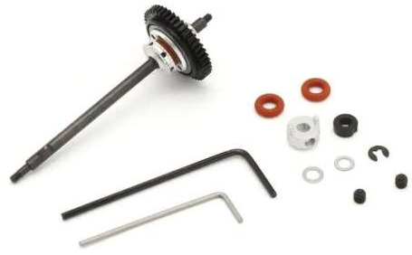
    </td>
    <td bgcolor="#EAF4FB" style="border: 1px solid black; padding: 8px; text-align: center;">n/a (purchased part)</td>
  </tr>

  <!-- Tires -->
  <tr>
    <td style="border: 1px solid black; padding: 8px;"><b>Tires</b></td>
    <td style="border: 1px solid black; padding: 8px;">Kyosho slick tires, narrow, 20 shore, 4 pcs. (MZW-02-20)</td>
    <td style="border: 1px solid black; padding: 8px; text-align: center;">
      <a href="https://mini-zshop.de/Mini-Z/Reifen-Mini-Z/Kyosho-Reifen/Slick-Reifen-schmal-20-Shore-4-Stk-MZW-02-20::1127.html">Purchase link</a>
    </td>
    <td style="border: 1px solid black; padding: 8px; text-align: center;">
      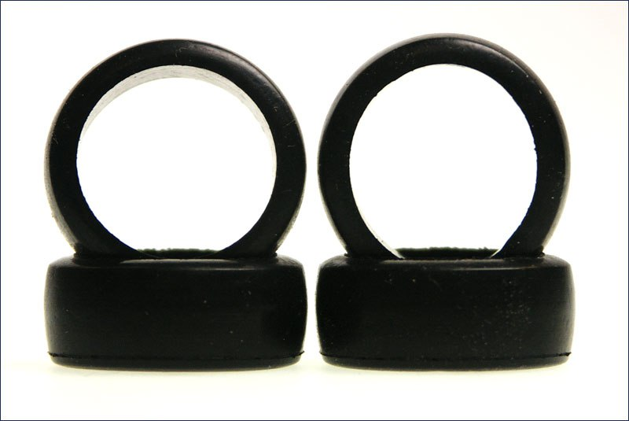
    </td>
    <td style="border: 1px solid black; padding: 8px; text-align: center;">n/a (purchased part)</td>
  </tr>

  <!-- Ball bearings -->
  <tr>
    <td bgcolor="#EAF4FB" style="border: 1px solid black; padding: 8px;"><b>Ball bearings</b></td>
    <td bgcolor="#EAF4FB" style="border: 1px solid black; padding: 8px;">10× ball bearings (8× front axle: 2× steering knuckle + 2× wheel per side)</td>
    <td bgcolor="#EAF4FB" style="border: 1px solid black; padding: 8px; text-align: center;"><a href="https://www.amazon.es/-/en/Swpeet-Bearing-Variety-Bearings-Shielded/dp/B0DQNGRL3R">Purchase link</a></td>
    <td bgcolor="#EAF4FB" style="border: 1px solid black; padding: 8px; text-align: center;">
    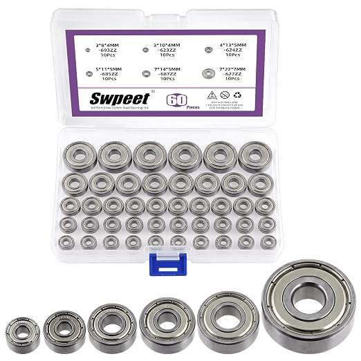
    </td>
    <td bgcolor="#EAF4FB" style="border: 1px solid black; padding: 8px; text-align: center;"><i>n/a (purchased part)</i></td>
  </tr>

  <!-- Main computer -->
  <tr>
    <td style="border: 1px solid black; padding: 8px;"><b>Main computer</b></td>
    <td style="border: 1px solid black; padding: 8px;">Raspberry Pi CM5</td>
    <td style="border: 1px solid black; padding: 8px; text-align: center;">
      <a href="https://www.berrybase.de/raspberry-pi-compute-module-5">Purchase link</a>
    </td>
    <td style="border: 1px solid black; padding: 8px; text-align: center;">
      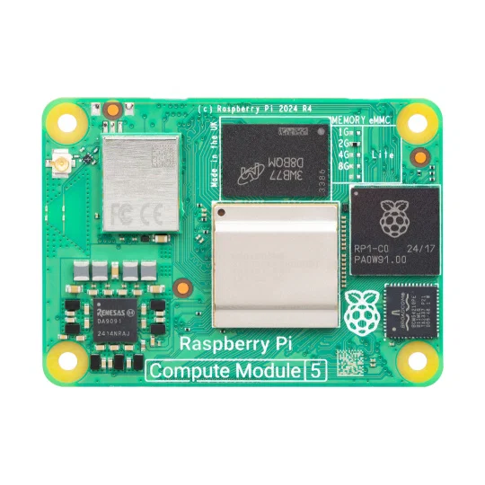
    </td>
    <td style="border: 1px solid black; padding: 8px; text-align: center;">n/a (purchased part)</td>
  </tr>

  <!-- Baseboard -->
  <tr>
    <td bgcolor="#EAF4FB" style="border: 1px solid black; padding: 8px;"><b>Own carrier board (baseboard)</b></td>
    <td bgcolor="#EAF4FB" style="border: 1px solid black; padding: 8px;">Self-developed PCB for CM5, STM32, sensors, and motor driver</td>
    <td bgcolor="#EAF4FB" style="border: 1px solid black; padding: 8px; text-align: center;">n/a (own development, not purchased)</td>
    <td bgcolor="#EAF4FB" style="border: 1px solid black; padding: 8px; text-align: center;">–</td>
    <td bgcolor="#EAF4FB" style="border: 1px solid black; padding: 8px; text-align: center;"><code>kicad/baseboard</code> (KiCad project available)</td>
  </tr>

  <!-- Microcontroller -->
  <tr>
    <td style="border: 1px solid black; padding: 8px;"><b>Microcontroller</b></td>
    <td style="border: 1px solid black; padding: 8px;">STM32F411 BlackPill</td>
    <td style="border: 1px solid black; padding: 8px; text-align: center;">
      <a href="https://www.berrybase.de/en/adafruit-stm32f411-blackpill-development-board">Purchase link</a>
    </td>
    <td style="border: 1px solid black; padding: 8px; text-align: center;">
      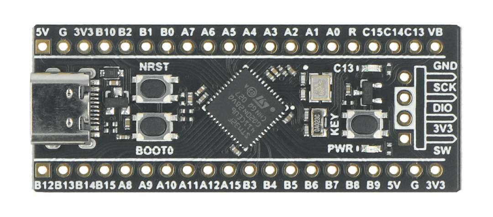
    </td>
    <td style="border: 1px solid black; padding: 8px; text-align: center;">n/a (purchased part)</td>
  </tr>

  <!-- ToF sensors -->
  <tr>
    <td bgcolor="#EAF4FB" style="border: 1px solid black; padding: 8px;"><b>Distance sensors</b></td>
    <td bgcolor="#EAF4FB" style="border: 1px solid black; padding: 8px;">4× VL53L8CX time-of-flight (30 Hz)</td>
    <td bgcolor="#EAF4FB" style="border: 1px solid black; padding: 8px; text-align: center;">
      <a href="https://eckstein-shop.de/Pololu-VL53L8CX-Time-of-Flight-8x8-Zone-Distance-Sensor-Carrier-with-Voltage-Regulators-400cm-Max-EN">Purchase link</a>
    </td>
    <td bgcolor="#EAF4FB" style="border: 1px solid black; padding: 8px; text-align: center;">
      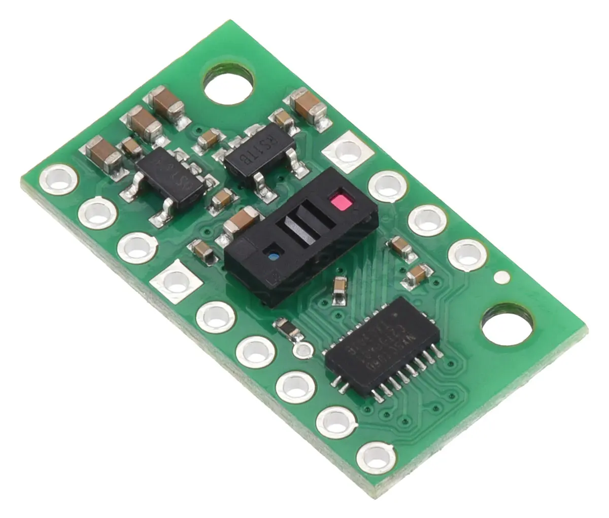
    </td>
    <td bgcolor="#EAF4FB" style="border: 1px solid black; padding: 8px; text-align: center;">n/a (purchased part)</td>
  </tr>

  <!-- Camera -->
  <tr>
    <td style="border: 1px solid black; padding: 8px;"><b>Camera</b></td>
    <td style="border: 1px solid black; padding: 8px;">Raspberry Pi Camera Module 3 Wide, 12 MP</td>
    <td style="border: 1px solid black; padding: 8px; text-align: center;">
      <a href="https://www.berrybase.de/raspberry-pi-camera-module-3-12mp">Purchase link</a>
    </td>
    <td style="border: 1px solid black; padding: 8px; text-align: center;">
      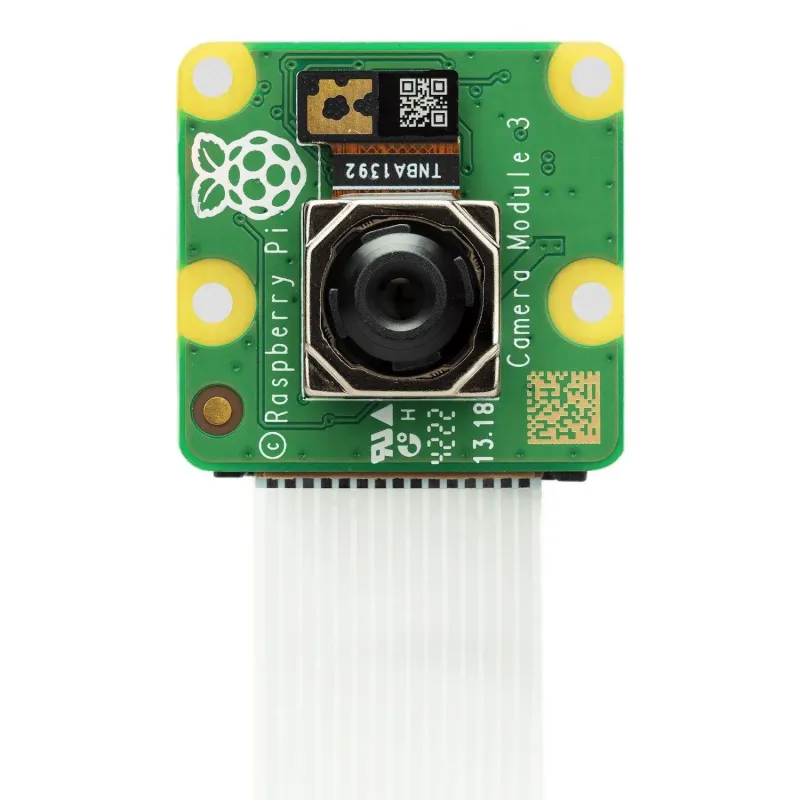
    </td>
    <td style="border: 1px solid black; padding: 8px; text-align: center;">n/a (purchased part)</td>
  </tr>

  <!-- Gyro -->
  <tr>
    <td bgcolor="#EAF4FB" style="border: 1px solid black; padding: 8px;"><b>Orientation sensor</b></td>
    <td bgcolor="#EAF4FB" style="border: 1px solid black; padding: 8px;">BNO086 (gyroscope)</td>
    <td bgcolor="#EAF4FB" style="border: 1px solid black; padding: 8px; text-align: center;">
      <a href="https://www.mouser.de/de/ProductDetail/CEVA/BNO086?qs=ulEaXIWI0c%2FqTo1scjodAw%3D%3D">Purchase link</a>
    </td>
    <td bgcolor="#EAF4FB" style="border: 1px solid black; padding: 8px; text-align: center;">
      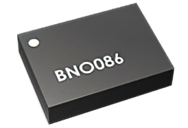
    </td>
    <td bgcolor="#EAF4FB" style="border: 1px solid black; padding: 8px; text-align: center;">n/a (purchased part)</td>
  </tr>

  <!-- Battery -->
  <tr>
    <td style="border: 1px solid black; padding: 8px;"><b>Battery</b></td>
    <td style="border: 1px solid black; padding: 8px;">3S LiPo, 11.1 V, 550 mAh</td>
    <td style="border: 1px solid black; padding: 8px; text-align: center;">
      <a href="https://www.amazon.de/TATTU-R-Line-550mAh-11-1V-Battery/dp/B08HYTDK6S">Purchase link</a>
    </td>
    <td style="border: 1px solid black; padding: 8px; text-align: center;">
      
    </td>
    <td style="border: 1px solid black; padding: 8px; text-align: center;">n/a (purchased part)</td>
  </tr>

  <!-- Base deck -->
  <tr>
    <td bgcolor="#EAF4FB" style="border: 1px solid black; padding: 8px;"><b>Chassis – base deck (lower deck)</b></td>
    <td bgcolor="#EAF4FB" style="border: 1px solid black; padding: 8px;">3D print, material PPA-CF</td>
    <td bgcolor="#EAF4FB" style="border: 1px solid black; padding: 8px; text-align: center;">n/a (self-made)</td>
    <td bgcolor="#EAF4FB" style="border: 1px solid black; padding: 8px; text-align: center;">–</td>
    <td bgcolor="#EAF4FB" style="border: 1px solid black; padding: 8px; text-align: center;"><code>cad/base and middle plate.f3z</code><br><code>models/Lowderdeck.stl</code></td>
  </tr>

  <!-- Middle deck -->
  <tr>
    <td style="border: 1px solid black; padding: 8px;"><b>Chassis – middle deck (middle deck)</b></td>
    <td style="border: 1px solid black; padding: 8px;">3D print, material PLA/PETG or PPA-CF</td>
    <td style="border: 1px solid black; padding: 8px; text-align: center;">n/a (self-made)</td>
    <td style="border: 1px solid black; padding: 8px; text-align: center;">–</td>
    <td style="border: 1px solid black; padding: 8px; text-align: center;"><code>cad/base and middle plate.f3z</code></td>
  </tr>

  <!-- Upper deck -->
  <tr>
    <td bgcolor="#EAF4FB" style="border: 1px solid black; padding: 8px;"><b>Chassis – upper deck (camera/sensor mount)</b></td>
    <td bgcolor="#EAF4FB" style="border: 1px solid black; padding: 8px;">3D print, material PLA/PETG or PPA-CF</td>
    <td bgcolor="#EAF4FB" style="border: 1px solid black; padding: 8px; text-align: center;">n/a (self-made)</td>
    <td bgcolor="#EAF4FB" style="border: 1px solid black; padding: 8px; text-align: center;">–</td>
    <td bgcolor="#EAF4FB" style="border: 1px solid black; padding: 8px; text-align: center;"><code>cad/top plate.f3z</code></td>
  </tr>

  <!-- Front axle -->
  <tr>
    <td bgcolor="#EAF4FB" style="border: 1px solid black; padding: 8px;"><b>Front axle (steering knuckle, linkage mount)</b></td>
    <td bgcolor="#EAF4FB" style="border: 1px solid black; padding: 8px;">3D print, material PLA/PETG or PPA-CF</td>
    <td bgcolor="#EAF4FB" style="border: 1px solid black; padding: 8px; text-align: center;">n/a (self-made)</td>
    <td bgcolor="#EAF4FB" style="border: 1px solid black; padding: 8px; text-align: center;">–</td>
    <td bgcolor="#EAF4FB" style="border: 1px solid black; padding: 8px; text-align: center;"><code>cad/Steering knuckle2.f3d</code><br><code>cad/track_rod.f3d</code><br><code>cad/radmutter.f3d</code></td>
  </tr>

  <!-- Support bridge -->
  <tr>
    <td style="border: 1px solid black; padding: 8px;"><b>Steering support bridge</b></td>
    <td style="border: 1px solid black; padding: 8px;">3D print, material PLA/PETG or PPA-CF</td>
    <td style="border: 1px solid black; padding: 8px; text-align: center;">n/a (self-made)</td>
    <td style="border: 1px solid black; padding: 8px; text-align: center;">–</td>
    <td style="border: 1px solid black; padding: 8px; text-align: center;"><code>cad/support bridge.f3d</code></td>
  </tr>


</table>
<br>

This chapter provides a **step-by-step guide** through the **assembly** of our autonomous robot. The instructions are structured so that the robot is built from bottom to top, starting with the lower deck and ending with the upper deck.

## **Assembly overview**

The robot consists of three main levels, matching the current CM5/STM32 platform described in the previous chapters:
1. **Lower deck**: Drive motor with gearbox, ball differential rear axle, front axle with steering knuckles and steering servo, integrated front nose
2. **Middle deck**: Baseboard (STM32F411, motor driver, sensor connectors), Raspberry Pi CM5, battery
3. **Upper deck**: Rotating sensor tower with the four VL53L8CX ToF sensors, camera tower with the Raspberry Pi Camera Module 3 Wide and its pan servo

## **Step 1: Preparing the 3D-printed parts**

**3D-printed components represented in the current CAD files** (cf. [Table 22: Bill of materials for replication](#table-22-bill-of-materials-for-replication)):
- Lower deck and middle deck plate: [base and middle plate.f3z](cad/base%20and%20middle%20plate.f3z); the lower deck STL is also available as [Lowderdeck.stl](models/Lowderdeck.stl)
- Front steering knuckles (2×), track rod, and wheel nuts: [Steering knuckle2.f3d](cad/Steering%20knuckle2.f3d), [track_rod.f3d](cad/track_rod.f3d), and [radmutter.f3d](cad/radmutter.f3d)
- Steering support bridge: [support bridge.f3d](cad/support%20bridge.f3d)
- Upper deck / camera tower assembly: [top plate.f3z](cad/top%20plate.f3z)


**Material recommendations:**
- **Lower deck**: PPA-CF, since it does not bend under motor/suspension load and keeps the sensor and camera angles stable (cf. [Chassis design](#chassis-design))
- **Middle/upper deck, front axle, and support bridge**: PLA/PETG or PPA-CF


## **Step 2: Lower deck assembly**

### **2.1 Drive motor and rear-axle bearings**
**Components:** <ins>N30 drive motor</ins>, <ins>ball bearings</ins>

<div align="center">
    <a href="img/construction/lowerdeck_top.png" target="_blank">
        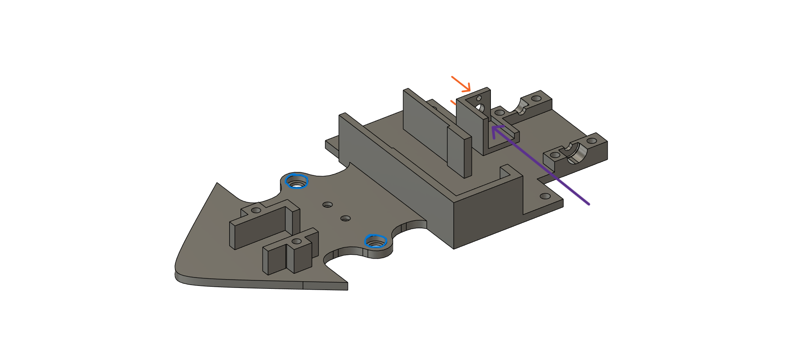
    </a>
</div>

**Insert** ball bearings into the **blue-marked holes** on the lower deck. **Push** the **motor** into the motor slot, following the **purple arrow**, then **screw** it in place from the other side using the screws provided.

### **2.2 Front axle / steering knuckles**
**Component:** <ins>Front axle (steering knuckle, linkage mount)</ins>

<div align="center">
    <a href="img/construction/front_axle.png" target="_blank">
        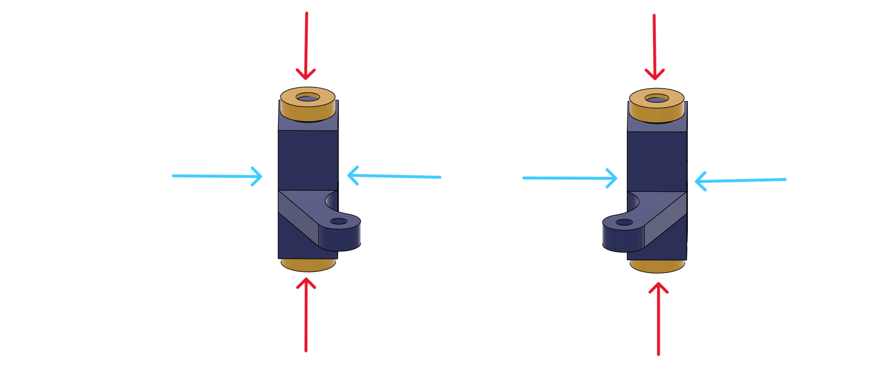
    </a>
</div>

For **each** of the two printed steering-knuckle parts: **insert** a **ball bearing** from either side (cyan arrows) and a **ball bearing** on top (top red arrows). Then insert them into the coresponding **ball bearings** on the lower deck.

### **2.3 Rear axle, front wheels and steering linkage**
**Components:** <ins>Ball differential rear axle</ins>, <ins>Mini-Z compatible wheels and tires</ins>, <ins>INJORA N30 Nano steering servo</ins>

<div align="center">
    <a href="img/construction/lower deck assembly 1.png" target="_blank">
        
    </a>
</div>

**Slide** two **ball bearings** into the **rear axle**, then **Insert** the **rear axle** into the rear axle holder (right orange line) and **screw** the rear axle holder cap on with the provided screws (green arrows).
**Slide** the **servo** into its slot (blue arrow) and screw its lid on (yellow arrows).
**Insert** front **wheels** into the steering knuckles.
Prepare the **track rod** using the 3D-printed part and the joints, then **connect** the two **steering knuckles**. Adjust them until they are both facing **straight forward**.

Install the **battery** in its slot on the **lower deck**, between the front and rear axles.


## **Step 3: Middle deck assembly**

### **3.1 Support bridge and middle deck**
<div align="center">
    <a href="img/construction/lower deck assembly 2.png" target="_blank">
        
    </a>
    <a href="img/construction/middle deck assembly 1.png" target="_blank">
        
    </a>
    <a href="img/construction/Bodenplatte.png" target="_blank">
        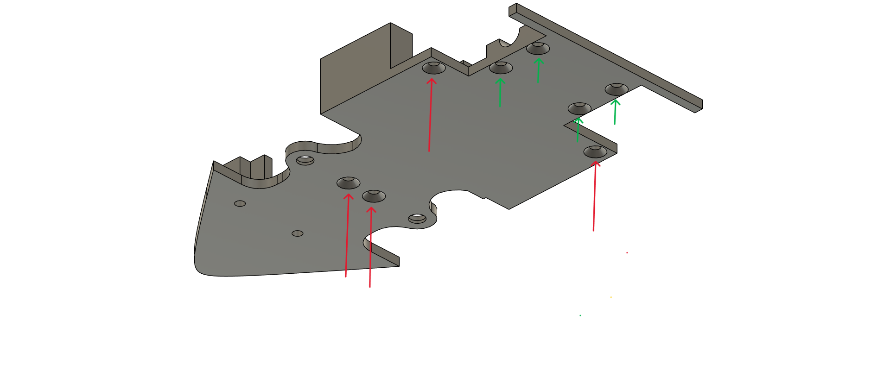
    </a>
</div>

**Mount** the **3D-printed support bridge** onto the lower deck to secure the steering knuckles in place (red arrow, top left image). **Place** the **middle deck plate** on top of the lower deck (top right image) and **screw** it on from below (with a sufficiently long screw), using the **holes marked in red** on the bottom of the lower deck, making sure the support bridge is held tightly in place.

### **3.2 Mount the baseboard and connect all components**
**Components:** <ins>Baseboard (own PCB, cf. <code>kicad/baseboard</code>)</ins>, <ins>Raspberry Pi CM5</ins>

<div align="center">
    <a href="img/construction/middle deck assembly 3.png" target="_blank">
        
    </a>
</div>

**Place** the **baseboard** (with the CM5 already connected via the Hirose FH12-22S connector and M.2 socket) onto small spacer bolts onthe middle deck (circled in red) and **add** the big spacer bolts on top of the baseboard that hold the upper deck plate. **Screw** it on from the bottom (opposite of red arrows). 

## **Step 4: Upper deck – ToF sensors and rotating camera tower**

### **4.1 Mount the upper deck**
<div align="center">
    <a href="img/construction/top deck assembly 1.png" target="_blank">
        
    </a>
</div>

**Place** the **upper deck**, together with the sensor/camera tower, onto the standoffs mounted in step 3.2 and secure it using 4 small **spacer bolts** (red circles).

### **4.2 Insert the distance sensors**
**Component:** <ins>4x VL53L8CX time-of-flight sensors</ins>

<div align="center">
    <a href="img/construction/top deck assembly 1b.png" target="_blank">
        
    </a>
</div>

**Insert** the **ToF sensors** into the marked areas of the tower and **connect** each of them to the **baseboard** following the [wiring diagram](#step-5-wiring).

### **4.3 Mount the camera tower and camera**
**Component:** <ins>Raspberry Pi Camera Module 3 Wide (12 MP)</ins>

<div align="center">
    <a href="img/construction/top deck assembly 2.png" target="_blank">
        
    </a>
</div>

**Place** a **ball bearing** into the hole on top of the tower, then **insert** the **camera pole** into the tower. **Screw** the **camera** onto the plate at the top of the pole and **connect** it to the baseboard via its CSI cable.

### **4.4 Connect the camera pan servo**
The camera tower is rotated by a servo so the camera can be aimed at different angles under STM32 control (cf. [Further development: rotating camera tower](#further-development-rotating-camera-tower)).

<div align="center">
    <a href="img/construction/top deck assembly 3.png" target="_blank">
        
    </a>
</div>
 
**Push** the **connection piece** into the hole at the bottom of the camera pole. **Insert** the **servo** from below (blue arrow) and **insert** the **servo horn** into the connection piece. Then **screw** it tight from the top.

<br>

## **Step 5: Wiring**

<div align="center">
    <a href="img/plan_gesamt%20Kopie.jpg" target="_blank">
        
    </a>
</div>

The **wiring diagram** above (identical to [Figure 9](#figure-9-wiring-diagram)) shows all connections between the **baseboard**, the **Raspberry Pi CM5**, the **STM32F411**, the **motor and encoder**, the **steering servo**, the **camera pan servo**, the **BNO086 gyroscope**, and the **four VL53L8CX ToF sensors**. Since almost all connectors (motor, servos, gyroscope, ToF sensors, CM5) are provided directly on the **self-designed baseboard PCB** (cf. <code>kicad/baseboard</code>), wiring mainly consists of plugging each component's cable into its labeled connector on the board – there is no need for point-to-point soldering as with a generic breadboard setup.

**Use cable ties** to secure the remaining cables (motor, servos, sensors) so they do not obstruct moving parts (steering, wheels, rotating camera tower) or block the **camera's** or **ToF sensors'** field of view. To connect the **battery**, use an **XT60 connector**, as is common for RC LiPo batteries.

<br>

## **Step 6: Software installation**

### **6.1 Prepare Raspberry Pi OS**
Use "**Raspberry Pi OS (Bookworm, 64-bit)**" and install it on the CM5 boot medium (eMMC or SD card, depending on your CM5 variant/baseboard).


### **6.2 Install Python libraries**
```bash
# Camera stack (Raspberry Pi OS packages)
sudo apt update
sudo apt install -y python3-picamera2 python3-libcamera

# Python packages used by the CM5 control software
pip3 install pygame pyserial numpy opencv-python imutils

# IMU + board interface libraries
pip3 install adafruit-blinka adafruit-circuitpython-bno055 adafruit-circuitpython-bno08x
```

### **6.3 Install Battlepillars software**
```bash
git clone https://github.com/Battlepillars/Wro26.git
cd Wro26/src/pi
python3 main.py
```

### **6.4 Build, compile and upload to the controllers**

Our vehicle uses two controllers:
- **Raspberry Pi CM5** (high-level logic in Python)
- **STM32F411 BlackPill** (low-level control in C++/Arduino via PlatformIO)

#### **A) CM5: Start control software**
```bash
cd Wro26/src/pi
python3 main.py
```

#### **B) STM32: Compile and flash firmware**
Prerequisites:
- VS Code + PlatformIO extension
- STM32 connected via ST-Link

```bash
cd Wro26/src/stm32

# Compile firmware
pio run

# Upload firmware to STM32 via ST-Link
pio run -t upload

# Optional: monitor serial output
pio device monitor -b 921600
```

#### **C) Data exchange between both controllers**
- UART interface: `/dev/ttyAMA0`, **921600 Baud**
- **STM32 → CM5**: sensor data (ToF distance arrays, rps, voltage, distance)
- **CM5 → STM32**: actuator commands (speed, steer)

